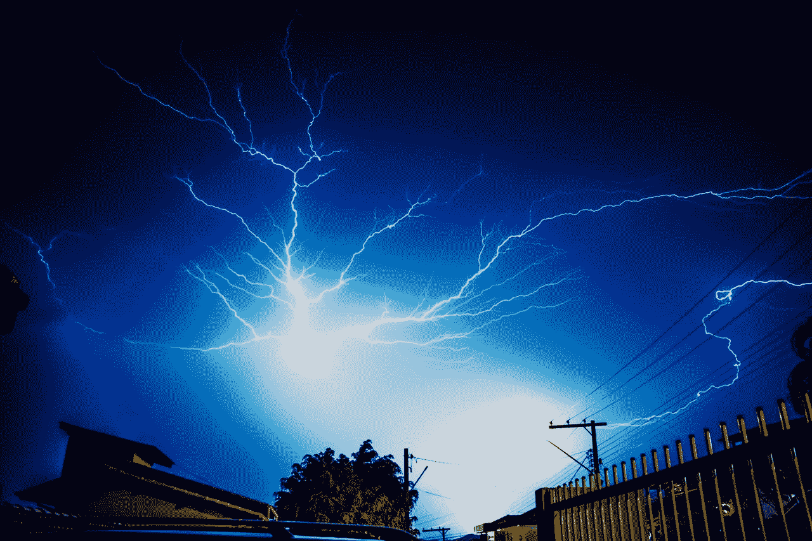
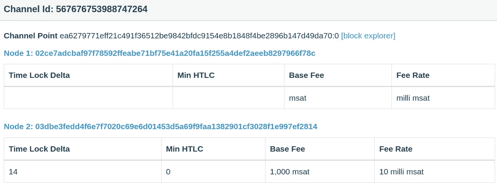
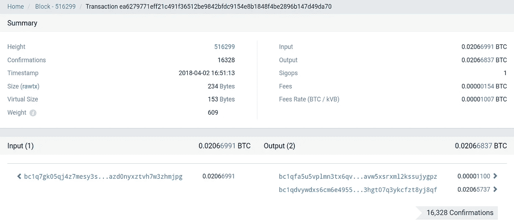
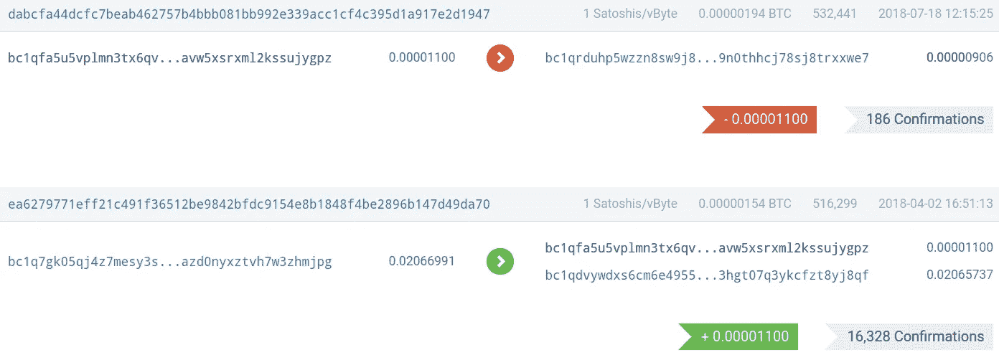
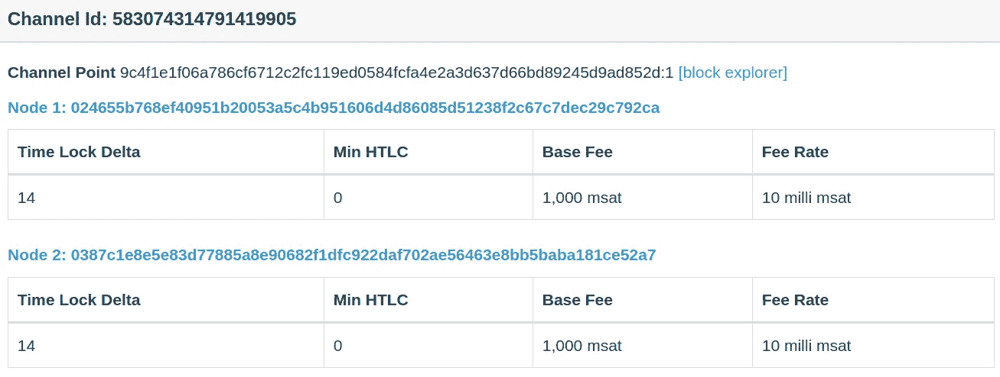
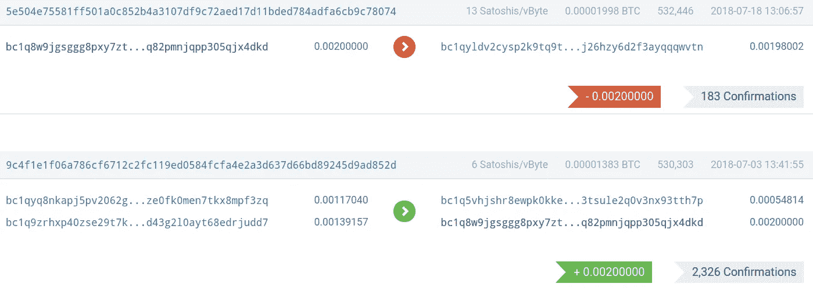

# 区分比特币区块链中的双向和单向通道关闭

> 原文：<https://medium.com/coinmonks/distinguishing-mutual-and-unilateral-channel-closing-in-the-bitcoin-blockchain-ec2e0e7d71f4?source=collection_archive---------2----------------------->

## 有没有想过如何区分相互的和单方面的闪电网络通道关闭？

Gaurav AgrawalLightning 通道有两种不同的结束方式:

1.  一个相互合作的成交简称为[成交](https://github.com/lightningnetwork/lightning-rfc/blob/master/03-transactions.md#closing-transaction)
2.  称为[承诺交易](https://github.com/lightningnetwork/lightning-rfc/blob/master/03-transactions.md#commitment-transaction)的单边、不合作成交

很容易有区别:[雷电网络规范说](https://github.com/lightningnetwork/lightning-rfc/blob/master/03-transactions.md#closing-transaction)相互闭合的`locktime`字段始终为 0。让我们看看如何在实践中检查这一点！

我们将使用闪电网络浏览器[1ml.com](https://1ml.com/)为一个渠道找到资金交易。然后我们使用比特币区块浏览器[btc.com](https://btc.com/)找到消费交易的哈希 ID。然后，我们使用基于网络的比特币 API 接口:[chainquery.com](http://chainquery.com/)进行消费交易。我们将锁定时间与零进行比较。

## 共同结算是什么样的

我们在这里可以看到一些封闭的渠道:[https://1ml.com/channel?order=closedchannels](https://1ml.com/channel?order=closedchannels)

举个例子:[https://1ml.com/channel/567676753988747264](https://1ml.com/channel/567676753988747264)

Screenshot from [https://1ml.com/channel/567676753988747264](https://1ml.com/channel/567676753988747264)

浏览器显示其通道点为:ea 6279771 eff 21 c 491 f 36512 be 9842 bfdc 9154 E8 b 1848 F4 be 2896 b 147d 49 da 70:0
这其中的第一部分是资金交易的比特币交易 ID，冒号后的第二部分是交易输出的零基索引。从零开始的索引意味着这里的 0 指向事务的第一个输出。

我们可以在比特币区块浏览器上找到资金交易:[https://BTC . com/ea 6279771 eff 21 c 491 f 36512 be 9842 bfdc 9154 E8 b 1848 F4 be 2896 b 147d 49 da 70](https://btc.com/ea6279771eff21c491f36512be9842bfdc9154e8b1848f4be2896b147d49da70)

Screenshot from [https://btc.com/ea6279771eff21c491f36512be9842bfdc9154e8b1848f4be2896b147d49da70](https://btc.com/ea6279771eff21c491f36512be9842bfdc9154e8b1848f4be2896b147d49da70)

交易的第一个输出是闪电通道关联的比特币地址:
BC 1 qfa 5 u 5 vplmn 3 tx 6 qvtgvc 5 ente 2hg 5 wfxa 7 VF 3 jaw5 xsr XML 2 kssujygpz

Screenshot from [https://btc.com/bc1qfa5u5vplmn3tx6qvtgvc5ente2hg5wfxa7vf3javw5xsrxml2kssujygpz](https://btc.com/bc1qfa5u5vplmn3tx6qvtgvc5ente2hg5wfxa7vf3javw5xsrxml2kssujygpz)

我们可以看到通道以这个事务 ID 结束:dab CFA 44 dcfc 7 beab 462757 B4 BBB 081 bb 992 e 339 ACC 1 cf 4c 395 D1 a 917 e 2d 1947

所以我们可以在比特币 API 上用 [getrawtransaction 查询整个解码后的交易，仔细看看:](http://chainquery.com/bitcoin-api/getrawtransaction/dabcfa44dcfc7beab462757b4bbb081bb992e339acc1cf4c395d1a917e2d1947/1)

重要的部分是`"locktime": 0`
这是一个相互合作的渠道关闭。

## 单边交易看起来像什么

让我们看看另一个频道，比如这个:[https://1ml.com/channel/583074314791419905](https://1ml.com/channel/583074314791419905)

Screenshot from [https://1ml.com/channel/583074314791419905](https://1ml.com/channel/583074314791419905)

它的通道点是:9 C4 f1 E1 f 06 a 786 cf 6712 C2 fc 119 ed 0584 fcfa 4 e 2 a3 d 637d 66 BD 89245d 9 ad 852d:1
末尾的 1 表示我们在寻找事务的第二个输出。

下面是比特币区块浏览器中的资金交易:[https://BTC . com/9 C4 f1 E1 f 06 a 786 cf 6712 C2 fc 119 ed 0584 fcfa 4 e2a 3d 637d 66 BD 89245d 9 ad 852d](https://btc.com/9c4f1e1f06a786cf6712c2fc119ed0584fcfa4e2a3d637d66bd89245d9ad852d)

Screenshot from [https://btc.com/9c4f1e1f06a786cf6712c2fc119ed0584fcfa4e2a3d637d66bd89245d9ad852d](https://btc.com/9c4f1e1f06a786cf6712c2fc119ed0584fcfa4e2a3d637d66bd89245d9ad852d)

闪电通道关联的比特币地址为:
[BC 1 q 8 w9 jgsggg 8 pxy 7 ztw CDK 8 l 4 hnsrwrskp 4 HW 8k 4 q 82 pmnjqpp 305 qjx 4d KD](https://btc.com/bc1q8w9jgsggg8pxy7ztwcdk8l4hnsrwrskp4hw8k4q82pmnjqpp305qjx4dkd)

Screenshot from [https://btc.com/bc1q8w9jgsggg8pxy7ztwcdk8l4hnsrwrskp4hw8k4q82pmnjqpp305qjx4dkd](https://btc.com/bc1q8w9jgsggg8pxy7ztwcdk8l4hnsrwrskp4hw8k4q82pmnjqpp305qjx4dkd)

该通道以此交易 ID 结束:5e 504 e 75581 ff 501 a0c 852 b4a 3107 df 9 c 72 aed 17d 11 bded 784 adfa 6 CB 9 c 78074

因此我们可以像上面的一样查询[来查看解码的事务:](http://chainquery.com/bitcoin-api/getrawtransaction/5e504e75581ff501a0c852b4a3107df9c72aed17d11bded784adfa6cb9c78074/1)

重要的是`"locktime": 543621745`
这是一次单方面的、不合作的渠道关闭。

## 感谢

感谢 Mykola Sakhno 和 LightningPeach 团队帮助我理解这些类型的交易。