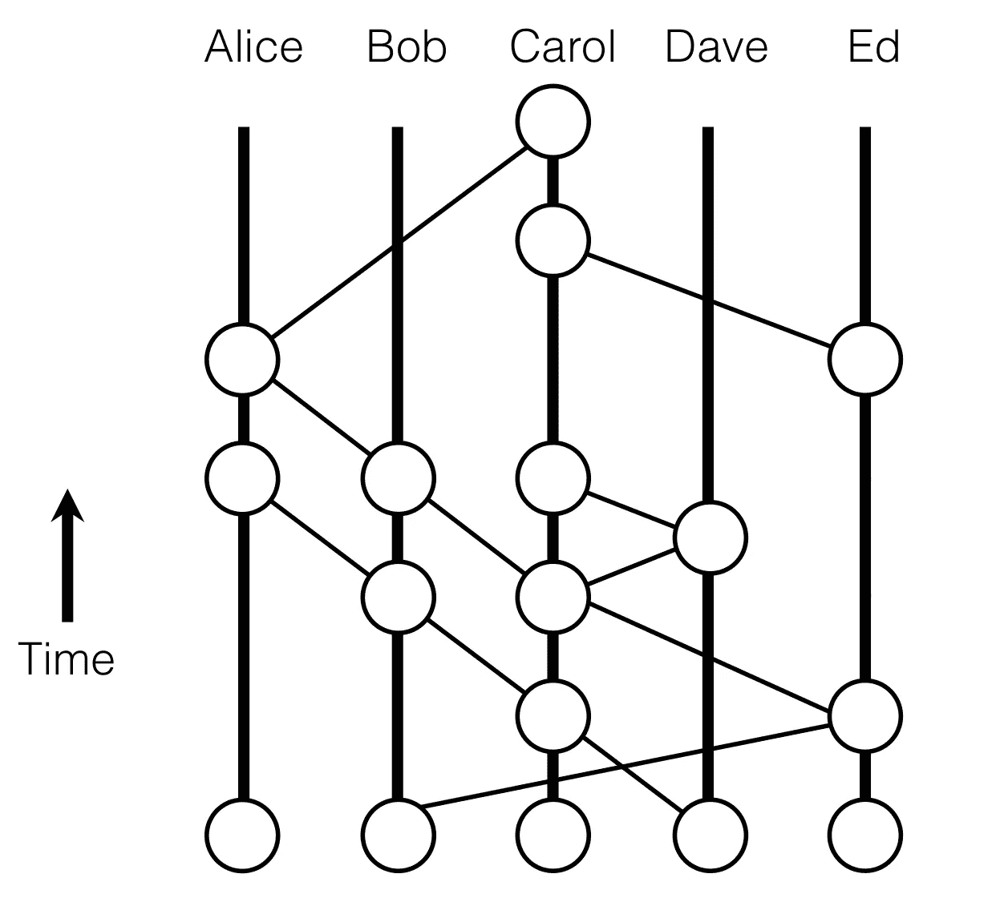

# 分布式账本技术

> 原文：<https://medium.com/coinmonks/distributed-ledger-technology-855cbdc28370?source=collection_archive---------7----------------------->

## 都不叫区块链…

首先，这篇文章是为初学者写的，所以如果你是一个经验丰富的专业人士，你可能会阅读下面的帖子并翻白眼，或者你可能会发现下面的咆哮是有关联的。

区块链这个，区块链那个。让我们把一切都放在区块链上。让我们建造一个区块链，叫它别的什么。太多人对这项开创性的技术有错误的想法。我认为 80%对加密有看法的人都是错的。40%是错误的，因为他们出于错误的原因相信 crypto，40%是因为他们不相信 crypto。我可以写一整篇文章来解释为什么后者应该重新考虑他们轻浮的观点，但是我还不准备在网上暴露自己。保持聪明，练习安全上网。

大多数人首先需要明白的是**T5 不是 T7 唯一的同类。区块链是最近流行起来的许多***【DLTs】***分布式账本技术之一。请允许我重新措辞:**

> ***并不是每一种加密货币都建立在区块链上***

太多的人似乎认为比特币和比特币现金甚至比特币和以太坊没有区别。将以太坊比作比特币，正如表达式所说， ***如同将苹果比作橙子*** 一样毫无意义(虽然将比特币比作比特币现金更像是将橙子比作橘子)。尽管如此，在加密货币被广泛接受之前，人们需要了解这些差异，否则我们就有可能创造另一个只基于投机的泡沫。

请允许我首先列出几个值得注意的问题:

1.  区块链(比特币、以太坊、莱特币等。)
2.  有向无环图。DAGs (IOTA，Dagcoin 等。)
3.  Hyperledger Fabric (IBM、Corda、Intel 等。)
4.  哈希图(海德拉)

为了让这个更全面一点，我们来画一些图。

**This is a blockchain**

**This is a DAG**

**This is a Hashgraph**

你现在比密码界 37%的人都聪明。(是的，这个数据是我编造的。)

“好吧，所以有不同的 DLT。还有什么不同？”。每个 DLT 都需要一个共识算法，本质上是一种对每个传入交易的有效性达成一致的方法。你可能听得最多的是工作证明。但正如你现在所猜测的，不止一个。

这里还有一些:

1.  利害关系证明
2.  授权证明
3.  重量检验
4.  燃烧证明
5.  经过时间的证明
6.  涟漪共识
7.  IOTA 的纠结
8.  海德拉的许可哈希图

这其中的差异就像比较苹果…不，不是比较橘子…更像是比较苹果和苹果。

大多数这些共识算法的唯一共同点是它们大多以证明开始，并且它们都有某种缺陷。虽然 IOTA 的 Tangle (DAG)可能源自区块链，但工作证明与燃烧证明无关。

可能我现在最大的问题是，整个加密货币市场如何向同一个方向 移动，而不管它与其他加密货币的差异。如果明天有消息称区块链存在致命的安全漏洞，我预计比特币、以太坊和其他区块链密码将会下跌。但出于某种原因，基于完全不同的技术 的**IOTA 也经常被拖垮。这只能说明现在的市场是多么的同质化，并且只能进一步强调这样一个事实，与老化的股票市场相比，密码仍然是婴儿。**

误会的结果从来都是冲突和混乱，也正是因为误会，我们才允许*[***这种***](https://techcrunch.com/2018/02/02/the-iced-tea-company-that-changed-its-name-to-include-blockchain-retracts-on-bitcoin-mining-operation/)*@ # $ %的事情发生。不过这也不全是坏消息，因为除了**

****

**事实是，**

> **当人们误解并根据自己的情绪做出决定时，他们更容易预测。**

**如果明天，某个安全套公司改名为 ______ 区块链，我就知道这是一个绝佳的投资时机(仅开玩笑)。如果明天，市场达到前所未有的高点，每个人都像 20 多岁的人一样开始狂欢，我就知道是时候开始挖掩体了。**

# **我希望你学完这个…**

**这不完全是一回事。**

**感谢阅读。**

**下周我将写圆形和方形的区别。**