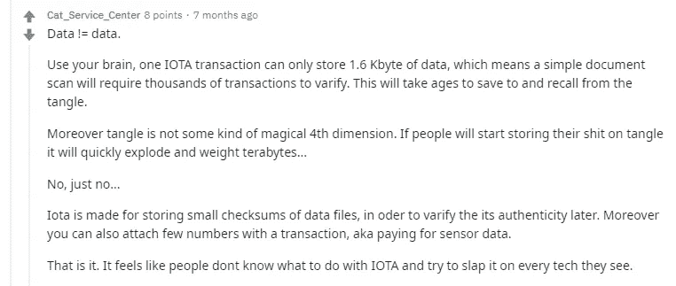
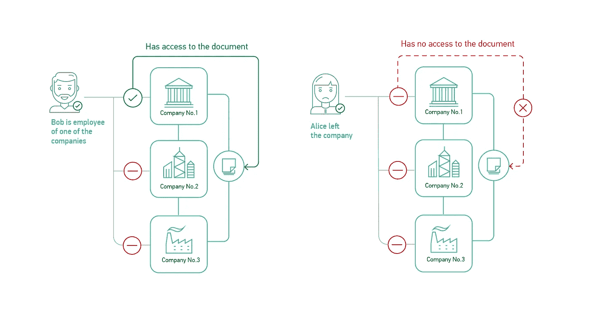

# 基于文件的区块链的分布式工作流

> 原文：<https://medium.com/coinmonks/distributed-workflow-on-file-based-blockchain-cbc485cae9f5?source=collection_archive---------0----------------------->

## 如何通过以太坊、Hyperledger、IOTA 区块链发送文件？这个问题没有简便的解决方法。

Distributed workflow

在 [Coinmonks](/coinmonks/for-beginners-upload-images-onto-the-iota-tangle-6da0d4069705) 上，创新者描述了他是如何通过 IOTA 发送图像的。他将其转换为 Base64 字符串。然后，这些文本字符串在 10 分钟内被附加到 53 笔交易中发送到收件人的地址。在 Reddit 上，他得到了可预测的反馈，主要观点是:IOTA 不是为那个用例创建的。

Do not use IOTA as a file storage

比特币、以太坊、Hyperledger 和其他 DLT 的论坛上也提供了同样不方便的方式。

另一方面，还有分布式文件存储系统，如 IPFS、Storj、Sia、FileCoin。他们为了安全复制文档，为了保密加密数据。在 IPFS 网络中，文档地址与其散列相匹配。这保护了文档不被修改:在任何编辑之后，新的文档将在新的地址用新的散列来发布。文档不受控制地分布在这样的文件系统中，所以通常很难删除它们。一般来说，文件存储系统的功能是有限的:您不能指定访问权限，不能自动处理文档或收集统计数据。

出于什么实际目的可能需要将[区块链](https://blog.coincodecap.com/tag/blockchain/)和分散式文件存储结合起来？需要集成这些技术来创建自动化的分散工作流。与其他组织及其周围社区的新型业务关系成为可能。例如，与承包商互动的透明系统，允许跟踪任务和付款的变化。或者由品牌合作伙伴和大使组成的生态系统，他们开发社区并因自己的努力而获得回报。

让我们探索一下分布式工作流系统可以执行什么任务。

# 区块链系统中的文件存储

## 文件的真实性和有效性

没有文件存储，[区块链](https://blog.coincodecap.com/tag/blockchain/)无法执行的一个简单操作就是证明文件的真实性。为了证明文档的真实性，您需要生成它的哈希值。如果文档没有被编辑，哈希仍然与真实文档相同。为了存储文档并生成它们的散列，[区块链](https://blog.coincodecap.com/tag/blockchain/)开发者使用第三方服务，例如 IPFS。

在基于文件的[区块链](https://blog.coincodecap.com/tag/blockchain/)中，数据直接存储在节点中，因此不需要连接到第三方服务。例如，下面的场景是可能的。该文档在会议上得到合作伙伴的同意，并上传到基于私有[区块链](https://blog.coincodecap.com/tag/blockchain/)的分布式工作流系统。还有，秘书把文件发给了相关的人。现在任何通过电子邮件收到这份文件的人都可以通过这个系统验证其真实性。

> 另一个场景:客户将项目文档上传到他们的公司文件存储中，并允许承包商访问。过了一段时间，客户对规范做了一些小的编辑，从共享存储中删除了文件的早期版本，但是忘记通知承包商更新。当承包商完成任务时，该文件的原始版本再也找不到了，因为它已从系统中删除。

即使客户使用分散的 IPFS 系统，也无助于调查问题:在 IPFS，一份旧的废弃文件过一会儿就不见了。因此，需要一个更复杂的系统。您可以在基于文件的区块链中设置各种使用场景，包括永久存储曾经上传的文档。因此，规范的初始版本可以由分布式系统的所有用户存储。此外，通过设置文档文件夹中的更改通知，可以避免该事件。

## 数据访问控制和监控

在业务系统中，您通常为用户分配角色，限制他们对数据的访问。假设一名员工已经离开公司，不再能够访问集中的企业存储中的数据。如何阻止他访问分散系统中存储的文件？

要做到这一点，你需要从一开始就设置一个加密系统。存储在分布式系统上的所有文件在上传时都必须受到密码保护。必须开发多重签名系统来访问它们。例如，访问文档需要两个签名:员工的签名和检查集中员工权限目录的系统的签名。

Three companies use distributed workflow system and multi-signature

根据业务需求，多重签名系统可能会更加复杂。如果一个去中心化的系统为三个公司的交互提供服务，那么除了一个员工的签名，来自这些公司的一个就足够了。

用户授权系统允许跟踪谁添加和访问了文档。

## 防止组织间工作流中的数据泄漏

如何授权只访问特定工作站的数据？它需要避免授权用户在其家用笔记本电脑上安装节点后丢失的情况。在一个组织中，DLP 系统用于控制数据的分发。当几个公司参与到工作流程中时，就更难施加限制了。

在分散式系统中，除了加密之外，您还可以在物理上限制数据的分发。为此，您需要在企业环境中部署基于文件的区块链的子链或分支。然后设置节点白名单。此后，没有人能够未经授权安装节点并连接到网络。因此，处理和存储文档的工作站将被物理地定义。

## 智能合同的工作流程

在企业内部，文档的处理是自动化和透明的。通常，相关各方可以轻松跟踪文档的状态并查看其内容。工作流提供了角色、责任、截止日期和不同的流程选项。

这样的系统可以转移到几个公司相互之间的交互吗？是的，但这需要一个由智能合约管理的分散系统，而不是由管理员管理。参与者就工作流达成一致，然后流程在代码中实现并自动执行，无需人工控制。记录和文档同时存储在所有节点上，因此不能被删除或修改。

> 例如，可以用这种方式组织官方调查的登记和跟踪过程。公司外部的相关人员将能够跟踪他们的案例，并查看当前负责官员的联系人。

有时，承包商以客户不付款为借口，延迟向分包商付款。如果客户在 DLT 登记支付信息，合作的透明度对所有各方来说都会大大增加。分包商注意到客户已经付款，并开始项目工作。

由智能合同管理的分布式系统上的文档管理可以实现到拍卖、多方合同、供应链等等。

# 分布式工作流的均匀服务

甚至是建立在改造过的 IPFS 之上，用作运输网络。对于公司网络来说，这是一个比任何区块链、oracles 和分布式文件系统的组合更可靠的解决方案。考虑到企业系统的复杂性，额外的集成和对多个解决方案的支持需要大量的工作并伴随着风险。例如，有必要分别控制用户对区块链系统和文件存储系统的访问。

甚至结合了最先进的分布式技术。除了内置的文件存储，网络还实现了快速智能合同、节能共识和 DAG 结构化注册。10 月，甚至推出了测试网络的首个[公共版本，并展示了其中一些技术的实践。在测试过程中，我们](https://github.com/evenfound/guide-to-testnet-v0.1.0)[演示了](https://evenfound.org/blog/the-october-report-on-even-testnet)如何发送和接收文档、事务以及运行节点。

该网络已准备好开展试点项目。我们愿意与企业工作流程系统的开发商和系统集成商以及最终客户合作。[联系团队](https://evenfound.org/team)启动工作流项目。

> [直接在您的收件箱中获得最佳软件交易](https://coincodecap.com/?utm_source=coinmonks)

