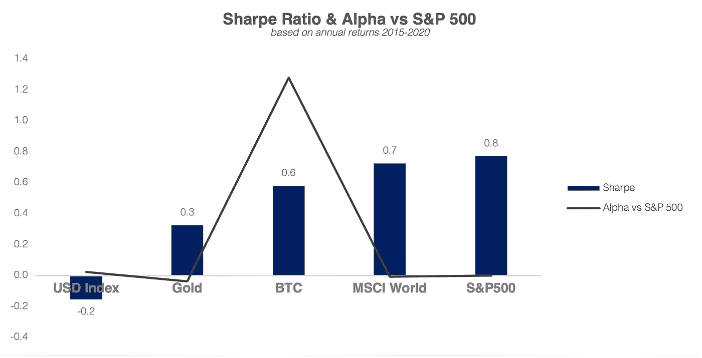
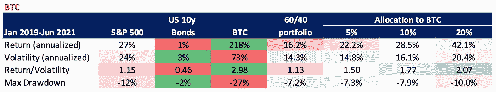
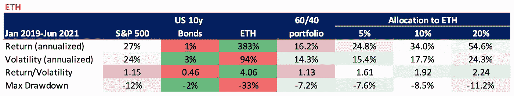
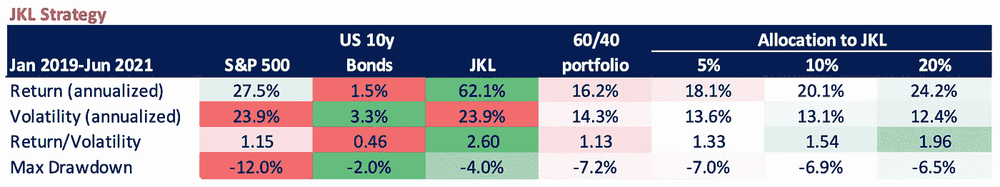

# 利用加密实现多样化:

> 原文：<https://medium.com/coinmonks/diversifying-with-crypto-1f740b047337?source=collection_archive---------3----------------------->

## **传统 60/40 投资组合中的数字资产分配**

> 文章由 [Lesia M.](https://twitter.com/LesiaMrch)

Photo by [David McBee](https://www.pexels.com/@davidmcbee) | pexels.com

## TL；速度三角形定位法(dead reckoning)

*   加密货币的多元化是一个有争议的话题:一方面，加密资产类别产生了非凡的回报，另一方面，高波动性相当不稳定。
*   只要通过保持低相关性来对冲传统资产的下行风险，Crypto 就能提供良好的多样化。
*   加密货币产生的阿尔法值高于股票。这一点因最近贷款平台的兴起而被放大，这些平台为持有的密码提供高收益。
*   事实上，将 5%的份额分配给比特币确实可以获得加密回报，同时保持投资组合的波动性基本不变。
*   对 ETH 的 5%配置带来了大约 8%的年回报率，ETH 的投资组合波动性为 7%。
*   将 20%的资金分配给 JKL 策略，经典投资组合的年化回报增加了 8%，而其波动性下降了。

近年来，加密货币受到了来自各个可能方向的高度关注:传统金融机构、企业、政府、零售客户和许多其他人。所有这些市场参与者都将 cryptos 视为未来的互联网/黄金/支付方式；扰乱政府和社会秩序；作为便利犯罪活动和洗钱的工具；作为一种新的法定货币来对抗通货膨胀和给予公民财政独立；作为国债的储备资产。如今，加密货币的潜在应用广泛传播。

金融机构覆盖的最常见的研究主题之一是密码是否是一种“可投资”的资产类别，如果是，这种资产类别提供了哪些多样化的好处。这些年来，这类研究的结果在不同研究机构之间形成了令人印象深刻的对比，通常与最近的加密市场走势奇怪地一致。

事实上，银行在结论中自相矛盾的历史由来已久。2021 年 5 月 21 日，高盛发表了一份报告[1]，其中该银行的全球宏观研究团队针对加密市场。尽管该报告大力强调加密货币固有的特殊风险，但它也描述了小额比特币配置对传统投资组合的多样化好处。然而，仅一个月后，即 2021 年 6 月，高盛投资策略集团发布了另一份报告[2]，其中加密货币被视为“对我们客户的多元化投资组合而言不可行的投资”。

2021 年 2 月，JP 摩根全球研究(JP Morgan Global Research)发布了其关于区块链、数字货币和加密货币的年度报告[3]，其中“加密货币的小额(至多 2%)配置仍能提高投资组合的效率，因为高回报和适度的相关性”。与此同时，该银行的分析师不确定 cryptos 的多样化优势，因为“加密资产继续被列为股票重大提款的最差对冲工具”。

这种争议不允许对加密资产的多样化优势得出单一结论。造成这种缺乏清晰愿景的因素有很多，特别是加密资产的波动性，比股票或黄金高出数倍。然而，加上非凡的回报，加密货币仍然比许多传统资产产生更高的夏普比率。

Source: JKL Research

此外，加密货币事实上取得了显著的阿尔法相对于股票。例如，2015 年至 2020 年期间，比特币的阿尔法与标准普尔 500 之比为 128%，这意味着在 5 年时间跨度内，加密货币的回报率超过基准指数 128%。加密货币产生超额收益的方式主要是通过区块链网络的动态(如比特币减半事件或加密‘燃烧’)和新产品的推出。行为模式和信息(非)效率的结合也推动了加密中的 Alpha，由此来自类似来源的信息和观点被相对较小的受众通过一组通信渠道共享。不幸的是，这些来源中的一些碰巧是未经核实的和有偏见的，导致恶名昭彰的“泵和转储”计划，故意歪曲，等等。

此外，如今加密货币有可能在比特币和加密资产本身上生成 alpha。随着越来越多的贷款平台允许投资者从其持有的加密货币中获得高额回报，拥有加密货币从未像现在这样有吸引力。收益产品缓解了销售压力，减少了市场上的流动性，因为许多用户选择持有他们的加密资产来赚取高利率。两者——传统资产和密码本身的 alpha 都让数字资产类别与其他投资大相径庭。

最后，cryptos 在传统投资组合多样化中的有益作用源于数字和传统资产之间历史上较低的相关性。这一特性将加密货币变成了一种抵御传统投资组合下行风险的防御性对冲工具。

为了说明数字资产的多样化优势，我们评估了在将密码分配到经典的 60/40 投资组合时各种财务指标的变化。我们将使用 BTC 作为整个加密货币的代理，使用 ETH 作为 DeFi 空间的代理，因为后者被广泛视为分散的应用层。

值得一提的是，到目前为止，市场已经广泛地将密码产业视为一个整体。然而，随着市场参与者对区块链空间的了解越来越多，我们预计相关性将下降，加密项目将根据其内在价值定价。

## **与 BTC 一起多元化**

我们考虑以下指标来评估 BTC 多元化投资组合的表现:回报、波动性、风险调整回报和最大提款。

尽管波动性很大，但由于回报过高，比特币仍能创造出优于风险调整后数据的表现。然而，比特币的波动性是股票的 3 倍，其最大提取额是股票的两倍多，对于那些瞄准特定投资组合风险水平的投资者来说，这种加密货币仍然远远超出了舒适区。

Source: JKL Research

**事实上，将投资者的一小部分资产配置到比特币中，可以获得加密的回报，同时保持较低的波动性**。在 2019 年 1 月至 2021 年 6 月期间，在传统的 60/40 投资组合中，BTC 的 5%配置对投资组合的波动性影响最小，同时年回报率增加 6%。然而，20%的较大配置已经驱动了投资组合约 40%的波动。

## **用 ETH 实现多样化**

总的来说，用 ETH 分散传统的 60/40 投资组合与比特币有一些非常相似的模式。与 BTC 一样，ETH 在 2019 年 1 月至 2021 年 6 月期间创造了出色的风险调整后回报。将 5%的资金分配给 ETH 可以获得大约 8%的年回报，而 ETH 占投资组合波动性的 7%。

Source: JKL Research

尽管如此，以太坊比比特币更不稳定。在 2019 年 1 月至 2021 年 6 月之间，以太坊对比特币的贝塔系数为 1.05，这表明在此期间，以太坊的风险比 BTC 高 5%。因此，同等的 ETH 分配比 BTC 分配产生更高的回报，同时伴随着更高的风险水平。

这似乎是 DeFi 空间的一个合适的代理，因为与比特币相比，大多数分散式项目的风险要高得多。以太由于其分散应用，未来可能有更大的上升潜力，但风险更高。例如，尽管 BTC 在 6 月份下跌了 6%，但 ETH 下跌了约 16%。

需要强调的是，上述 BTC 和瑞士联邦理工学院多样化表没有考虑产量的产生。考虑到各种收益应用对个人密码持有量提供高达 10%的年利率，传统投资组合中数字资产的表现将更加令人印象深刻。

## **利用 JKL 战略实现多元化**

JKL Capital 的交易系统利用 200 多个统计模型，持续优化数字资产分配，以最大化回报，同时最小化投资组合的风险。与仅做多策略相反，JKL 资本交易系统旨在预测短期价格变动，捕捉数字资产的诱人波动性并降低风险。

我们的基金与基础数字资产的相关性一直很低:自 2018 年 9 月该基金推出以来，JKL Capital 与比特币的相关性仅为 0.0715。用 JKL 策略使经典的 60/40 投资组合多样化，不仅提供了数字资产类别的对冲优势，还提供了针对数字资产本身下行风险的额外对冲。

Source: JKL Research

在此基础上，将 JKL 策略配置到一个传统的投资组合中，实际上降低了投资组合的波动性(！)同时提高年化收益。虽然风险调整后的回报不如分散投资 BTC 或瑞士联邦储蓄银行时强劲，但提高波动性水平和最大提款额完全符合寻求最小化风险敞口的传统投资者的要求。例如**以 20%配置到 JKL 策略，经典投资组合的年化收益增加 8%，而波动性降低。**

JKL 策略使投资者能够获得加密敞口，分散投资组合，并受益于与数字资产相关的波动性。与此同时，JKL Capital 通过与基础数字资产价格波动的低相关性，有效管理投资组合的实际波动性，同时避免下行风险。

## **结论**

根据 JP Morgan Perspectives [3]，“由于高回报和适度的相关性，加密货币的小额(最多 2%)配置仍然可以提高投资组合的效率”。该银行的全球研究同意比特币提高长期投资组合效率，但担心如果加密技术与传统资产的相关性增加，这种贡献可能会减少。

高盛的“顶级思维”研究[2]支持这一结论，声称比特币多样化收益的驱动因素是其高风险调整回报率以及与其他资产相对较低的相关性。

历史数据表明，加密资产的小额配置提高了投资组合的风险调整回报率，同时保持了较低的波动性。这种有利影响的主要原因是加密货币相对于传统资产产生 alpha 的能力，以及加密货币和传统资产之间的低历史相关性。

评估未来多样化的好处需要了解加密资产和传统资产之间的相关性是否会保持较低水平，或者随着加密资产类别获得更多主流敞口，它们是否会随着时间的推移而增长。风险在于，随着密码获得主流关注，它们与传统市场的相关性将会增加。一方面，更高的采用率可以改善数字资产类别的波动性，维持当前的风险调整回报率水平。另一方面，失去“防御性对冲”的地位可能会削弱加密资产作为多样化工具的表现。

[1]高盛(2021)。*最重要的。密码:一种新的资产类别？*

[2]高盛(2021)。*数字资产:情人眼里出西施*

[3]摩根大通的观点(2021 年)。*数字化转型和金融科技的崛起:区块链、比特币和数字金融*

**免责声明**

*私人和机密*

*仅限收件人*

*本材料严格保密，仅供专业投资者(根据开曼群岛金融管理局不时的定义)使用。未经 JKL Digital Capital Limited(“JKL”)的书面同意，不得出于任何目的复制、重新分发、传递给任何其他人或出版其全部或部分内容，并且必须在 JKL 要求时返还。虽然本材料中包含的信息是从据信可靠的来源汇编的，但 JKL 不代表或保证本材料中包含的信息的准确性、完整性或可靠性。*

*本材料的内容未经任何监管机构审核。建议您对本材料的内容保持谨慎。如果您对本材料的任何内容有任何疑问，您应该获得独立的专业意见。JKL 或其任何关联公司，或其任何或其各自的董事、高级职员、员工和代表都不会对因使用或依赖本材料中包含的任何信息而导致的任何直接、间接或后果性损失承担任何责任或义务。本材料不构成认购或购买任何金融产品的要约或邀请。其目的不是提供任何信贷或其他评估的基础，也不应被视为购买任何金融产品的建议。*

JKL、其关联公司和/或任何或其各自的高级职员、董事、员工和代表可能不时在本材料中描述的产品或与产品相关的任何投资中、为他们的专有账户和/或为他们管理的账户和/或为客户拥有重大利益，这可能对产品的价值产生积极或消极的影响。

> 加入 [Coinmonks 电报频道](https://t.me/coincodecap)，了解加密交易和投资

## 另外，阅读

 [## 加密交易机器人——最佳免费加密交易机器人

### 2021 年币安、比特币基地、库币和其他密码交易所的最佳密码交易机器人。四进制，位间隙…

medium.com](/coinmonks/crypto-trading-bot-c2ffce8acb2a)  [## 最佳 6 个加密交易信号电报通道

### 这是乏味的找到正确的加密交易信号提供商。因此，在本文中，我们将讨论最好的…

medium.com](/coinmonks/best-crypto-signals-telegram-5785cdbc4b2b)  [## BlockFi 评论 2021:利弊和利率

### 今天，我们提出了一个全面的 BlockFi 评论，这是一个成立于 2017 年的加密贷款平台，拥有其…

blog.coincodecap.com](https://blog.coincodecap.com/blockfi-review)  [## 加密税务软件——五大最佳比特币税务计算器[2021]

### 不管你是刚接触加密还是已经在这个领域呆了一段时间，你都需要交税。

medium.com](/coinmonks/best-crypto-tax-tool-for-my-money-72d4b430816b)  [## Pionex 评论 2021 |免费加密交易机器人和交易所

### Pionex 是为交易自动化提供工具的后起之秀。Pionex 上提供了 9 个加密交易机器人…

medium.com](/coinmonks/pionex-review-exchange-with-crypto-trading-bot-1e459d0191ea)