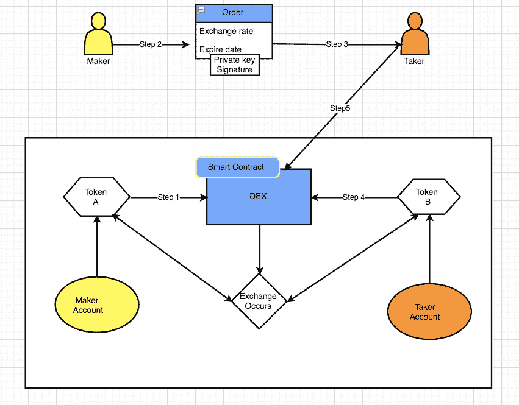

# 深入研究 0x 协议

> 原文：<https://medium.com/coinmonks/diving-deep-into-0x-protocol-547efb83ffed?source=collection_archive---------6----------------------->

**背景:**

0x 是建立在以太坊区块链之上的开源协议，用于交换基于 ERC20 的令牌。代币的交换是通过一个智能合约系统来完成的，任何建立在以太坊区块链之上的去中心化应用(DApp)都可以使用这个协议，并且可以访问公共流动性池或者可以创建自己的流动性池。将 0x 协议与分散式交换区分开的关键特征是它的链外顺序中继和链上值传送。

**链外订单和链内结算的一般顺序:**

现在我们来详细谈谈链外订单传递和链上价值转移。按照图 1.1 一步一步来。图下方给出了每个步骤的描述。

(Figure 1.1)

**步骤 1:** 制作器允许分散式交换机(智能合约)访问他/她的令牌 a

**步骤 2.a:** 出票人创建用代币 B 兑换他/她的代币 A 的订单，并给出期望的汇率和截止日期。在这之后，制造商用他/她的私钥签署订单。

**步骤 2.b:** 现在，制造商可以通过任何通信媒介发送订单，包括电子邮件、facebook、Skype 等。

**第三步:**收单者偶然看到了制单者的订单，想要用他/她的代币与制单者的代币进行交换。收款人填写订单(使用智能合约中的 fill()函数)。

**步骤 4:** 现在，接受者将允许分散交换(智能合约)访问他/她的令牌 b

**第五步:**收单员将出票人的订单提交给分散交易所。

现在，分散交易(智能合约)将验证订单，检查订单是否过期或已经被其他人填写，如果不是，则它将在制造商和接受者之间交换令牌。

要了解[点对点顺序和广播顺序如何在 0x 协议](/@usmanework99/point-to-point-orders-and-broadcast-orders-on-0x-protocol-50ad4087d099)上工作，我建议你也阅读我们关于这个主题的文章。

[*在 0x 协议上实现点对点命令和广播命令。*](/@usmanework99/point-to-point-orders-and-broadcast-orders-on-0x-protocol-50ad4087d099)

感谢 Sidra Tariq 在这篇文章中对我们的帮助。