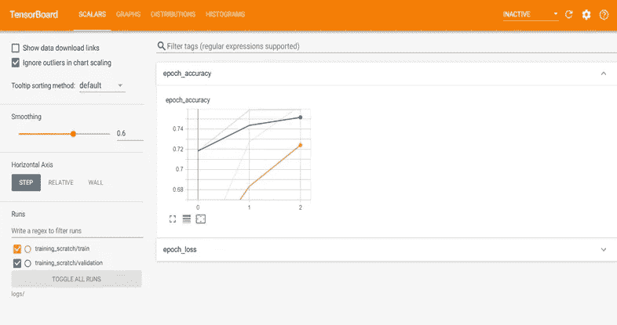
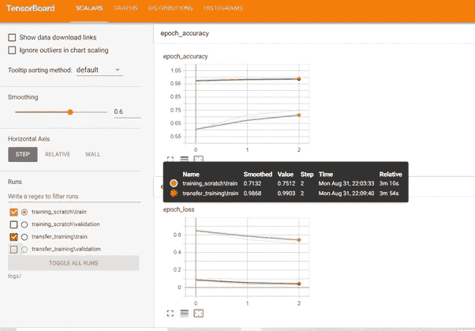
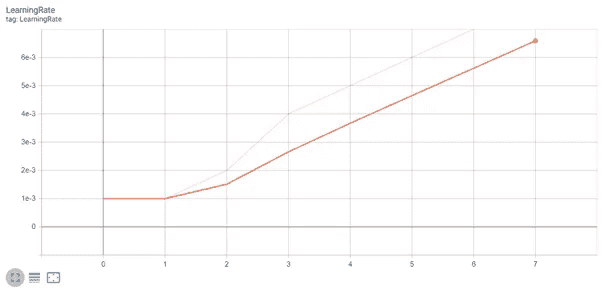
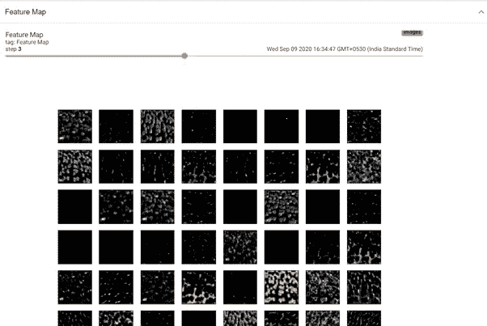
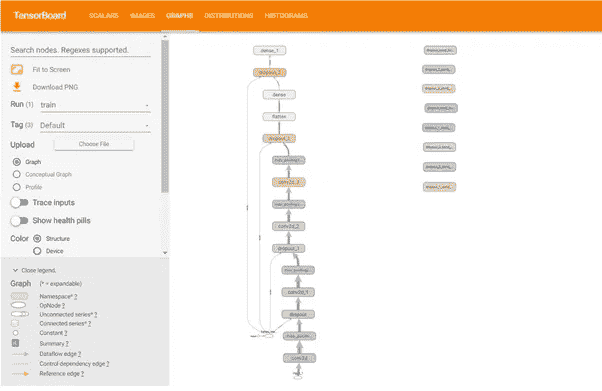
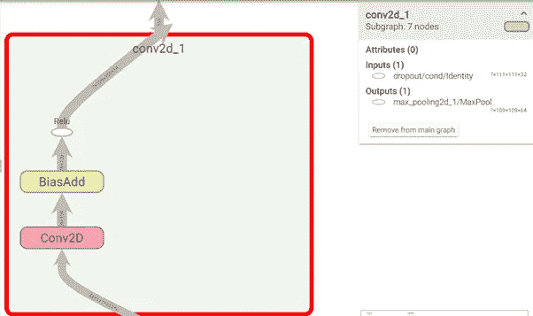
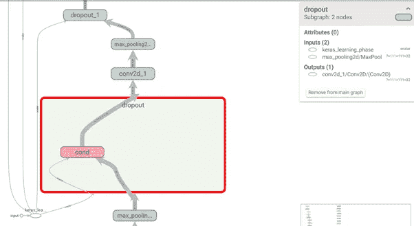
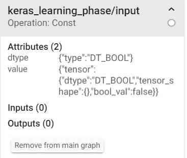
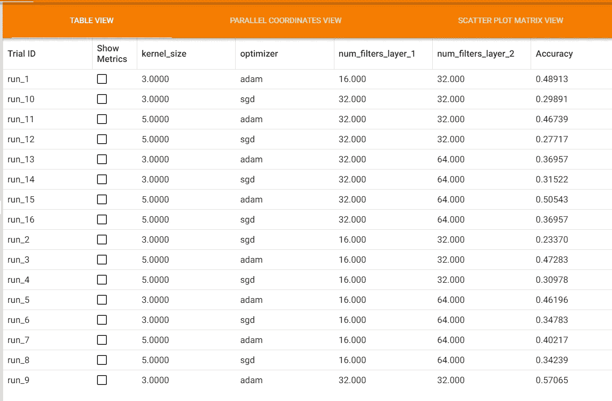

# 潜入冲浪板

> 原文：<https://medium.com/coinmonks/diving-into-tensorboard-c68523418738?source=collection_archive---------0----------------------->


TensorFlow 是最受欢迎的深度学习框架，随着 Tensorflow 2.0 的发布，Keras 已被集成到 Tensorflow 生态系统中。这大大提高了 Tensorflow 的易用性。Tensorflow 为深度学习提供了许多令人惊叹的功能和库。Tensorboard 是 Tensorflow 提供的惊人功能之一。根据 tensorflow.org:

Tensorboard 是一个分析、可视化、调试训练的神奇工具。Tensorboard 是 Tensorflow 的一部分，但也可以单独安装。

我们的 Tensorflow 之旅概述如下:

1.  Tensorboard 入门
2.  分析标量和度量
3.  绘制图像数据
4.  分析图形模型
5.  超参数调谐

**1。****Tensorboard 入门** TensorBoad 在模型训练时使用回调。要在训练中使用 Tensorboard，您需要在 model.fit 函数中包含 Tensorboard 回调。

```
log_dir = "logs"
tensorboard_callback = tf.keras.callbacks.Tensorboard(logdir)
model = tf.keras.Sequential([###YOUR MODEL###])
model.compile()
model.fit(x,y, callbacks=[tensorboard_callback])
```

此后，将为`log_dir`中的培训生成日志。您可以从 Jupyter 笔记本或命令行启动 Tensorbaord。要在 Jupyter 笔记本中使用它，请在新的单元格中使用下面的代码，您将在单元格输出中看到 Tensorboard。

```
%load_ext tensorboard
%tensorboard –logdir log_dir
```

使用下面的命令在命令行中运行 Tensorboard，然后打开 [http://localhost:6006/](http://localhost:6006/) 查看 Tensorboard。

```
tensorboard –logdir logs/
```

运行以上命令后，您将能够看到如下的张量板:



您可以看到训练和验证数据集的准确性和损失。接下来，假设你想比较两个型号的性能。然后，您可以在不同的目录中为它们记录日志。例如，我们将训练两个模型来进行猫和狗的分类，一个是定制模型，另一个是迁移学习模型(我知道这是一个不公平的比较😊).


正如你所看到的，在 Tensorboard 的帮助下，比较不同模型的性能变得更加容易，这有助于快速分析实验结果。例如，如果我们只想查看训练结果，我们可以从左侧窗格中仅选择相关的跑步。



**2。分析标量和度量**如上图所示，Tensorboard 默认绘制度量。如果您想添加任何其他指标或参数，您也可以这样做。要记录自定义值，您需要使用摘要编写器来编写日志。首先，定义一个摘要作者。

```
file_writer = tf.summary.create_file_writer(logdir + "/metrics")
```

执行此操作后，logdir 目录下将有一个名为 metrics 的新目录。为了记录，value 调用调用下面的代码。

```
with file_writer.as_default():
   tf.summary.scalar(name_of_the_scalar, data=value_to_log, step=epoch)
```

要记录该值，您需要一个在 on_epoch_end 触发的回调，否则只会记录一个值。在那里，您需要使用`tf.summary.scalar`进行日志记录。对于这个例子，我们将使用`LearningRateScheduler`。首先，我们需要定义函数来改变基于时期的学习率。这可以使用下面的函数来完成:

```
def learning_rate_schedule(epoch):
    learning_rate = 0.001

    if epoch > 1:
     learning_rate = 0.002
    if epoch > 2:
     learning_rate = 0.002+epoch*0.001

    with file_writer.as_default():
     tf.summary.scalar('Learning Rate', data=learning_rate, step=epoch)
    return learning_rate
```

然后将这个回调添加到`model.fit`中的回调列表中。模型开始训练后，您将能够在 Scalars 选项卡下监视一个新图形。



如果您想要监视一个指标，那么您可以使用下面的语法将文件编写器设置为默认。

```
file_writer.set_as_default()
```

**3。绘制图像数据:**在训练深度学习模型时，最好与 AUC 曲线、混淆度量等其他度量一起监控训练进度。这些指标可以在 Tensorboard 中绘制成图像，并可以跨时期进行监控。您也可以使用模型的输入或输出图像。要在张量板上绘制图像，您需要调用`tf.sumary.image`函数。

```
tf.summary.image("Image data", image, step=EPOCH)
```

在图像是张量格式的情况下，您可以将图像作为参数传递，它将被绘制出来。在图像不是张量格式的情况下，在绘图之前需要转换成张量格式。对于这个例子，我们将绘制张量板图像中隐藏卷积层的输出。为此，首先我们将创建一个卷积层输出的网格。为此，我们将使用以下方法:

```
def getFeatureMap():
 earlyPredictor = tf.keras.Model(model.inputs,model.get_layer(index=6).output)
    feature_maps = earlyPredictor.predict(img)[0]
    square = 8
    ix = 1
    figure = plt.figure(figsize=(12,12))
    for _ in range(square):
     for _ in range(square):
         ax = plt.subplot(square, square, ix)
            ax.set_xticks([])
            ax.set_yticks([])
            plt.imshow(feature_maps[:, :, ix-1], cmap='gray')
            ix += 1
    return figure

def plot_to_image(figure):
 buf = io.BytesIO()plt.savefig(buf, format='png')
    plt.close(figure)buf.seek(0)
    image = tf.image.decode_png(buf.getvalue(), channels=4)
    image = tf.expand_dims(image, 0)
    return image
```

正如在 Tensorboard 中记录标量值一样，为了记录图像，我们需要一个回调函数来记录每个时期的图像(如果您需要时期级别)。所以我们将在`LearningRateScheduler`回调期间调用这个。为此，我们首先需要使用`getFeatureMap`函数获得数字。然后，我们使用`plot_to_image`将数字转换成张量，并使用`tf.summary.image`将其写入日志。

```
figure = getFeatureMap()
with file_writer_image.as_default():
    tf.summary.image("Feature Map", plot_to_image(figure), step=epoch)
```

训练完成后，您将获得所有时期的输出。您可以使用滑块来查看不同时期的输出。



**4 分析图模型:** Tensorflow 使用图模型对模型进行优化。随着 Tensorflow 2.0 的到来，我们可以使用 Keras 来定义层，Tensorflow 在幕后处理它。Tensorflow 为定义的模型创建一个图表来优化训练。



创建模型时会生成图形，如果使用 Tensorboard 回调，您可以在图形选项卡下看到模型中的所有层。如果你想专注于一层，那么你需要双击它。我们来分析一个卷积层。



正如你看到的双击任何卷积层，有 Conv2D 层，其次是 Bias 和 Relu。箭头表示流量，箭头的数量是输出/输入维度。在右上角，您可以看到图层名称以及带有输入/输出维度的输入-输出图层名称。如果你观察辍学层，你会发现一些有趣的事情。如你所知，在训练过程中，Dropout 层会随机丢弃一定数量的神经元，但是在推理过程中，该层不会丢弃任何东西。这个模型是如何处理的？这可以从图表中看出:



如果你看到有一个`keras_lerning_phase`接受一个标量输入，输出进入每个漏失层。学习阶段的输入是指示它是否是学习阶段的布尔值。这样，压差值可以从指定值变为 0。



**5。超参数调优:**训练深度学习网络实验。这些实验可以从数据扩充到超参数调整。Tensorboard 提供了一种在 HParams 仪表板中跟踪这些超参数实验的方法。要使用 HParams 仪表板，只需在模型定义中做一些更改。首先，导入 HParams API 并定义想要优化的超参数。要定义 Hparams，请使用以下语法:

```
hp.HParam(name, domain=None, display_name=None, description=None)
```

`Name`:参数
`domain`的名称:取值，可以是离散的(hp.discrete)、整数区间(`hp.IntInterval(min_value=None, max_value=None)`)或实数区间(`hp.RealInterval(min_value=None, max_value=None)` )
`display_name`:要在张量板上显示的名称
`description`:参数说明

让我们定义几个我们想要调整的参数。

```
import tensorboard.plugins.hparams.api as hp
HP_Filters_layer_1 = hp.HParam('num_filters_layer_1', hp.Discrete([16, 32]))
HP_Filters_layer_2 = hp.HParam('num_filters_layer_2', hp.Discrete([32, 64]))
HP_Kernel = hp.HParam('kernel_size', hp.Discrete([3, 5]))
HP_Optimizer = hp.HParam('optimizer', hp.Discrete(['adam', 'sgd']))
```

然后，我们需要定义文件写入器，并使用以下代码定义 HParam 板的配置:

```
with tf.summary.create_file_writer('logs/hparam_tuning').as_default():
 hp.hparams_config(
     hparams=[HP_Filters_layer_1, HP_Filters_layer_2, HP_Kernel, HP_Optimizer],
        metrics=[hp.Metric('accuracy', display_name='Accuracy')])
```

这样，我们就为 HParam 仪表板编写了高级信息。接下来是定义模型。为了定义模型，我们创建了一个接受超参数和运行名的函数。

```
def configurableModel(dir, hparams, name):
    model = tf.keras.Sequential([
     tf.keras.layers.InputLayer(input_shape=imgsize+(3,)),
        tf.keras.layers.Conv2D(hparams[HP_Filters_layer_1], (hparams[HP_Kernel],hparams[HP_Kernel]), activation='relu'),
        tf.keras.layers.MaxPool2D(),
        #Rest of the layers])
```

正如您在 Conv2D 层中看到的，我们传递的不是滤波器数量，而是`hparams[HP_Filters_layer_1]`。这需要在我们有配置的模型的所有层上完成。model.compile 也需要这样做，因为我们在超参数中也有 optimizer。

```
model.compile(optimizer=hparams[HP_Optimizer], loss='sparse_categorical_crossentropy', metrics=['accuracy'])
```

现在您需要在 model.fit 中传递回调，如下所示:

```
model.fit(train, batch_size=64, epochs=10, callbacks=[hp.KerasCallback(dir, hparams, trial_id=name)])
```

`dir`:是目录名。
`hparams`:超参数字典。
`trial_id`:使用这些参数运行的名称。

现在我们需要用所有可能的参数组合来运行模型。为此，我们只需在超参数的嵌套循环中调用模型函数:

```
!rm -rf logs/ #To remove previous logs
iter = 0
for layer1 in HP_Filters_layer_1.domain.values:
 for layer2 in HP_Filters_layer_2.domain.values:
     for kernel in HP_Kernel.domain.values:
         for optimizer in HP_Optimizer.domain.values:
             iter += 1
                hparams = {
                HP_Filters_layer_1: layer1,
                HP_Filters_layer_2: layer2,
                HP_Kernel:kernel,
                HP_Optimizer: optimizer
                }
                run_name = "run_"+iter
                acc = configurableModel('logs/hparam_tuning/' + run_name, hparams, run_name)
```

训练结束后，我们将能够在 tensorboard 中看到 HPARAMS 选项卡和结果表。



需要考虑的一件重要事情是，训练需要运行 n 次(取决于配置的数量。2 *2* 2*2)，这可能会导致大量的计算时间。因此，在小时间段的小数据集上进行实验，以找到好的参数或至少过滤掉最差的参数，这可能是一个好主意。

当我们探索 Tensorboard 时，我们发现 Tensorboard 在许多方面对监控训练有很大的帮助。Tensorboard 也可以和 PyTorch 一起使用。

代码可以在 [Github](https://github.com/Keshav-Aggarwal/Exploring-Tensorboard) 上找到。

快乐深度学习…