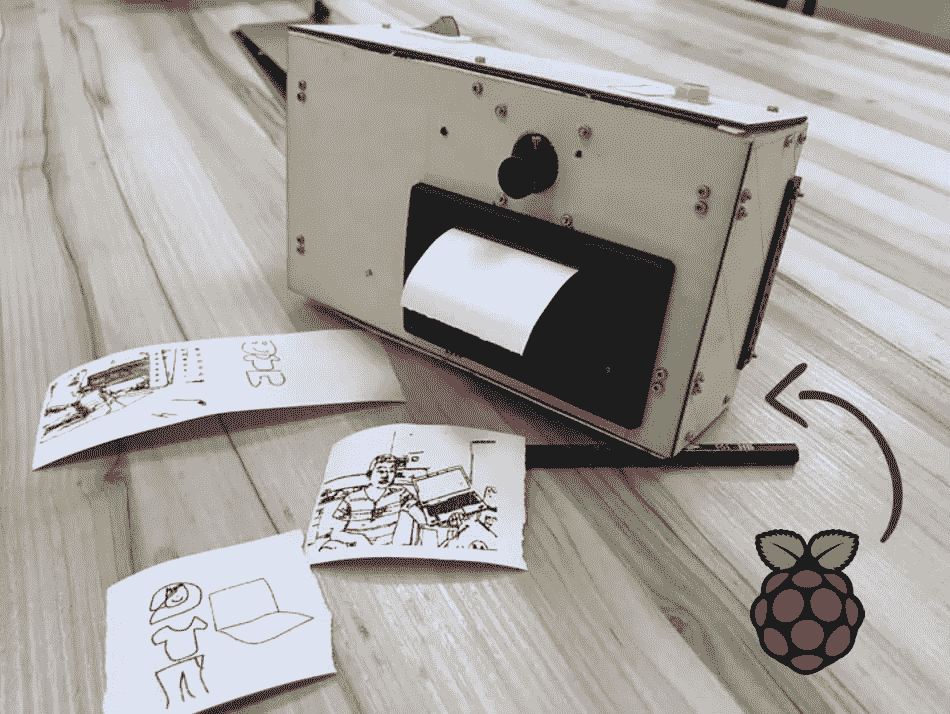

# DIY 对象检测涂鸦相机与树莓派(第一部分)

> 原文：<https://medium.com/coinmonks/diy-object-detection-doodle-camera-with-raspberry-pi-part-1-f2652872c6f5?source=collection_archive---------8----------------------->

让我们创建一个可以创建和打印一些艺术作品的相机。查看演示视频以了解结果。