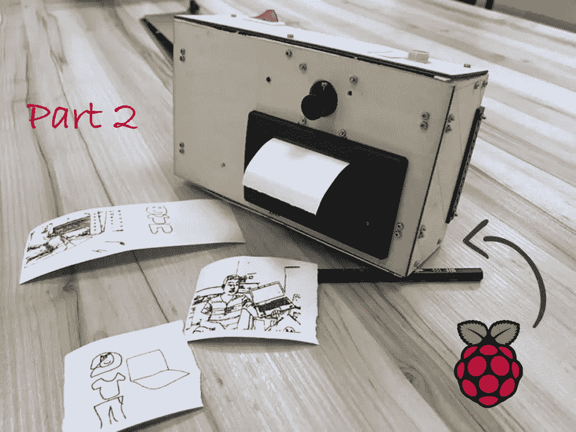

# 用树莓派 DIY 物体检测涂鸦相机(第二部分)

> 原文：<https://medium.com/coinmonks/diy-object-detection-doodle-camera-with-raspberry-pi-part-2-2f7c0ca53731?source=collection_archive---------9----------------------->

[上一篇](/coinmonks/diy-object-detection-doodle-camera-with-raspberry-pi-part-1-f2652872c6f5)走过了这个项目的前几个部分，即语音激活和物体检测。这一次，我们将总结其余的软件和硬件组件，以建立一个完整的对象检测涂鸦相机。

*   涂鸦检测到的物体
*   用微型热敏收据打印机打印绘图