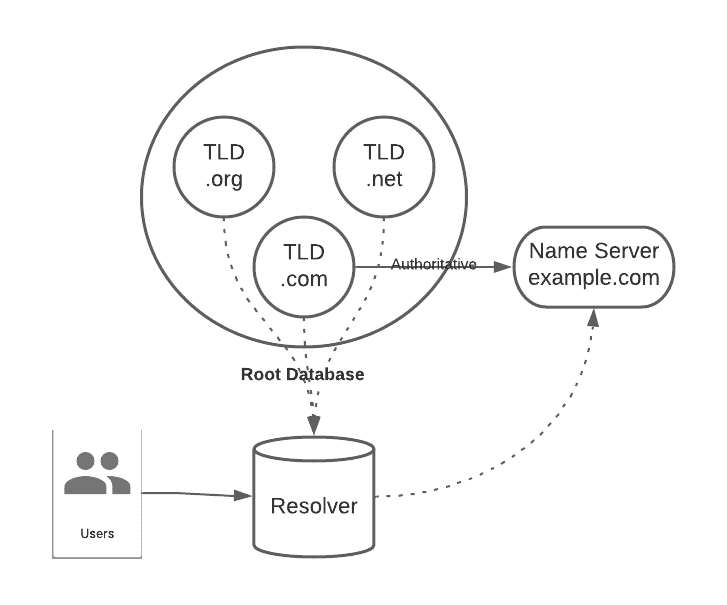
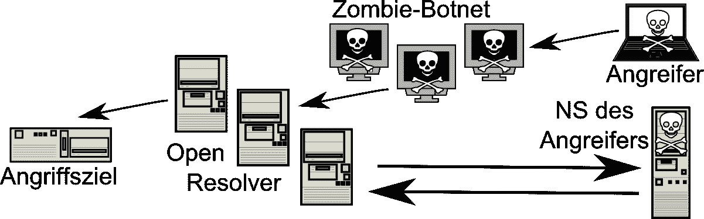
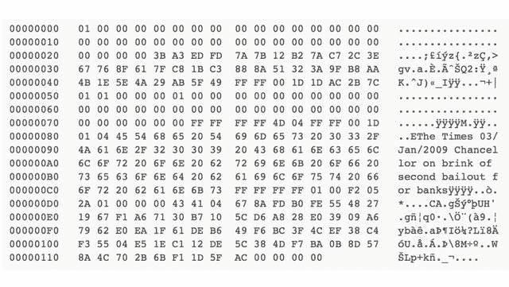

# DNS 攻击摘要

> 原文：<https://medium.com/coinmonks/dns-attacks-summary-e82b3a221b08?source=collection_archive---------6----------------------->

本文旨在收集关于 DNS 协议和架构的已知问题。这样做的目的是更新安全级别的状态

我不会提醒你什么是 DNS 协议和架构，有大量的网站完全适合。因此，我选择了对本文重要的不同观点。

最初，DNS 架构和协议允许将人类可读的名称转换为互联网地址(IP)，反之亦然。以前，使用/etc/hosts 文件来执行这种转换。从安全的角度来看，这种技术仍然是最安全的，但在操作上完全无法管理，尤其是随着 Web 的发展。

随着时间的推移，DNS 终于有点成为“信任中心”，因为现在验证操作是在域名的基础上进行的。网络很清楚在我的带有 [SPF](https://en.wikipedia.org/wiki/Sender_Policy_Framework) 的域名下允许发送电子邮件，谷歌检查你是否是带有 [ACME](https://en.wikipedia.org/wiki/Automated_Certificate_Management_Environment) 的 letsencrypt 等域名的持有者。在全球范围内，我们会附加与域相关的密钥、哈希和路由信息(区域)。这是一件好事，注意到这一点很重要，因为越来越多的 DNS 被要求提供服务如此重要数据所需的安全功能。

# 本地拦截

这是第一个真正的 DNS 问题。基本上，它使用不可靠的传输协议(UDP ),不使用加密或签名。这使得协议容易受到代理或简单嗅探的 [MITM 拦截攻击](https://en.wikipedia.org/wiki/Man-in-the-middle_attack)。

有可能在用户或权威服务器没有得到通知的情况下监听和修改数据。唯一的限制是已经有一个物理连接。

在这种拦截模式下，有可能劫持 DNS 查询的目的地，劫持网站，电子邮件服务器，rdp…当然也有可能剖析用户。

# 远程拦截

远程拦截包括通过在解析器的缓存中强加虚假数据来劫持域 example.com 的连接，解析器然后将该数据重新分发给用户。这是 DNS 的两个弱点的结合，允许实现这一壮举。

第一个原因来自 UDP 的使用，UDP 是一种不可靠的传输协议，为攻击者提供了利用虚假数据欺骗 DNS 响应的可能性。因此，服务器的缓存在本质上受到影响，因为如果数据在输入端可能是坏的，那么它将是坏的。

这是一个特别严重的问题，因为即使不在中间也可以进行拦截。此外，这仍然是一个问题，因为 DNSSEC 正在努力，因为许多 DNS 安装只是被遗忘。

[本出版物](https://web.mit.edu/6.033/www/papers/dnssec.pdf)详细介绍了 DNS 攻击媒介

# deputy director of ordnance services 军火服务司副司长

我们最终到达那里，这肯定是最常见的攻击。首先，重要的是要理解，在我们的情况下，DNS 架构和协议被劫持来攻击目标。受到攻击的不是 DNS，而是它变成了武器> DNS 放大。

进行 DNS 放大攻击有几种方法，但一般概念是，在某些情况下，名称服务器会用很长的数据包来响应短请求数据包。在某些情况下，60 字节的请求可能会导致超过 3，000 字节的响应。因此，增益系数大于 50。该响应通过假冒的 IP 地址被定向到受害者的 IP 地址。

当响应大于 512 字节时，EDNS 扩展允许通过强制客户端使用可靠的协议(如 TCP)发送请求来限制这种类型的攻击。

跟踪这种类型的攻击特别困难，因为大量信息被盗用，如果没有大量数据，就不可能确定攻击的来源。

# DNSSEC

幸运的是，DNSSEC 解释起来会更复杂，因为有符号的响应必然比无符号的响应大。因此，DNSSEC 需要 EDNS0 来指示数据包必须通过 TCP 传输，因为响应超过了 512 字节。

就其本身而言，DNSSEC 并不是为了防止传输层(UDP/TCP)拦截的风险而设计的，我们将在后面看到这一点。

# DNSSEC:信任链

即使 DNSSEC 确实可以防止缓存中毒或放大等预测性攻击，但仍有可能使用 MITM 攻击模型进行攻击，在这种模型中，从源头上重建信任链会更容易。

DNSSEC 不对根信息附加任何信任证明。基本上拦截 example.com 会很复杂，但拦截美国会更容易。com TLD(顶级域名)，从而重建 example.com 链。

用我的行话来说，我称之为重建攻击。这个想法是重建所有的链条，而不仅仅是一个环节。这个问题来源于客户没有信任点，我通常称之为信任引导。通常，它类似于作为主要块或起源块插入(硬编码)在客户端软件中的公钥。这个公钥将签署第一个上升点，并允许获得一个初始信任，并消除重建链的可能性。

我描述的相对简单，但实际上这些操作管理起来相当复杂。典型地，在比特币中，因为每个人都相信创世区块，所以该协议在不可靠的网络上技术上(和密码上)是可靠的。

Bitcoin’s Genesis Block

我不知道为什么开发人员和研究人员没有将信任引导集成到 DNSSEC 中。但是可能有几个原因:

*   从技术上来说，管理起来很复杂(尤其是在遭到破坏的情况下)，它不是一个(网络)区块链
*   实现的复杂性:有些人会要求注册他们的公钥。
*   政治问题:这给了这个创世区块很大的权力。

# DNSSEC:重播和计时问题

重放攻击在于重用由权威机构发布和签名的数据。[维基百科有一篇关于这个主题的有趣文章](https://en.wikipedia.org/wiki/Replay_attack)。你应该知道，在 DNSSEC，是编辑区域的人来签名，他的私人密钥(通常)不会存储在域名服务器上。因此，不可能从他那里得到允许(粗略地)通知网络使用哪个区域的权威时间装订，因为必须为此使用编辑键。[网上有一篇文章](https://cs.gmu.edu/~eoster/doc/npsec_08-revocation.pdf)是关于应对重播的解决方案。

TLS/SSL 在其撤销机制中集成了一种类似的方法，称为 [OCSP Stapling](https://en.wikipedia.org/wiki/OCSP_stapling) ，以确保证书的不可否认性。这种技术对于在客户机/服务器通信期间的用户保密性有很大的优势。

在 DNS 方面，将区域编辑器的密钥留在服务器上会使区域暴露于太多的黑客攻击，并且由于重放是可能的，一旦被盗，密钥甚至可以在不被检测到的情况下制造真假区域。

因此，该区域被一劳永逸地签名，因此没有人能够证明该区域的完整性，从而证明所使用的区域的完整性。

然而，利用这种漏洞是复杂的，因为它需要几个因素才能变得有趣。首先，需要经过签名和验证的区域。除非你窃取了编辑器的密钥，否则你将不得不记录服务器广播的所有区域，并通过 MITM 将感兴趣的区域呈现给[攻击者。而且要想得到一个所谓的有趣地带来完成一次攻击也不容易。](https://en.wikipedia.org/wiki/Man-in-the-middle_attack)

我不知道我们是否可以认为这种攻击是非常实际的，所以我将这种漏洞归类为理论上的或次要的。然而，从纯密码的角度来看，它是密码链中的一个中断。

# 体系结构

DNS 的总体架构正在老化。这主要是因为它在技术上的发展非常有限，而需求和能力却在增加。互联网和计算机连接的力量降低了体系结构的安全性。因此，定向到根服务器的 DDoS 会对用户使用 DNS 以及互联网产生重大影响。

# 我应该用 DNSSEC 吗

当务之急是，这本身就是一个完美的解决中毒问题的方法，这个问题在 DNS 中尤为严重。然而，DNS 演进并没有在本地拦截方面提供大的突破，但是它们很好地规范了远程拦截。

最后，DNS 受到自身安装的影响。互联网上有大量的 DNS 服务器绝对不是最新的，从缺失的实现(如 DNSSEC)到未打补丁的安全漏洞。

需要一个彻底的解决方案。