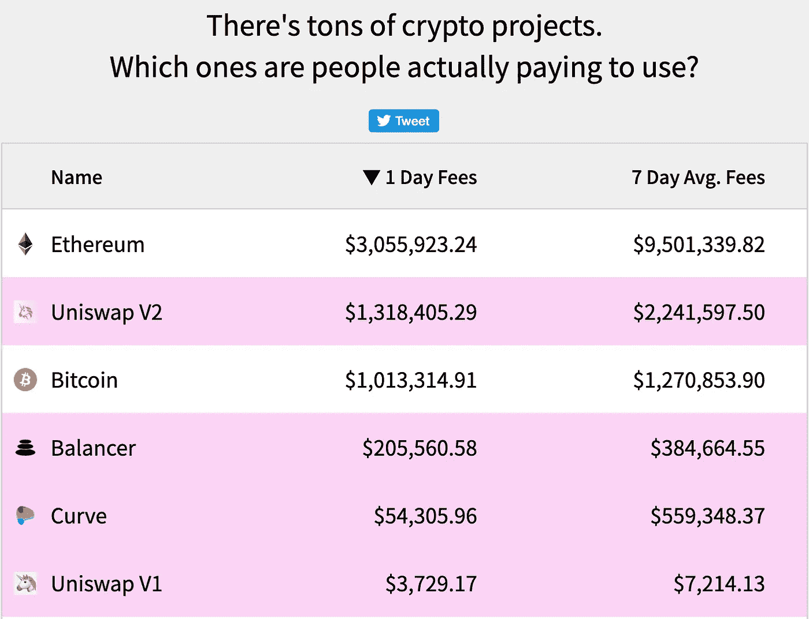

# 任何密码实际上产生收入吗？

> 原文：<https://medium.com/coinmonks/do-any-cryptos-actually-generate-revenue-70137e2413fd?source=collection_archive---------2----------------------->

Source: [Cryptofee.info](https://cryptofees.info/)

[2 分钟视频](https://youtu.be/N0SvRAcanZE)了解一些加密技术现在是如何产生收入的

如果我要冷嘲热讽的话，简单的答案是肯定的，cryptos 面临着来自世界各地监管机构的大量罚款和处罚。有人声称整个[密码部门是一个骗局](https://davidgerard.co.uk/blockchain/2020/09/06/the-crypto-market-as-a-single-unified-scam/)，它将在一个强大的重击中轰然倒地，或者这是嫉妒的政治，希望他们在推出时是一个买家…