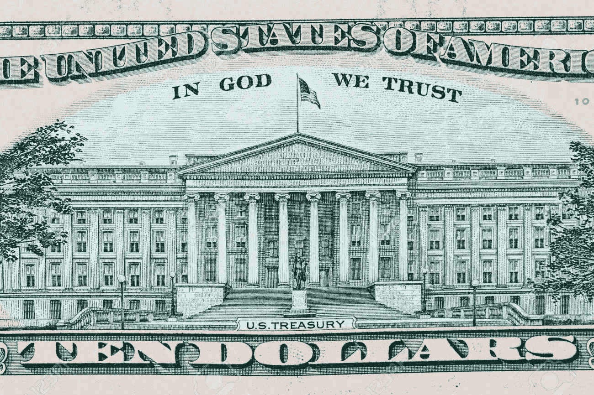
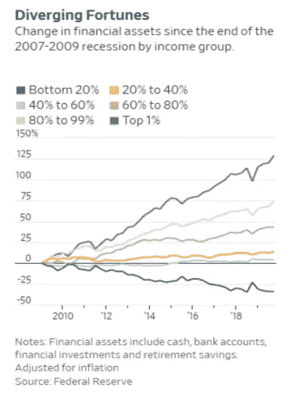
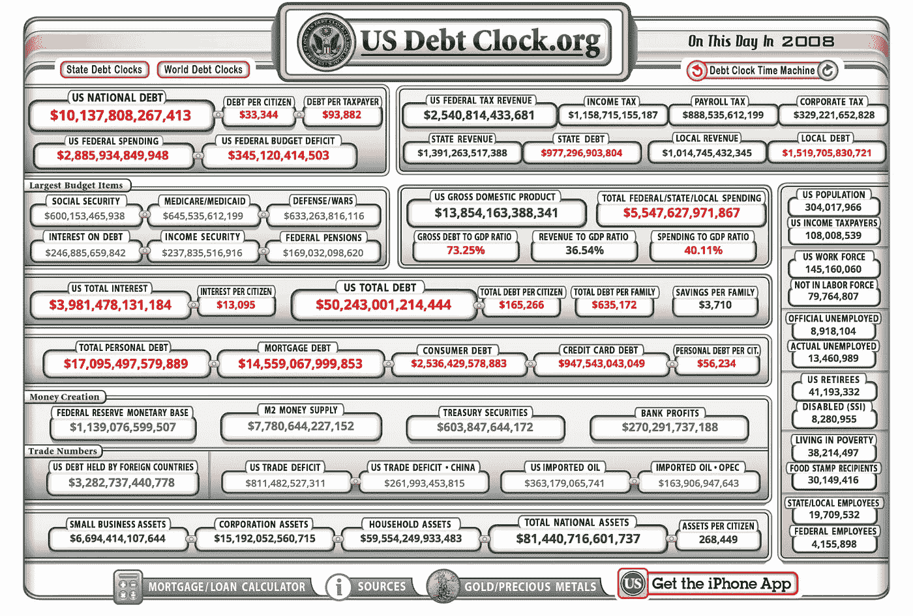
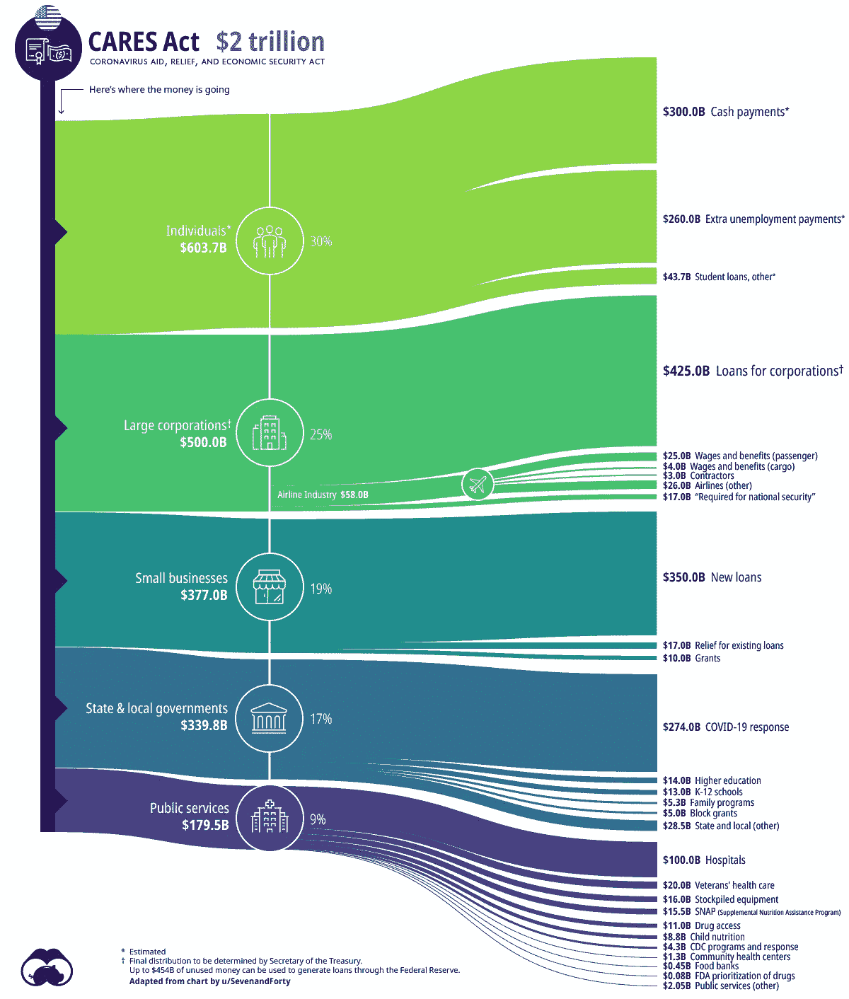
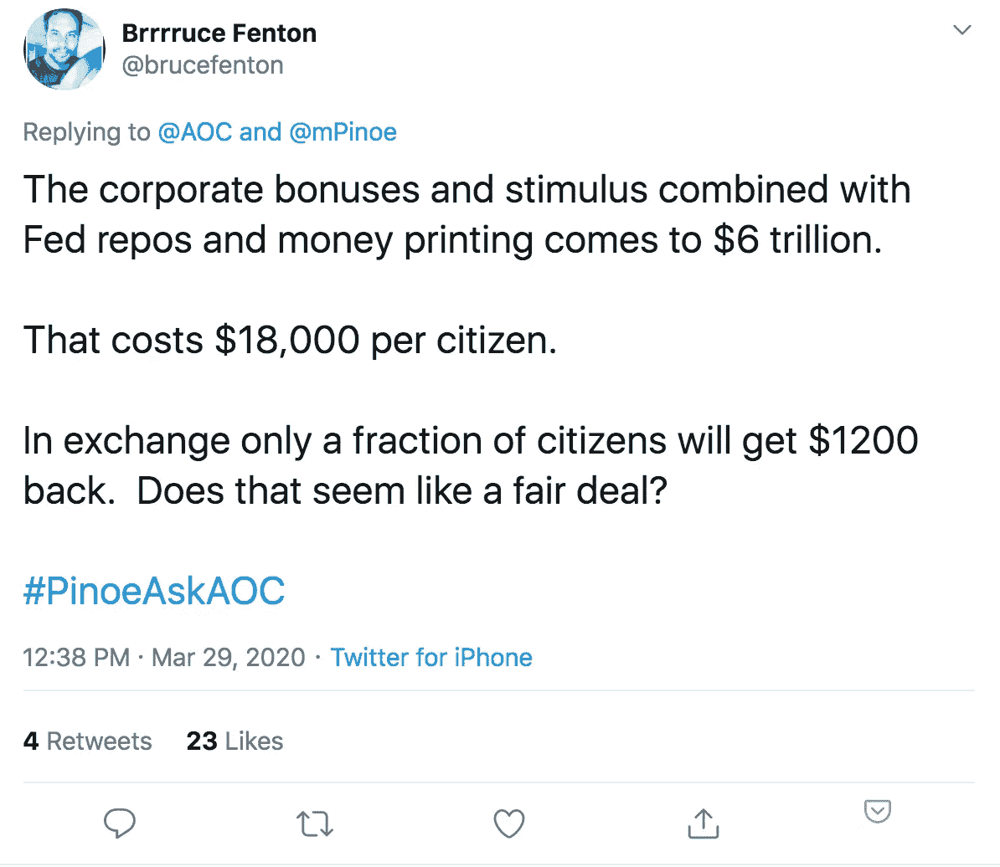
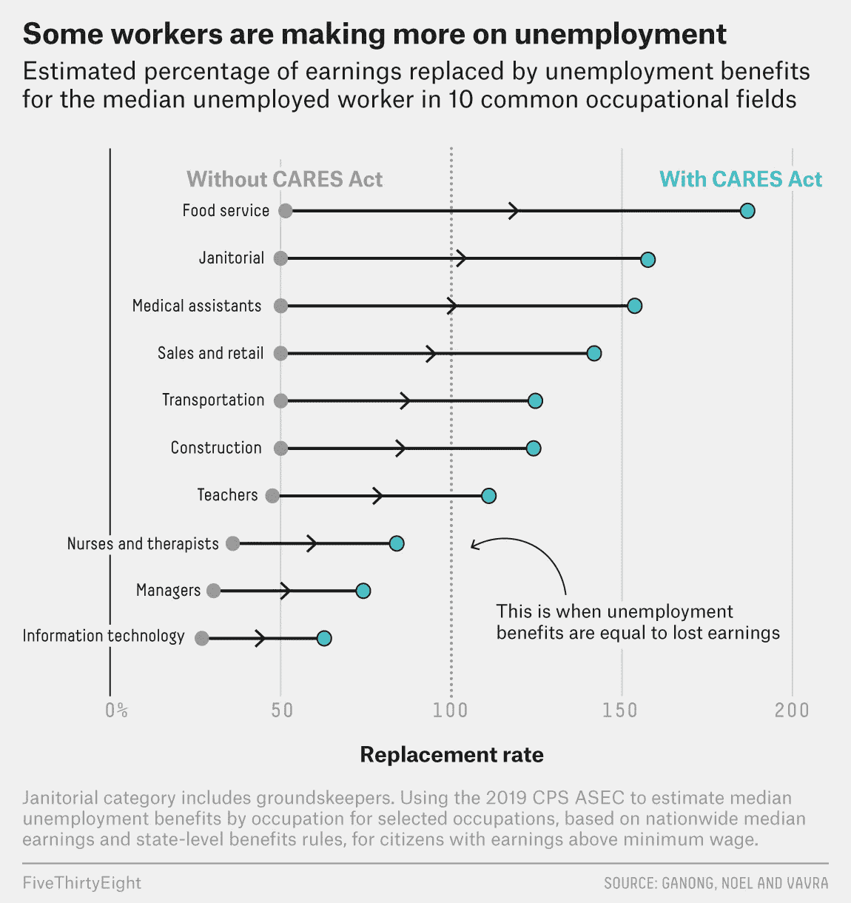

# 美国经济的问题

> 原文：<https://medium.com/coinmonks/do-dollars-make-cents-e9c9c641e123?source=collection_archive---------1----------------------->

## 如果美元变成美分，拥有美元还有意义吗？

美元是我一生的现状。我的美元从未被否认，被广泛接受，保护我的钱的责任由我的银行承担(加上我有 FDIC 保险)。我今天的 1000 美元明天还是 1000 美元。简而言之，美国让持有美元变得容易。这是对复杂情况的过度简化。世界各地的公民都认为美元最有意义，尽管它会把他们的美元变成美分。

## “苹果效应”

保持简单愚蠢。复杂是进步的敌人。美元和苹果产品有什么共同点？它们都是著名的身份象征，直观地起作用。挖掘表面之下。当你需要帮助时，你会用苹果产品做什么？你把它拿到商店，一个“天才”会通过一扇隐蔽的门把你的问题赶走。你把你的复杂性外包给苹果。苹果让你的生活变得愚蠢简单。光滑的产品吸引了你的初次购买，但你仍然保持忠诚，因为苹果将你的复杂转化为简单。“苹果效应”是苹果光滑的产品加上简单的用户体验。“苹果效应”对一个人的影响转化为你愿意为成为他们系统的一部分而支付的苹果溢价。

> 神奇的是，“苹果效应”让我们变得愚蠢和懒惰，同时让我们看起来很棒。我们无法抗拒诱惑，最终永远被困在它的魔咒中。

## 美元提供了完全相同的价值主张

我来证明:钱是什么？钱是怎么赚的？钱是什么时候赚的？为什么赚钱？谁赚钱？大多数人不能回答最基本的 5W 的钱。这些问题都没有涵盖金钱的复杂方面。就像 iPhone 一样，我们每天都在使用它，但它从未让我们意识到我们对它的内部外观一无所知。再一次，复杂性被外包，我们只剩下简单性。无论晴雨，美元每天都在运转。但是坏了怎么办？这不是我们的问题，因为我们有美联储(和苹果商店)的“天才”来解决它。

“美元效应”公开做出如下提议:“使用起来很简单，即使你很懒或很笨，加上我们会处理复杂的部分。你接受这个提议吗？”你必须想办法弄清楚这是否是一笔好交易，但是你没有，因为你没有其他选择。所以没什么好想的。通过排除法，我们都说“是”。出于时间的考虑，我们跳过了小字，开始追逐美国梦。

IN GOD WE TRUST

我们醒着的大部分时间都在为美元工作。我们的生活依赖于它，然而我们对它的理解却止于我们刷信用卡。我们都(盲目地)信任我们的政府，作为回报，“我们相信上帝”。这是字面上印在钱上。所以我们的美元是有意义的，因为早在我们降临地球之前，上帝就对人类有意义了。

> 我们的政府相信上帝，我们相信我们的政府，我们的钱每天都在运转。有什么问题？

假设三方的动机一致，就没有问题。我们对美元的盲目信仰会得到相应的回报。但这不是我们的现实。

## 坎蒂隆效应

> **坎蒂伦效应**是指货币供应量的变化导致相对价格的变化。相对价格的变化是因为货币供应量的变化有一个特定的注入点，因此有一个特定的经济流动路径。

[我们的美元是如何变成美分的？](/coinmonks/american-firesale-making-america-cheap-again-9f19747b1ef2)看看下图中命运是如何分化的。最富有的美国人的金融资产财富增加了+125%,而最贫穷的人实际上减少了-35%。为什么？我们切断了金钱和生产力之间的联系。美国股市脱离了美国经济。这一切都可以通过坎蒂隆效应来解释:离美元印钞机最近的人受益最大。2008 年后，大规模的量化宽松政策(QE)按照涓滴经济原则(T8)发放给了 1%的人。现实情况是，富人得到的每一美元，只有几分“流到”大多数人手中。给富人足够多轮的 QE，我们最终会得到一个明显的异常财富不平等的结果。

这就是为什么勤劳的蓝领美国人正在落后。他们的职业道德保持不变，但他们离印钞机太远，当 QE 元到达他们手中时，他们只收到美分。雪上加霜的是，印了这么多钱，实际上稀释了底层人省下的几美元。

自 2008 年以来，美国印刷了 3.9 万亿美元的 QE。相比之下，2008 年美国国债高达 10 万亿美元。今天这个数字是 25 万亿美元。这 15 万亿美元的缺口并不是 GDP 带来的净新增生产率。15 万亿美元中的大部分是凭空造出来的钱。灰线清楚地显示了 1%的人通过接近印刷机而受益，而下面所有的线显示了 1%的人是如何决定分配上述资金的。

> 这不是资本主义。这是一个作弊的游戏，在游戏开始前，获胜者已经被选定。这场游戏的赢家不会输，只有一个例外:系统性失败。

US NATIONAL DEBT CLOCK FROM 2008

## 免费抽奖活动

今天，一件令人绝望的事情正在发生:新冠肺炎刺激计划。这是一种说美国正在免费发放货币的花哨说法。在美国历史上，坎蒂伦效应首次惠及普通蓝领美国人。是时候了，对吧？但是有一个陷阱(总是有一个陷阱)。以下是《关爱法案》新资金的分配情况。如你所见，2 万亿美元中只有 30%流向个人。慷慨地说，我们可以加上适用于中小企业的 19%，使总数达到 49%。但是你和你的孩子会承担全部费用。

这些免费现金发放是为了应对新冠肺炎造成的极端情况。我们目前有 3300 万失业的美国人(T2 占工作年龄美国人的 23%)。这些数字仅比大萧条时期失业最严重时期低 1.9%。加上 COVID 之前的失业人数，我们已经超过了大萧条失业最严重的时期。

COVID 免费抽奖才刚刚开始。我们开始时每人 1200 美元。[现在他们正在讨论每人 2000 美元，每户可能高达 6000 美元](https://www.cnbc.com/2020/05/12/house-democrats-stimulus-bill-includes-a-second-round-of-1200-checks.html)——这才叫富有。杨安泽的全民基本收入(UBI)多久会成为新常态？也许在这个时候他更适合代表美国。这里有一个更好的角度来看美国正在印刷的免费钞票:

## 破碎的激励结构

许多在家领取免费支票的失业者面临一个奇怪的困境。有 3 个普通角色收到了免费的钱。第一类是负责任的老年人群，他们想要回自己的工作，以恢复常态感。第二个群体正在制造类似或合理的同等数量()刺激检查正在导致行为的转变，损害我们的工作动机。

对于仍然在职的人来说，激励结构如何？不要放大细节，让我们缩小过去 20 年的范围。[埃隆·马斯克在最新的乔·罗根体验播客](https://www.youtube.com/watch?v=JWKNfT5vUnc)中提到了这一点，“制造业曾经被高度重视……现在它经常被轻视，这是错误的。”接着说“太多聪明的人进入了金融和法律领域……我们应该让更少的人做法律，更少的人做金融，更多的人做东西。”金钱不再与生产相关。赚大钱与金融市场和非生产性行为有着非常高的相关性。收入最高的人通常是最好的投资者和投机者。过去是人们在建造东西。这意味着，我们收入最高的不是创造新的东西，增加我们的 GDP，而是金融奇才和法律鹰派，他们精通于玩一场[零和游戏](https://en.wikipedia.org/wiki/Zero-sum_game)，通过将大众将死，以指数方式增加他们的净资产。

这让 1%的富人超出了他们最疯狂的想象，同时产生了最小的、最坏的结果。这打击了 99%的人的士气，他们把所有的时间都花在工作上，却没有足够的时间去弄清楚为什么他们的美元会变成美分。那么，这将把 99%的人置于何处呢？2020 年 3 月，40%收入低于 4 万美元的美国人失去了工作。如果你在加州[一年挣 40，000 美元，税后你每月的实得工资是 2，742 美元。现在 1200 美元的刺激支票，可能很快就会达到 2000 美元，这将让这群失业者陷入一种奇怪的困境。许多人会质疑一份工作是否值得。免费的钱让人变懒。](https://neuvoo.com/tax-calculator/California-40000)

## 结论

在繁荣时期(70 年代、80 年代、90 年代)，美联储成功运用了“苹果效应”，取得了巨大的成果。我们都买了，因为这是我们最好也是唯一的选择。然后我们在绝望面前变得贪婪。通过追踪 2008 年大金融危机期间 QE 的坎蒂隆效应，我们看到今天的财富不平等不是赢得的，而是给予的。新冠肺炎突显了我们金融市场的实力，也暴露了经济的脆弱性。我们最聪明的头脑在华尔街工作，并保持股票接近历史高点。与此同时，23%处于工作年龄的美国人失业，其中许多人对重返工作岗位是否值得感到矛盾。如果你再放大一倍，这些数字会更加难看:[年收入低于 4 万美元的美国人中有 40%已经失业](https://twitter.com/DiMartinoBooth/status/1260557003837054976?s=09)。

对于许多有时间反思的失业美国人来说，这场游戏变得越来越清晰。自 2008 年以来，努力工作并没有给大多数美国人带来回报。许多人现在通过刺激支票尝到了坎蒂隆效应的滋味，在过去十年中，1%的人毫无疑问地获得了刺激支票，QE 使他们的净资产飙升了 125%。所以现在每个人都知道，你在美国应该努力的方向是游说，尽可能地接近印刷机，而不是工作。我认为，如果你在 LinkedIn 上的全职工作“越来越接近印刷机”，你也明白美国是如何运转的。风气从“努力工作”到“聪明工作”再到“不工作”。因为这是人们拿工资要做的事。坎蒂隆效应告诉我们，无论你如何分割，只有富人变得更富。

B ***itcoin 修复了这一点。*** [***找出原因***](/@bitcoin_1st/coronavirus-stocks-bitcoin-and-asians-514a3abaf1bb) ***。***

> [直接在您的收件箱中获得最佳软件交易](https://coincodecap.com/?utm_source=coinmonks)

