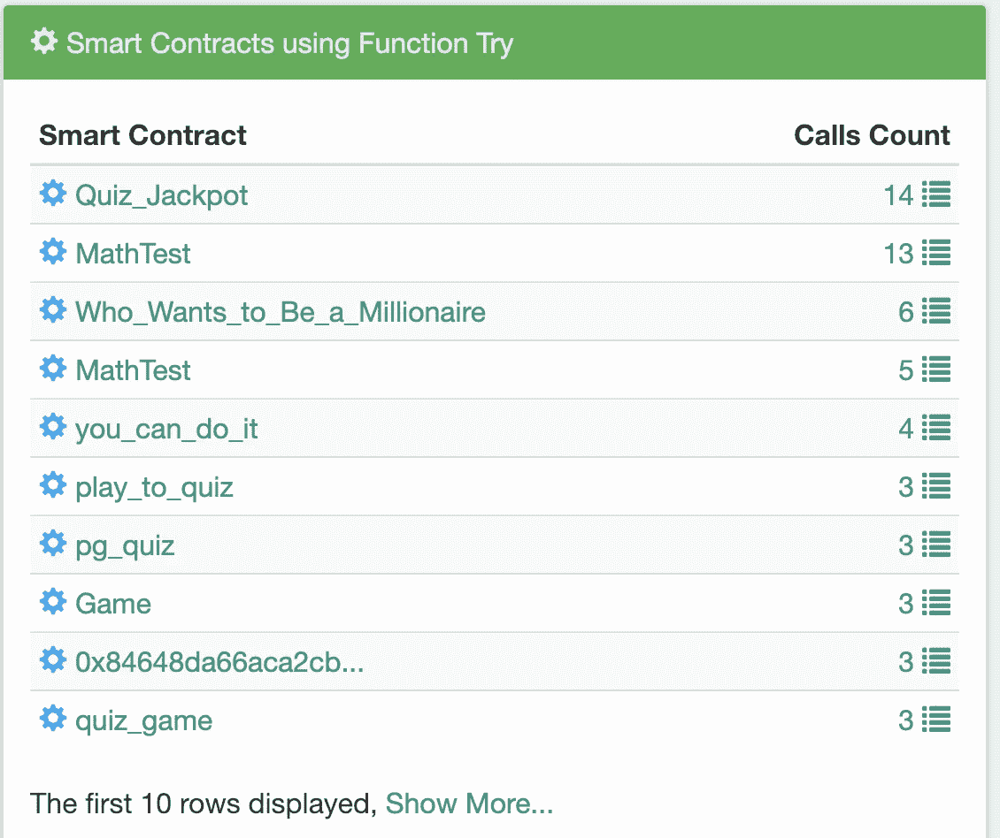

# 不要被加密问答游戏所迷惑！

> 原文：<https://medium.com/coinmonks/do-not-be-fooled-by-crypto-quiz-games-f38f72a53c78?source=collection_archive---------2----------------------->

## 他们就是骗局。如果你不读这篇文章，下面是他们如何得到你的钱。

# 什么是测验？

以太坊网络中出现了许多“智力竞赛”智能合约。这个游戏很简单:你必须猜出问题的答案。奖品从 1 到 6ETH 甚至更多。

这是一个例子:


Example QUIZ_GAME ( source: [Bloxy.info](https://bloxy.info/address/0x37c8da5a09a0afdce72371764473d88cc1374f61))

您可以在 Etherscan 找到该合同的来源:[https://ethers can . io/address/0x 37 c8 da 5a 09 a 0 AFD ce 72371764473d 88 cc 1374 f 61 # code](https://etherscan.io/address/0x37c8da5a09a0afdce72371764473d88cc1374f61#code)

规则很简单:你可以回答这个问题，合同将比较正确答案的散列和你的散列，如果它们匹配，就把所有的合同余额转移给你，在撰写本文时是 6 ETH。不错的交易！

哦，对了…差点忘了…要回答这个问题，你必须至少在第三次通知时存款。所以答案的成本是 3 ETH，奖金是 6 ETH。再说一次，这是个不错的交易。

# 轻松赚钱

在撰写本文时，Etherscan 中只有 2 个事务:合同创建和 set_game()调用:


Only 2 transactions shown in [Etherscan](https://etherscan.io/address/0x37c8da5a09a0afdce72371764473d88cc1374f61)

第一个只是契约创建，第二个是 set_game()调用，同样向契约发送 6 ETH。这个很有趣，因为它

以纯文本形式显示测验的答案！！！

如果你打开 ethers can:[https://ethers can . io/tx/0x BC 3 b 60 fbbe 2 efda 73 b 2 f1 febaec 05550362 dbcd 19d 02d 83 a9 c 14948d 70d 041 f](https://etherscan.io/tx/0xbc3b60fbbe2efda73b2f1febaec05550362dbcd19d02d83aa9c14948d70d041f)，将调用参数切换到 UTF-8 表示，你会看到:


Source: [Etherscan](https://etherscan.io/tx/0xbc3b60fbbe2efda73b2f1febaec05550362dbcd19d02d83aa9c14948d70d041f)

这在 Bloxy.info 中显示得更好:


Transaction details source: [Bloxy.info](https://bloxy.info/tx/0xbc3b60fbbe2efda73b2f1febaec05550362dbcd19d02d83aa9c14948d70d041f)

所以看起来你已经得到了一个答案(“手套”)并且可以很容易地从契约中得到 3 ETH？

正如你可能猜到的，没有。

# 陷阱在哪里？

首先，查看该合同的 Bloxy 详细页面，您将看到与 Etherscan 显示的不同之处:


Smart contract calls Source: [bloxy.info](https://bloxy.info/address/0x37c8da5a09a0afdce72371764473d88cc1374f61)

什么？你有两个以上的电话？智能合约交易超过 2 笔？是的。

是的。电话可以是内部的。当一个智能合约调用另一个智能合约时，它们将是内部事务，并且它们同样重要，因为它们也可能改变智能合约的内部状态。

这份智能合同的创建者看起来像个骗子。他使用另一个智能合约([0x 4a 3c 2 EAD 2 a2 ce 2051 e 409 ba 51 b 710 E4 e 09163492](https://bloxy.info/address/0x4a3c2ead2a2ce2051e409ba51b710e4e09163492))进行内部调用，设置了另一个答案 hash，与答案不同，可见于 Etherescan。这是通过使用以下事务完成的:


Question is the same, answer is not. Source: [Bloxy.info](https://bloxy.info/tx/0x01fd7a64239ac65f5f49c37a6d010aabe2e013596b9f8ca4bdacc38e7f538bbe)

如果你仔细看看智能合约代码，尤其是在函数 set_game 上:

```
**function** *set_game*(string _question,string _response) public payable {
 **if**(**responseHash**==0x0) 
     {
     **responseHash** = keccak256(_response);
     **question** = _question;
     **questionSender** = msg.**sender**;
     }
 }
```

当且仅当之前没有设置答案散列时，它才设置答案散列( **responseHash** )。此智能合约的创建者使用了内部智能合约调用(在 Etherscan 中不可见！)来改变答案哈希。

**responseHash** 并非有意显示为公共智能合约变量。但是，可以很容易地以编程方式获取它:

```
>>> web3.eth.getStorageAt( Web3.toChecksumAddress(smart_contract_address),2).hex()
**'0xf152950bed091c9854229d3eecb07fae4c84127704751a692c8409543dc02bd3'**
```

如您所见，它等于内部事务中设置的内容，而不等于“手套”答案的哈希，即等于:

```
>>> web3.sha3(**text**=**'GlovE'**)
HexBytes(**'0x28a2cf3d43e08c03112de5742b068e23ab3cede00f14059427e6264859fd462c'**)
```

完全不同。

如果您现在查看以太网扫描交易，并尝试回答问题，存放 3 ETH，您将丢失它们。

那么什么是正确的答案呢？很可能，根本不存在。智能合同具有以下功能:

```
**function** *StopGame*() public payable {
    require(msg.**sender**==**questionSender**);
    msg.**sender**.transfer(**this**.balance);
}
```

契约创建者注意到他将如何使用它，通过进行另一个内部交易新提问者:


new Questioner source: [Bloxy.info](https://bloxy.info/tx/0x6cc4a4534d60b4917ddfa30487aac15b5e531f3db1d24f0635ee5b8ae22eecb0)

因此，即使没有人会得到正确的答案，他会得到所有的存款。

# 骗局

1.  骗子创建合同
2.  他从另一个契约(由他专门创建)调用这个新的智能契约的方法来设置问题、答案散列和受益人。这些电话**在以太扫描**中看不到！
3.  然后他用同样的问题和可见的(但错误的)答案调用外部事务(这些是以太扫描中可见的
4.  **人们看着这个交易和智能合同代码，认为这是一个简单的方式来获得奖励。他们试着回答，存钱和松绑**
5.  **人们存了一些钱后，骗子便可以提取它。**

# **有多少受害者？**

**与此相关的智能合约列表非常多。智能合约 0 x4a 3 C2 EAD 2 a2 ce 2051 e 409 ba 51 b 710 e 4 e 09163492 与其中的许多相关:**

****

**Source: [bloxy.info](https://bloxy.info/address/0x4a3c2ead2a2ce2051e409ba51b710e4e09163492)**

**但是如何让人们参与骗局呢？可能最明显的方法是查看 Try()方法调用，在那里存放钱来回答测验。**

**Bloxy 通过名称或签名显示所有智能契约中方法使用的统计信息。最成功的是…**

****

**Try method usage in smart contracts. Source: [bloxy.info](https://bloxy.info/functions/3853682c)**

**按月统计调用 Try( **string _response** )函数的次数:**

****

**Scam is on the raise…Source: [bloxy.info](https://bloxy.info/functions/3853682c)**

**在这些电话中，有一小部分“诱饵”电话，但也有真实的电话，人们试图使用来自以太网扫描的可见答案进行欺骗，并失去了他们的钱。**

# **结论**

**我们分析了这个骗局的例子，主要是基于这样一个事实，即 Etherscan **没有显示关于智能合约内部交易的重要信息**。这使得骗子可以愚弄那些只关注外部交易的人。为了防止将来出现这种情况，请考虑:**

1.  **轻松赚钱从来不存在。如果你认为你可以愚弄某人，最有可能的情况是这是骗子的诱饵**
2.  **注意智能合约之间的内部交易。在优秀的开发人员手中，它们是强大的工具(我们希望在未来关于 DEX 和衍生品的材料中涉及到这一点)。糟糕的开发者会用他们聪明的用法欺骗你。**
3.  **考虑使用更多关于智能合同交易的信息，而 [Bloxy.info](https://bloxy.info) 就是很好的资源。Etherscan 显示的不是所有交易，而是智能合同。**
4.  **让您的钱留在口袋里:)**

```
*This article was composed from the data and by analytical tools from* [*Bloxy.info*](https://bloxy.info) *analytical engine.* [*Bloxy.info*](https://bloxy.info) *web site provides a set of tools for analytics, traders, companies and crypto enthusiasts.

The tools include APIs, dashboards and search engine, all available on-site, providing accurate data, indexed directly from the blockchain live node.

Bloxy mission is to make blockchain more transparent and accessible to people and businesses.

Please, make a reference to the source of data when referencing this article.*
```

**[](http://bit.ly/2G71Sp7)**

> **[直接在您的收件箱中获取最佳软件交易](https://coincodecap.com/?utm_source=coinmonks)**

**[](https://coincodecap.com/?utm_source=coinmonks)**