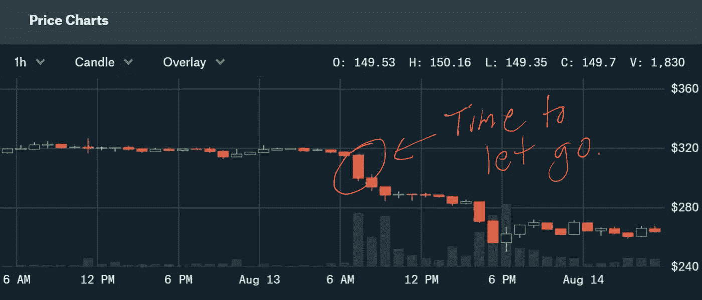

# 不要复苏——熊市中 CDP 的应急计划

> 原文：<https://medium.com/coinmonks/do-not-resuscitate-contingency-planning-for-your-cdp-in-a-bear-market-c6687cd63741?source=collection_archive---------2----------------------->

不要复苏(DNR)是一项法律命令，它预先通知了患者的愿望，即在他们的心脏停止跳动或他们将自行停止呼吸的情况下，不要对他/她实施 CPR 或高级生命支持。

预计会住院或丧失行为能力而签发 DNR 的人这样做是因为他们认为英勇的救生措施的身体和情感代价太大了。这是一个人为自己的生活质量设定的下限。这是一个门槛，在这个门槛上，一个人的理性激励倾向于整体损失。如果你碰巧处于像我这样的情况，这是一个在熊市中考虑 CDP 的有用框架。

我并不是说这篇文章很恐怖。请在预期精神中吸收这一点，这是为了给你一个额外的心理模型，并帮助你在低迷时期使用 MakerDAO CDP 时实现更好的对冲。

在我的上一篇帖子中，我告诉了你我如何在 2018 年 2 月使用 CDP 偿还我的 5 万美元抵押贷款的故事，就在 2018 年熊市开始形成的时候。当我开始实验的时候，我被超额抵押了大约 300%。但随着 ETH 的价值开始崩溃，我的 CDP 接近了清算价格。不幸的是，我做这个实验的时机不对。

此外，几乎更重要的是，在我看来，这笔贷款的精神框架是“抵押”。贷款的初衷和精神完全指导了我的行动，就好像我仍然在做出可能会冲击我头顶屋顶的决定，尽管事实上我已经完全摆脱了零售银行系统的监督、判断和惩罚。我决定为了超级安全起见，卖掉了一些美国国债，然后一次性付清了全部 5 万美元。不知不觉中，熊市迫使我增加了我的总房屋净值，尽管在这个过程中，我用尽了最后一点可用的法定储备。

然而，我的 CDP 现在是自由的、清晰的，并准备再次借款。我开始幻想是否可以尝试用 CDP 做杠杆，借更多的戴。

到 2018 年 7 月，加密价格似乎稳定下来，我开始浏览 CDP 的一般博弈论。我很乐意在这里展开我的过程，但是它是广泛的，值得一个帖子本身，所以我将跳转到我的结论是，有大量的逻辑支持尽可能最大限度地利用杠杆，而缺乏逻辑反对它。因此，那个月我又开始借用戴，但这一次的精神框架是“赌博”。截然不同的心态。

此时，比特币的价格在 6000 美元左右。我以为我们在底部，显然我错了。然而，这正是我自己的经验揭示了使用 CDP 的一个隐藏的游戏理论方面。这个边缘案例有几个非常具体的先决条件，所有这些都适用于我。但是即使你的情况和我的不太一样，这种动力仍然适用。因此，我认为对于所有 CDP 用户来说，了解 DNR 的思维方式如何适用于 CDP，以及在与 MakerDAO 系统交互时心中有一个 DNR 价格是很重要的。

在我的赌博(也叫杠杆)实验开始时，我只有 ETH 可以赌，但没有更多的钱让我愿意输掉。这应该给你们中的一些人敲响了警钟，因为我认为有很多像我一样的 ETH 持有人，他们不能向系统中投入更多的现金，但我们希望让这些 ETH 袋发挥作用！

就在去年夏天，我还坚信，无论 ETH 的价格有多低，它最终都会回到熊市前的 1000 美元以上的水平。现在我不太确定，但这种回归更高价值的潜在信念是设定 DNR 的主要动力。

到 2018 年 7 月，我的 ETH 投资组合总价值不到 15 万美元。我想借与我的抵押贷款相同的金额(50K)，但即使把我所有的 ETH 放入 CDP 也不能让我获得“安全的”300%抵押。出于安全原因，我也不想将所有 ETH 放入 CDP。

**我的计划**

我把我的贷款目标降低到 35K 戴，把我的个人抵押舒适区从 300%降低到 200%。然后我扣动了扳机。

**七月中旬 CDP 快照:**

戴债:35K。

以太网价格:465 美元

抵押品锁定:150 PETH。

抵押率:200%

清算价格:350 美元

清算成本:39，550 美元(35，000 英镑外加 13%的罚金)

**真实抵押物:85.05376 PETH**

我把真正的抵押品定义为在即时清算的情况下，我在任何时间点损失的 PETH 值。这是一个关键的区别，因为即使 MakerDAO 要求 150%的 ETH 贷款抵押，如果你低于这个门槛，全部 150%不会被清算。最有可能的是你的实际债务金额被清算，外加 13%的违约金。你可以通过将你的 DAI 债务总额除以 ETH 的现货价格，然后将该数字乘以 1.13 来快速计算这个数字。(顺便说一句，这个数字不包括你的应计利息，但在 MakerDAO 系统中的利息可以忽略不计，特别是在较短的时间内)。

插入我的数字:(35，000/465)1.13=85.05376

85.05376 ETH，是我的杠杆实验开始时的损失，在那一瞬间，这相当于 39550 美元。

夏末的回调开始于 7 月底，7 月 31 日，ETH 收于 419.60 美元。我现在有 179%的抵押，在红色区域。出于本能，我开始向 CDP 注入更多 ETH，以保护它并降低我的清算价格。

我第一次加的是 12 ETH。

**7 月 31 日快照:**

戴债:(还)35K

以太网价格:419.6 美元

抵押品锁定:162 PETH。

抵押率:194%

清算价格:324.07 美元

清算费用:(尚)39，550 美元

**真实抵押物:94.25643 PETH**

如果你比较这两张快照，你会发现潜在清算的美元成本没有变化。但以 ETH 计算的罚金增加了 9.20267 ETH。假设我们生活在宇宙 A 中，我的 CDP 在第一次快照时被清算，然后与宇宙 B 比较，在宇宙 B 中，我的 CDP 在增加 9.20267 ETH 后立即被清算。在这两种情况下，瑞士联邦理工学院的股价都会回到之前的高点 1417.38 美元。

在这两个世界中，清算成本以美元计算是相同的，在清算时为$39，550.00。

然而，在宇宙 B 中，我失去了更多的 ETH，因此当 ETH 回到它以前的 ATH 时，价值为 13，043.68.00 美元。

在这一点上，我意识到，如果我拥有的唯一 CDP 节省工具是添加更多的 ETH，那么最终我会耗尽空间。如果我把清算价格一直压到我的个人极限，然后*被清算*，如果 ETH 回到它的 ATH，我将损失*更多的价值。*

这就像一个游戏的鸡。你在 CDP 上投入的 ETH 越多，你可以 100%保留抵押品的时间就越长。但每次你通过增加 PETH 压低清算价格，你就会增加耗尽 ETH 的罚金。

换句话说，如果你认为 ETH 的价格将不可避免地跌破你拯救它的能力，然后上涨到非常高的水平，你能做的最好的事情就是尽早平仓。但是没有人有完美的知识，你宁愿永远不被清算，所以 DNR 价格给你一个理性的中间地带。

# DNR 价格——这是清算底价，低于该价格时，您将不再为您的 CDP 辩护。这是一个下限，在这一点上，在早期清算的情况下，金融激励更好，当更极端的清算的幽灵出现时，更多的抵押品处于危险之中。

值得注意的是，设定 DNR 价格是一场赌博，但如果你的抵押品有限，向你的 CDP 增加更多抵押品也是一场赌博。每一步都有后果。设置 DNR 是更保守的方法，这可能是违反直觉的。这意味着在情感上为抵押品的巨大损失做好准备，即使你掌握着暂时持有抵押品的资源。

最终，我想不出一个公式来计算高质量的 DNR。有太多的数字仅仅是猜测，它们都是相对的。然而，有一件事你可以计算一下，如果你把所有的 ETH 都押上，你的最低平仓价格是多少。要计算这一点，将您的戴债务乘以 1.5，得到您的美元清算阈值，然后将该数字除以您持有的总 ETH 规模。

我当时有 318.2795 ETH，所以输入我的数字，我们得到这个等式:

(35，000 美元 x 1.5)/318.2795 = 164.95 美元最低清算价格

为了把这个数字放在上下文中，我不得不从叙事的角度来思考，并问自己什么样的 ETH 价格会代表主流叙事中的一个裂缝，即 *ETH* *可能会在* *恢复*。什么样的价格会让每个人都说“如果这里没有好转，我担心我们会跌得更低”？事实证明，这个确切的数字有一个非常方便的参考。MakerDAO 系统中所有 CDP 的平均清算价格已经成为一个准预测市场，基于对 ETH 价格下限的集体思考。到 2018 年 8 月，平均清算价格为 289.00 美元。要把我的清算价格降到那么低，总共需要 181 PETH。

以 289 美元为基准，我不得不问自己这样一个问题:如果我们跌破 289 美元，我们还能跌破 164.95 美元吗？如果答案是肯定的，那么是时候将 DNR 价格定在 289 美元了。或者说，我有足够的 ETH 将我的清算价格降到 5 美元。在这种情况下，我不认为 DNR 是必要的。为了使这成为一个有用的工具，你真的必须弄清楚你是否落入一个狭窄的范围，在这个范围内你可能会用尽空间。

**2018 年 8 月 11 日快照:**

戴债务:3.5 万美元

以太网价格:318.15 美元

抵押品锁定:181 PETH。

抵押率:165%

清算价格:290.05 美元

清算费用:(尚)39，550 美元

**真实抵押物:136.3558 PETH**

我记得八月的前两个星期，因为那时我意识到我们正在走下坡路，即使我有更多的 ETH 要添加，也是时候放手了。8 月 13 日上午 7 点到 8 点，我的 CDP 被清算了。

我发现令人激动的是，如果我没有选择 DNR 价格，我实际上会失去我所有的 ETH。这是一个非常黑白分明的指标，表明它对我是多么有用。但是我在下降的过程中发现了另一个令人兴奋的奖励。

记住你在画戴，或者持有戴，或者购买其他资产。一旦 ETH 的价格比你的 DNR 低 13%以上，那么你就有效地做空了 ETH 来获利。换句话说，一旦价格达到 DNR-13%，你就成功借入了比你以 DNR-13%的现货价格卖出相同数量的 ETH 所能得到的更高的 Dai 值(包括罚金)。这样，仅仅借戴就是一个非常有效的对冲资产价格下跌的手段。

# 附言

自从这篇文章发表后，Makerchat 上有人禁止了另一种保存 CDP 的方法。这值得一提，既让用户记住，也解释了为什么我没有这样做。

CDP 总是被过度抵押，所以根据定义，你已经有办法免除你的债务，只是它被锁在你的 CDP 里。如果您使用“免费”功能，您可以解锁部分抵押品并将其转换为 ETH。然后替戴卖 ETH，用所得的钱去擦一些债。这反过来会让你释放更多的抵押品，你可以出售，然后重复这一过程。随着资产价格继续下跌，这将是乏味的，需要频繁重复，但理论上你可以继续这样做，直到你的全部债务都还清(只要资产价格的崩溃速度不超过你释放抵押品并出售它的速度)。

不利的一面是，这种方法会为担保品的每次销售创建一个应税事件。我在杠杆赌博实验中的一个规则是，我不会产生任何更多的法定支出，包括税收。因此，这种类型的干预不是我的选择。

> [在您的收件箱中直接获得最佳软件交易](https://coincodecap.com/?utm_source=coinmonks)

