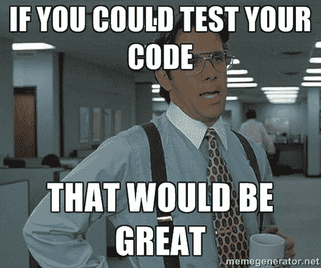

# 你甚至单元测试可靠性代码 bro/sis？

> 原文：<https://medium.com/coinmonks/do-you-even-unit-test-solidity-code-bro-sis-3ae0599873c0?source=collection_archive---------6----------------------->



[source](https://memegenerator.net/instance/55088928/office-space-that-would-be-great-if-you-could-test-your-code-that-would-be-great)

在过去的几周里，我有机会在一些黑客马拉松上编写 solidity 代码。本着黑客马拉松的精神，我们没有编写任何单元测试。在我看来，这些黑客马拉松的目的是在有限的时间内制造出可行的产品。但是现在想想，写任何 solidity 代码都是相当危险的。如果以太坊主网出现问题，你就可以玩真钱了！

编写单元测试通常有助于确保一段代码满足其预期的功能。单元测试还可以确保这段代码不会做它不想做的事情。这两个原因在编写可靠的智能合同时非常重要。你必须确认你的代码做了你认为它做的事情，并且确认它没有做其他危险的事情。🙃

注意:solidity 测试不同于 assert()、revert()、require()，后者是 solidity 提供的错误处理 API。这里*[*可以很好的解释这些是做什么用的。*](https://media.consensys.net/when-to-use-revert-assert-and-require-in-solidity-61fb2c0e5a57)*

*对我们来说幸运的是，Truffle framework 的优秀人员提供了一些非常好的助手类，如果你是一个以前了解过其他语言和框架的开发人员，这些类会让 solidity 单元测试感觉像是应该的。两个主要类别是:*

1.  *truffle/Assert.sol ( [链接](https://github.com/trufflesuite/truffle/blob/beta/lib/testing/Assert.sol)*
2.  *块菌/部署地址. sol*

*Assert.sol 包含您将用于单元测试的所有助手方法。例如 equal()即如果两个值相等，notEqual()即如果两个值不相等，isEmpty()、isNotEmpty()、isZero()、isNotZero()、isTrue()、isFalse()、isAbove()、isAtLeast()、isBelow()、isAtMost()等。所有助手方法的完整列表可以在[这里](https://github.com/trufflesuite/truffle/blob/beta/lib/testing/Assert.sol)找到。*

*假设我们有一个这样的合同…*

```
*pragma solidity ^0.4.2;contract SimpleStorage {uint storedData;function set(uint x) public { storedData = x;}function get() public view returns (uint) { return storedData;}}*
```

*上面的契约有两个公共函数。我们可能会决定将这两个代码块视为两个独立的功能或彼此的补充。所以我们可能会决定对它们都使用一个单元测试。*

*有两种方法可以测试这个智能合约。使用 truffle framework，你必须在 solidity 中编写 solidity 测试或者 Javascript mocha 测试。*

*在 solidity 中编写测试看起来会像这样。*

```
*pragma solidity ^0.4.2;import "truffle/Assert.sol";import "truffle/DeployedAddresses.sol";import "../contracts/SimpleStorage.sol";contract TestSimpleStorage {function testItStoresAValue() public {
SimpleStorage simpleStorage = SimpleStorage(DeployedAddresses.SimpleStorage());
simpleStorage.set(89);
uint expected = 89;
Assert.equal(simpleStorage.get(), expected, "It should store the value 89.");
}}*
```

*这里，我们首先将两个助手类 *Assert.sol* 和 *DeployedAddresses.sol* 导入到这个测试契约中。然后，我们创建我们的契约，并将其命名为 *TestSimpleStorage* 。请注意，我们遵循了块菌文档中描述的命名约定。所有测试合同都必须以大写的`T`开头`Test`。*

*然后我们定义一个测试方法 *testItStoresAValue()* ，这里我们也遵循一个命名约定，从`Test`开始，使用小写的`t`。在此方法中，我们使用 DeployedAddresses 引用来获取 SimpleStorage 契约的对象。然后，我们只需调用 SimpleStorage 契约的 set 方法，为契约中的变量 storedData 设置一个值(89)。*

*这个单元测试的目的是检查如果我们在 SimpleStorage 契约中用 set()方法设置一个值，在我们调用 get()方法时，我们应该得到相同的值。*

**testItStoresAValue()* 方法的最后一行使用 Assert helper 类来完成这项工作。使用 *Assert.equal()* 我们检查当我们调用 *get()* 时得到的值是否等于我们设置的初始值 89。我们测试的可靠性部分到此结束。现在让我们写一些 Javascript。*

*另一个选择是用 javascript 编写智能合约测试，即使用 javascript 中的 Mocha 编写测试。*

```
*var SimpleStorage = artifacts.require("SimpleStorage");contract('SimpleStorage', function(accounts) {it("...should store the value 89.", function() {
  return SimpleStorage.deployed().then(function(instance) {     simpleStorageInstance = instance;
    return simpleStorageInstance.set(89, {from: accounts[0]});
  }).then(function() {
    return simpleStorageInstance.get.call();
  }).then(function(storedData) {
    assert.equal(storedData, 89, "The value 89 was not stored.");
  });
});});*
```

*上面很简单，我们用契约对象用 89 调用 *set()* 方法并通过调用 get 方法确认 89 被存储。这里我们断言使用 mocha 的助手类。*

*这个教程的代码是[这里是](https://github.com/akinmail/solidity-unit-test-tutorial)。*