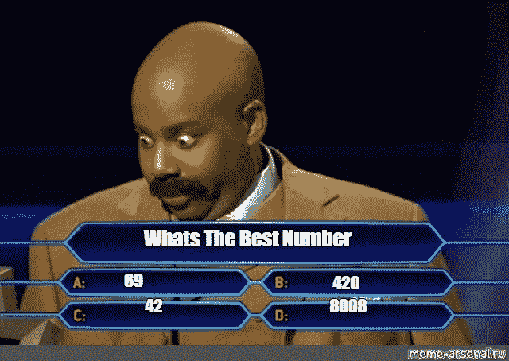
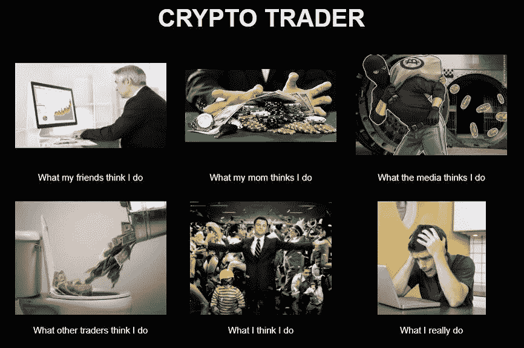

# 做你自己的研究(宣言)

> 原文：<https://medium.com/coinmonks/do-your-own-research-a-manifesto-30b48583db65?source=collection_archive---------2----------------------->

尽管$DYOR 可能是一个迷因，但其背后的哲学却不是。实际上，在投资你辛苦赚来的钱之前“做你自己的研究”似乎是一个常识，然而我们在这里。投资的基本原则仍然适用于加密，但由于市值较小，发行更容易被操纵。鲸鱼(持有大量代币的人)拥有巨大的权力来抬高或压低任何给定的代币价格。

创建这个项目是为了证明在投资项目之前深入挖掘项目的重要性。从这个意义上来说，$ term 是一个实验，测试不知情的参与者实际上对 sh 的研究有多好！他们在浪费他们的 sat/Gwei。我们预测可能会有两种人交易 DYOR 美元:

1.  了解迷因、了解风险的内部人士对代币很感兴趣，并“兜售”代币，看看哪些煽动者不阅读。
2.  那些不“自己做研究”并证明他们会购买任何被欺骗的代币的人。

如果你是前者，请放心，$DYOR 的收益将会进入赠款项目，如 [Gitcoin](https://gitcoin.co/grants/) 和 [Panvala](https://panvala.com/grants/) 。

如果你是后者，你可能永远不会读到这封信，但如果你读了: ***感谢你资助以太坊生态系统的发展***——有**绝对**更糟糕的方式让你损失*咳*花钱。作为一个社区，我们非常感谢您的贡献。

Crypto Bull markets bring out the *absolute worst* people. Also — you’re never getting that Lambo.

YOR 代表“做你自己的研究”。它已经成为一种思想的模因。所以代币供货量是 42069420。

为了避免被起诉，影响者-投机者-操纵者开始添加“这不是投资建议……”免责声明，你很难在 crypto 中找到一个没有说过无数次这些话的“人物”。影响者下面的级别:交易者、投机者、骗子、骗子、@$$holes 和 sh！投币骗子，字母 D-Y-O-R 被随意添加到帖子、推文和评论的末尾，以增加一些心理战，并将责任转嫁给毫无防备的路人。

*困难就在这里:*即使是“自己做研究”的概念也不利于改善公共领域的知识基础。这意味着你和你自己有责任弄清楚什么是骗局，什么不是骗局，谁是好的创始人，什么聪明的合同有或没有漏洞，什么项目旨在为空间提供长期价值，什么项目旨在赚快钱和退出。

我有一些好消息和一些坏消息。首先是坏消息:你不是加密、交易和编码方面的专家——我知道这一点，因为这个星球上只有不到 100 人在这三个方面拥有完善的专业知识。好消息是，有一个蓬勃发展的社区，他们真正关心生态系统的发展，而不是暴利，我们将帮助你筛选出“可以帮助你获得 10 倍收入的 Youtube 名人”，以找到提供诚实客观的反馈和分析的宝石。

别误会，有许多杰出的项目致力于一些真正开创性的、惊天动地的、范式转变的、颠覆行业的事情；**这绝对不是其中之一。**

Owocki is another one of the good guys. We are big fans of him and everything he is working toward.

我们这些在 2017 年 ICO 泡沫后留在加密领域的人，为了继续建设，每当一个新项目激怒 Crypto Twitter 时，就会得到 whiplash 和 PTSD 的混合物，或者那些首字母，“DYOR”，在一个令人讨厌的邪恶帖子的结尾似乎是无辜的警告。

建议:点击不请自来的投资提示所附的 Uniswap 或 [Etherscan](https://etherscan.io/token/0x4f878ffde3038f074bd0360639ecd1294df27887) 链接，根本称不上“自己做研究”他们知道大多数人不会深入挖掘必要的步骤。看到这个看似“便宜的热门 alt”提示触手可及的 FOMO(害怕错过)几乎是势不可挡的。你的电报组只有几百人，所以“热门消息”必须只提供给少数幸运者；再猜。

The name of the 2016/2017 ICO game was “over promise, over raise, and under deliver.”

你也不能完全依赖项目的技巧和/或发布的材料来决定投资的质量。ICO 泡沫在 2018 年初破裂，因为大量不知情的“投资者”用信用卡购买了$BTC 和$ETH，并将其投向了不成熟的想法，而不是可用的产品。现在，那些更好的想法已经成为产品，加密社区越来越大，越来越了解市场。但是像你这样的人每天都来。

分散融资(Decentralized Finance)就在这里，现有的管理者和新来者都可以轻松获得。这里的问题是，绝大多数人不了解 DeFi，他们不了解风险，他们不了解协议，他们被 FOMO 和类似于 2017 年牛市的情绪所席卷。

Defi Dad is one of the good guys.

DeFi 是真正有能力颠覆全球金融基础设施的加密领域。个人可以以持续且显著高于高收益储蓄账户利率的利率持有和出借他们的稳定存款。我们已经建立/正在建立一个金融基础设施，与传统金融相平行，优于传统金融，几乎没有监管。如果你正在读这篇文章，你是这场壮观的运动的一部分，这场运动的目的是将人们从大银行和政府支持的垄断资金的压迫下解放出来。

然而，这个美丽的新沙盒，像它的前辈一样，已经并将被猫砂渗透。每个新领域都有江湖骗子、骗子和江湖骗子。不幸的是，没有可能的方法来保护每个追逐“月球蓝宝”梦想的 n0b 免受欺诈，但在$DYOR，我们将尽最大努力帮助鼓励加密货币投资的最佳实践，特别是在 DeFi 领域。

If you’re lucky, you’ll feel all 6 of these within the span of a half hour.

所以你已经做到了这一步，你仍然有购买$DYOR 的荒谬愿望“因为如果它卫星了呢？！？!"有这种感觉的不止你一个人。就是不要。正如代币合同中所说:

> “DYOR 主张自己做研究。$DYOR 代币被创造出来作为一个迷因，以警告以太坊和 Defi 空间的人们代币市场的荒谬性。我们在不到半个小时的时间里创造了这个东西，其他人也可以。买这个 Sh！风险自担。”

幸运的是，关于这种加密货币的迷因，没有更多的“研究”要做。恭喜你，你成功地通过了我们的“白皮书”我们的“宣言”我们的思考片警告，现在有希望适应未来。

为了让你开始你的智能加密投资和 DeFi 参与之旅，我们编制了一个不全面的最佳实践列表。没有特定的顺序，以下是在冒险进入游泳池深水区之前要考虑的事情:

*   **不要投资超过你愿意承受的损失。**如果失去你投入的 100%会损害你和/或你的家庭，那就不要这样做。
*   多元化是关键。对一个投资组合来说，接触加密技术是很重要的，和传统投资组合一样，你可以在大、中、小盘代币以及[稳定币](https://www.ledger.com/academy/what-are-stablecoins)之间分散投资。
*   “不是你的密钥，不是你的密码”——永远不要与任何人分享你的私钥或密码种子词，不要以电子方式或以照片/截图的形式存储它们，不要留下任何超出你愿意在交换中离开的东西。
*   不要过度利用你的职位。密码市场比传统市场更不稳定。如果不完全了解自己在做什么，不了解一项或多项相关资产的潜在波动性，也不愿意让自己的头寸完全清算，那么就不要扰乱利润率、期权和高杠杆头寸。
*   几乎每一个代币都有忠诚的士兵和“包包持有者”愿意不惜一切代价骗取代币，识别他们并半信半疑地接受他们的“建议”。
*   一旦你超越了世界上的硬币基础和双子座，风险就会放大。**经过审计的智能合同仍然存在一些风险**，那么，关于那些没有经过审计的智能合同，你有什么看法呢？**与尚未审核的智能合同互动时，要格外小心。**(您会遇到很多早期项目，但如果您是新手，很难区分哪些已经存在，哪些是全新的)。
*   调查团队成员。团队是匿名的还是可以在项目网站的团队页面上找到？在领英、推特和搜索引擎上查找创始人——他们以前被骗过吗？他们在社区里有体面的名声吗？其他人对创始人、团队和象征有什么看法？
*   这个领域的勤奋是广泛的和自我保护的，很像这个帖子和项目。当开发者看到它并发布粗略的代码时，他们渴望并愿意指出欺诈。你通常可以在快速搜索推特和/或红迪网后发现这样的抱怨。

作为的最后一个想法，$DYOR 的创建是为了给生态系统增加价值，并帮助保护和警告新来者。如果 2017 年 ICO 泡沫中没有太多的欺诈和退出骗局，我们可能会更接近大规模采用。感谢您花时间学习一些关于“如何学习做自己的研究”的知识，而不仅仅是听信于希勒家的 FOMO 计划。狩猎愉快。

## 此外，请阅读

*   最佳[密码交易机器人](/coinmonks/crypto-trading-bot-c2ffce8acb2a)
*   [密码复制交易平台](/coinmonks/top-10-crypto-copy-trading-platforms-for-beginners-d0c37c7d698c)
*   最佳[密码税务软件](/coinmonks/best-crypto-tax-tool-for-my-money-72d4b430816b)
*   [最佳密码交易平台](/coinmonks/the-best-crypto-trading-platforms-in-2020-the-definitive-guide-updated-c72f8b874555)
*   最佳[密码借出平台](/coinmonks/top-5-crypto-lending-platforms-in-2020-that-you-need-to-know-a1b675cec3fa)
*   [最佳区块链分析工具](https://bitquery.io/blog/best-blockchain-analysis-tools-and-software)
*   [加密套利](/coinmonks/crypto-arbitrage-guide-how-to-make-money-as-a-beginner-62bfe5c868f6)指南:新手如何赚钱
*   最佳[加密制图工具](/coinmonks/what-are-the-best-charting-platforms-for-cryptocurrency-trading-85aade584d80)
*   [莱杰 vs 特雷佐](/coinmonks/ledger-vs-trezor-best-hardware-wallet-to-secure-cryptocurrency-22c7a3fd391e)
*   了解比特币的[最佳书籍有哪些？](/coinmonks/what-are-the-best-books-to-learn-bitcoin-409aeb9aff4b)
*   [3 商业评论](/coinmonks/3commas-review-an-excellent-crypto-trading-bot-2020-1313a58bec92)
*   [AAX 交易所评论](/coinmonks/aax-exchange-review-2021-67c5ea09330c) |推荐代码、交易费用、利弊
*   [Deribit 审查](/coinmonks/deribit-review-options-fees-apis-and-testnet-2ca16c4bbdb2) |选项、费用、API 和 Testnet
*   [FTX 密码交易所评论](/coinmonks/ftx-crypto-exchange-review-53664ac1198f)
*   [n 零审核](/coinmonks/ngrave-zero-review-c465cf8307fc)
*   [比特交换评论](/coinmonks/bybit-exchange-review-dbd570019b71)
*   [3Commas vs Cryptohopper](/coinmonks/cryptohopper-vs-3commas-vs-shrimpy-a2c16095b8fe)
*   最好的比特币[硬件钱包](/coinmonks/the-best-cryptocurrency-hardware-wallets-of-2020-e28b1c124069?source=friends_link&sk=324dd9ff8556ab578d71e7ad7658ad7c)
*   最佳 [monero 钱包](https://blog.coincodecap.com/best-monero-wallets)
*   [莱杰纳米 s vs x](https://blog.coincodecap.com/ledger-nano-s-vs-x)
*   [bits gap vs 3 commas vs quad ency](https://blog.coincodecap.com/bitsgap-3commas-quadency)
*   [莱杰纳米 S vs 特雷佐 one vs 特雷佐 T vs 莱杰纳米 X](https://blog.coincodecap.com/ledger-nano-s-vs-trezor-one-ledger-nano-x-trezor-t)
*   [block fi vs Celsius](/coinmonks/blockfi-vs-celsius-vs-hodlnaut-8a1cc8c26630)vs Hodlnaut
*   Bitsgap 评论——一个轻松赚钱的加密交易机器人
*   为专业人士设计的加密交易机器人
*   [PrimeXBT 审查](/coinmonks/primexbt-review-88e0815be858) |杠杆交易、费用和交易
*   [埃利帕尔泰坦评论](/coinmonks/ellipal-titan-review-85e9071dd029)
*   [SecuX Stone 点评](https://blog.coincodecap.com/secux-stone-hardware-wallet-review)
*   [BlockFi 评论](/coinmonks/blockfi-review-53096053c097) |从您的密码中赚取高达 8.6%的利息