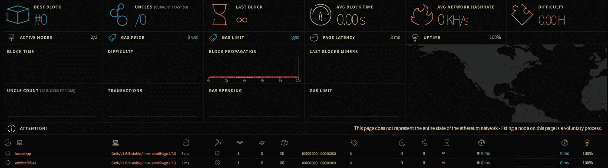
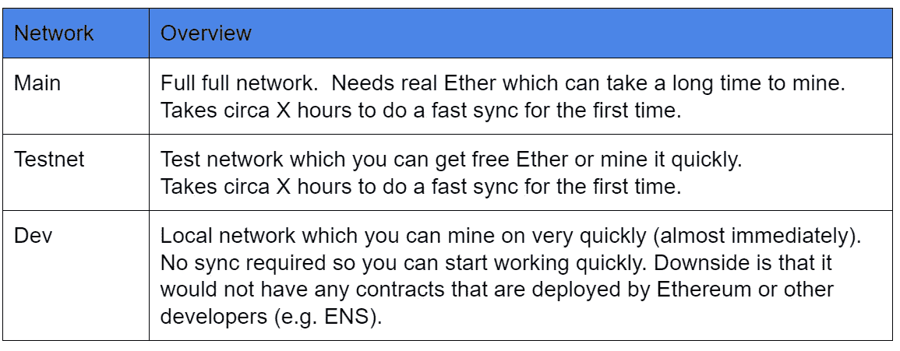
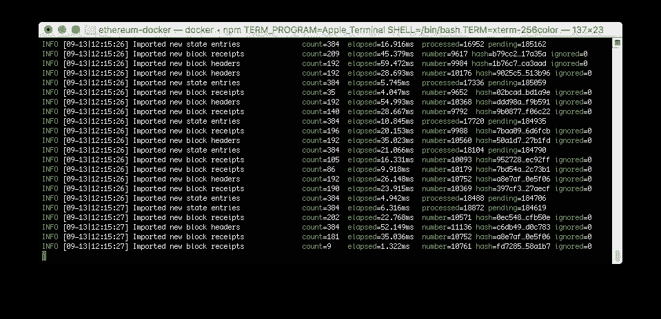
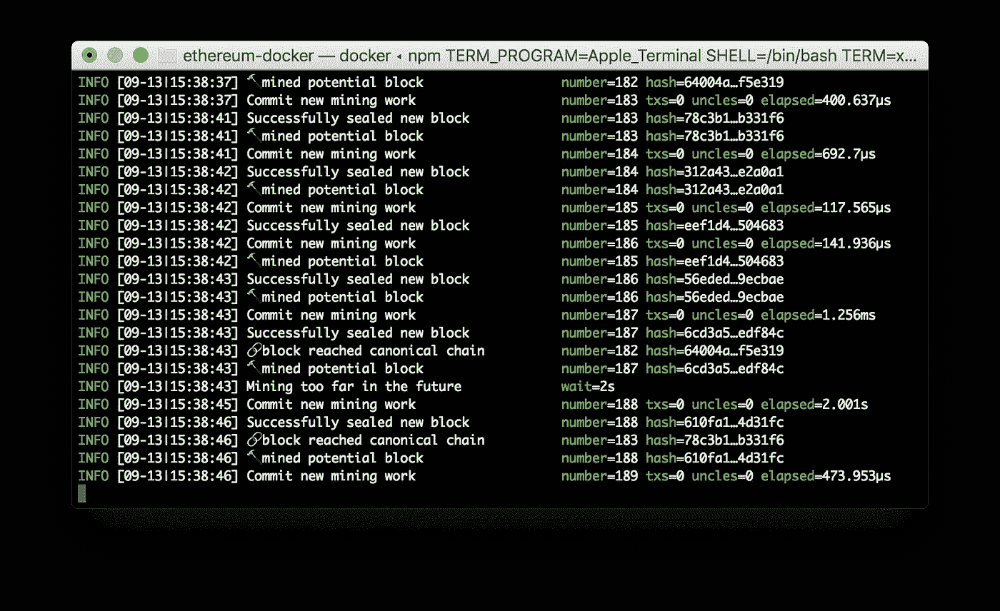
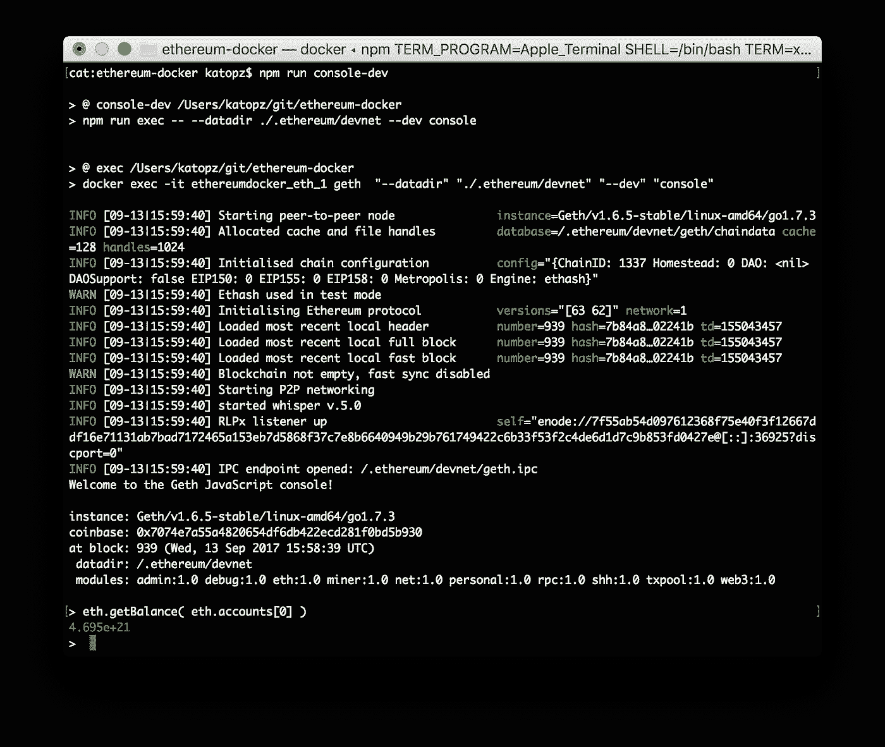
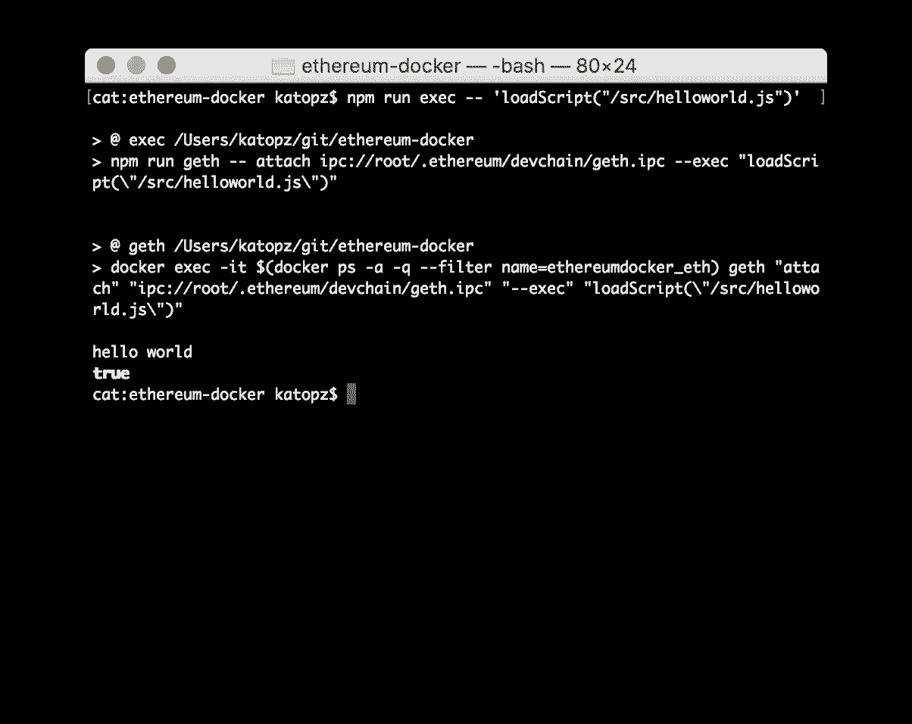

# 码头工人❤以太坊

> 原文：<https://medium.com/coinmonks/docker-ethereum-40b80c5adcc7?source=collection_archive---------4----------------------->

我刚刚开始开发**以太坊**并意识到那里例子有点混乱，如果你试图通过 **Docker** 来做的话，它甚至会更复杂(更容易设置，但更难进入容器进行开发)

[](https://capgemini.github.io/blockchain/ethereum-docker-compose/) [## 用 Docker Compose 构建私有以太网

### 如何使用 Docker 启动并运行以太坊开发和测试网络

凯捷](https://capgemini.github.io/blockchain/ethereum-docker-compose/) 

所以我决定简化它，将 **NPM** 扭曲到顶部，以便更容易地访问 **geth** 里面的 **Docker** 容器。用我的慵懒风格跟**以太坊**打个招呼吧！

# 先决条件

1.  可以运行终端的 Mac OSX 或 Linux。
2.  [**Docker**](https://docs.docker.com/engine/installation/) ，Docker 撰写
3.  [**同 NPM**](/@katopz/how-to-install-specific-nodejs-version-c6e1cec8aa11)
4.  Git 从[**github**](https://cnhv.co/6ol)**拉源代码(hive)**
5.  **拿起那个文件夹，准备好！**

## **经营以太坊**

```
$ npm run up
```

## **要打开 netstats**

```
$ open http://localhost:3000
```

****

**到目前为止一切顺利！我们在一分钟内完成了一些事情，让我们继续。**

# **选择网络**

**首先，我们必须选择在哪里捣乱…**

****

**ref : [http://www.ziggify.com/blog/blockchain-stack-1-installing-ethereum-geth-smart-contract/](http://www.ziggify.com/blog/blockchain-stack-1-installing-ethereum-geth-smart-contract/)**

# **创建新帐户**

> **你必须选择一个网络来工作，我将一个一个地展示如何去做。**

## **在主网络上创建新帐户**

```
$ npm run new
```

**您将看到下面的输出，只需在提示时输入您的密码。**

```
> @ new /Users/katopz/git/ethereum-docker
> npm run exec -- account new> @ exec /Users/katopz/git/ethereum-docker
> docker exec -it ethereumdocker_eth_1 geth  "account" "new"WARN [09-13|09:52:23] No etherbase set and no accounts found as default
Your new account is locked with a password. Please give a password. Do not forget this password.
Passphrase:
Repeat passphrase:
Address: {1187bb96afd48e6a46ca85f16064fb940bcf8384}
```

## **在 testnet 网络上创建新帐户**

```
$ npm run new-testnet
```

**进入 **geth** 控制台**

```
$ npm run console-testnet
```

**在 **geth** 控制台中，尝试这个来获得你的块号。**

```
> eth.blockNumber
```

**如果数字是 0，你就完了！它将永远开始同步…**

****

**我们等不了那么久，还是用 **Dev** 网络代替吧。**

## **在开发网络上创建新帐户**

```
$ npm run new-dev
```

**进入 **geth** 控制台**

```
$ npm run console-dev
```

**你现在应该进入控制台了，但是我们倾向于不通过控制台做事情，所以我们现在退出。:)**

```
> exit
```

# **采矿**

```
$ npm run mine-dev
```

**你应该看看…**

****

**要检查我们有多富有，请执行 **CTRL+C** 退出，然后通过运行…**

```
$ npm run console-dev
```

**给我看看钱！**

```
> eth.getBalance( eth.accounts[0] )
```

****

# **发展**

**但是我们不喜欢控制台，所以让我们>**存在**并且像这样直接从 **npm** 再做一次…**

```
$ npm run exec -- 'eth.getBalance( eth.accounts[0] )'
```

**或者甚至从 javascript 文件…**

```
$ npm run exec -- 'loadScript("/src/helloworld.js")'
```

****

**现在试着在那里和 **/src/helloworld.js** 玩得开心，不用等我:)**

# **为什么我们要再做一次？**

**因为打字太费时间了！**

```
$ docker exec -it $(docker ps -a -q --filter name=ethereumdocker_eth) geth "attach" "ipc://root/.ethereum/devchain/geth.ipc" "--exec" "eth.getBalance( eth.accounts[0] )"
```

**当我们可以…**

```
$ npm run exec -- 'eth.getBalance( eth.accounts[0] )'
```

**你应该知道如何**创建账户**、**采矿**、**开发**。这应该是一个良好的开端，甚至有更多的命令等着去弄乱(我稍后会写博客)我希望你们喜欢它！**

**还有一件事。如果你还没有加密货币帐户，你可以在下面注册获得一个(参考开发！)，我们很快就会需要它！**

**[](https://cex.io/r/0/up107588755/0/) [## 比特币交易所，交易 BTC 美元，BTC 欧元 CEX。超正析象管(Image Orthicon)

### 使用支付卡或通过银行转账轻松买卖美元或欧元的比特币。进入比特币交易网站…

cex.io](https://cex.io/r/0/up107588755/0/) 

# 概述

1.  你知道如何启动**以太坊**环境，选择网络。
2.  您可以挖掘并在仪表板上查看挖掘统计数据。
3.  你知道控制台，我告诉过你讨厌它。:)
4.  您可以从 **Docker** 容器外部执行命令。
5.  您可以在 volumed **/src** 文件夹中修改(或添加更多的 js)并从 Docker 容器外部用 **npm** 执行它。

# TODO(为我)

1.  送些乙醚来。
2.  创建一些智能合同。
3.  创建懒惰的例子，并把它写在博客上！

下次见。:)

> [直接在您的收件箱中获得最佳软件交易](https://coincodecap.com/?utm_source=coinmonks)

[](https://coincodecap.com/?utm_source=coinmonks)**