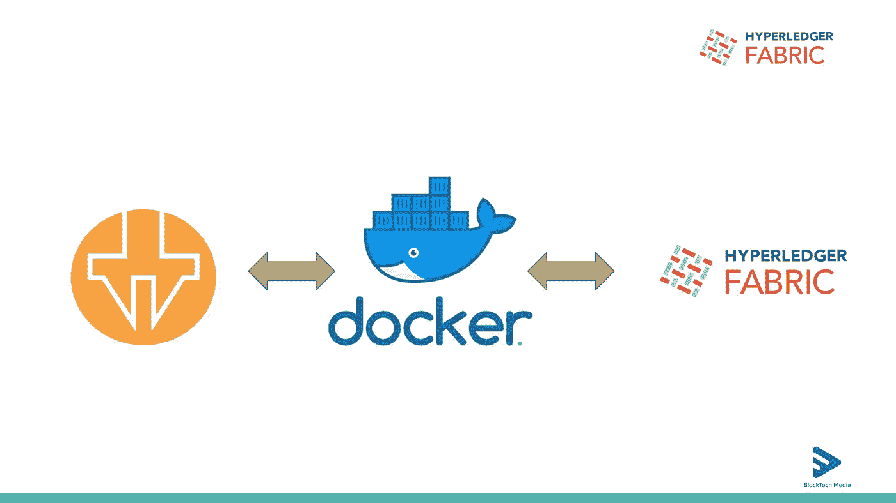
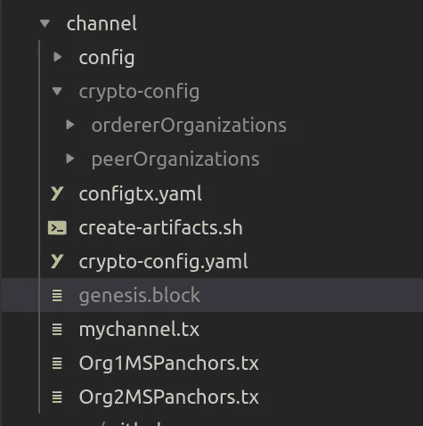
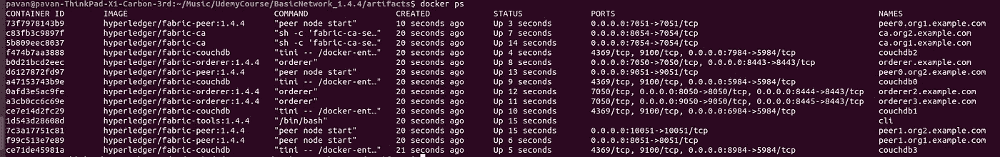
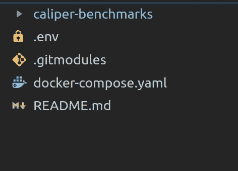
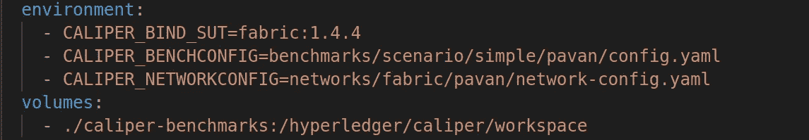
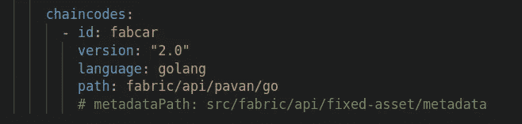
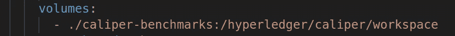
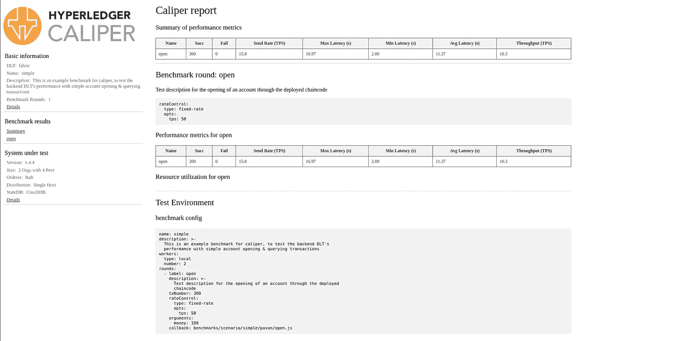

# 对接卡尺并与您自己的 Hyperledger 结构网络集成-即插即用:性能基准测试

> 原文：<https://medium.com/coinmonks/dockerising-containerising-caliperand-integrate-with-your-own-hyperledger-fabric-network-a328b318f6de?source=collection_archive---------0----------------------->



大家好，
我收到了很多将 caliper 与自己的 Hyperledger Fabric 网络集成的请求。所以我决定将 caliper 容器化，这样每个人都可以即插即用自己现有的网络，测试网络的性能基准。集装箱式测径器的变化很小。

同样，这里我假设您已经建立并运行了自己的网络，如果您没有自己的网络，我们将首先创建自己的结构网络。

我也创建了一个 Youtube 视频，它有详细的解释，你可以查看文章和视频。包括这里的链接。

第一部分

**第二部分:**

**步骤 1** :运行我们自己的网络(如果你已经有了自己的网络，可以跳过这一步)

在这里克隆基本网络回购形态[。](https://github.com/adhavpavan/BasicNetwork_1.4.4.git)

一旦你在 repo 上面克隆了，只需转到 repo 的主文件夹(BasicNetwork_1.4.4)。

网络结构:
1) 2 个 ORGS 各有 2 个对等点(每个组织有一个认可对等点)
2) 3 个 RAFT 订购者
3) 4 个 Cuch DB
4) 2 个认证机构

这里我使用 fabric 1.4.4 来创建网络。我希望您已经在您的机器上安装了带有映像 1.4.4 的先决条件。如果你想用其他版本创建一个网络，请随意在 repo 中做相应的修改，特别是在 docker-compose 文件中为一个镜像版本。

```
Go to cd **artifacts/channel/** folder in repo
Run following script
1) ./createArtifacts.shIt creates all necessary cryptomaterials and channel artifacts for our network. you can see all cryptomaterials in channel folder like below image
a. crypto-config
b. genesis.block
c. mychannel.tx
d. Org1MSPanchors.tx
e) Orge2MSPanchors.tx
```



回到工件文件夹。

```
2) Running all ContainersBefore running containers, go to dockerc-compose.yaml file and give the correct private file name for both certificate authority, in my case it is **priv_sk . As per cryptogen version private key name could be different format like priv_sk or long_string_sk.**Once you are done with changes with both Certificate authority(First two services) run below command**docker-compose up -d** This will run all necessary services for our network. you can see all containers using **docker ps**
```



```
3) Create and Join Channel
Run below command
./createChannel.shThis command will create channel and join all peer to channelInside channel-artifacts folder you could see mychannel.block.
PLease make sure that all commands defined in scripts run successfully 4) Install chaincode on Endorsing Peer and instantiate.Run below command
./deployChaincode.shThis command will install chaincode on endorsing peer and instantiate. Run "**docker ps"** and You can see additional chincode container.
```

我们的网络启动并运行，将有 15 个集装箱如下。


**步骤 2:在配置正确的容器中运行卡尺**

我创建了一个回购，请从 [**克隆到这里**](https://github.com/adhavpavan/ContainerisingCaliperForFabricBenchmark.git)

成功克隆 repo 后，进入主文件夹。它有如下非常精确的文件夹结构。



最重要的文件是 docker-compose 文件。让我们探索它。

docker-compose 文件 ie caliper 中定义了一个服务。在内部服务中，我们提供了三个重要的环境文件，并安装了一个卷。

1.  卡尺 _ 装订 _SUT
2.  卡尺 _ 基准配置
3.  卡尺 _ 网络配置
4.  已安装的卷



**第一步**:请绑定正确的 SUT(被测系统)——Fabric 和你的网络版本，如“f **abric:1.4.4** 或“ **fabric:1.4.6** ”(根据你的网络版本)。当我写这篇文章的时候，fabric 2.x 还不被支持。

**步骤 2**:Caliper benchmark repo 中的 BenchConfig
我已经为环境文件夹中提到的所有配置文件创建了自己的文件夹。

它与客户端相关，我们定义了配置，如回合数、事务数、参数和回调函数。

我们在 caliper-benchmark repo 的同一个文件夹**benchmarks/scenario/simple/pavan/open . js**中有一个回调函数(这个 repo 是我们主 repo 中的子模块)

Open.js

这个文件包含我们事务创建的逻辑。有两个主要的函数，run 和 init，Init 将执行一次，run 将执行我们在 config.yaml 文件中提到的任意数量的事务。这是针对一个 Worker(客户机)的，它是在 config.yaml 中定义的。如果我们定义多个客户机(Worker ),它将被相应地划分。

在我们自己的光纤网络中，我使用了 **Fabcar** 作为智能合约。您可以在 **generateWorkload()** 方法中看到创建汽车资产的逻辑。

如果我们想在单个事务中触发多个资产，我们可以在 open.js 文件中定义或者作为参数从 config.yaml 中传递

在 run 函数中，我用给定的参数创建汽车。

**注意:这里写的所有逻辑都将根据您自己的智能合同进行更改。请确保您已经在 open.js 文件中做了必要的更改。**

步骤 3: **网络配置**

文件在 caliper Repo 中的位置:
路径:**networks/fabric/pavan/network-config . YAML**

在这个文件中，请定义正确的配置。在这个文件夹(networks/fabric/pavan/)中，只需复制您自己运行的 fabric 网络的加密配置文件夹(不需要复制所有文件，但有些文件我们需要一个网络内配置文件。).根据您自己的运行网络，请添加/删除组织、对等方、订购方、ca 配置，并提供给定的正确路径。在路径中提供私钥名称时，请确保提供正确的加密配置文件夹中提到的名称。根据您的网络提及正确的端口。

我们必须复制我们的链代码，并放入下面的文件夹:fabric/pavan/go
中，该文件夹位于回购主位置的 **src** 文件夹中。



步骤 4:安装卡尺-基准官方回购



就这样，我们已经对回购做了所有必要的修改。让我们开始一个卡尺容器，并对光纤网络的性能进行基准测试。

去回购的家所在地。可以看到 docker-compose。YAML 的文件在那里。

在命令下运行

```
docker-compose up -d
```

您可以看到一个卡尺容器被创建。一旦 caliper 容器正在运行(您可以看到正在运行的容器:运行此命令- `docker ps`)，通过以下命令监控容器的日志

`docker logs caliper -f`

您可以在终端中看到 caliper 容器日志，它需要的时间取决于机器配置、网络配置、交易数量和回合数。

一旦对网络进行了基准测试，就会有一个关于回购所在地的 report.html 文件。只需在浏览器中打开并享受！



示例报告文件(另存为 HTML 并在任何浏览器中打开)。结果对我来说不是很好，因为我的资源配置非常低，在你的情况下，它可能是最好的之一。

有许多参数会影响 Hyperledger 结构网络的性能。您可以调整这些参数，微调网络以获得最佳性能。让我们看看结果。我将总结你们所有的结果，并为社区做一份绩效报告。

*   背书对等体的数量
*   频道数量
*   背书数量(背书政策)
*   订购服务配置(块大小和批处理时间)
*   组织数量
*   使用的分类帐数据库
*   链码/智能合同执行的复杂性
*   交易规模交易规模
*   对所有网络流量使用相互 TLS
*   vCPUs 的数量
*   存储器分配
*   磁盘类型和速度
*   网络速度
*   多个数据中心部署
*   CPU 速度
*   加密加速

您可以在`config.yaml`文件中定义任意轮次，如
1) **创建**汽车资产
2) **查询**汽车资产
3) **转移**汽车资产

这里我说的是 fabcar 智能合约，你可以对自己的智能合约做必要的改动。

**尝试不同的速率控制(固定和可变)以获得最佳性能结果。**

如果你遇到任何问题，请告诉我，我很乐意帮助你。你可以通过 linked in 或 Instagram 与我联系。
[**https://www.instagram.com/pavanadhavofficial/**](https://www.instagram.com/pavanadhavofficial/)[**https://www.linkedin.com/in/pavan-adhav/**](https://www.linkedin.com/in/pavan-adhav/) **邮箱:adhavpavan@gmail.com**

请在 Instagram 上与我分享您的 TPS 和吞吐量，让我们看看如何微调结构网络以实现最佳性能。

如果觉得这篇文章有用，可以在 [**上帮我买一杯咖啡 https://www.paypal.me/PAVANADHAV**](https://www.paypal.me/PAVANADHAV)[**https://ko-fi.com/adhavpavan**](https://ko-fi.com/adhavpavan)[**https://www.patreon.com/adhavpavan**](https://www.patreon.com/adhavpavan)

[](https://www.paypal.me/PAVANADHAV) [## 使用 PayPal 支付 Pavan Baburao Adhav。我

### 去 paypal.me/PAVANADHAV 输入金额。既然是 PayPal，那就简单又安全。没有 PayPal…

www.paypal.me](https://www.paypal.me/PAVANADHAV) [](https://ko-fi.com/adhavpavan) [## 给帕万买杯咖啡。ko-fi.com/adhavpavan

### 和 Ko-fi.com 一起为帕万买一杯咖啡

ko-fi.com](https://ko-fi.com/adhavpavan) 

谢谢你。

# 参考

*   [https://github.com/hyperledger/blockchain-explorer](https://github.com/hyperledger/caliper-benchmarks)
*   [https://hyperledger-fabric . readthedocs . io/en/release-1.4/prereqs . html](https://hyperledger-fabric.readthedocs.io/en/release-1.3/prereqs.html)
*   【https://docs.docker.com/compose/ 

> [直接在您的收件箱中获得最佳软件交易](https://coincodecap.com/?utm_source=coinmonks)

[](https://coincodecap.com/?utm_source=coinmonks)