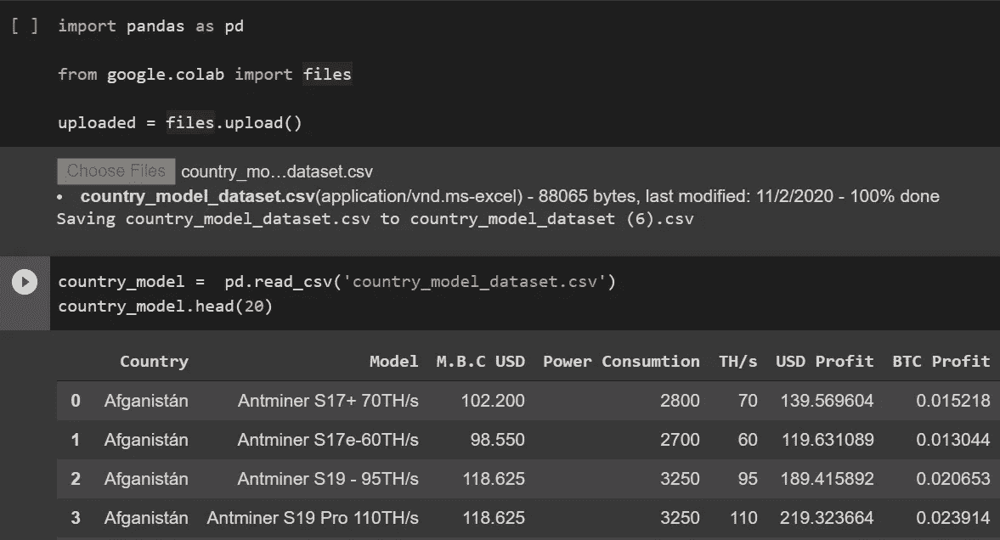
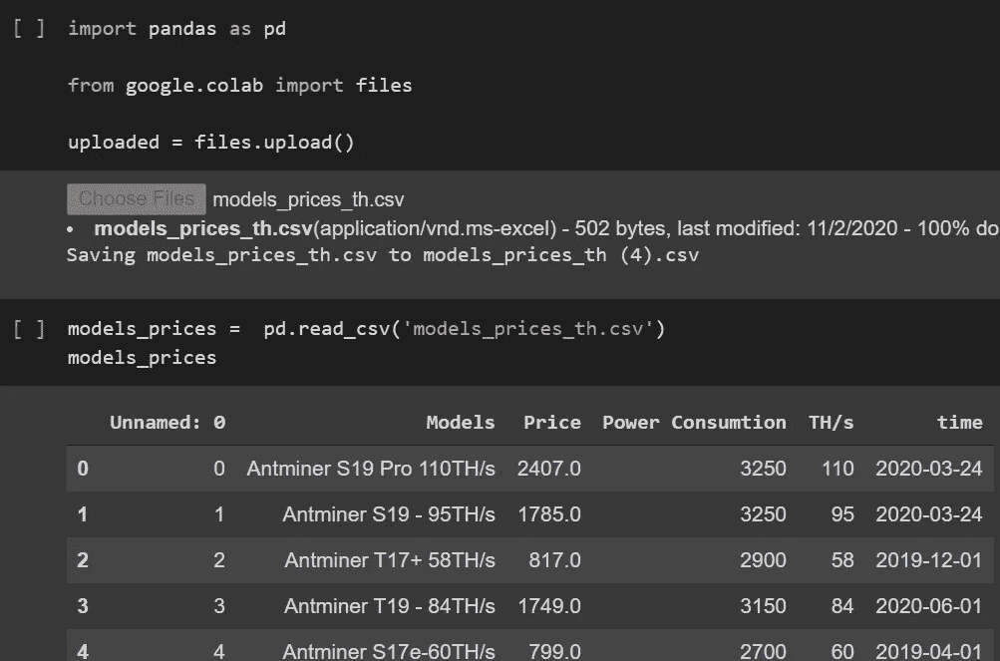
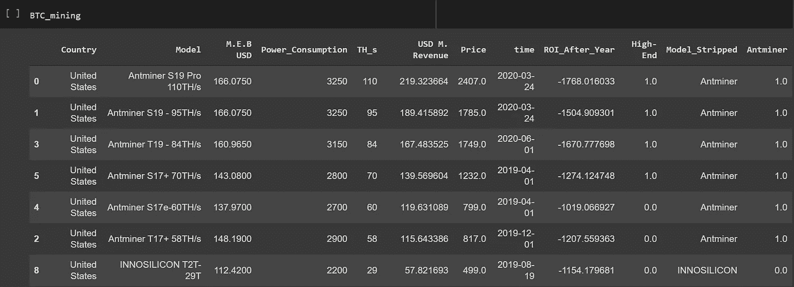
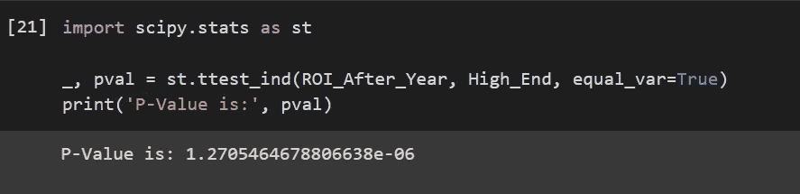
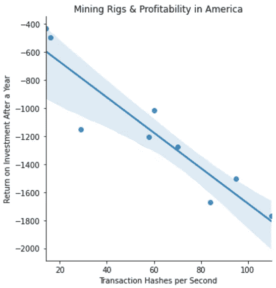
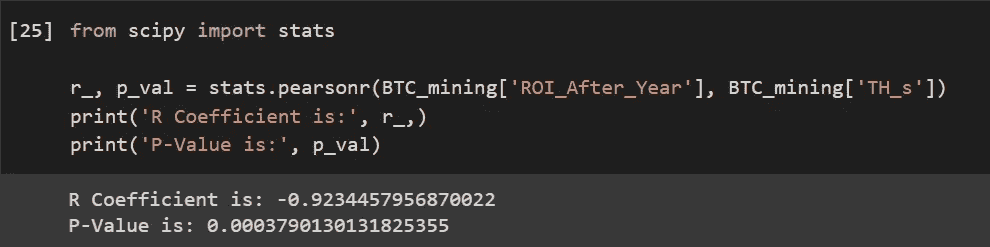
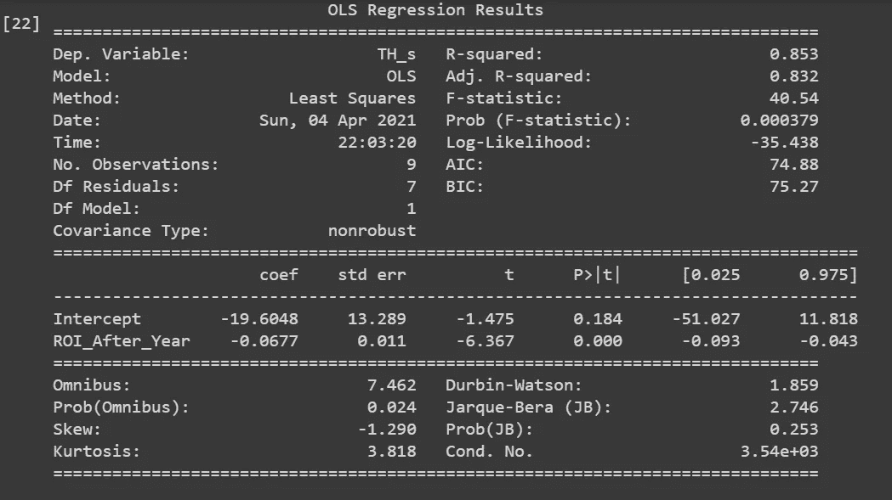
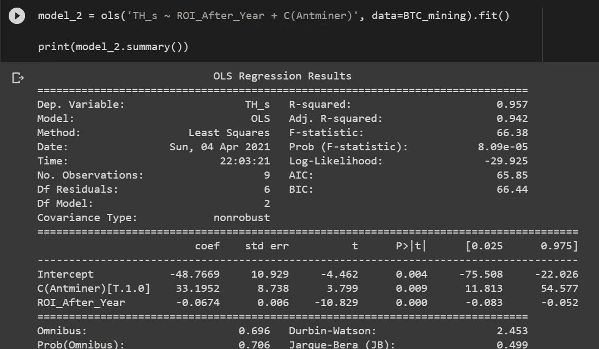
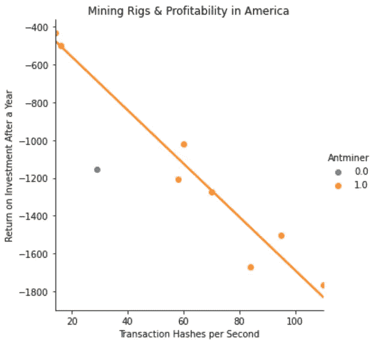

# 高规格的采矿硬件能增加利润吗？

> 原文：<https://medium.com/coinmonks/does-high-spec-mining-hardware-increase-profitability-72a46831151?source=collection_archive---------3----------------------->

## Lambda 学校第一单元组合项目

# 创收的另一种方式

过去十年来，依靠开采比特币生活一直是许多人的梦想，在这里，人们可以在没有剥削的情况下获得被动收入。通过电脑的“工作证明”来积累财富。

公司的仓库里堆满了成千上万台同时运行的采矿机器，这可能会威胁到我们，愚弄我们，让我们相信这艘船已经在个体采矿上航行了。为了盈利，需要几十台钻机在运转。现在情况可能还不是这样。

新冠肺炎疫情带来的经济动荡让我们许多人在家工作，如果不是失业的话。这是实现这个梦想的时候吗？

# 密码挖掘到底是如何工作的？

计算机被配置为解决复杂的数学问题，当问题解决后，会产生一个新的硬币(或一部分)并将其返还给矿工。矿机是专门为解决这些问题而生产的计算机，无休止地运行，很像服务器。当一种加密货币是新的时，解决这些问题的回报会产生大量的这些硬币。随着加密货币的成熟，解决这些复杂数学难题的难度也在增加，这是因为部署了大量计算机来挖掘其区块链。

采矿盈利能力取决于被开采的货币(在这种情况下是比特币)、采矿能力和机器价格，以及每月产生的电费。更大的计算能力通常与更高的能量消耗相关，如果一个人的硬件缺乏效率，这使得这种活动相当昂贵。

# 我们的假设

使用来自 Kaggle 的比特币历史数据的数据集，该数据集包含 8 种不同 ASIC 矿机型号的数据，其功耗按国家平均值转换为月平均电费，从 2019 年**04–01–04**到 2020 年**06–01–06**从交易散列转换为美元的 BTC 奖励金额，以及包含这些采矿钻机的价格值以及这些价格设定日期的第二个数据集， 我希望证实，一个只有一台顶级采矿钻机的人是否能够从购买中收回成本，并保持收入流大于支付伴随这种计算密集型操作的巨额电费。

考虑到我们必须处理的数据，一个配备了他们所能买到的最快硬件的人，有可能仅仅通过加密采矿就安然度过疫情吗？高昂的投资成本值得吗？确认高端矿机和盈利能力之间是否存在正相关关系可以揭示这一点。

# 理解数据

读取以下两个数据集:

country_model DataFrame

models_prices DataFrame

这里有一个数据字典，这样我们就可以看到并理解 *country_model* 数据框架中每一列的确切含义:

*   **国家**
*   **型号**:ASIC 矿机类型
*   **M . b . c . USD**:每月账单费用，单位为美元
*   **功耗**:每个型号的功耗，单位为瓦/小时
*   **TH/s:** 每秒的事务哈希数。测量矿工的计算能力。
*   **美元利润**:每月美元利润
*   **BTC 利润**:BTC 月利润

和用于*型号 _ 价格*数据帧的数据字典:

*   **型号**:ASIC 矿机类型
*   **价格**:ASIC 矿机价格
*   **功耗**:每种型号的功耗，单位为瓦/小时
*   **时间**:发布日期

# 数据清理

在探索了这两个数据框架之后，我遇到了相当多的问题。列名有错别字，行名是用西班牙语写的，电费有一个奇怪的缩写，甚至还有一个不必要的额外索引栏。'*USD _ profit '*和'*BTC _ profit '*都不包含实际利润值，但包含收入值。这不是计算每月电费后剩下的价值，而是 BTC 从促进区块链交易的大宗奖励和采矿费中获得的总额。必须给它们一个合适的名字。

*   ***country _ model***现为***country _ model _ USA***:删除了除美国以外的所有其他国家。只关心他们的采矿活动，不与他人比较。
*   **M . b . c . USD**现在是**M . e . b . USD:**以美元为单位的每月电费
*   **功耗**现在是**功耗**
*   **美元利润**现在是**美元百万收入**:每月美元收入
*   **型号**现在是**型号**:因此该列将与其他数据帧上具有完全相同行的列对齐
*   ***车型 _ 价格*** 现为 ***车型 _ 价格*** :与上述更名保持一致即可

从 *country_model* 中删除*‘BTC 利润’*栏。当我用美元比较模型价格、电费和矿业收入时，这是不必要的。而且从 *models_prices* 我掉了' *Unnamed: 0 '。*

清理完这些列后，我开始创建一些新的列。

# 特征工程

*   ***BTC _ 矿业*** :使用第二个数据帧索引时，通过使用外部合并将第/s 列上的 country_model_usa 和 model_prices 数据帧合并在一起而创建的数据帧
*   **Model_Stripped** :区分矿机品牌
*   Antminer :由于除了一个以外，所有这些钻机都是由 Antminer 制造的，所以我设置了这个变量，以便它为它们返回 1，为另一个返回 0
*   **ROI_After_Year** :计算一整年后的投资回报。需要收回购买采矿机器的成本，同时每月支付高额电费
*   **高端**:如果矿机价格低于 1000 美元，返回 0，如果价格高于 1000 美元，返回 1。

Final Version of our DataFrame

# 限制

比特币的波动性是一个我无法解释的变量。这是我的数据的最大局限性，显示当考虑到 BTC 的波动性时，你需要多长时间才能获得投资回报。因此，这里我们使用的是 2019 年 4 月至 2020 年 6 月期间兑换成美元的 BTC 利润的平均值，而不是整个时间段内每天 BTC 的确切价值。这只能给我们一个粗略的估计，2020 年**能挣多少**，而不是 2021 年。

同样的限制也存在于一年的电费中。M.E.B .是基于一般电力消费价格的平均值，而不是基于以有竞争力的账单成本向大型发电机供电的定制合同或天然气分配合同。

另一个限制是太阳能发电的秘密矿工的数量。[2019 年 12 月，只有 6%的美国家庭安装了太阳能电池板。我相信，到 2020 年 6 月，也就是我的数据集获得数据的最后一个月，这个百分比的增长不会超过这个数字(比如说 10%)。这些账单矿工不应该对我们的调查结果产生太大的影响。](https://www.pewresearch.org/fact-tank/2019/12/17/more-u-s-homeowners-say-they-are-considering-home-solar-panels/)

# **开始第一项测试**

在整理了我们的数据后，我思考了什么方法能给我们提供我们需要的洞察力。从简单开始，我选择了一个**双样本独立 t 检验**。该检验允许我们比较两个总体均值，以确认它们是否相等。在我们的例子中，它确认' *ROI_After_Year'* 和' *High_End'* **的平均值是否等于***。我们称之为我们的零假设，它与它的逆假设配对，替代假设，即两个均值**不等于**。P 值(概率值)用于确定我们是否拒绝或未能拒绝零假设(只是不能把它当作事实，我们毕竟是在处理具有平均值的**样本总体**)。如果我们拒绝它，我们接受另一个假设来代替它。拒绝和未能拒绝假设是基于达到某个阈值，如果没有被超越。这个门槛被称为我们的阿尔法或𝜇.通常设定为 0.05%或 5%。如果我们的数据中有足够多的观察值达到或超过 0.05，我们有理由相信这种相关性不仅仅是建立在偶然的基础上，而且**可能**也有一种偶然的关系。用科学符号写的:*

*   高端机器的𝐻0: 𝜇1 投资回报率=低端机器的𝜇2 投资回报率
*   高端机器的𝐻𝑎: 𝜇1 投资回报率低端机器的≠𝜇2 投资回报率

根据我们的假设，我使用变量' *ROI_After_Year'* 和' *High_End'* 进行了 t 检验，以确认它们之间是否存在关系。计算结果显示如下:

P 值为 1.27e-06 ，我们远低于阿尔法值 0.05。我们拒绝零假设，接受另一种假设，得出采矿一年后的投资回报与所用采矿机器的价格/价值之间存在关系的结论。

# 回归更进一步

t 检验的信息量有限。它只告诉我们两个变量之间是否有关系，而不是它们在统计上如何显著相关。为此，我们需要一个简单的线性回归模型。比较两个变量之间的线性度。现在我们需要一个量化变量用于挖掘模型。我们将使用' *TH_s'* '作为我们的目标，因为采矿机器散列事务的速度应该与采矿机器的技术规格相关联。而' *ROI_After_Year'* 将作为我们的特征。这里使用的假设执行的功能与 t-检验非常相似，只是增加了检验变量之间的斜率是否等于 0。

H0:*‘TH _ s’*与*‘ROI _ After _ Year’*之间的β1 斜率= 0

ha:*‘TH _ s’*与*‘ROI _ After _ Year’*≠0 之间的β1 斜率

简单线性回归模型的可视化；

嗯，看着图表，任何人都可以看出我们的变量之间存在负相关性，在美国，无论使用哪种模型，加密开采都会产生**损失**。

好了，现在我们的模型看起来像什么，我们可以计算线性相关系数，其中这两个定量变量的强度和方向由 R 来衡量，或者-1 和 1 之间的任何值将告诉我们是否存在负(-1)或正(1)关系。如果返回 0，则没有关系。

我们的 P 值再次低于阿尔法值 0.05。我们拒绝零假设，接受另一种假设，即两个变量之间有关系。从我们之前进行的 t 检验中，我们已经知道了这一点。我们的 R 系数告诉我们，这两个变量之间有很强的负相关。这与我们的图表一致。我们没有用高端采矿机器在一年中获利，而是看到我们仍然处于亏损状态。

让我们看看另一个模型，以便更好地了解正在发生的情况:

我们的斜率， *'ROI_After_Year'* 告诉我们，*' ROI _ After _ Year '*每增加一个单位，四舍五入后*将减少 0.07。*

调整后，我们的 R 平方显示了 y 变量的可变性，*‘TH _ s’*，这可以用 x 变量，*‘ROI _ After _ Year’*来解释。

我们发现，你的机器越低端(用交易散列率表示，机器型号越高越好，越贵)，你一年中从采矿中损失的**钱就越少**。我们最贵的型号 **Antminer S19 Pro 110TH/s** 所使用的纯粹计算能力产生的电费几乎与它的块奖励产出保持同步，仅支付其销售价格的*至 607 美元*。

# 多变量回归

我们的图表有一个非常明显的异常值，远远超出了我们的置信区间。让我们看看哪个品牌的矿机与其给定规格的散列率不一致。我们将把变量*‘ant miner’，*添加到我们的回归模型中。我们添加这个额外的特性不仅是为了识别这个异常值，也是为了提高我们模型的准确性。

添加“蚂蚁矿工”作为另一个预测因子实际上帮助了我们的模型，将我们的 R 调整值从 0.832 提高到 0.942。

唯一的 INNOSILCON 矿工被证明是一个巨大的异常值，在我们的图表中用蓝色标出。Antminer 采矿机器在计算能力和价格方面或多或少都有一致性。

# 结论

无论你运行哪个平台，它们都需要你付出代价。在美国开采加密技术是无利可图的，因为我们缺乏广泛的补贴电力和太阳能使用。

我原以为高端矿商在功耗方面会更加保守，允许一家公司利用其难以置信的散列率，最终在一年内收回投资和利润。数据显示并非如此。即使我们将这一时间框架延长至两年，在比特币的平均块报酬继续存在的情况下，**ant miner S19 Pro 110/s**也只会支付其销售价格的一半左右，远远没有实现利润回报。

如果你认为有可能通过挖掘比特币来补充你在疫情损失的收入，那么你会付出代价。采矿不再适合美国的个人，不像早期那样了。只有大量购买这些矿工，用太阳能电池板运行，或者在一个有补贴(如果不是社会化的话)的公用事业账单国家运行，采矿才会产生正回报。

[只有约 6%的美国家庭由太阳能供电](https://www.pewresearch.org/fact-tank/2019/12/17/more-u-s-homeowners-say-they-are-considering-home-solar-panels/)，只有极少数人可以通过在整个新冠肺炎疫情采矿产生被动收入。

> 加入 Coinmonks [电报集团](https://t.me/joinchat/JaY3hVVw2WhiNmFl)，了解加密交易和投资

## 另外，阅读

*   [什么是融资融券交易](https://blog.coincodecap.com/margin-trading)
*   最好的[加密交易机器人](/coinmonks/crypto-trading-bot-c2ffce8acb2a) | [网格交易机器人](https://blog.coincodecap.com/grid-trading)
*   [3 商业评论](/coinmonks/3commas-review-an-excellent-crypto-trading-bot-2020-1313a58bec92) | [Pionex 评论](/coinmonks/pionex-review-exchange-with-crypto-trading-bot-1e459d0191ea) | [Coinrule 评论](/coinmonks/coinrule-review-2021-a-beginner-friendly-crypto-trading-bot-daf0504848ba)
*   [AAX 交易所评论](/coinmonks/aax-exchange-review-2021-67c5ea09330c) | [德里比特评论](/coinmonks/deribit-review-options-fees-apis-and-testnet-2ca16c4bbdb2) | [FTX 交易所评论](/coinmonks/ftx-crypto-exchange-review-53664ac1198f)
*   [n rave 零点回顾](/coinmonks/ngrave-zero-review-c465cf8307fc) | [Phemex 回顾](/coinmonks/phemex-review-4cfba0b49e28) | [PrimeXBT 回顾](/coinmonks/primexbt-review-88e0815be858)
*   [Bybit Exchange 审查](/coinmonks/bybit-exchange-review-dbd570019b71) | [Bityard 审查](/coinmonks/bityard-review-7d104239be35) | [CoinSpot 审查](https://blog.coincodecap.com/coinspot-review)
*   [3 commas vs crypto hopper](/coinmonks/3commas-vs-pionex-vs-cryptohopper-best-crypto-bot-6a98d2baa203)|[赚取加密利息](/coinmonks/earn-crypto-interest-b10b810fdda3)
*   最好的比特币[硬件钱包](/coinmonks/the-best-cryptocurrency-hardware-wallets-of-2020-e28b1c124069?source=friends_link&sk=324dd9ff8556ab578d71e7ad7658ad7c) | [BitBox02 回顾](/coinmonks/bitbox02-review-your-swiss-bitcoin-hardware-wallet-c36c88fff29)
*   [莱杰 vs n 格拉夫](/coinmonks/ledger-vs-ngrave-zero-7e40f0c1d694) | [莱杰纳诺 s vs x](/coinmonks/ledger-nano-s-vs-x-battery-hardware-price-storage-59a6663fe3b0) | [币安评论](/coinmonks/binance-review-ee10d3bf3b6e)
*   [加密复制交易平台](/coinmonks/top-10-crypto-copy-trading-platforms-for-beginners-d0c37c7d698c) | [Coinmama 评论](/coinmonks/coinmama-review-ace5641bde6e)
*   [CoinLoan 审核](/coinmonks/coinloan-review-18128b9badc4) | [YouHodler 审核](/coinmonks/youhodler-4-easy-ways-to-make-money-98969b9689f2) | [BlockFi 审核](/coinmonks/blockfi-review-53096053c097)
*   最好的[加密税务软件](/coinmonks/best-crypto-tax-tool-for-my-money-72d4b430816b) | [硬币追踪评论](/coinmonks/cointracking-review-a-reliable-cryptocurrency-tax-software-5114e3eb5737)
*   最佳[加密借贷平台](/coinmonks/top-5-crypto-lending-platforms-in-2020-that-you-need-to-know-a1b675cec3fa) | [杠杆代币](/coinmonks/leveraged-token-3f5257808b22)
*   [BlockFi vs Celsius](/coinmonks/blockfi-vs-celsius-vs-hodlnaut-8a1cc8c26630)|[Hodlnaut 点评](/coinmonks/hodlnaut-review-best-way-to-hodl-is-to-earn-interest-on-your-bitcoin-6658a8c19edf) | [KuCoin 点评](https://blog.coincodecap.com/kucoin-review)
*   [Bitsgap 审查](/coinmonks/bitsgap-review-a-crypto-trading-bot-that-makes-easy-money-a5d88a336df2) | [Quadency 审查](/coinmonks/quadency-review-a-crypto-trading-automation-platform-3068eaa374e1) | [Bitbns 审查](/coinmonks/bitbns-review-38256a07e161)
*   [埃利帕尔泰坦评论](/coinmonks/ellipal-titan-review-85e9071dd029) | [赛克斯斯通评论](/coinmonks/secux-stone-hardware-wallet-review-15-discount-coupon-2020-7577032faa6e)
*   [本地比特币审核](/coinmonks/localbitcoins-review-6cc001c6ed56) | [加密货币储蓄账户](https://blog.coincodecap.com/cryptocurrency-savings-accounts)
*   最佳[区块链分析](https://bitquery.io/blog/best-blockchain-analysis-tools-and-software)工具| [赚比特币](/coinmonks/earn-bitcoin-6e8bd3c592d9)
*   [加密套利](/coinmonks/crypto-arbitrage-guide-how-to-make-money-as-a-beginner-62bfe5c868f6)指南| [如何做空比特币](/coinmonks/how-to-short-bitcoin-568a2d0b4ae5)
*   最佳[加密制图工具](/coinmonks/what-are-the-best-charting-platforms-for-cryptocurrency-trading-85aade584d80) | [最佳加密交易所](/coinmonks/crypto-exchange-dd2f9d6f3769)
*   [如何在印度购买比特币？](/coinmonks/buy-bitcoin-in-india-feb50ddfef94) | [瓦济克斯审查](/coinmonks/wazirx-review-5c811b074f5b)
*   [印度比特币交易所](/coinmonks/bitcoin-exchange-in-india-7f1fe79715c9) | [比特币储蓄账户](/coinmonks/bitcoin-savings-account-e65b13f92451)
*   [CoinDCX 评论](/coinmonks/coindcx-review-8444db3621a2) | [加密保证金交易交易所](https://blog.coincodecap.com/crypto-margin-trading-exchanges)