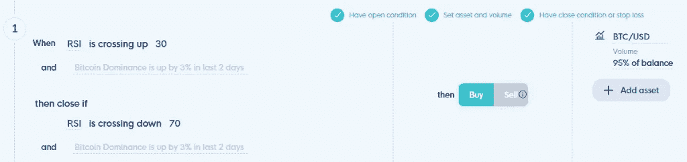
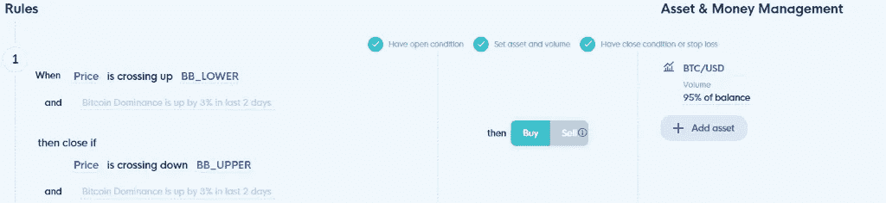

# 交易打败了 HODL 吗？测试牛市中最受欢迎的加密交易指标

> 原文：<https://medium.com/coinmonks/does-trading-beat-hodl-the-most-popular-crypto-trading-indicators-during-a-bull-run-tested-19c545ac3843?source=collection_archive---------2----------------------->

啊，2017 年伟大的加密牛市。神话和传说的时代，百万富翁诞生，毕生积蓄化为乌有。比特币从 1000 美元以下涨到 20000 美元的辉煌让观察人士哑口无言，霍德勒则欣喜若狂……前提是他们及时转向卖家。

交易平台、加密机器人和交易所并不像今天这样发达，但许多交易者仍然试图应用技术分析来预测价格走势。当时最好也是最简单的交易策略就是紧紧抓住你的比特币。从 4 月一直到 12 月底，你可以什么都不做就获得 1075.8%的收益。

无所事事有时是最难的事情。尤其是对于那些已经见证了自己持有量倍增的交易员而言。在霍德林坚持不懈需要非凡的心理毅力。

在加密方面，交易比 HODL 好吗？积极增加你的资金或者只是观察，你会更好吗？

查看加密领域最近的价格走势，我们希望测试五大最受欢迎的加密交易指标，并了解它们在 2017 年加密牛市中的表现。这应该给你一个主意，如果交易或霍德林更好。

# 2017 年加密牛市的回溯测试策略

免责声明:这不是试图找到最好的加密交易策略或牛市交易机器人。这只是一个挑战一些常见范式并提供优化思路的思想实验。以下战略基于这些指标的最常用方式，并且[受益于前瞻性 b](http://ttps//corporatefinanceinstitute.com/resources/knowledge/finance/look-ahead-bias/)ia。它们不包括止损或获利。为了测试的目的，想象你的整个策略仅仅基于一个交易指标。

所有策略都在 2017 年 4 月 1 日至 2017 年 12 月 31 日进行了回溯测试。在同一时期持有比特币，被认为是 2017 年的牛市，将产生 1075.8%的回报。为了便于比较，我们在每笔交易中使用账户上的所有资金进行交易，这在现实生活中是不可取的。经过回溯测试的指标有:

*   MACD
*   RSI
*   布林线
*   VWAP
*   EMA (50)
*   EMA (200)

以下是我们的发现:

# 在 2017 年加密牛市期间交易 MACD

MACD 在加密交易中非常受欢迎，所以关注它是有意义的，因为你知道其他交易者也在关注它。当 MACD 柱状图变绿或穿过 0 时，价格应该上涨。当柱状图变红或向下穿越 0 时，交易者通常会建仓。

MACD trading strategy

这正是我们如何设置我们的回溯测试。无论何时柱状图翻转，我们都在进场或出场。结果如下:

MACD trading results

尽管在高时间框架内交易被认为有利于消除噪音，但这并不适用于 2017 年加密牛市中的 MACD。那时候事情进展很快。在所有测试的时间框架中，MACD 的表现都不如买入并持有。每天的时间框架产生了“刚好”+302.33 %，而同样的策略在 4 小时的时间框架中表现了两倍。

# 在 2017 年加密牛市期间交易 RSI

RSI 是另一个经典指标，在加密交易中非常突出。应用它很容易:当它显示 30 或低于 30 时，资产超卖，因此价格应该上涨，因为它正在回归均值。当价格高于 70 时，资产被视为超买，因此价格预计会下跌。

RSI trading strategy

RSI 的流行可能归因于它的易用性。在我们的测试中，RSI 单独输给了买入并持有和其他指标，尤其是在较低的时间框架内。这并不令人惊讶，因为比特币当时并不愿意坚持“超买”这个概念。

RSI trading results

# 在 2017 年加密牛市期间交易 VWAP

VWAP 是股票交易的一个流行指标，因为它能很好地确定资产的平均交易量和价值。价格互动就像移动平均线:向上穿越是看涨，向下穿越是看跌。

VWAP trading strategy

如果你在 2017 年单独使用 VWAP 交易比特币，你会获得一些令人难以置信的回报，但仍无法击败买入并持有。同样，“平均”或“均值”不是比特币在抛物线运行中喜欢遵守的东西。

VWAP trading results

# 在 2017 年加密牛市期间交易布林线

布林线是趋势和波动的双重指标。在我们的交易策略设置中，当价格穿越底部波段时，我们开仓，当价格穿越较高波段时，我们平仓。

Bollinger Bands® trading strategy

在一个趋势清晰且波动性高的市场中，布林线表现不佳。它们的效用在较低的时间范围内变得更加明显。

Bollinger Bands®trading results

# 在 2017 年加密牛市期间交易 HMA

下一个:移动平均线。我们将从赫尔移动平均线开始。它意味着在过滤噪音的同时反应灵敏，可以成为你的加密交易策略的重要组成部分。我们的策略再次设定在价格向上/向下穿越时开仓或平仓。默认周期是 20，在这个测试中保持这个状态。

HMA trading strategy

虽然 HMA 的表现相当不错，而且在不同的时间范围内表现得相当一致，但它仍然达不到买入并持有的要求。然而，在我们测试的所有移动平均线中，HMA 给出了最好的收益。

HMA trading results

# 在 2017 年加密牛市期间交易均线(50)

50 均线有时被用作高时间框架的动态支撑或阻力。我们设置的就像 HMA 一样——当价格上涨/下跌时，我们开仓/平仓。结果很有趣。

EMA 50 trading strategy

高时间框架应用程序似乎运行良好，但在 2017 年比特币牛市期间，仅使用 50 均线交易可能是导致净亏损的一种策略。

EMA 50 trading results

# 在 2017 年加密牛市期间交易均线(200)

最后，让我们看看 200 均线。用于指示加密市场是向上还是向下的趋势，这是一个重要的移动平均线。因为这是一条移动缓慢的均线，我们期望看到更少的交易和更好的结果。

EMA 200 trading strategy

在较低的时间框架内，这种策略表现不错，虽然没有击败买入并持有。每天它从不开仓，因为价格不与均线互动。然而，像其他单独测试的指标一样，它不应该是设计交易策略时考虑的唯一指标。

EMA 200 trading results

# 如何结合出色的加密策略来击败买入并持有

在为下一轮牛市做准备时，回顾一下结果，看看我们能改进什么是非常有益的。

# 改进基本的 MACD 交易策略

让我们从 MACD 策略开始，它在 4 小时时间框架内的回报率为+708.68 %。更好地查看结果的统计数据，我们应该会得到下一步尝试的指示:

MACD trading statistics

我们可以看到，我们赢的交易比输的交易多，而且多得多。然而，亏损的头寸比盈利的头寸平仓更快。因此，我们可能需要寻找关于何时平仓的第二个确认:

MACD optimised trading strategy

增加一条规则，MACD 直方图需要变红，但同时价格需要低于 100 SMA，这可能有助于确定上升趋势的可能结束。

对我们的新策略进行回溯测试表明，第二次迭代实际上会大大超过买入并持有:

MACD optimised trading strategy results

仔细查看统计数据，我们可以看到我们大幅增加了持仓时间，减少了错误信号:

MACD improved trading statistics

# 改进基本的 HMA 交易策略

让我们以类似的方式来看看 4 小时 HMA 策略，它有很好的结果:

HMA trading statistics

统计数据告诉我们，亏损的头寸会很快平仓。由于我们使用的是移动平均线，我们可以尝试一个较慢版本的 HMA(默认长度为 20)，看看更多的喘息空间是否有助于我们策略的执行:

HMA optimised trading strategy

我们将关闭条件下的 HMA 长度更改为 80，因此我们可以再次预期头寸数量的减少。回溯测试在同一时期运行:

HMA optimised trading strategy results

这一修正版本的回报率为+1091.5%，超过了买入并持有的回报率。同样，我们看到更少的位置和更少的错误信号，这是理想的:

HMA improved trading statistics

# 结论

虽然探索哪些指标在之前的牛市中表现良好是很有趣的，但不是一个单一的顶级指标，我们可以将其作为一个独立的策略。这是一个很好的提醒，振荡器水平或移动平均线交叉不一定是教条式的，特别是在特殊情况下。

击败买入并持有确实是可能的。如果你对不同的方法和当它不是牛市时会发生什么感兴趣 [Dirk F. Gerritsen 等人，Finance Research Letters，](https://doi.org/10.1016/j.frl.2019.08.011)在 2019 年写了一篇详细的研究论文，其中他们在更长的时间跨度内评估了多种加密交易策略，并根据包括夏普比率在内的一些有趣的标准进行了比较。

从中得出的一个重要结论是，当你想得到策略的最佳版本时，对多个时间框架进行回溯测试是必不可少的。即使只是出于你的想法，花额外的时间检查你的想法也有可能显著改善你的结果——这不正是我们所追求的吗？

另一个明显的发现是确认指标的作用。它可以像在组合中添加 SMA 一样简单，而您的策略却有了实质性的改进。有了扎实的研究、计划和工具，加密交易者没有理由错过下一轮强劲的牛市。在同等执行效率下，使用可靠的加密机器人比购买并持有要好——0。

# 其他加密交易策略

关于如何设计[伟大交易策略的更多指导，请查看我们在本指南](https://blog.cleo.one/post/btc-trading-strategy-in-times-of-uncertainty)中关于寻找什么以及如何创建某种程度上安全的策略的建议。我们的[帮助中心也有简单的交易策略](https://intercom.help/cleoone/en/collections/2481247-cleo-one-trading-strategy-examples)让你开始。

如果你想看回溯测试的版本，可以去 CLEO.one 应用，那里有免费的、已经测试过的策略。事实上，当你[连接一个币安交易所账户，你就可以免费使用 Cleo . one](https://cleo.one/binance/)！该帐户是挤满了现场交易机器人，回测，纸交易槽，等等！立即注册，确保您的位置。

## 另外，阅读

*   最好的[加密交易机器人](/coinmonks/crypto-trading-bot-c2ffce8acb2a)
*   [密码本交易平台](/coinmonks/top-10-crypto-copy-trading-platforms-for-beginners-d0c37c7d698c)
*   最好的[加密税务软件](/coinmonks/best-crypto-tax-tool-for-my-money-72d4b430816b)
*   [最佳加密交易平台](/coinmonks/the-best-crypto-trading-platforms-in-2020-the-definitive-guide-updated-c72f8b874555)
*   最佳[加密借贷平台](/coinmonks/top-5-crypto-lending-platforms-in-2020-that-you-need-to-know-a1b675cec3fa)
*   [最佳区块链分析工具](https://bitquery.io/blog/best-blockchain-analysis-tools-and-software)
*   [加密套利](/coinmonks/crypto-arbitrage-guide-how-to-make-money-as-a-beginner-62bfe5c868f6)指南:新手如何赚钱
*   最佳[加密制图工具](/coinmonks/what-are-the-best-charting-platforms-for-cryptocurrency-trading-85aade584d80)
*   [莱杰 vs 特雷佐](/coinmonks/ledger-vs-trezor-best-hardware-wallet-to-secure-cryptocurrency-22c7a3fd391e)
*   了解比特币的[最佳书籍有哪些？](/coinmonks/what-are-the-best-books-to-learn-bitcoin-409aeb9aff4b)
*   [3 商业评论](/coinmonks/3commas-review-an-excellent-crypto-trading-bot-2020-1313a58bec92)
*   [AAX 交易所评论](/coinmonks/aax-exchange-review-2021-67c5ea09330c) |推荐代码、交易费用、利弊
*   [Deribit 审查](/coinmonks/deribit-review-options-fees-apis-and-testnet-2ca16c4bbdb2) |选项、费用、API 和 Testnet
*   [FTX 密码交易所评论](/coinmonks/ftx-crypto-exchange-review-53664ac1198f)
*   [n 零审核](/coinmonks/ngrave-zero-review-c465cf8307fc)
*   [比特交换评论](/coinmonks/bybit-exchange-review-dbd570019b71)
*   [3Commas vs Cryptohopper](/coinmonks/cryptohopper-vs-3commas-vs-shrimpy-a2c16095b8fe)
*   最好的比特币[硬件钱包](/coinmonks/the-best-cryptocurrency-hardware-wallets-of-2020-e28b1c124069?source=friends_link&sk=324dd9ff8556ab578d71e7ad7658ad7c)
*   最佳 [monero 钱包](https://blog.coincodecap.com/best-monero-wallets)
*   [莱杰纳米 s vs x](https://blog.coincodecap.com/ledger-nano-s-vs-x)
*   [bits gap vs 3 commas vs quad ency](https://blog.coincodecap.com/bitsgap-3commas-quadency)
*   [莱杰纳米 S vs 特雷佐 one vs 特雷佐 T vs 莱杰纳米 X](https://blog.coincodecap.com/ledger-nano-s-vs-trezor-one-ledger-nano-x-trezor-t)
*   [block fi vs Celsius](/coinmonks/blockfi-vs-celsius-vs-hodlnaut-8a1cc8c26630)vs Hodlnaut
*   Bitsgap 评论——一个轻松赚钱的加密交易机器人
*   为专业人士设计的加密交易机器人
*   [PrimeXBT 审查](/coinmonks/primexbt-review-88e0815be858) |杠杆交易、费用和交易
*   [埃利帕尔泰坦评论](/coinmonks/ellipal-titan-review-85e9071dd029)
*   [SecuX Stone 点评](https://blog.coincodecap.com/secux-stone-hardware-wallet-review)
*   [BlockFi 评论](/coinmonks/blockfi-review-53096053c097) |从您的密码中赚取高达 8.6%的利息