# 戴着链子的狗。分析基于区块链的游戏的复杂机制

> 原文：<https://medium.com/coinmonks/dogs-on-chain-analyzing-complex-mechanics-of-the-blockchain-based-game-2b691eaced57?source=collection_archive---------8----------------------->

当复杂的结构从一套简单的规则中浮现出来时，你不觉得很有趣吗？如果是这样的话你一定会喜欢这个！

简而言之， [Dogs On Chain](https://dogsonchain.com) 是一款基于区块链的游戏，玩家在游戏中为争夺乙醚在他们的宠物之间展开战斗。像这样的竞技游戏必须有强大的理论基础，证明选择赢家的逻辑在所有意义上都是公平的 *(tbh 我对现在的白皮书写得很失望)*。
我们声称**我们的方法**:

*   是无偏的
*   允许玩家学习和发展长期成功的策略
*   完全防止作弊

随着战斗结果的计算正在进行**链上** 你可能想知道上述的*到底是怎么实现的。*

这篇文章的重点是我们如何确定哪只狗更有可能获胜，这个功能如何影响游戏性，以及它如何与其他细微差别一起，使游戏**变得令人惊讶地有趣**。有时事情可能会变得过于技术性。但是我鼓励你不要害怕这些公式，因为它们并没有那么可怕。

# 游戏部分

以下是游戏玩法的概述。

每个玩家都有一只**宠物狗**。

Each player has a pet dog

狗有一套**技能点**和一个**品种。**

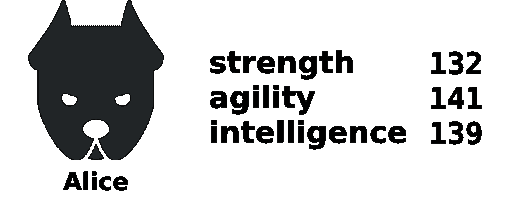

Pitbull Alice

在开始时，玩家被给予 10 点**技能点，他想怎么花就怎么花**。没有人能看出分数是如何分布的。

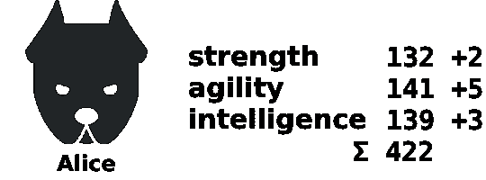

Alice spent her points

玩家为争夺以太在彼此**之间设置**战斗**。**

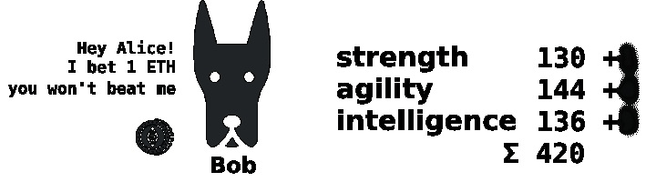

Alice received fight request from Bob. Notice she doesn’t see how he spent his points last time. However sum of all skill points is public.

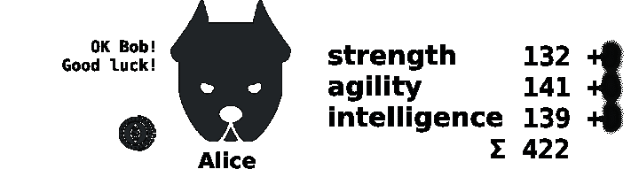

Alice accepted the fight request. Bob doesn’t see her last spend too.

当双方同意战斗的时候，他们的技能点就完全显露出来了。胜利者获得所有以太并获得额外的技能点数。她的分数也会半随机增加。

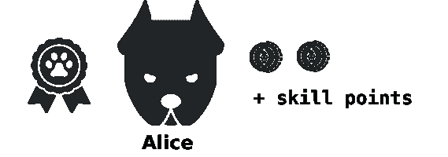

Alice won!

失败者受到随机减少技能点数的惩罚。然而，他也获得了他必须在下一场战斗前花费的免费点数。

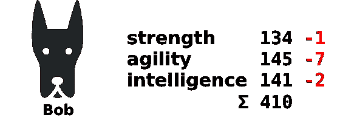

Bob lost. His skill points got randomly decremented

这种技能点的随机增减，你后面会看到，是**非常重要的**。它们不是完全随机的，但是被设计成使狗的技能点分布更加均匀。

# 计算赔率。为什么爱丽丝赢了？

首先，战斗的结果不是确定性的，而是概率性的。所以你事先不能肯定的说爱丽丝会不会赢，你可能只能说出这个事件的概率。

几率是根据对手的技能点和他们的品种来计算的。玩家还必须在战斗前完全揭示自己的技能点(所以鲍勃出价，爱丽丝出价并揭示，鲍勃揭示。但那是另一个讨论的话题)。一旦发生这种情况，过程如下:

*   基于狗的技能计算一个整数，我们称之为 *k*
*   从 *0* 到 *200* 产生一个随机数 *X*
*   如果 *X* 小于 *(100+k)* —爱丽丝赢，否则—鲍勃赢。

是的，我知道 100 和 200 听起来很随意，还有很多神奇的常数即将出现。我会用它们让你更好地理解事物，真正的价值可能会有所不同。
现在**试着理解一下**如果爱丽丝更强——*k*为正，比如说 *50* ，那么鲍勃只有在 *150 < X < 200* 的情况下才会赢，如果 *0 < X < 150* 爱丽丝才会赢。同样，如果鲍勃更强——k 为负，比如说——*50*，那么爱丽丝只有在 0*X<50*的情况下获胜，鲍勃在 50*X<200 的情况下获胜。这应该不难。*

## 计算 k

从刚才讨论的内容来看， *k* 应该被视为一个对手相对于另一个对手的优势的某种**度量。在我们开始之前，公式不仅包括两只狗的技能点，还包括它们的品种，所以让我们弄清楚品种是如何影响狗的。**

**品种**显然是宠物一生都无法改变的，它**定义了技能优先级**。比如比特犬的一级技能是敏捷，二级是力量，三级是智力。有 3 种技能，所以有 6 种排列，所以有 6 个品种。让我们用这样的符号来表示品种:

Notation for breeds

皮特保罗将被表示为[2，1，3]。鲍勃是杜宾，所以他的品种表示为[3，2，1]。

现在我们可以计算 *k* ，我们这样做:

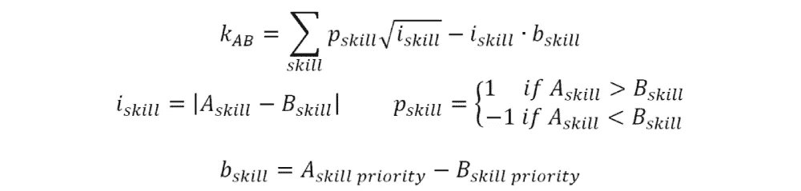

看起来很复杂，但其实很简单。让我解释一下:

*   这里 A 是爱丽丝，B 是鲍勃。
*   我们对每个技能进行计算，然后将所有 3 个部分结果相加得到 *k.*
*   在求和符号中，你可以看到两个表达式
*   首先是技能差异的平方根。而 ***p*** 只是平方根下避免负号的变通方法。它的工作方式类似于 sqrt(-4) = -2
*   第二个涉及品种。我们将技能差异和技能优先级差异相乘。

不过我应该指出，要真正使用这个公式，你应该在这里或那里塞进几个常数，以便它与其他数字合作，就像已经提到的 200，给获胜者多少自由点数，也许增加品种的重要性，在非线性的同时加入额外的线性依赖，等等。

这个公式有什么有趣的地方呢？

*   对于同类狗 *k = 0*
*   因为平方根在那里，*一般来说*，2 个技能的较小优势胜过 1 个技能的较大优势。
    所以 *(10，10，7)* 比 *(9，9，9)* 好。
*   技能差异越大，品种就越重要。而如果技能点相同，品种根本不重要。

## 技能保证金限额

这个微小的细节很可能是游戏逻辑中最重要的方面，因为它将所有的事情都完美地联系在一起。可以这样表述:

> 一个人的任何技能与其他两个技能的差异都不能超过 X 点

例如，一个人不能总是把所有的分数都花在敏捷性上。如果我们把这个技能余量限制设为，比如说 10，就不可能有技能点 *(100，3，1)* ，的狗，但是 *(100，90，90)* 就可以*。*

首先，这很重要，因为否则只增加初级技能是合理的。此外，这个限制给了我们一个有限的可能狗的数组，因此分析这个数组和游戏的一般逻辑。

# 分析

为有趣的部分做好准备。我们有一套简单的规则，由此产生了相当复杂的系统。让我们研究一下，看看它是否值得一玩！

## 实地研究

在前面的段落中，我说过技能余量限制(从现在开始称为“SML”)给了我们一个有限的可能狗的数组(从现在开始称为“领域”)。实际上，对于每个可能的技能点总和，它都是相同的数组，所以我们可以用两个数字唯一地识别任何一只狗:它在数组中的位置和它所有技能点的总和。这是因为我们可以计算出具有特定技能的狗所能得到的最低和最高分数。
假设 SML 是 10，这个最小值是 30，那么显然一只狗达到这个最小值当且仅当它有一个技能配置 *(30，40，40)* 并且在这个例子中的总和是 110。形式上:

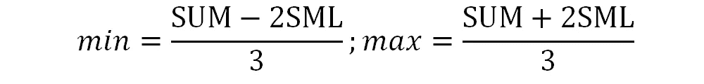

Minimum and maximum points dog’s skill might have given sum of all 3 skills and skills margin limit

所以对于任何一只狗，我们可以从每项技能中减去这个最小值(与其总和相关),得到它在领域中的对应点。出于进一步研究的目的，田间品种已经不再重要了。我们可以说它的主要技能有多少点，次要技能有多少点，第三技能有多少点*(主要技能，次要技能，第三技能)*，例如 *(10，12，14)* 。
在这个配置中，如果 SML 是 10 岁，我们有 111 只不同的狗。如果我们不在品种上做最后一个把戏，我们会得到 666 只狗(*最终*光明会被确认)。

好吧。下一个合乎逻辑的问题是:什么样的技能配置是**领域中最好的？**一般情况下*酷炫*在赛场上的分布是怎样的？

要回答这个问题，我们需要定义“酷”的概念。有很多选择，比如将狗与场地中其他狗的所有 T2 k T3 相加，或者是平均值 T4 k T5，或者是中间值。我建议在场地上数一数这只狗打败了多少只狗(赢的概率超过 50%)。让我们把这个数字除以场地的大小。

想象*凉爽*，我们得到这个可爱的马鞍形状。

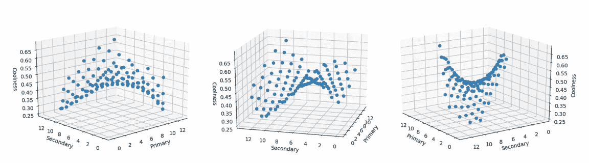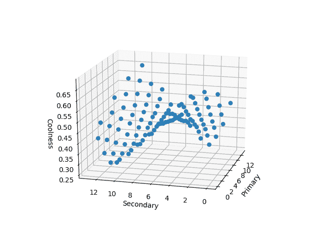

Coolness of dogs in the field. SML = 10

这里有 5 个有趣的地方:

*   两个高小费。一个比另一个高(也是最高的)是点 *(10，10，0)* 。另一个低一点对应 *(6，2，12)非平凡不是吗？*
*   中间部分，酷在 0 左右，对应的是 *(7，6，7)这样的平均分布技能。*
*   两个较低的提示。最低是 *(13，3，4)惊艳吧？*再高一点就是 *(1，11，8)* 。

这些“第二”提示，无论是低的还是高的，都来自一些非常特殊的事情。事实上，有两个主要原因可以解释为什么狗会很酷。我将把它留给真正的数学狂人去思考。**关于这张照片的重要一点**是:

> 对于每只狗来说，都存在足够数量的较弱的对手和相同数量的较强的对手

还是那句话，*冷静*在这里，狗没有获胜的可能性。这是衡量一只狗比多少只狗强的标准。等等，你说，每个人都有强弱之分，这怎么可能呢？简单的解释就是**它在转圈。就像石头打剪刀，剪刀剪纸，纸盖石头。当然这更复杂，但总体思路是一样的。**

**注。我们在游戏中不做以下事情。相反，我们在计算 k 值之前对分数进行了标准化。因此，在游戏*
中，只有像前面所示的情节才是重要的，如果我们让不同总数的玩家参加战斗，会怎么样呢？

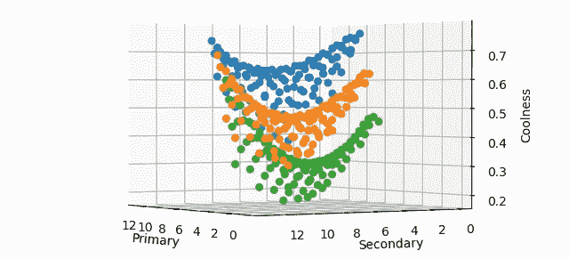

Coolness of dogs with different SUMs. Green — SUM-1, orange — SUM, blue — SUM+1

看，没有可怕的事情发生，甚至马鞍形状也没有改变。但是，作为一个开发者，它告诉我的是，这里我们需要将形状向上拉伸，这样在与总和至少比自己大 5 分的对手战斗时才有意义。**或者**(这就是我们在游戏里做的)在计算 *k.* 之前先把点数归一化

## 讨论游戏性和可能的策略

你可以想象改变技能点，增加或减少，就像切换到领域中的其他点。比什么是成功的玩法？

记住你不能看到你的对手上一次是如何花费他的可用点数的。所以你看不到他目前在场上的位置。但是你可以看看他之前的。事实上，你可以看到他如何改变观点以及他遇到了哪些对手的完整历史。由此你可以算出他可能的游戏策略。

那些认为一切都是处于危险边缘的人大错特错。很容易发现这样的狗，基本上是带走它们的乙醚。

还记得战斗结束后双方技能点不受控制的变化会使他们的技能分布趋于一致吗？它把它们拖向马鞍的中心。这种改变之后，你所达到的点并不是秘密。问题是你下一步会去哪里。玩家手动花费的点数应该足以到达*马鞍中心的几乎*任何一点。我说“*几乎”*是因为如果在随机均匀化之后，你对去哪里的选择总是略有不同，那就更有趣了，你不觉得吗？

我觉得现在不是定义和分析点价值概念的时候，也不是从长远来看它可能带来什么样的酷感的时候。

重点是想赢的**玩家真的要**研究对手。****

**另一件需要提及的事情是**明智地规划你的投标策略。选择**投入**多少钱的一致策略也是成功的关键因素之一。

# 结论

就娱乐性的媒体文章而言，开头所声称的事情已经被证实了。

如果你有任何问题，或者你发现了我们系统中的一个致命缺陷并想告诉我们*(或者等到游戏准备好并利用它)*随时加入我们的电报聊天。

[https://dogsonchain.com](https://dogsonchain.com/)T22
https://telegram.me/DogsOnChain

## ⓓ代币预售将于 2018 年 5 月开始

## 在权力下放的背景下，我们愿意接受任何帮助

# 让我们一起创造美好的事物！

 [## 戴着链子的狗

### 可以马上查看并加入@DogsOnChain。

电报.我](https://telegram.me/DogsOnChain)  [## 戴着链子的狗

### 革命性的区块链游戏和加密货币。

dogsonchain.com](https://dogsonchain.com/)