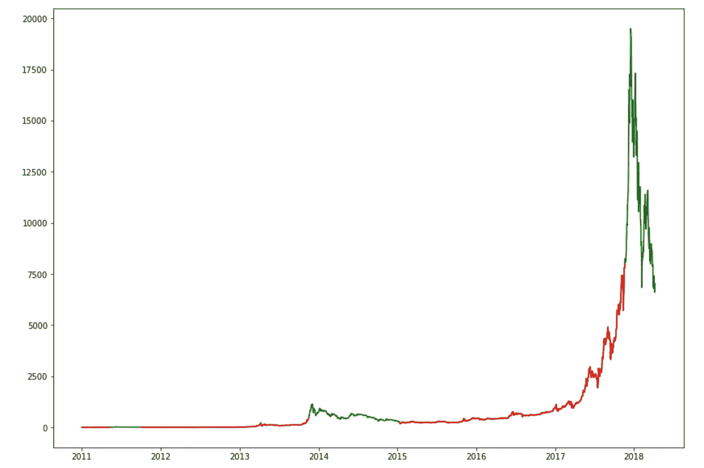
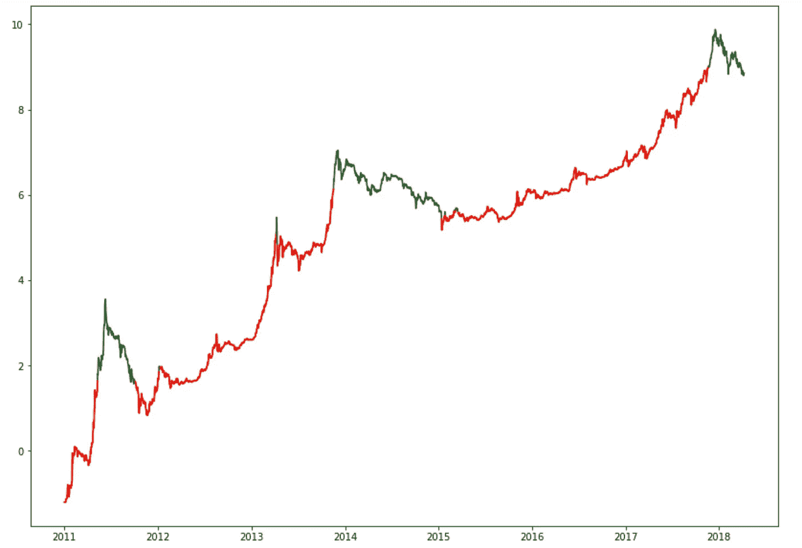
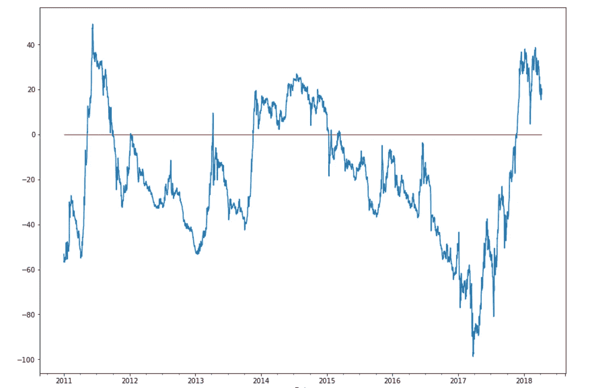
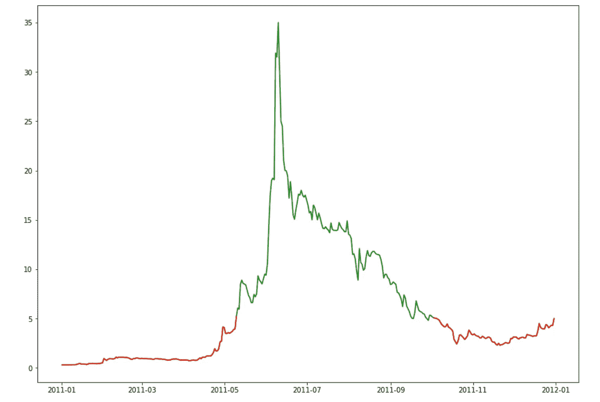
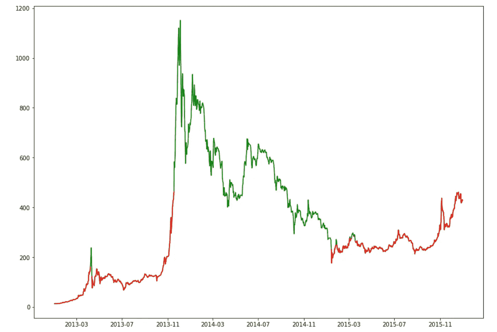
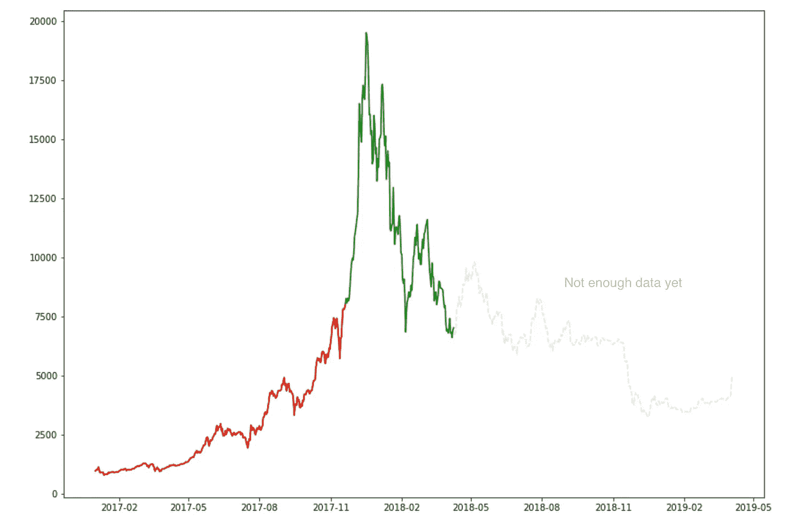
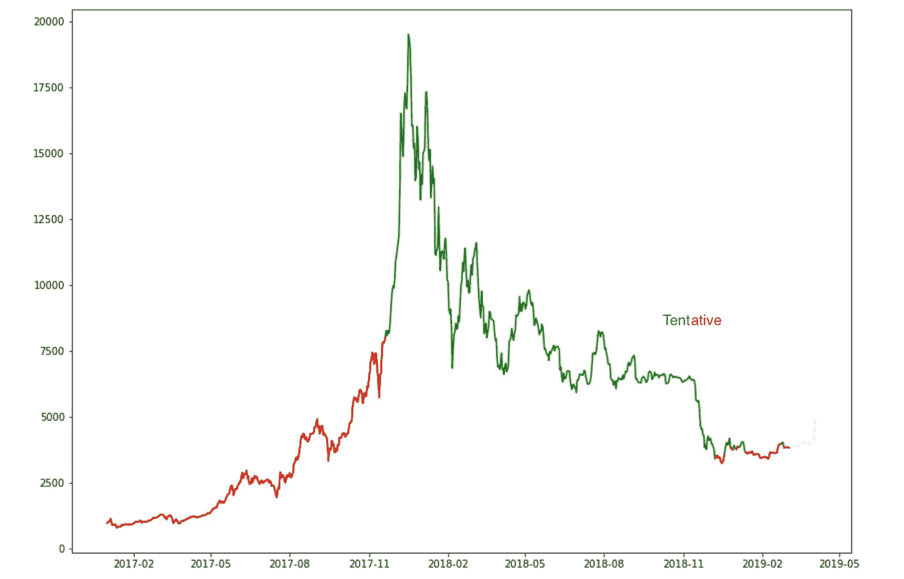

# 美元成本平均法——真的有效吗——比特币案例研究

> 原文：<https://medium.com/coinmonks/dollar-cost-averaging-does-it-really-work-bitcoin-case-study-e29e02e24ffc?source=collection_archive---------0----------------------->


Photo by [Roman Mager](https://unsplash.com/@roman_lazygeek?utm_source=medium&utm_medium=referral) on [Unsplash](https://unsplash.com?utm_source=medium&utm_medium=referral)

假设你有一些钱，决定要投资，并且已经知道你想投资什么。它可以是任何东西，但我们假设它是比特币。做这件事的聪明方法是什么。你是预先投资全部金额，还是在几天、几周或几个月内分期购买，以获得所谓的[美元平均成本](https://www.investopedia.com/terms/d/dollarcostaveraging.asp)的好处。

美元平均成本经常被吹捧为一个解决两难问题的好办法，如果你现在购买，你可能会以“高价”购买一切。如果你买入后市场马上下跌怎么办？在这种情况下，平均美元成本允许你现在买一些，然后再以新的较低价格买一些，让你以更好的平均价格买入。如果价格没有下跌，那么你现在买一些，以后在更高的价格买一些。你的平均价格更高，但你仍然很高兴，因为价格上涨了，你赚了钱。也许平均成本是痛苦和遗憾最小化，而不是回报最大化。如果随后价格上涨，你会很高兴，因为你至少在价格上涨前提前买入了一部分。如果之后价格下降，你会很高兴，因为你现在可以买到更多你想要的东西，但现在价格更低了。无论哪种方式，你都是快乐的，或者至少有一种方式来合理化你做了正确的事情。

美元成本平均法似乎有道理，但它对你的预期未来回报真的有什么影响。我决定将美元成本平均法应用于比特币，专门看看它与一次性购买所有东西相比如何。

对于过去的每一天，我都将截至目前(2019 年 4 月 5 日)的回报与在接下来的 12 个月中以 12 笔相等的分期付款平均投资的美元成本进行了比较。例如，如果今天是 2017 年 1 月 1 日，你有 12，000 美元可以投资，是在 2017 年 1 月 1 日投资全部 12，000 美元更好，还是在接下来的 12 个月每月投资 1，000 美元更好。在这个例子中，平均成本的未来回报是 174%，但是如果你一次购买所有东西，未来回报是 422%。

下图显示绿色表示平均成本带来更好的未来回报，红色表示一次性购买带来更好的未来回报。



Dollar cost averaging versus investing all at once

下一个图表显示了相同的数据，但这次使用了对数刻度，以便于阅读。记住绿色是平均成本更好的地方，红色是立即购买更好的地方。



Dollar cost averaging versus investing all at once (log scale)

如果你把所有红色和绿色的日子加起来，结果是 27%的日子是绿色的。因此，大多数时候(大约 73%)你最好一次性投资。平均来说，美元成本平均法比一次购买法更糟糕，但是我们可以通过观察美元成本平均法更有效时的具体情况来深入研究。首先让我们看看未来收益的差异大小。



Dollar cost average future returns less buy at once future returns (annualised)

红线表示零差异的位置。红线以上是美元平均成本更好的地方和多少。红线以下是“立即购买”更好的地方以及价格。为了能够进行时间上的比较，回报率的差异已经按年计算。例如，值 20 表示在该特定日期，美元平均成本每年提高 20%。值-20 表示在该日期立即购买每年收益 20%。差异的大小是显著的。当平均成本更高时，未来的回报平均每年提高 18%。当立即购买更好的未来回报平均每年 32%更好。这些都是相当大的差异。

现在让我们来看看美元成本平均法更好的具体时期。这些是绿色的部分，让我们放大这里。2011 年、2014 年和 2018 年有大片绿色斑块，正如你可能猜到的那样，它们对应于“泡沫”时期及其随后的熊市。



2011



2014



2018

每种情况下的模式都很清楚。当我们已经处于接近垂直的大幅上涨(后来被称为泡沫)时，平均成本成为更好的策略，并保持更好，直到我们接近(但尚未处于)随后的价格底部。其他时候最好一次买完。

2018 年的图表在最近 12 个月没有红色或绿色，因为我们还没有未来的价格数据来了解未来 12 个月的平均美元成本会如何。这一时期在图表上显示为灰色。为了试着猜测事情会如何发展，我稍微改变了一下规则，说让我们看看在我们剩下的时间里，平均成本会如何变化。因此，如果只剩下 11 个月的数据，我们就用 11 个月来代替 12 个月，如果只剩下 10 个月，就用 10 个月，如此类推，如果只剩下 2 个月，就用 2 个月。“假设的 2018”图表显示了当你这样做时会发生什么。



2018 with assumptions

如果我想投资比特币，我现在会怎么做？很明显，我们并没有处于垂直上升的中途，因此可以排除这种可能性。我们是即将触底还是已经触底。也许吧。“带假设的 2018”图表似乎表明，我们刚刚过渡到一个红色时期，在这个时期，立即购买更好。请记住，这张图表有额外的假设，最后部分的颜色仍然是试探性的。

从基本面来看，我个人的观点是，现在就断言当前的熊市结束还为时过早。价格很可能在 12 月中旬触底，达到 3100 美元左右，但也有可能最终的底部还没有到来。一些知名的比特币多头(是的，多头)提出了一个可信的理由，即在下一轮牛市开始之前，我们仍有可能跌至 1000 美元。清理上一轮牛市的过剩和 ICO 平仓可能还有很长的路要走。

由于美元成本平均法比一次购买法有心理优势，而且我们现在是处于绿色还是红色时期也是势均力敌，我认为总的来说，从今天(2019 年 4 月 5 日)起，美元成本平均法仍然是我的选择。最近 4 月 2 日和 3 日的意外上涨也需要谨慎，并增加了使用美元成本平均法的理由，以防万一。

最后，我总结了一下我学到的东西:

*   如果你一次性购买比特币，而不是美元平均成本，大多数情况下(但不是全部)你会获得更好的未来回报。
*   然而，如果你是在熊市期间买入，或者价格已经出现了大幅度的垂直上涨，那么平均成本会更有效。
*   美元成本平均在心理上更容易，所以如果有疑问，那么宁愿美元成本平均和快乐。

```
The Python code for this article is available on [Github](https://github.com/dcimring/crypto-price-analysis/blob/master/dollar_cost_averaging.ipynb)
```

*请注意，本文中的任何内容都不应被视为投资建议。以上是我个人的看法。如果你走到这一步，那么你可能已经意识到比特币是极其不稳定的。在投资比特币或其他任何东西之前，请做好自己的研究，做出自己的决定。*

> [在您的收件箱中直接获得最佳软件交易](https://coincodecap.com/?utm_source=coinmonks)

[](https://coincodecap.com/?utm_source=coinmonks)