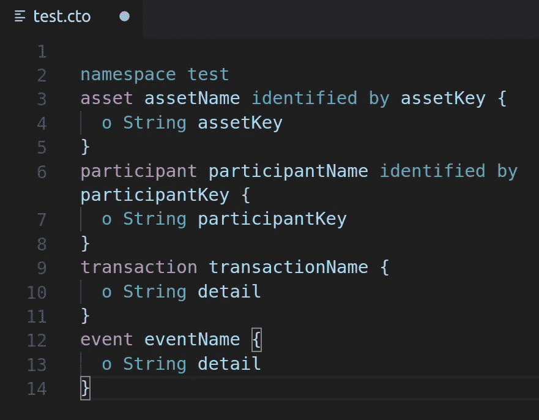
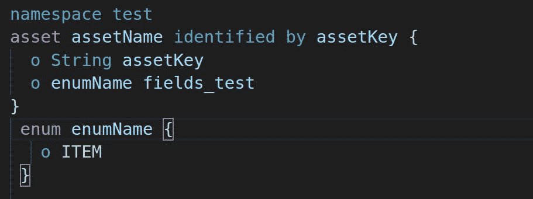
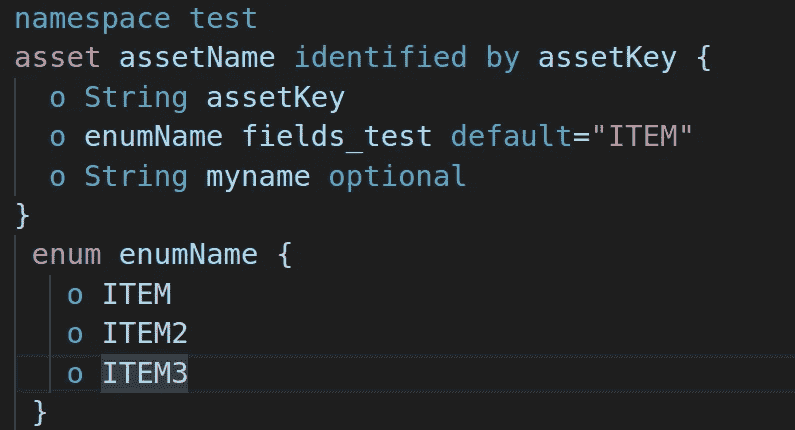

# 领域模型文件-使用 Hyperledger composer 建模语言-第 1 部分

> 原文：<https://medium.com/coinmonks/domain-model-file-in-hyperledger-composer-modeling-language-part1-97f0777e720a?source=collection_archive---------5----------------------->

领域模型语言是一种面向对象的语言，用于定义业务网络模型。容易理解和简单学习。

业务模型定义了以下内容的表示:

a)资产:参与者处理资产(不可变或非不可变)

b)参与者:用户/顾客

c)交易:由资产参与者携带

d)事件:发出事务

Composer 建模在中定义。描述资产、参与者、交易和事件表示的 cto 文件。

您可以定义资产、参与者、执行人和识别人。

您可以使用其他语言、字符串、双精度、整数等数据类型来定义资产、参与者。也可以用 enum 关键字定义自己的数据类型。根据枚举值验证数据。

在下面的屏幕中，enumName 是用户定义的数据类型，带有一个项目值。

默认情况下，所有资产和参与者值都是必需的，但如果您需要任何可选值，也可以使用可选语言来定义。在默认数据类型的情况下，您也可以使用 default 关键字设置默认值。如下图所示。myname 是可选资产，same for ITEM 设置为默认值。

如果我们将在 playground 中测试输出，只有 2 个资产将显示为 mystring 是可选资产，enumName 将默认值设置为 ITEM。

在下一节中，我将定义一些用于定义数据模型的其他特性。

谢谢