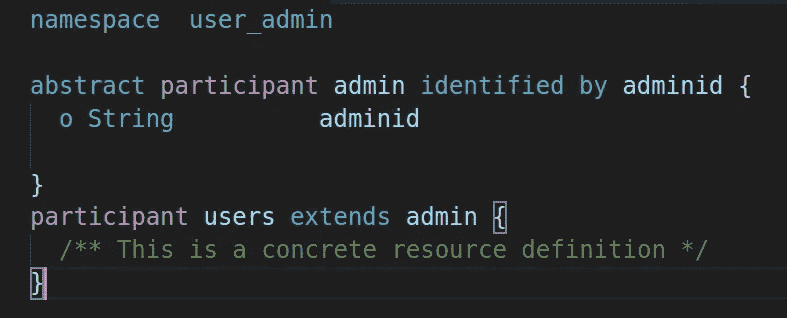

# 领域模型文件-使用 Hyperledger composer 建模语言-第 2 部分

> 原文：<https://medium.com/coinmonks/domain-model-file-in-hyperledger-composer-modeling-language-part2-612a58fe8031?source=collection_archive---------4----------------------->

为了完善 Hyperledger composer 中的 composer 建模语言，让我们来看看 Composer 建模语言中使用的一些功能。

**a)抽象类**:和其他面向对象语言一样，你也可以使用抽象类，它不允许创建在抽象类中声明的对象实例。

**b)扩展(继承)**:支持面向对象语言的继承属性。扩展允许访问类中的其他类。

然而，复合建模语言仍然不允许多重继承。

示例:在下面的捕获中有两个类，抽象类 Admin participant 和扩展抽象类的 user 类。你可以扩展抽象类来创建抽象类的对象实例。

像其他编程语言一样，你也可以通过下面的符号来使用数组。

o String []用户详细信息

概念:它像一个结构一样工作，是多个字段组合，这些字段可以组合在一起，然后可以在任何类中使用。

我在抽象类中定义了 contact，所以当你编译和测试代码时，所有的 contact 字段都会显示出来，你需要输入相同的数据。

**e)字段验证** n:如果需要防止乱七八糟的数据进入字段，那么你验证你的字段日期，它是字符串和整数的形式。

示例:在下面，您可以限制代码值，只允许三个大写字符。您可以使用 regex 函数来验证字符串字段。

如果您想要验证年龄列应该在[18，65]之间，在这种情况下，您可以使用 range 函数来验证整数值。

这些是 Composer 建模语言的一些特性。

如有任何问题，请随时评论。