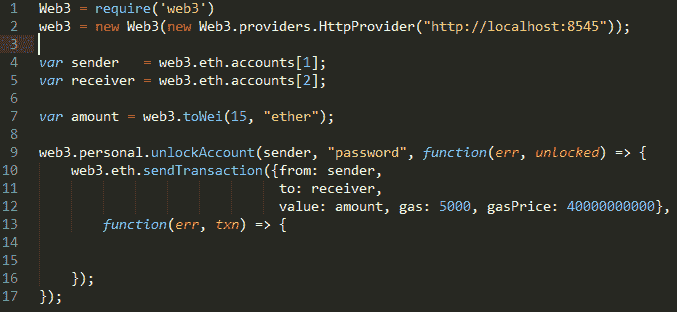

# 不要把你的以太输给黑客，遵循安全的以太坊编程方法

> 原文：<https://medium.com/coinmonks/dont-loose-your-ethers-to-hackers-follow-safe-ethereum-programming-methods-e5e87ad0c30e?source=collection_archive---------8----------------------->

我们在以太坊和其他论坛上不断看到类似下面这样的消息，人们不断被黑客机器人夺走以太。

1.我一解锁一个地址，余额就变成 0 了。(以太坊第 17013 期)

2.在 sendTransaction 或迁移期间，帐户中的以太网被清除(以太坊问题#16936 #16992，在 github 中提出，我们在电子邮件中收到)

3.等等

昨天(19-Jun)我看到了至少三个丢失 ETH 的实例。虽然其中一些是测试以太网，相同或类似的机器人也在以太坊主网上积极寻找易受攻击的地址，人们的真实以太网正在被黑客窃取，在谈论黑客和阻止或列入其公共以太坊地址黑名单的可能性之前，让我们讨论一下有哪些漏洞和可遵循的安全编程方法，以便我们在解锁地址以提交交易时不会丢失以太网。

**1。不安全的 RPC 连接**

在您的节点中使用 geth 参数之前，请严格理解这些参数的含义。

以下是不安全的 RPC 连接参数

*geth-RPC-rpcaddr " 0 . 0 . 0 . 0 "-RPC cordomain " * "*

-rpcaddr“0 . 0 . 0 . 0”-允许全世界任何人都可以连接你的以太坊节点

-RPC corsdomain " * "-可以从任何应用程序连接节点

**2。解锁账户**

账户必须被解锁，以便从账户转移某些东西，或者在任何合同书写活动期间，以便可以从账户消耗所需的汽油。如下面的代码所示，使用其密码解锁帐户，并使用 eth_sendTransaction 将一些乙醚从一个帐户转移到另一个帐户。如果 DAPP 和 Ethereum 节点在同一个服务器上，并且 rpc 连接不对外开放，那么这对于一些测试程序来说是没问题的。但是，帐户的密码会在程序中暴露，请确保在测试交易完成后删除密码。

**请注意**:当应用和以太坊节点在两个不同的服务器上时，如果我们尝试上面的代码，公钥、账号密码、以太坊节点地址、rpc 端口号等细节都是通过 http 传输到以太坊节点的。

现在，“中间人”可以嗅到这种不安全的交易，并劫持一切对他有利的东西，潜在地从这个帐户或以太坊节点的所有其他帐户中取走所有可用的以太。

中间人在这里详细解释[https://en.wikipedia.org/wiki/Man-in-the-middle_attack](https://en.wikipedia.org/wiki/Man-in-the-middle_attack)和[https://www.veracode.com/security/man-middle-attack](https://www.veracode.com/security/man-middle-attack)

**解总签&发送:**

当应用程序和以太坊节点在两个不同的服务器上时，考虑总是对交易进行签名并发送到区块链。您帐户的私钥保存在您的服务器/计算机中，签名的交易被安全地发送到以太坊节点。

原始交易及其签名交易的示例如下所示…

signed transaction = 0 xf 86 c 80850 a 7 a 35820082520894 ef 0338 BD cfda 23 beba 0059719 a 7 C5 d 496089 EC 38880 de 0 b 6 B3 a 76400008025 a 09 f 2 e 3 D5 ca 8 b 947 a2 e 20 e 46 AE 05 B3 C1 d 42 b 99 c 2d 00 e 665 BF 89 BC 54 f 9058 ca 4c 6a a 0612 fa

下面是生成上述内容的示例节点 js 代码，

3.我们也在合同创建期间解锁账户，我们将在下一篇文章中详细讨论如何安全地解锁账户..

4.非技术加密投资者如何保护他们的私钥，将详细探讨..

快乐(安全)编码…