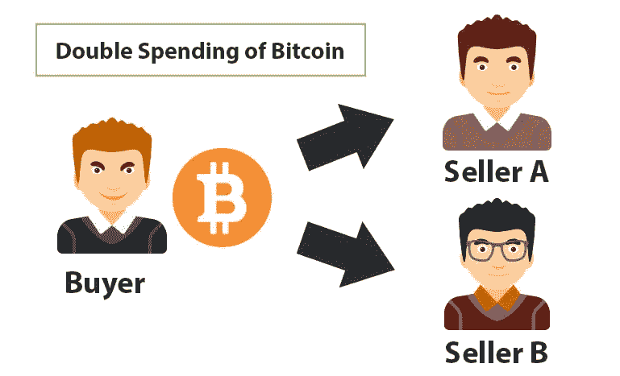

# 双倍消费？区块链安全？程序员解释

> 原文：<https://medium.com/coinmonks/double-spend-blockchain-security-programmer-explain-6d5ce155e562?source=collection_archive---------10----------------------->

[source](http://bitcoins.net/guides/double-spend.asp)

对于区块链来说，什么是双重消费？作为一个企业家或开发者，你为什么应该选择早期区块链适配器

> **免责声明**
> 
> 这是一系列解释已经发生/可能发生的安全问题。
> 
> 如果你计划采用区块链技术作为一个企业家，一个开发商为您的业务。是时候深入探讨区块链技术带来的常见安全问题了。

让我们开始吧！

> **安全顾虑
> 【双花】**

`**Double Spending**` 是指一个人同时在两个以上的地方花完全相同的钱。你可能想知道为什么会发生这种事，让我们一起来探索吧！

> **双花是如何发生的？**

假设你有价值 10 美元的比特币。然后你点了价值 10 美元的`a cup of coffee` ，在你用另一笔钱支付咖啡后，你点了价值 10 美元的`order a cheesecake` 。

直觉上是不可行的。但是，你的`account balance`每 10 分钟(最长可能等待期)才会体现**。**

换句话说，你的账户余额将每 10 分钟更新一次。

> 引擎盖下发生了什么？

「1」每一个`spendings/transactions`都会被放在一个`box「Mempool」`里，等待被`people 「Miner」`拿走。

『2』`People 「Miner」`会从他们喜欢的`box「Mempool」`中挑选`spendings/transactions`(通常是费用最高的*)，并将这些`spendings/transactions`放入`**Block**` **『比特币每 10 分钟就会产生一个新块』***

**

*How blocks are generated*

*【3】因为区块链是一个`decentralized system`，所以人们对于哪个`blockchain`应该被信任有意见是很正常的。规则是谁有`the longest chain of blocks wins`。*

> *披露/有用链接*

***关于我**
我是一名全栈 javascript 开发人员，也是 NEO 区块链项目的贡献者之一。*

***在 NEO 之上用 Javascript 构建去中心化应用？** [尼奥·区块链，编程教程，Javascript](https://medium.com/blockchain-under-the-hood)*

***如果你认为自己是个人才？** [科班出身](https://cobinhood.com/careers)*