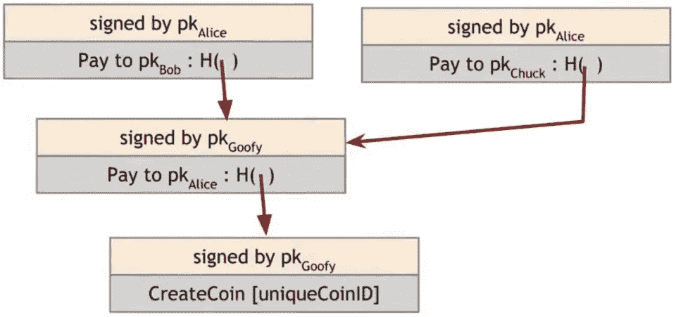
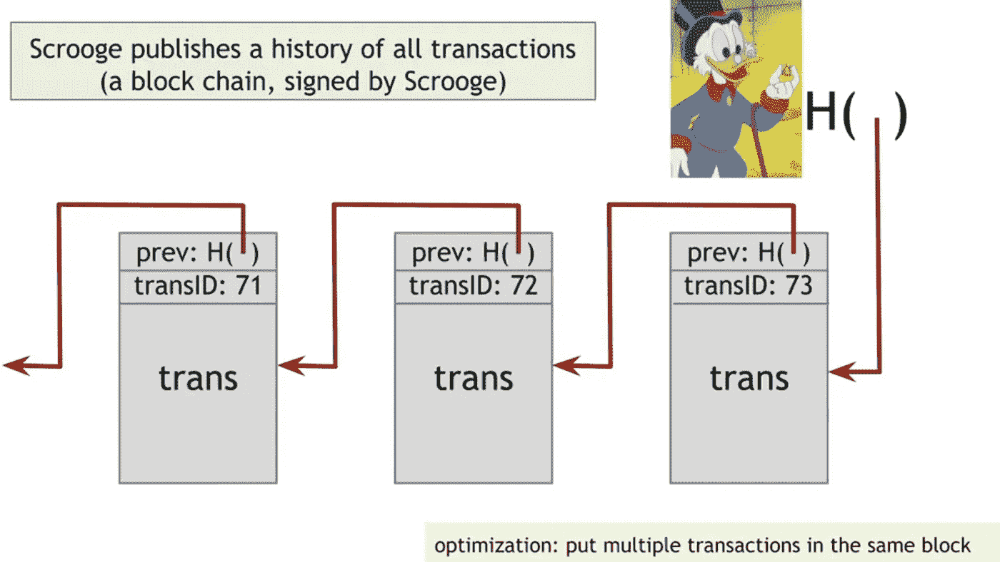
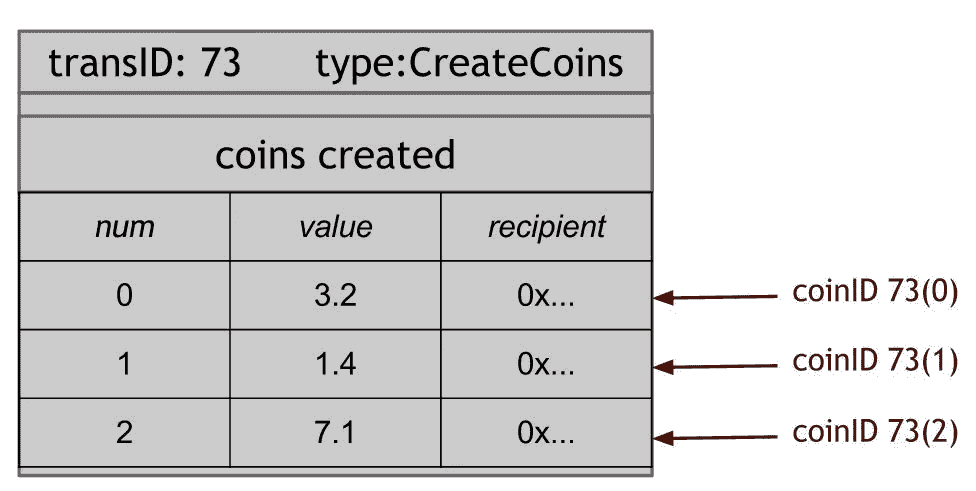
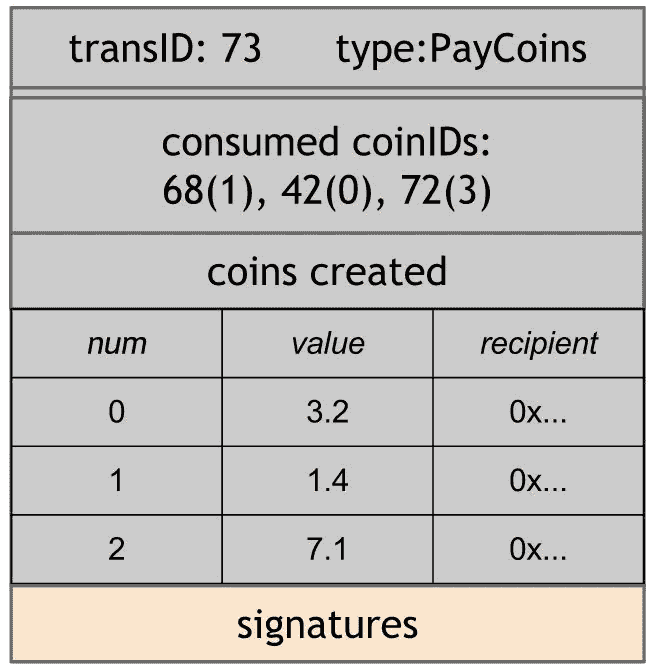

# 数字货币双倍消费！

> 原文：<https://medium.com/coinmonks/double-spending-in-digital-currency-4685476e8236?source=collection_archive---------2----------------------->

数字货币已经存在很长时间了，随着比特币区块链的出现，它已经成为人们关注的焦点。但是，什么是数字货币呢？嗯，它是一种数字形式的货币，在价值上，它类似于实物货币，但具有即时交易和所有权无国界转移等属性。

因此，每一种新货币都会产生一些问题，在这种情况下，这就是双重支出问题。双重消费是制作数字货币的副本并将其发送给商家，同时自己保留原件的行为。所以，我们用一个很酷的例子来理解这个问题。

## **高飞硬币**

因此，假设我们的朋友高飞决定按照以下规则发行某种数字货币:

*   只有高飞有权利创造硬币，每个硬币将有一个唯一的 CoinId，它将由他数字签名。
*   每笔交易都有交易人的数字签名和收款人的地址。

Goofy Coins

*   高飞创造了一个具有唯一 CoinId 的硬币并用它的公钥签名。
*   现在，高飞决定把硬币给爱丽丝，所以他用它的数字签名进行了一次交易(Pay to pK(Alice): H())，现在爱丽丝拥有了硬币，一个散列指针指向高飞的交易。
*   现在，爱丽丝被证明是恶作剧，并决定加倍花费硬币。所以，她在交易上签了名，把硬币给了鲍勃，又签了名，给了查克。Chuck 不知道也没有办法知道硬币已经寄给 Bob 了。事实证明，这是一个双重支出问题，也是开发任何数字货币时的主要担忧。

# 吝啬鬼来营救

现在，我们的亿万富翁朋友发现了这个问题，并试图以自己的方式解决它。所以，他发明了自己的吝啬鬼硬币。

吝啬鬼硬币有一些每个人都需要遵守的规则:

*   硬币只能由吝啬鬼创造。
*   他将公布所有交易的历史记录，如果交易有效，他将对其进行数字签名。

Scrooge Coin

*   现在，一个人做的每一笔交易都会被分配一个唯一的 transId，并被推入区块链。因此，任何人都可以来检查交易是否是在过去进行的，并且 Scrooge 通过签署最后一个块的散列指针来验证区块链中没有篡改。为了优化，我们将多个事务放在同一个块中。
*   Scrooge 中有两种类型的交易:

1.  **创建硬币交易**

Create Coin Transaction

在一个块中有多个交易，并且每个交易具有三个字段:CoinId(例如 73(0)或 73(1))、进行的交易的价值和接收地址(接收者的公钥)。交易被认为是有效的，因为“守财奴这么说”。

2.**支付硬币交易**

Pay Coins Transaction

这些是由其他人进行的交易，具有以下信息:硬币的 transId、正在交易的硬币的价值和接收者地址。它还包含在该区块进行交易的所有人的数字签名。

在以下情况下，硬币或交易将被视为有效:

*   它是一枚被消费的硬币，即它早先由 Scrooge 进行交易。
*   它尚未被消费或使用。
*   输出总值=输入总值，即发送方发送的金额和接收方收到的金额应该相同。
*   所有硬币的前主人都签了名。

**问题真的解决了吗？**

好吧，有了吝啬鬼硬币，我们找到了双倍消费的解决方案，但是如果:

*   Scrooge 停止验证或维护区块链。
*   他自己变得腐败，并开始验证无效的交易。
*   人们不再相信斯克罗吉制定的规则。

如果你想一想，你会很容易发现这些问题是因为吝啬鬼硬币的集中而产生的，解决办法是**去中心化**，在那里人们可以相互信任，并有一个共识机制。这本身就是一个很大的讨论话题。

> [在您的收件箱中直接获得最佳软件交易](https://coincodecap.com/?utm_source=coinmonks)

