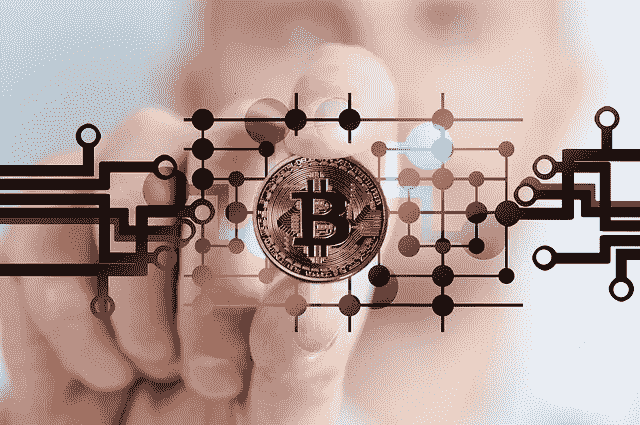
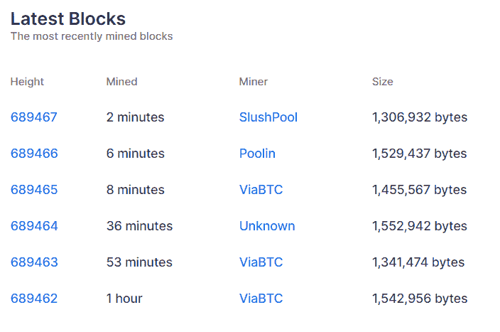

# 加密货币的双重消费

> 原文：<https://medium.com/coinmonks/double-spending-of-cryptocurrency-867af0210d47?source=collection_archive---------8----------------------->

Image taken from [here](https://www.tokens24.com/cryptopedia/basics/bitcoin-addresses-explained)

在我的上一篇博客中，我讨论了矿工，他们为什么采矿，什么是未确认的交易池，看到了不同的区块，以及在创建一些区块后区块奖励如何变化。在这篇博客中，我将讨论双重消费的概念，UTXOs，以及其他与区块链交易相关的概念。

# 1.什么是双重消费？

当你钱包里有现金，去任何商店买杂货、衣服、任何设备等。结账后，收银员会给你买这些东西需要支付的总金额。你把全部现金交给收银员，然后把东西带走。但是现在，你有没有可能支付同样的现金，用来支付买东西的费用，再用来购买可乐、薯片等等。从商店还是从其他商店？是的，除非你偷了收银员的钱，然后骗了他，但这是违法的，你肯定会因为犯罪而受到惩罚。所以你不能花同样的钱去买其他你已经花了的东西。

这是双重消费的情况，一个人用同样的钱支付给不止一方。银行业的这个问题必须得到解决，否则货币的价值将会降低，货币、交易、银行业务、账户余额等都将不复存在。

在加密货币中，由于货币是数字的，所以人们更容易复制交易和进行双重消费。但是中本聪在创造比特币的时候就考虑到了这个问题，并通过引入交易的**验证和确认**的概念以及在交易中添加**时间戳**来解决这个问题。在比特币共识(在各自的区块链中每个节点遵循的协议)中，交易应该至少有 6 次确认，以获得其真实性的信任。假设你有 3 个 BTC，你花了 2.5 个 BTC 到两个不同的钱包地址(钱包地址与受益人的账号相同)，交易将进入未确认交易池，我在上一篇博客中讨论过。矿工将确认第一笔交易，由于它是有效的，它将被添加到块中，现在只需要 6 次确认就可以完成这笔交易。第二笔交易仍然存在于未确认交易池中，假设第二台挖矿机取出进行确认，但会发现这次交易无效。

为什么这次无效？这是主要问题。这是因为当每一个比特币从一个比特币钱包(发送方的账户)转移到另一个比特币钱包(接收方的账户)时，那么这些特定比特币的所有权就会转移到接收方的钱包。区块链的每种加密货币都有一个所有权链。因此，在第二次交易中，发送方试图向第二方双倍支付相同金额的交易无效，因为在交易验证期间，发现这些 BTC 的所有者是其他人。

第二种情况是，如果来自未确认交易池的两个交易同时被确认，那么在这种情况下，两个区块将在区块链中形成。是的，区块链分裂了一段时间。所以现在**最长链规则**将适用，它说，在两个分支中，链将是最长的，即其他块将继续在区块链添加，因此它们也将被添加到两个分支之一。因此其中一个分支会比另一个分支长，而那个较长的分支将永久留在区块链，而较短的分支将被排除在外。该分支应该延伸到 6 个街区以成为永久的。**两个分支不可能有相同的大小**。一旦区块链获得永久分支，较短的分支将被移除。被移除的分支的交易再次进入未确认的交易池，或者这取决于将会发生什么的共识。在上一篇博客中，我说过一旦 miner 确认交易并将其添加到 block，交易就从发送者的钱包转移到接收者的钱包。只是因为我想向你介绍这个概念。但实际交易发生在获得至少 6 个确认时，即在添加交易的区块之后，必须有至少 6 个区块才能进行成功和真实的交易。为什么？我刚刚在上面的段落中讨论过。有时还取决于钱包，需要多少确认才能成功交易

以下快照显示了比特币区块链的区块编号及其发现时间。在块 **689467** 之前发现块 **689462** 。因此块 **689462** 得到了 6 个确认，由于块 **689467** 是最新的块，它只有一个确认。

下面的快照显示了已经得到 6 次确认的块 **689462** ，比 **689467** 更可信。

下面的快照显示了块 **689467** 。因此，它是不可信的，一旦它得到 6 个更多的块添加，该块的交易将被确认。这完全取决于钱包，有些钱包需要 3 次确认，有些需要 2 次确认，大额交易有时也需要 15 次确认。

# 2.UTXO 是什么？

UTXO 是未用完的事务输出，是区块链的基本元素。假设你去超市买一些零食。你的实体钱包里会有一些钱。你买了 30 美元的东西。结帐柜台的出纳员要求你付款。你拿出钱包，看到你有一张 50 美元的钞票。你把那张 50 美元的钞票交给出纳员，作为回报，出纳员给你 20 美元的零钱，你把它放在钱包里。还好吗？你给的钱总数是 50 美元，作为回报你得到了 20 美元，所以它可以被解释为一个等式 50 美元=30 美元+20 美元。你从钱包里花了 50 美元，这导致了两个硬现金的产生，30 美元和 20 美元。LHS=RHS，左边创造的总量等于右边创造的货币总量。我们也可以说有 20 美元没有花掉。为什么没有用完？因为你仍然可以从你的钱包里拿出这 20 美元去买其他的东西，但是这 30 美元花掉了，你就不能再用它们了。此外，50 美元是您从钱包中输入的交易，这导致 30 美元和 20 美元的输出，从中您得到 20 美元作为另一个输入到您的钱包中。
同样，在加密货币中，当一笔交易完成时，你得到的回报被称为**未用交易输出(UTXO)** 。当你用比特币创建一笔交易时，那么假设你的钱包里有 0.6 BTC，0.5 BTC，1.8 BTC，1.5 BTC(我把 BTCs 的数值都简化了，实际在小数点后有 8 位数)。是的，你的钱包在后台看起来是这样的，来自各种交易的双币直到你明确地做它才被合并，因为它们中的每一个都有自己的所有者链。你的钱包会把这个藏起来，显示总数给你。现在假设你想创建 2 个 BTC 的交易，你的钱包在后台会自动选择那些**【UTXOs】**，结果会比 2 个 BTC 略多，因为交易费用也要支付(所有这些都是自动的，你只需添加你要支付的金额和收款人的钱包地址)。所以，假设钱包花了 1.8 BTC 和 0.5 BTC 进行交易，这相当于 2.3 BTC。它将转到未确认交易池，并从该池添加到 block，交易费将交给 miner，交易将需要 6 次确认才能成功。2 BTCs 已经到达接收器，假设矿工的费用是 0.1 BTC，所以它会自动支付给他，现在我们剩下 0.2 BTC 作为零钱。如果你索赔，那么它将被还原到你的钱包，否则它是支付给矿工。你不需要明确地声明，因为后端的钱包会这样做，这些 0.2 BTCs 是 UTXO，它们被还原到你的帐户，你可以在未来使用。现在你的钱包看起来像 0.6 BTC，0.2 BTC，1.5 BTC。

下面的快照显示了从箭头左侧的发送者到接收者(接收者标有红色边界)地址的交易。

在上面的快照中， **2.37361032 BTC** 的交易是由 LHS 的发送方发起的。交易分成 5 个输出，其中绿色边界地址是 UTXO，返回到帐户，红色边界是接收者将收到的实际花费。现在看看蓝色边界，在 LHS 和 RHS，你会看到实际投入不等于产出，因为在 LHS 没有减去交易费 **(0.00061184)** 。但是当你从 LHS **2.37361032 BTC** 中减去交易费 **(0.00061184)** ，那么 LHS 就会变成等于 RHS。这个概念我已经在上面讨论过了，为了跟踪 BTC 不丢失，LHS 应该等于 RHS。

# 3.比特币地址会完成吗？

每次进行交易时，都会生成汇款人和收款人的新钱包地址，这样做是为了向双方提供匿名性，没有人可以跟踪交易。你仍然可以追踪，但是绘制地图会花费很多时间。所以你会看到你每次做交易的时候钱包地址都在变，所以这就是为什么会发生的原因。在上面的交易中，你也会看到 UTXO 的钱包地址是不同的，1 是相同的，另一个是不同的，但两者都是发送者的地址。这就是为什么两个 UTXO 有不同的地址，但最终都是发送方。这并不意味着你将不能使用你钱包里的其他比特币，因为最终这些地址的主人只有你自己。所以，你在后台有很多地址，但是钱包隐藏了复杂性，只显示最近的地址。即使有人将比特币寄到旧地址，你也会收到，因为你只是所有者。
由此产生了这些问题**比特币地址会很快终结吗？如果我得到一个地址，而那个地址已经被占用了怎么办？如果有人使用了我的钱包地址，并使用了相同的硬币，该怎么办？**让我们来看看比特币区块链的一些数学部分。

*   每个钱包地址都有一个私钥。所以每次交易后都要生成新的私钥。这些都映射在你的钱包的后端。因此，交易后会生成一个新的钱包地址，我们在上一节讨论了为什么要这样做。
*   每个私钥是 256 位的。
*   因此有 **2256** 种组合。
*   这意味着你可以抛 256 次硬币来获得完全随机的私钥。人们确实这么做了。
*   私钥是完全随机的，不检查它是否存在
*   **看起来像:**0101010001001010001001001001111010101010101010101010001010100010101010101010101010101010101010101010101010101010101
*   T2 26867.868686866666
*   每个公钥都是 160 位的。
*   公钥是从私钥生成的。
*   公钥是 160 位
*   因此有 **2160** 个组合，由私钥创建。
*   **看起来像:**0101010001001010001001001111010101010101010101010001010101010101010101010101010101010101010101010101010101010101
*   14615.868686868667
*   这 256 个二进制位的私钥和 160 个二进制位的公钥被转换成十六进制，以便对其进行处理
*   1 BTC = 108 聪。聪是 0.00000001 BTC。要创造一个 BTC，我们需要 108 只聪。
*   方块奖励减少后的方块数为 210000
*   方块奖励每 210000 块减半，所以会像 50+25+12.5+6.25+3.125+1.5625+……。~=100.这样做是因为新的比特币因为区块奖励而引入区块链。
*   总奖励将达到约 100 英镑
*   创造的比特币总数将是 210000 X100 = 2100 万。总共可以创造 2100 万个比特币。
*   因此**210000000 x 108 = 210000000000000**satoshis 是可能的。因此，我们需要最多 210000000000000 个地址。
*   但是我们有**1461501637330902918203684832716283019655932542976**对应**的公钥(也就是钱包地址)1157920892373161954235709850086879078532698465656400**
*   从可以生成的最大值中得到相同公钥的概率是 N(A)/N(B)，其中 N(A)是需要的最大地址，N(B)是可以生成的最大公钥。
*   2100000000000000/14615016373309029182036848327 1628301965 59325 4276 = 0.
*   因此，生成相同比特币地址的概率是 1.436 x 10–33。
*   一个人被流星砸死的概率是(根据[nationalgeographic.com](https://www.nationalgeographic.com/science/article/160209-meteorite-death-india-probability-odds))，这比生成一个相同地址的比特币要大得多。
*   即使你在一生中不断产生新的地址，你仍然无法接近那个大数字

在这篇博客中，我讨论了双重消费的概念，UTXO，各种与交易相关的概念，交易及其确认的例子，比特币及其钱包的更多概念等。我希望它是概念性的，并且用简单的语言来解释复杂的概念。在接下来的博客中，我将讨论更多关于区块链和交易的概念。

> 社交媒体链接:[LinkedIn](https://www.linkedin.com/in/ansh-vaid/)|[GitHub](https://github.com/AnshVaid4)|[insta gram](https://www.instagram.com/being_optimist/)|[Twitter](https://twitter.com/anshvaid4)
> 
> 访问我的网站:[https://cybergeeks.website/](https://cybergeeks.website/)
> 
> *原载于*[*https://github.com*](https://github.com/AnshVaid4/Blogs/blob/caff161e83f7cb87d41468660ab5875de2cd47a4/blogs/2021-10-13-ExploitingServices.md)*。*

> 加入 Coinmonks [电报频道](https://t.me/coincodecap)和 [Youtube 频道](https://www.youtube.com/c/coinmonks/videos)了解加密交易和投资

## 也阅读

 [## 最佳加密交易所| 2021 年十大加密货币交易所

### ICON _ PLACEHOLDEREstimated 预计阅读时间:28 分钟加密货币交易所的加密交易需要知识…

blog.coincodecap.com](https://blog.coincodecap.com/crypto-exchange)  [## 2021 年 10 大最佳加密贷款平台| CoinCodeCap

### 当谈到加密货币贷款时，大量因素等同于良好的收入状况。此外，借款的一部分…

blog.coincodecap.com](https://blog.coincodecap.com/crypto-lending)  [## 2021 年最佳免费加密交易机器人

### 2021 年币安、比特币基地、库币和其他密码交易所的最佳密码交易机器人。四进制，位间隙…

medium.com](/coinmonks/crypto-trading-bot-c2ffce8acb2a)  [## 最佳 4 个加密交易信号电报通道

### 这是乏味的找到正确的加密交易信号提供商。因此，在本文中，我们将讨论最好的…

medium.com](/coinmonks/best-crypto-signals-telegram-5785cdbc4b2b)  [## BlockFi 评论 2021:利弊和利率| CoinCodeCap

### 今天，我们提出了一个全面的 BlockFi 评论，这是一个成立于 2017 年的加密贷款平台，拥有其…

blog.coincodecap.com](https://blog.coincodecap.com/blockfi-review)  [## 如何在印度购买比特币？2021 年购买比特币的 7 款最佳应用[手机版]

### 如何使用移动应用程序购买比特币印度

medium.com](/coinmonks/buy-bitcoin-in-india-feb50ddfef94)  [## 加密税务软件——五大最佳比特币税务计算器[2021]

### 不管你是刚接触加密还是已经在这个领域呆了一段时间，你都需要交税。

medium.com](/coinmonks/best-crypto-tax-tool-for-my-money-72d4b430816b)  [## 存储比特币的最佳加密硬件钱包[2021] | CoinCodeCap

### 保管您的数字资产很容易，但找到正确的存储方式却是一项繁琐的任务。在线钱包有一个风险…

blog.coincodecap.com](https://blog.coincodecap.com/best-hardware-wallet-bitcoin)