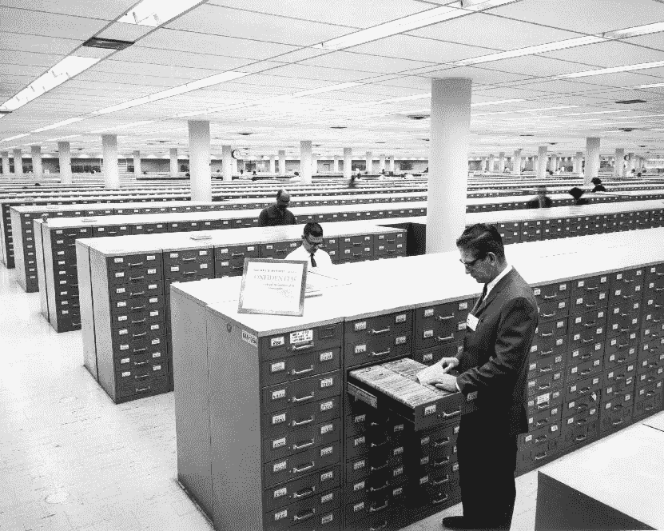
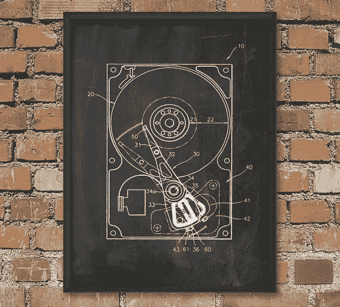
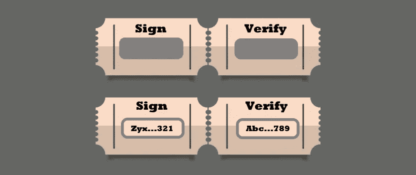

# 重复支出问题的替代解决方案

> 原文：<https://medium.com/coinmonks/double-spending-problem-3b7c2654229b?source=collection_archive---------4----------------------->

比特币白皮书清楚地表明了中本聪的意图；将款项从一方支付给另一方，而无需通过金融机构来防止第一方再次花掉这笔钱的能力。

> 抽象。电子现金的纯点对点版本将允许在线支付直接从一方发送到另一方，而无需通过金融机构。数字签名提供了部分解决方案，但是如果仍然需要可信任的第三方来防止重复花费，那么主要的好处就失去了。我们提出了一个使用对等网络来解决重复消费问题的解决方案。网络通过将事务散列到一个基于散列的工作证明的持续链中来标记事务的时间戳，从而形成一个在不重做工作证明的情况下无法更改的记录。最长的链不仅证明了所见证的事件序列，还证明了它来自最大的 CPU 能力池。只要不合作攻击网络的节点控制着大部分 CPU 能力，它们就会产生最长的链，超过攻击者。网络本身需要最小的结构。消息是在尽最大努力的基础上广播的，节点可以随意离开和重新加入网络，接受最长的工作证明链作为它们离开时发生了什么的证明。
> 
> 来源- [比特币白皮书](https://bitcoin.org/bitcoin.pdf)

这里开创性的部分是解决重复支出的问题。在区块链概念发明之前，唯一可用的方法是使用 1)政府支持的实际货币，2)金银等贵重材料，或 3)中央银行系统。自区块链以来，唯一能够避免重复支出的另一个大型项目是 IOTA 在 Tangle 上的工作。尽管许多人看重区块链确保支付的能力，但这仅仅是一个小小的开始，而不是最终目标。

当我后退一步时，我想到了一些替代方案。我将描述我的三种新的*高度理论化的*方法来实现这种交易，并提出第四种方法*可能*在现实世界中可行。这项工作的目标是推动进一步创新。

# 出发点

我想介绍的四种方法都应用了相同的原理:

> 允许点对点支付而不需要第三方确认支付的能力。

让我用一些思维实验带你经历一次迭代之旅。

# 限制

任何一种证明所有权的方法都依赖于统计极端值，这些极端值可以向你保证，别人声称拥有你的财产的可能性不大。对于这一发现，让我们看看如何利用下面的陈述。

*   储物空间有限。
*   处理能力有限。
*   如果制造伪造品的成本高于伪造品所代表的金额，法定货币(如钞票)将不会被伪造。

迄今为止，证明数字项目所有权的任何方法都应用某种数字签名方案，其中只有所有者能够复制给予原始项目的签名。然而，数字签名本身并不能防止重复支出。第二方可以简单地复制该项目并使用他们自己的密钥生成签名，从而声称他们拥有该项目。这就是为什么区块链和泰戈也提到了物品的所有权历史。为了清楚起见，下面的方法假设签名过程中包括类似的参考模型。

# 方法 1: 51%全局存储规则

假设可以公开知道有多少存储空间可供全人类使用，防止第二个人创建他们自己的签名的第一种方法是通过**要求这个签名大到占据所有可用存储空间的 51%**。

比如说，全世界的总储存量是 70 单位。为了证明数字财产的所有权，您需要创建一个 36 个单位(70/2+1)的签名。该项目只能出售，如果买方也可以创建 36 个单位的签名。因此，卖方将至少释放 2 个单位，破坏她的签名，使她无法证明所有权。

买方现在可以有效地要求对数字项目的唯一所有权。

# 方法 2: 51%个人存储规则

这种方法类似于前面的方法，但假设已知地球上每个人有多少可用的存储空间。

在这个方案中，的要求是，**的签名大小是一个人总可用存储空间的 51%**。在一件商品售出之前，买家会将一个虚拟文件交给卖家。卖家将不得不为虚拟物品创建一个签名，这实际上破坏了他们对原始物品的签名。只有当卖方可以证明他们可以签署虚拟，买方可以要求对数字项目的唯一所有权。

# 方法 3:通过不断的变异获得所有权

除了要求大量的存储空间，我们还可以要求处理能力。任何设备都有向内存读写数据的速率限制。例如，在一个以 10 个 [IPS](https://en.wikipedia.org/wiki/Instructions_per_second) 工作的单线程 CPU 上，每秒只能执行十次运算。

在为数字项目创建签名后，新的所有者将在内存中存储该签名的副本(也有初始时间戳),并对其应用不断的变化。这些突变将是一种预测模式，然而，它们不能被捷径化，因为前一个周期的结果必须是已知的。

为了向买方证明所有权，卖方将停止操作，并将原始签名和计算的最终结果移交给买方。买方将重新应用突变模式，并跟踪循环次数，直到达到最终结果。这将告诉购买者达到这种状态需要多少个周期。给定周期数、来自卖方设备的 IPS 速率、加上初始时间戳和卖方停止存储器内处理的时间戳，买方可以计算突变周期是否曾被中断。如果没有，买方可以安全地要求对数字项目的唯一所有权。

# 方法四:刮刮卡

这种方法使用一个物理对象来帮助证明所有权，其形式为**一张由两部分组成的刮刮卡**。第一部分标记为“Sign ”,包含一个隐藏的公钥。第二个标记为“验证”，包含相应的私钥，也是隐藏的。

> 这个故事中的“真正的制造商”基本上可以是买卖双方都足够信任的任何人，以制作一张不能被篡改的刮刮卡。刮刮卡不会像第三方或第三方网络那样区分交易的来源、目的地或价值。彩票足够信任刮刮卡，不用担心篡改或欺诈，即使他们的赌注很高。

要转让所有权，卖方必须将刮刮卡的“验证”部分交给买方。买方同时将一张新的未使用的刮卡交给卖方。买家会检查刮痕标签是否没有破损。两者都将检查刮刮卡是否来自真正的制造商。

现在发生了两个模拟动作。

*   买方将打开“验证”封条，并使用私钥来检查数字项目附带的签名是否是用公钥制作的。
*   卖方将打开“签名”封条，并使用公钥为数字项目创建新的签名。然后，卖方将销毁刮刮卡的“签名”部分，并将未动过的“验证”印章和新签名交给买方。

买家现在是物品的新主人。卖家不再能够证明她是所有者，因为她不再能够产生具有有效且未被触摸的“验证”印章的真正的刮擦卡。只要购买者拥有新的“验证”条，他就可以安全地要求对数字项目的唯一所有权。

Click to read more blockchain stories