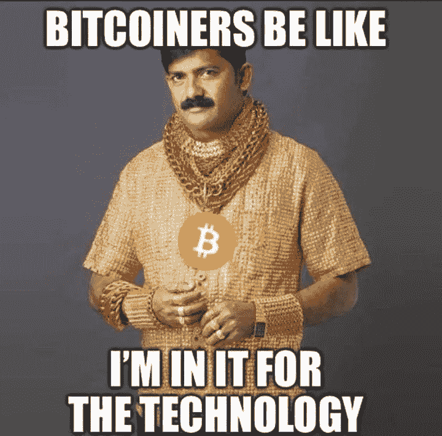
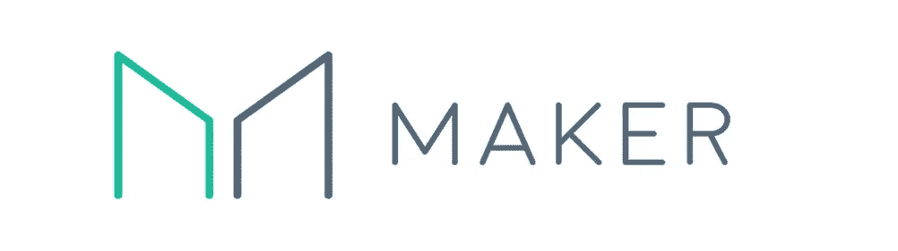
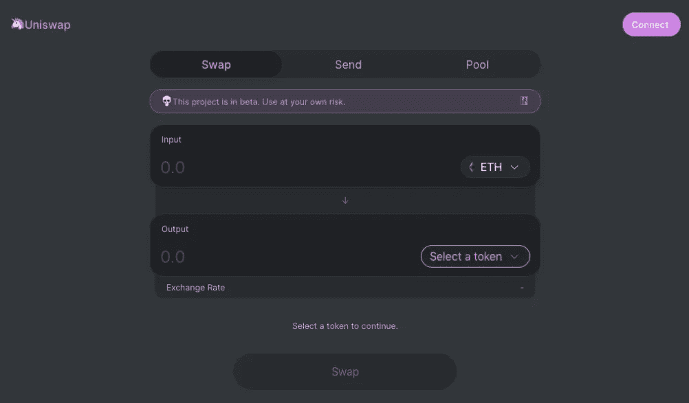
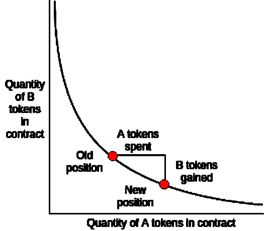

# 掉进了 DeFi 兔子洞

> 原文：<https://medium.com/coinmonks/down-the-defi-rabbit-hole-117357c15078?source=collection_archive---------0----------------------->

## 分散金融的奇妙世界

> “电子现金的纯点对点版本将允许在线支付直接从一方发送到另一方，而无需通过金融机构”

你可能会认为这是比特币白皮书摘要的第一行。加密货币的诞生是作为一种在同行之间交换价值的方式，但令人惊讶的是，今天比特币更强有力的故事讲述其实不是关于价值交换，而是关于价值的 T2 商店，数字黄金和法定货币。这种叙事的鼓舞人心的例子可以在 PlanB 的 [Stock-to-Flow](/@100trillionUSD/modeling-bitcoins-value-with-scarcity-91fa0fc03e25) 和 Saifedean Ammous 的“比特币标准”中找到。叙述方式的这种转变有几个原因——描述所有这些超出了本文的范围——其中一个原因依赖于加密领域的人们不急于花费加密，只是因为他们预计比特币或其他加密货币的价值从长远来看会增加。

我知道，你来这里是为了技术，改变世界和搞垮银行…但是假设密码空间的大多数参与者都是理想主义者，那就太天真了…

我猜你听说过这样一个故事:2009 年，一个人因为买了两个达美乐披萨而获得了 10.000 BTC……如果你预计某样东西会随着时间的推移而升值，那么花掉它而不是希望未来升值是非常不理智的。那么，当持有这种货币的人有巨大的动机不去花它的时候，这种形式的货币怎么能成功地作为价值交换呢？？你不需要了解格雷欣定律，就能明白劣币(在我们的例子中是法定货币)会赶走良币(比特币或其他加密货币)，对吗？

那又怎样？**我们是否应该放弃使用加密来交换价值的想法**，促进大规模采用，直到比特币的资本化程度如此之高，价格将稳定下来——如果这种情况真的会发生的话？

嗯……不一定，事实上我们有一种叫做**的东西。**最初是 2014 年推出的**系绳美元** … USDT，直到发行市场上最广泛的稳定币。基本上是美元，没有银行系统的麻烦。有了 USDT，我们可以在不依赖中介的情况下进行不受审查的交易和保值。但是**有一个条件**，这样一个稳定的硬币(连同其他硬币)依赖于法定美元的外部支持。理论是这样的:对于每一个有限制的美元，有限制的美元代币的发行者在他的银行账户中存储了一个法定美元。美元价值的稳定性依赖于对第三方的**信任……**

但是等一下，**加密货币不就是为了消灭可信第三方吗？Tether Dollar 是有用的，他的采用清楚地证明了这一点——在撰写本文时，这是第四大加密技术——但依赖可信的第三方并不是加密货币的初衷。**

**我们能否在不依赖可信第三方的情况下，打造一枚稳定的硬币**、**一种你不会后悔花钱的加密资产？** [制造者道](https://makerdao.com/en/)证明了答案是肯定的，我们可以建造算法稳定的硬币，而这仅仅是开始！

值得一提的是，制造商 Dao 并不是第一个成功尝试创造算法稳定硬币的人，2014 年的第一次尝试是来自 **Dan Larimer** 和 **BitUSD on BitShares** 。BitUSD 它是稳定的，它仍然在运行，但它从来没有达到制造商道的规模，今天有超过 9000 万美元的资本。

DAI 是基于 CDPs ，抵押债务头寸，每个人都可以通过锁定一个智能合约在 ETH 中的抵押头寸来创造新的 DAI，最小 peg 比率为 150%。该比率保证了即使汇率 ETH/USD 突然下降到 2/3，每个 DAI 都有足够的 ETH 支持。

例如，假设汇率 ETH/USD 为 100 美元，如果您想铸造价值 100 美元的 DAI (100 DAI ),您需要锁定 CDP 智能合约 1，5 ETH(价值 150 美元的 ETH)。现在你可以拿着你新铸造的代币——ERC 20 代币——去卖其他密码，用来购买商品和服务或者其他……如果你想释放你锁定的密码，你必须偿还 100 代币和一笔稳定费。这个过程将摧毁你用来结算头寸的平台，同时释放你的抵押品。

现在有趣的问题是，**为什么戴是有价值的和稳定的？不幸的是，答案并不简单…**

但让我们试一试:从很高的层面来看，**戴是有价值的，因为它有一个至少相当于其名义价值 150%的抵押品**作为后盾。超过 150%临界值的 CDP 会自动清算，从而实现这种最低挂钩。回到前面的例子，价值 150 美元的 ETH 创造 100 个 Dai，在 ETH 价值下降的情况下——这意味着以美元计算的锁定 ETH 价值低于 150 美元——因此挂钩比率低于 150 %, CDP 将立即被拍卖，拍卖人将以高于市场价格的折扣购买带有 Dai(将被销毁)的抵押品(ETH)。考虑到这种清算风险，CDP 所有者通常会过度抵押，目前 peg 比率超过 300%。

另一方面，DAI 在 1 美元的**稳定性取决于供需平衡**:如果 DAI 的市场价值高于 1 美元，CDP 创造者将受到激励，以创造更多 DAI 并在市场上出售这些 DAI，增加供应，从而压低价格。如果 DAI 的市场价值低于 1 美元，CDP 所有者将被激励在市场上购买 DAI，并销毁这些 DAI 以释放其抵押品。这将造成稀缺性，增加戴的价值。

最后还有**紧急关闭**，它被设计为直接向戴和 CDP 的持有人强制执行目标价的最后手段，用于保护制造商免受对其基础设施的攻击，如市场非理性、黑客攻击或安全漏洞。它允许 DAI 持有人用 1 美元的抵押品赎回他们的代币。触发过程目前由创客投票者选择的紧急神谕控制，并将由多抵押品 DAI 中的创客投票者(MKR 令牌持有者)直接控制

正如你可能已经猜到的那样，这个系统非常复杂，以至于很多人都认为戴既不会[稳定](https://blog.bitmex.com/a-brief-history-of-stablecoins-part-1/)也不会[扩展](/@hasufly/maker-dai-stable-but-not-scalable-3107ba730484)。但就像《大黄蜂》里那个本不该飞起来的故事一样，创客戴无视流体动力学，在稳定增长资本的同时保持稳定。

既然我们已经解决了不依赖于将法定货币存入某个可信任的第三方银行账户的稳定硬币的创造问题，那么我们在分散金融堆栈方面的下一步是什么？

**交易加密资产的时间价值**，允许参与者以分散的方式租赁、借用和卖空加密资产**，而不依赖于诸如交易所**的可信第三方。

正如 [Compound](https://compound.finance/) 创始人所言，**利率填补了那些拥有剩余资产却不使用的人和那些没有资产但有生产性投资或用例的人之间的空白**。交易资产的时间价值对双方都有利，创造了非零和财富。这就是 Compound、Oasis、ETHLand 和许多其他协议为加密社区的参与者提供的可能性。

**它是如何工作的？**我将以复利为例，因为目前管理更多价值的是贷款 Dapp。传统上，在货币市场中，贷款人需要发布、管理和监督具有规定利率和期限的贷款要约，等待借款人匹配他们的出价。这种框架会产生摩擦，要求行为者积极参与，使其出价和报价适应市场动态，锁定单个贷款人的资金，不能最大限度地提高市场流动性。

Compound in 实施的解决方案基于**资产池，其利率通过算法得出**，利率基于资产的供给和需求。

贷款人和借款人直接与协议进行交互，而无需相互协商诸如到期日、利率或抵押品等条款。

基本上**贷款人转移流动性池中的资产，并立即开始以当前利率(由系统通过算法确定)赚取复利**，而借款人必须锁定抵押品，并可以立即开始借入资产。

借款人必须将其抵押系数保持在临界水平以下——取决于资产的波动性——以避免清算。

**贷款人可以随意提取流动性**——假设资产池中的资产并非都是借来的——没有期限限制，而 **i** 利率由协议根据加权供求的数学公式自动调整，以最大限度地提高流动性。

当然，该协议不能提供流动性，但它依靠利率调整来激励流动性。如果对某项资产有很高的需求，高利率会刺激登陆出价，而高利率反过来会抑制借贷需求。

目前，戴的贷款年利率大约为 5%，该平台管理着 1.25 亿美元的加密资产，赚取利息。对于一个分散的协议来说还不错…

又一只大黄蜂在飞！

但是分散的交易所怎么办？ DEXes 出现已有几年，它允许用户以不可信的方式交换令牌，而不依赖可信的第三方持有他们的令牌和私钥。尽管在 DeFi 领域扮演着重要的角色，但是到目前为止，分散式交易所**有两个主要缺陷**阻碍了它的采用:**可用性和流动性。**即使你笨到使用这些工具，你也可能找不到足够的流动性来执行交易而不扰乱对你不利的价格。

但是这里来了 [**Uniswap**](https://uniswap.io/) ，有着如此直观的 UX 以至于**甚至你的奶奶也能执行交易** …

但这还不是全部… **平台最显著的方面**不是 UX，而是**它的流动性和产生方式**。你听说过做市商吗？金融行业中那些高度专业化的家伙，他们通过提供流动性来赚钱，填满交易所的两面？这里有一个消息，Uniswap 部署了一个分散平台，通过允许任何人从做市中赚取**来解决流动性问题。

与其他交易所不同，Uniswap 没有账簿，没有做市商，只有流动性提供者。任何人都可以通过向 Uniswap 交易所市场之一——智能合约——交付等值的 ETH 和 ERC-20 代币，向 Uniswap 提供流动性。作为回报，贡献者将获得交易所智能合约中的代币(“池代币”ERC-20)，他们可以随时使用这些代币提取自己的流动性份额。每次在平台上进行交易时，根据每个参与者在资金池中的份额，向每个参与者收取 0.3%的费用。资金池的参与者可以随时提取他们的资产+应计费用，但他们将获得的资产组合取决于市场的走向..

这种系统的想法最初是受到 Vitalik 的一些帖子的启发，基本上资产的**汇率不是由一个外链 oracle 的价格馈送决定的，而是由池中两个交换资产的比例决定的。**描述这个做市系统的公式很简单: [**X * Y = K**](https://github.com/runtimeverification/verified-smart-contracts/blob/uniswap/uniswap/x-y-k.pdf) 其中 X 和 Y 是两个交换资产的数量，K 是常数。这样一个公式描述了价格变动的曲线。

参考上图，假设代币 A 是 DAI，代币 B 是 ETH，如果有人花 DAI 购买 ETH，他将增加池中 DAI 的数量，减少 ETH 的数量。结果将是戴的 ETH 价格下降，因为我们在曲线上向下移动。最后，两种资产之间的汇率将自动与市场汇率保持一致，因为套利者将迅速利用与其他交易所的任何价差。

* *看起来很酷，但它对流动性提供者也有利可图吗？嗯，视情况而定……简短的答案是:在**长期来看是**，而在**短期来看** **取决于**市场的移动速度，更好、更长的答案你可以在[这里](/@pintail/uniswap-a-good-deal-for-liquidity-providers-104c0b6816f2)和[这里](https://www.tokendaily.co/blog/pnl-analysis-of-uniswap-market-making)找到。

我想这足以作为 DeFi 空间的第一次潜水，但这并不意味着我们在兔子洞的底部，下面还有更多:智能合约失败的分散保险，如 [Nexus Mutual](https://www.nexusmutual.io/) ，杠杆交易所，如 [DyDx](https://dydx.exchange/) ，合成资产交易平台，如 [Synthetix](https://www.synthetix.io/) 或 blasfemy……[WBTC](https://www.wbtc.network/)以太坊网络上的比特币……这还不是全部！

所以请保持关注，快速移动并打破东西！

> [直接在您的收件箱中获得最佳软件交易](https://coincodecap.com/?utm_source=coinmonks)

