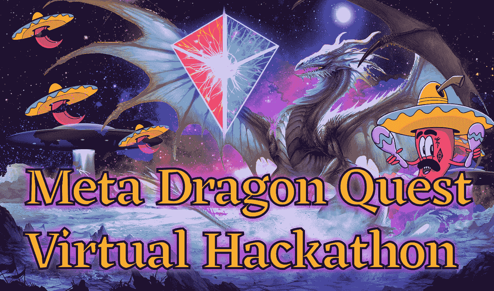
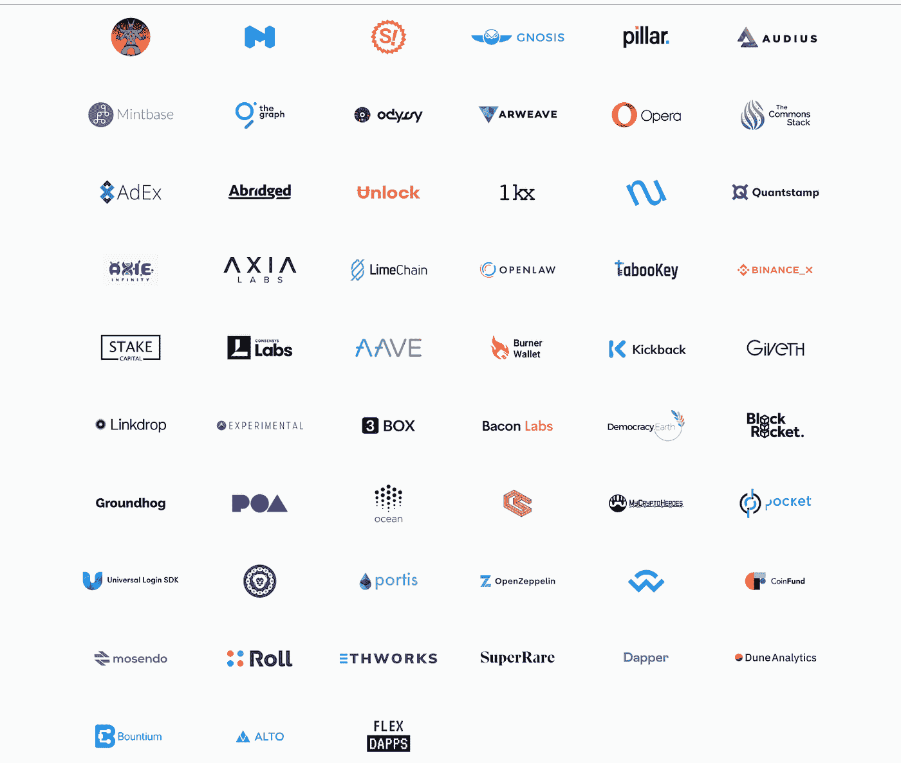

# “龙之旅”虚拟黑客马拉松

> 原文：<https://medium.com/coinmonks/dragon-quest-virtual-hackathon-aa413216ad24?source=collection_archive---------2----------------------->

## 由 MetaCartel 供电的大型集市

你们一直在等待的，超越其他一切的任务终于要结束了。当我们得知 ETHParis 被取消后，我们决定举办虚拟黑客马拉松来缓解痛苦。从 4 月 1 日开始——*这可不是开玩笑的*——我们邀请您到[参加为期 30 天的分布式开发功夫🐉](https://hackathon.metacartel.org/)

MetaCartel 是一个全球社区，以远程优先为重点。

**我们相信最好的团队和建造者来自任何地方，因此虚拟黑客马拉松是欢迎来自任何地方的人们合作、一起学习和建造酷东西的完美方式。**

世界上一个普遍的误解是,“黑客”特指编码或软件开发。这根本不是真的！为了证明这一点，我们邀请所有黑客加入我们的探索！无论你是设计师、营销人员、插画师还是拥有其他技能的人，**我们都需要你！**黑客马拉松奖金包括非技术性的黑客活动，所以戴上你的创意帽子，加入我们的创意、奖励和改变世界的旅程吧！

**我们不只是在寻找黑客，**我们在寻找艺术家、作家、哲学家、博客作者、游戏玩家、设计师、游戏设计师等等。如果你有想法，并想与一个由受启发的个人组成的社区合作，我们希望你加入进来。

这次黑客马拉松的重点是通过一个完全虚拟的评委、赞助商和黑客小组提供卓越的体验。MetaCartel 正在推动 Web3 的采用，并支持建造者社区，使以太坊生态系统成为一个令人惊叹的工作场所。我们相信虚拟活动更具包容性和可持续性，并为参与者创造了一种更简单的参与方式，因此 MetaCartel 生态系统很荣幸能够赞助此活动。

哦，还有奖品，当然，会有很多奖品，比如来自赞助商的创意奖金，例如:**“创造最新颖的 XYZ，可能利用 ABC 项目。”**总冠军(第 1-5 名)都将因被特级大师选中而获得战利品。评判时需要考虑的一些因素包括 UX、独特性/创造性、影响/有用性、用户验证、产品/市场适合度等等。我们目前正在审核来自赞助商的大量奖金，并在此接受更多的。

**龙之旅**黑客马拉松的目标是揭开传统黑客马拉松框架的盖子，鼓励最大限度的合作，最大限度地交流思想，更重要的是**在做这件事的时候获得最大的乐趣。**

我们希望看到你的功夫技巧，不仅仅是忍者开发者，我们还希望看到空手道撰稿人、折纸艺术家和插花社区组织者。需要各种各样的人来构建健壮的系统，这些系统在形式和功能上既优雅又平衡。我们热爱建设者和有用的工具，但人永远是第一位的，社区是掌中的**五** **点掌爆心术**。

探索今天的奖金，找到一个团队，或通过进入[不和谐](https://discord.gg/zwVYwsh) 现在**来分享您的想法。**

 [## 🐲龙之任务🐲MetaCartel 的虚拟黑客马拉松🌶|只是另一个 WordPress 网站

### 我们相信最好的团队和建设者来自任何地方，因此虚拟黑客马拉松是完美的…

hackathon.metacartel.org](https://hackathon.metacartel.org/) 

## TL:DR **🐲🐲🐲** [进入龙](https://hackathon.metacartel.org/) **🐲🐲🐲**

> [直接在您的收件箱中获得最佳软件交易](https://coincodecap.com/?utm_source=coinmonks)

