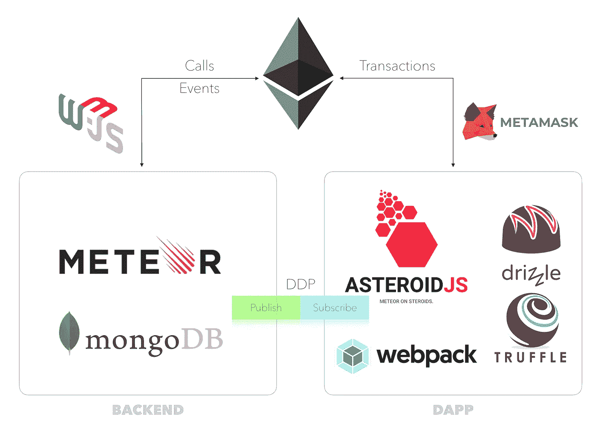
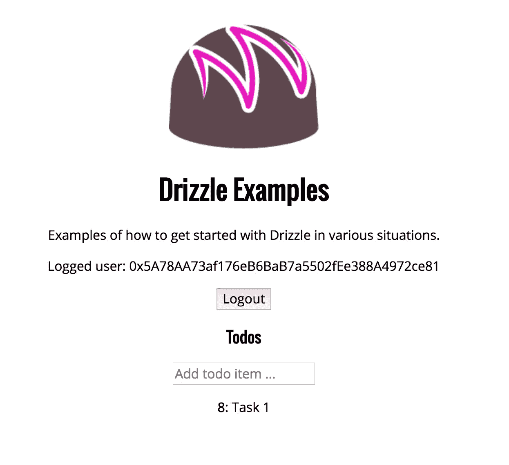

# 毛毛雨 DAPP 与流星后端

> 原文：<https://medium.com/coinmonks/drizzle-dapp-with-meteor-backend-b16ff0a8dd11?source=collection_archive---------7----------------------->

对于一些区块链项目，我们需要使用应用服务器以旧的方式存储信息。它可以是一个私人客户信息，也可以是一个 BLOB，由于燃气成本，我们无法将它存储在以太坊中。在这种情况下，我们可以使用分布式数据协议(DDP ),它解决了所有开发人员都面临的许多问题:查询服务器端数据库，将结果发送到客户端，然后每当数据库发生任何变化时，就将变化推送到客户端。

在本文中，我们将展示如何在 Truffle/毛毛雨分布式应用程序中使用支持 DDP 的 Meteor 后端。



Truffle/Drizzle/Meteor Application Map

先从 DAPP 这边说起吧。只需打开[毛毛雨盒](https://truffleframework.com/boxes/drizzle)，我们就可以在几个步骤中运行 DAPP。现在我们需要向我们的毛毛雨/松露应用程序添加一个支持 DDP 协议的库。在我们的例子中，我们使用了 [Asteroid](https://github.com/mondora/asteroid) ，这是一个同构/通用的 javascript 库，它允许从几乎任何 JS 环境连接到 Meteor 后端。为了监听我们的服务器，我们需要提供一个端点并创建新的小行星对象。

```
const Asteroid = createClass();// Connect to a Meteor backend
const asteroid = new Asteroid({
  endpoint: 'ws://localhost:9000/websocket',
});
```

然后我们可以使用 *asteroid.subscribe* 功能订阅我们的收藏。

由于我们的 DAPP 已经在使用一个 Redux 商店，我们可以用它来记录状态变化，并在需要时更新用户界面。例如，如果一个新的记录被添加到我们的服务器集合中，我们将分派一个新的操作来保存这些更改。

```
asteroid.ddp.on('added', (doc) => {
  if (doc.collection === 'tasks') {
    const docObj = Object.assign({}, doc.fields, { _id: doc.id });
    store.dispatch(addTodo(docObj));
  }
  if (doc.collection === 'users') {
    store.dispatch(setLoggedUser(doc.fields));
  }
});
```

为了遵循 Redux store 规则，我们还需要为我们的分布式集合创建一个 [Reducer](https://redux.js.org/basics/reducers) 。

```
const todos = (state = [], action) => {
  switch (action.type) {
    case ADD_TODO:
      return add(state, action);
    case REMOVE_TODO:
      return remove(state, action);
    case EDIT_TODO:
      return edit(state, action);
    case GET_ALL_TODO:
      return action.data;
    default:
      return state;
  }
};
```

然后将其添加到我们的毛毛雨框中定义的组合减速器中。

```
const reducer = combineReducers({
  routing: routerReducer,
  todos,
  user,
  ...drizzleReducers
})
export default reducer
```

在我们的例子中，我们有 *HomeContainer* ，它包装了我们的 *Home* 组件，并提供了组件 *props 的状态转换。*现在我们需要将分布式集合添加到映射中，以便在 React 中访问我们的服务器数据。

```
const mapStateToProps = state => {
  return {
    accounts: state.accounts,
    SimpleStorage: state.contracts.SimpleStorage,
    TutorialToken: state.contracts.TutorialToken,
    drizzleStatus: state.drizzleStatus,
    todos: state.todos,
    user: state.user,
  }
}const mapDispatchToProps = dispatch => ({
  dispatchCallAddTodo: data => dispatch(callAddTodo(data)),
});Home.contextTypes = {
  drizzle: PropTypes.object
}const HomeContainer = drizzleConnect(Home, mapStateToProps, mapDispatchToProps);
```

请注意，我们还添加了 *mapDispatchToProps* 来为 *Home* 组件提供向集合添加数据的能力。然后使用*trissleconnect 将两个映射连接到 React 组件。*

所以，现在我们准备更新 *Home* 组件，并添加一个逻辑来显示我们的服务器数据。

```
<h3>Todos</h3>
<div>
  <input
    type="text"
    placeholder="Add todo item ..."
    onKeyPress={this.handleAddTodo}
  />
</div>
<ul>
  {this.props.todos.map((t, i) =>
    <li key={i}>
      <span className="text">
        <strong>{t.data !== undefined ? t.data :'n/a'}</strong>:      
        {t.text}
      </span>
    </li>
  )}
</ul>
```



请注意，由于 DDP，我们可以作为*props*parameter*访问 React 组件中的服务器集合，如果服务器集合被更新，那么我们的 React 组件将被重新呈现以向用户提供刷新的数据。*

*我们已经使用 Asteroid javascript libraly 将毛毛雨/松露 DAPP 与流星后端连接起来，但这只是我们需要解决的一个任务。我们的下一个目标是根据智能合同状态更新 DAPP 订阅。为此，我们将使用“开箱即用”的毛毛雨*简单存储*智能联系。*

```
*pragma solidity ^0.4.18;contract SimpleStorage { event StorageSet( string _message ); uint public storedData; function set(uint x) public { 
    storedData = x;
    StorageSet("Data stored successfully!");
  }
}*
```

*现在让我们看看我们的后端，并在那里集成智能合同逻辑。多亏了 Truffle 框架，我们可以使用我们已经在 DAPP 中使用的相同的人工制品。需要说明的是，后端也有在 Meteor/React 控制下运行的客户端部分。我们不打算在服务器端进行事务处理，我们将在这里使用没有任何密钥存储的 *web3* 库。后端客户端部分可以使用带有元掩码的 Truffle 库。为了更新 React 组件，我们使用 *withTracker* 函数和with *Tracker。依赖关系*对象*。*在智能契约包装类中，我们有简单的 getters 和 setters，它们具有 *depend* 和 *changed* 函数。*

```
*const contractDep = new Tracker.Dependency;class SimpleStorage {
  //...
  getData() {
    contractDep.depend();
    return this.data;
  } _setData(data) {
    if(this.data !== data) {
      this.data = data;
      contractDep.changed();
    }
  }
  // ...
}*
```

*现在在*带跟踪器*的循环中，如果合同数据改变，那么组件*道具*将被更新，然后 React 组件将被重新渲染。*

```
*class App extends Component {
  // ...
  export default withTracker(() => {
    const update = simpleStorage.getData();
    Meteor.subscribe('tasks'); return {
      tasks: Tasks.find({}, { sort: { createdAt: -1 } }).fetch(),
      incompleteCount: Tasks.find({ 
          checked: { $ne: true } }).count(),
      currentUser: Meteor.user(),
      currentData: simpleStorage.getData(),
    };
})(App);*
```

*现在，我们将更新后端服务器部分，并根据智能合同的当前状态进行发布。在服务器上，我们使用 *web3* 库来监听*简单存储*事件。*

```
*let listener = null;function setListener(cb) {
  listener = cb;
}if (Meteor.isServer) {
  if (typeof web3 !== 'undefined') {
    web3 = new Web3(web3.currentProvider);
  } else {
    web3 = new Web3(new
    Web3.providers.WebsocketProvider("ws://localhost:8545"));
  }
  const sc = new web3.eth.Contract(SimpleStorageArtifact.abi);
  sc.options.address = SimpleStorageArtifact.networks[5777].address; sc.events.StorageSet({fromBlock:0}, 
    (error, event) => { if(error)console.error(event) })
     .on('data', function(event) {
       sc.methods.storedData().call().then(result => {
         if(listener) {
           listener(result)
         });
   })
}
export default setListener*
```

*现在我们可以调整集合的发布*

```
*let collectionFilterfunction setFilter(filter) {
  if(filter === undefined) return;
  collectionFilter = filter;
}
setListener(setFilter)if (Meteor.isServer) {
  Meteor.publish('tasks', function tasksPublication(data) {
    return Tasks.find({
      $or: [
        { private: { $ne: true } },
        { data: collectionFilter },
      ],
    });
  });
}*
```

*所以我们只发布数据等于到*集合过滤器*的项目，即*简单存储*数据。这里的问题是 *Meteor.publish* 不重新发布集合，如果 *collectionFilter* 改变的话。只有客户端可以推送服务器发布并使*任务. find* 重新运行以提供新数据。由于跟踪流星重新运行订阅和推重新发布，如果订阅参数被改变。因此，我们可以通过以下方式更新后端客户端订阅以获得重新发布的作品:*

```
*export default withTracker(() => { const update = simpleStorage.getData();
  Meteor.subscribe('tasks', 
    update !== undefined ? update.toString(10) : 'loading');
  // ..}*
```

*现在，我们需要回到我们的 DAPP，使订阅工作也在这里。首先，如果商店状态由于智能合约事务而改变，我们将获得更新，然后如果我们有新的状态，则取消订阅集合，并使用更新的 *SimpleStorage* 数据值再次订阅。*

```
*function _select(state) {
  return state.contracts.SimpleStorage.storedData['0x0'] !==   undefined ? state.contracts.SimpleStorage.storedData['0x0'].value : undefined;
}
let currentValue = 0;
let subscription = asteroid.subscribe('tasks', currentValue);function _refresh() {
  let previousValue = currentValue
  currentValue = _select(store.getState())
  if (previousValue !== currentValue) {
    asteroid.unsubscribe(subscription.id);
    subscription = asteroid.subscribe('tasks', currentValue);
  }
}
store.subscribe(_refresh);*
```

*现在，我们的 DAPP 使用 *SimpleStorage* 作为一个键，为客户端“打开”离线数据。我们的后端部分正在监听区块链事件，一旦有新的事务到达，就向客户端开放对新内容的访问。当客户端使用 Asteroid *更新订阅/subscribe* 时，新的内容将在 React 界面中可用。*

*我们的 [GitHub 库](https://github.com/REGA-RS/meteor-drizzle)中的完整代码*