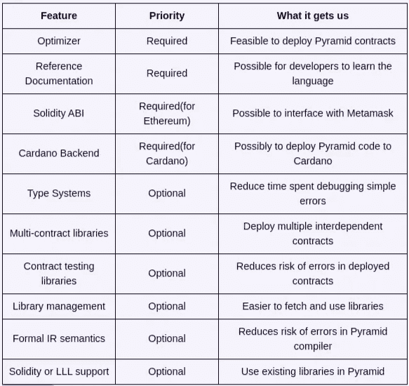
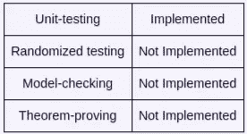

# 以太坊合约的 DSL

> 原文：<https://medium.com/coinmonks/dsls-for-ethereum-contracts-380136177abd?source=collection_archive---------13----------------------->

## [Pyramid](/coinmonks/write-your-next-ethereum-contract-in-pyramid-scheme-6b6e4deadf2f) 是一种使用面向语言编程编写智能合同的语言。人们可以开发新的编程语言，与其他所有语言进行互操作。


[Source](https://twitter.com/PyramidLang)

> **署名** —这是[迈克尔·伯格的](https://twitter.com/TheMichaelBurge)博客文章[以太坊合约的 DSLs】的转载作品](https://www.michaelburge.us/2018/05/15/ethereum-chess-engine.html)

[**使用 Coinmonks 作业门户**](https://coinmonks.com/) 查找加密作业

[***加入 Coinmonks 投稿人电报组。***](/coinmonks/coinnmonks-crypto-writers-telegram-group-f56b4621af0a)

[***捐造僧侣***](/coinmonks/monks-need-your-help-7440418d67ec)

一个好的智能合同语言是一个 10 亿美元的问题。

为什么？看看最近一些黑客攻击中损失的金额:

*   [平价——3 亿美元](/chain-cloud-company-blog/parity-multisig-hack-again-b46771eaa838)
*   [道——5 千万美元](https://www.coindesk.com/understanding-dao-hack-journalists/)
*   100 万美元

作为回应，人们如何改变他们的开发过程？

以太坊倾向于一般用途的 [SMT 解算器](https://github.com/Z3Prover/z3)，部分设计的[定理证明器](https://coq.inria.fr/)。 [Cardano](https://www.cardano.org/en/home/) 的目标是更多的前期设计，严重依赖于[基于类型的工具](https://www.haskell.org/)和 [K 框架](http://www.kframework.org/index.php/Main_Page)。

在本文中，我提出了面向语言的编程作为替代。专家为建模、令牌或原子跨链交换创建专门的语言。合同开发人员用它们来描述合同的相关部分。

专家知道撰写安全合同的规则。然而，这些规则并没有得到始终如一的遵守。合同开发人员不是专家，即使是专家也可能在审查大量代码时出错。

专用语言始终如一地应用安全规则，并减少了需要审查的代码量。

[Pyramid](/coinmonks/write-your-next-ethereum-contract-in-pyramid-scheme-6b6e4deadf2f) 是一种使用面向语言编程编写智能合同的语言。人们可以开发新的编程语言，与其他所有语言进行互操作。

作为技术演示，我开发了一个 C 编译器，并移植了一个 [C 象棋引擎](https://www.michaelburge.us/2017/09/10/injecting-shellcode-to-speed-up-amazon-redshift.html)来运行在以太坊的虚拟机(EVM)上。合同开发人员并不期望使用 C，但它是一种几乎所有程序员都知道的简单实用的语言。

最后，我给对使用这种语言感兴趣的人一个关于金字塔的状态更新。

# 金字塔建模语言

有了智能合约，“代码就是法律”。但是谁能读懂并信任 1000 行微妙的代码呢？

首先，通常不清楚合同“正确”的含义。人们是在丢了钱之后才知道有问题，而不是之前。

我提出了一种描述安全属性的语言，其中每个需求都适合一条 tweet。我将这种语言应用于以太坊的 ERC-20 令牌标准。

代币是可交易的虚拟货币。举例来说，有许多游戏玩家或以太坊矿工拥有显卡，他们可以将显卡租给人工智能研究人员:一个令牌可以换取 GPU 时间。

以太坊或卡尔达诺有他们自己的基础货币**以太**和**阿达**，所以你可能会奇怪为什么人们发行新货币而不是兑换基础货币。有三个常见的原因:

*   扩散:人们想要投资一个想法，而不是个人行为。先锋指数基金允许你投资于“美国经济”，而无需审查公司的商业计划，而代币允许你投资于“GPU 市场”，而无需租赁数据中心的空间和采购显卡。
*   **承诺**:由于代币只能用于特定目的，投资者作为一个整体只能通过创造真正的生产性需求来退出。这使得这个想法更有可能成功。
*   **限制**:一些代币需要额外的交易限制。例如:允许用户用信用卡或银行转账购买代币，或者检查用户是否是合格的投资者。

因为扩散、承诺和限制都适用于我们假设的 GPU 市场，所以一个新的令牌将是有用的。为了能在交易所交易，它实现了 ERC-20 接口:

```
contract ERC20Interface {
    **function** totalSupply() **public** constant returns (uint);
    **function** balanceOf(address tokenOwner) **public** constant returns (uint balance);
    **function** allowance(address tokenOwner, address spender) **public** constant returns (uint remaining);
    **function** transfer(address to, uint tokens) **public** returns (bool success);
    **function** approve(address spender, uint tokens) **public** returns (bool success);
    **function** transferFrom(address **from**, address to, uint tokens) **public** returns (bool success);
    event Transfer(address indexed **from**, address indexed to, uint tokens);
    event Approval(address indexed tokenOwner, address indexed spender, uint tokens);
}
```

坚固性准确地描述了这些方法的数据流。但是这并没有告诉你这些方法是做什么的。为此，我们需要法律。

我将使用假想的**金字塔建模语言** (PML)来描述实现该接口的契约所具有的属性。这里有一个:

# 1.地址持有令牌

`@totalSupply **=** sum(@balanceOf $address, $address)`

该定律规定，如果你将每个用户持有的所有令牌相加，你将得到`totalSupply()`。

并不是每个 ERC-20 合同都满足这条定律:如果在你购买后可以出售之前有两周的“持有期”，开发商可能会在`totalSupply`中包括未授予的令牌，但只在用户的`balanceOf`中计算已授予的令牌。

但是，如果您的特定合同是真的，您可以只用一行声明，您的合同不能通过将令牌隐藏在用户余额之外的东西中来铸造或销毁令牌。

PML **公式**有 3 类自由变量:

*   `@`符号表示该标识符引用了一个契约方法。
*   一个`$`符号可以用任何**值**替换，生成一个新的公式。
*   未标记的变量代表建模语言中的术语。

没有`$`符号的公式被称为**表达式**。一些表达式——比如涉及`=`操作符的表达式——是**命题**。定律是一个公式，经过`$`-替换后，它被简化为命题。

`sum`特殊形式将`$address`的所有可能值代入公式`@balanceOf $address`并对结果求和。

这是另一条定律:

# 2.转移不会改变总供给

```
@totalSupply **=** @transfer $_ $_
               @totalSupply
```

契约的初始状态是任意的。`=`从这个初始状态“分叉宇宙”，并在每个状态中比较两个不同的动作。

在左边，我们调用契约的`totalSupply`方法。在右边，我们首先用任意两个参数调用`transfer`，然后调用`totalSupply`。`=`要求`totalSupply`返回的值相同。

一系列表达式计算出最后一个表达式。定律必须适用于所有可能的初始状态和对`$`变量的赋值。

并不是每一个 ERC-20 都满足这个属性:有些代币会对代币中的每一笔交易“征税”。然而，大多数是这样的，重要的是要知道这两条线是否适用于您最喜欢的令牌。

这个属性还有更强的版本:

# 3.初始化后，总供应量不变

```
@initialize _
$result **=** @totalSupply
_
$result **=** @totalSupply
```

`initialize`方法不是 ERC-20 标准的一部分，但一些合同无论如何都会有。该法律接着规定“在契约被初始化之后，没有可能改变令牌的`totalSupply`”。`_`代表“任何方法调用序列”。

因为`totalSupply`是无符号的，所以它满足`@totalSupply >= 0`。这使得属性#3 排除了产生大量令牌的整数溢出错误。PoWHCoin hack 就是一个例子。

每个`=`对`totalSupply`进行约束。如果电源发生变化，不可能给出两个不同的值，因此两个约束中的一个会被违反。

性质 1、2 和 3 是普遍性质:它们适用于所有可能的情况。有些法律在成立之前是有条件的。我们可以用`if`来限制它们:

# 4.委托转移不会改变总供给

```
@totalSupply **=** **if** @allowance $owner $spender **>=** $amount
                  { @transferFrom $owner $_ $amount ; @totalSupply }
                  @totalSupply
```

委托转移允许用户授予其他用户或合同使用其代币的权限。拥有数千个代币的加密货币交易所可能需要这种许可才能进行交易。

这个规律主要检查`transferFrom`没有抛出异常，因为`=`的左边没有抛出异常。

`if`表达式的第一行是**条件**。其他线路为**顺向**和**替代**。

`{ X ; Y }`是顺序执行两条语句的不区分缩进的语法。

属性 4 不是很有用，因为它不精确。我主要用它来介绍语法。下面是`transfer`更精确的规格:

# 5.如果转账改变了用户的余额，他们发送或接收。

```
$balance **=** @balanceOf $addr
@{$from}transfer $to $amount
$newBalance **=** @balanceOf $addr
**if** $newBalance **=** $balance
   _
   ($addr **=** $from **&** $balance**-**$newbalance **=** $amount) **|**
   ($addr **=** $to   **&** $newBalance**-**$balance **=** $amount)
```

这里有两个附加的语法:

1.  `@{$from}transfer`语法将`$from`约束到调用`transfer`的地址。
2.  `&`和`|`运算符组合了多个命题。

# 使用 PML

这种建模语言只用几行字就能表达很多东西。但是你能用规范做什么呢？

*   **沟通**:安全审计员和代币投资者可以使用这种语言来谈论合同，而无需改变开发过程。无需编写额外的代码。
*   **测试生成**:用随机或开发者选择的值替换`$`变量，并测试属性是否成立。在生成地址和加密哈希时必须小心。
*   **模型检查**:规格可以发送给 Z3 这样的模型检查器。如果契约本身也可以转换成 Z3，那么就有可能正式证明契约的安全性。

自定义语言可以比实现更有效地传达意图，并允许专用工具检查意图。

Pyramid 的目标是让专家创建像这种建模语言一样的专用语言。DSL 可以是规范、可执行代码或测试框架。

在下一节中，我将展示我如何创建一种新语言的具体细节。

# c 编译器

金字塔建立在[球拍](http://racket-lang.org/)上。因为 Racket 专注于语言开发，所以有用于实现[类型系统](https://docs.racket-lang.org/turnstile/index.html)、[语义工程](https://docs.racket-lang.org/redex/)、[解析](http://docs.racket-lang.org/brag/)和[程序合成和验证](https://emina.github.io/rosette/)的库。

使用金字塔作为代码生成器，任何人都可以创建高级智能合同语言。

Pyramid 的旗舰语言是 Scheme 方言，但是在这一节中，我创建了一个 C 编译器，它可以编译我在[上一篇文章](https://www.michaelburge.us/2017/09/10/injecting-shellcode-to-speed-up-amazon-redshift.html)中写的[象棋引擎](https://github.com/MichaelBurge/ceagle/blob/master/test-support/chess-engine.c)。引擎成功计算出一盘棋`[perft](https://chessprogramming.wikispaces.com/Perft+Results?responseToken=0b5319559f293333b682ffb8f4b744c78)`。

我的实现基于 Matthew Butterick 的 [Beautiful 球拍](https://beautifulracket.com/)，因此感兴趣的读者可以使用他写得很好的书作为指南。Matthew 是一名律师和网页设计师，他使用面向语言的编程出版了像[实用排版](http://practicaltypography.com/)和[律师排版](http://typographyforlawyers.com/)这样的书籍。

# 概观

自定义语言从第一行开始:

```
**#lang ceagle** 
**typedef** **unsigned** __bits 64 **uint64_t**;
**typedef** **unsigned** **int** bool;

...
```

每种基于金字塔的语言都有一条`#lang`线。`ceagle`是球拍[集合](https://docs.racket-lang.org/reference/collects.html)的名称，描述了如何阅读和解释文件的其余部分。

只有第一行有预定义的语法，其他的都可以完全定制。

C 编译器有以下几个编译阶段:

```
 **Stage**          |                        **Output**[Lexer](https://github.com/MichaelBurge/ceagle/blob/master/lexer.rkt)                    |          Token sequence/[type information](https://en.wikipedia.org/wiki/The_lexer_hack)[Parser](https://github.com/MichaelBurge/ceagle/blob/master/parser.rkt)                   |            Parse Tree[Expander](https://github.com/MichaelBurge/ceagle/blob/master/expander.rkt)                 |            Syntax Tree[Simplifier](https://github.com/MichaelBurge/ceagle/blob/master/simplifier.rkt)               |            Syntax Tree[Compiler](https://github.com/MichaelBurge/ceagle/blob/master/compiler.rkt)                 |            Pyramid Syntax Tree[Macros](https://github.com/MichaelBurge/ceagle/blob/master/builtins.pmd)                   |            Pyramid Syntax
```

解析器使用 [brag](http://docs.racket-lang.org/brag/) DSL 来定义 [BNF](https://en.wikipedia.org/wiki/Backus%E2%80%93Naur_form) 语法。

有趣的工作发生在`Compiler`和`Macros`模块中。

自定义金字塔语言的扩展器将源代码的语法转换成一个**翻译单元**——一个包含依赖关系、特定于语言的解析树和特定于语言的 AST 等元数据的方案包。

```
(**struct** translation-unit ([ language        : Symbol            ]
                          [ source-code     : Sexp              ]
                          [ abstract-syntax : Any               ]
                          [ pyramid-ast     : Pyramid           ]
                          [ dependencies    : translation-units ]
                          ))
```

金字塔和 Ceagle 是在[类型球拍](https://docs.racket-lang.org/ts-guide/)中实现的，所以上面的`struct`包含了类型注释。

翻译单元按`dependencies`进行拓扑排序。翻译单元导出每个定义。

定制语言有两个组件:阅读器和扩展器。Ceagle 的阅读器运行词法分析器和语法分析器阶段来创建一个[语法对象](https://docs.racket-lang.org/guide/stx-obj.html)；而扩展器是一个宏，它在这个语法上运行扩展器、简化器和编译器阶段，以形成一个翻译单元。

自定义语言导出一个`make-translation-unit`函数。`execute?`参数让它们以不同的方式处理入口点模块:Ceagle 在最后调用`main`函数。

```
*; Ceagle's Expander*
(**define-syntax** (**c-module-begin** stx)
  (**syntax-case** stx ()
    [(**_** parse-tree) *; Starting with the parse tree as input...*
     **#`**(**#**%module-begin *; Declare a new module...*
        **#,@**(**require-stxs** **#**'parse-tree) *; ... that depends on other modules*
        (**provide** make-translation-unit) *; ... and which exports this function*

        (**define** (**make-translation-unit** execute?)
          (**define** abstract-syntax (**expand-translation-unit** parse-tree))
          (**define** compiled (**compile-translation-unit** abstract-syntax execute?))
          (**translation-unit** 'ceagle
                            (**quote** parse-tree)
                            abstract-syntax
                            compiled
                            dependencies *; Created from require-stxs*
                            )))]))
```

`expand-translation-unit`和`compile-translation-unit`是指一个 [C 平移单元](https://en.wikipedia.org/wiki/Translation_unit_(programming))，不是金字塔`translation-unit`。

C 的`#include`只适用于 C 源代码，但是 Ceagle 有一个非标准的`#require`，允许它导入任何基于金字塔的语言，并保证它们只被编译一次。这些是通过上面的`require-stxs`从解析树中提取的。

大部分有趣的作品都在`compile-translation-unit`里。上面提到的《漂亮的球拍》一书更详细地涵盖了之前的所有内容。

为了编译一个翻译单元，我将提供编译所有 4 类抽象语法的规则:

*   声明
*   声明
*   公式
*   类型

类型模块定义了 Ceagle 中使用的所有类型，我在下面复制了重要的类型。

# 声明

C 翻译单元由顶级声明:`typedef`、全局变量和函数定义组成。entrypoint 模块应该另外定义一个名为`main`的函数。

以下是这些的定义:

```
*; Top-level declarations*
(**struct** c-unit      ([ decls : c-declarations        ]))
(**struct** c-decl-type ([ name  : Symbol                ]
                     [ type  : c-type                ]))
(**struct** c-decl-var  ([ name  : Symbol                ]
                     [ type  : c-type                ]
                     [ init  : (**Option** c-expression) ]))
(**struct** c-decl-func ([ name  : Symbol                ]
                     [ sig   : c-signature           ]
                     [ body  : c-statement           ]))
(**define-type** c-declaration  (**U** c-decl-var c-decl-type c-decl-func))
(**define-type** c-declarations (**Listof** c-declaration))
```

为了减少括号的数量，我喜欢定义我的单数类型`c-declaration`的复数版本`c-declarations`。在本文中，我将只明确定义单数版本。

## 键入别名

通过记住表中的`name`和`type`关联来实现`typedef`，以供翻译单元的其余部分使用。因为它也必须返回金字塔语法，所以它返回一个空的`begin`形式:

```
(**:** compile-decl-type (**->** c-decl-type Pyramid))
(**define** (**compile-decl-type** x)
  (**destruct** c-decl-type x)
  (**register-type!** x-name x-type #f)
  (**pyr-begin** (list)))
```

`destruct`宏为`struct`中的每个字段定义一个变量。所以`x-name`指的是`(c-decl-type-name x)`。

有关如何进行类型检查的更多详细信息，请参见`Types`部分。

## 变量声明

`c-decl-var`是一个变量声明`int x = 5;`。有两个部分:

1.  记住`x`的类型是表格中的`int`
2.  将声明编译成形式`(define x initializer)`，其中`initializer`或者是给定的表达式，或者是取决于类型的默认值。

从概念上讲，变量都是指向`sizeof(type)`字节的指针。然而，值没有同一性，所以每种类型都有一个`variable-definer`宏，它为一个值分配一个新的内存位置。

```
(**:** compile-decl-var (**->** c-decl-var Pyramid))
(**define** (**compile-decl-var** x)
  (**destruct** c-decl-var x)
  (**register-variable!** x-name x-type)
  (**make-macro-application** **#`**(**#,**(**variable-definer** x-type)
                             **#,**x-name
                             **#,**(**shrink-pyramid**
                                (**if** x-init
                                    (**compile-expression** x-init 'rvalue)
                                    (**compile-default-initializer** x-type))))))

(**:** variable-definer (**->** c-type PyramidQ))
(**define** (**variable-definer** ty)
  *; Handles typedefs*
  (**define** real-type (**resolve-type** ty))
  (**match** real-type
    [(**struct** c-type-fixed   _) **#**'%c-define-fixnum ]
    [(**struct** c-type-struct  _) **#**'%c-define-struct ]
    [(**struct** c-type-pointer _) **#**'%c-define-pointer]
    [(**struct** c-type-union   _) **#**'%c-define-union  ]
    ))
```

宏期望并返回语法，因此`shrink-pyramid`函数反转编译器的扩展阶段，将 AST 转换回语法。

对于`int x = 5`的情况，编译器发出一个`%c-define-fixnum`宏的使用。这是用金字塔写的，看起来很像一个普通的球拍宏:

```
(**define-syntax** (**%c-define-fixnum** stx)
  (**syntax-case** stx ()
    [(**_** name init) **#'**(**begin** (**define** name (**let** ([ ptr (**%c-allocate-fixnum**) ])
                                           (**%c-word-write!** ptr init)
                                           ptr))
                            (**%c-noinline** name))]
    ))

*; %#-mem-alloc is a Pyramid Standard Library primitive*
(**defmacro** (**%c-allocate-fixnum**)
  **`**(**%#**-mem-alloc %**#**-WORD))
```

`%c-noinline`扩展为`(set! name name)`并阻止金字塔优化器尝试内联变量:这在编译器的未来版本中是不必要的。

## 函数声明

一个函数声明看起来像`int main() { return 0; }`。一个函数有几个要求:

*   函数名和签名需要记住以备后用。
*   函数内部定义的变量不应该逸出主体。
*   参数以右值的形式传递，所以新的变量需要从中初始化。
*   一条`return`语句用给定值完成当前函数调用。
*   函数应该是普通的 lambdas，这样它们就可以和其他金字塔程序一起使用。

把所有这些放在一起，我们得到这个:

```
(**:** compile-decl-func (**->** c-decl-func Pyramid))
(**define** (**compile-decl-func** x)
  (**destruct** c-decl-func x)
  (**destruct** c-signature x-sig)
  (**:** sigvar-init (**->** c-sigvar VariableName))
  (**define** (**sigvar-init** v) (**symbol-append** (**c-sigvar-name** v)
                                         '-init))
  (**:** vars VariableNames)
  (**define** vars (map sigvar-init x-sig-args))
  (**register-variable!** x-name x-sig)
  (**declare-variable-scope**
   *; (define) a new local variable for each function parameter.*
   (**define** args (**for/list** : Pyramids ([ arg x-sig-args ])
                  (**define** arg-name (**c-sigvar-name** arg))
                  (**define** arg-type (**c-sigvar-type** arg))
                  (**register-variable!** arg-name arg-type)
                  (**make-macro-application** **#`**(**#,**(**variable-definer** arg-type)
                                             **#,**arg-name
                                             **#,**(**sigvar-init** arg)))))
   *; (define) the function to be a Scheme lambda.*
   (**pyr-definition** x-name
                   (**pyr-lambda** vars
                               *; quasiquote-pyramid is a macro like Lisp's*
                               *; quasiquote that switches between abstract and*
                               *; concrete Pyramid syntax*
                               (**quasiquote-pyramid**
                                **`**(**begin** **,@**args
                                        **,**(**with-returnpoint**
                                           (**compile-statement** x-body))))))))

(**define-syntax-rule** (**declare-variable-scope** xs **...**)
  *; Parameterize lets you temporarily modify a global variable.*
  *; The symbol table is restored when execution exits the body,*
  *; even if an exception occurs.*
  (**parameterize** ([ *variables* (**hash-copy** (***variables***)) ])
    xs **...**))
```

由于金字塔是 Scheme 方言，所以支持 Scheme 的`call/cc`。`return`语句只是用给定的值调用名为`return`的延续。

```
(**:** with-returnpoint (**->** Pyramid Pyramid))
(**define** (**with-returnpoint** exp)
  (**with-escapepoint** 'return exp))

(**:** with-escapepoint (**->** Symbol Pyramid Pyramid))
(**define** (**with-escapepoint** name exp)
  (**expand-pyramid** **#`**(call/cc (λ (**#,**name) **#,**(**shrink-pyramid** exp)))))
```

`break`和`continue`也被实现为延续。`goto`语句不能像这样作为延续来实现，因为它允许你跳转到你还没有访问过的标签。

这包括申报。由于我刚刚提到了`break`、`continue`和`goto`，接下来我将介绍语句。

# 声明

有 4 类陈述:

*   **标签**是可以跳转的地方。c 直接支持标签，但是大多数程序员不知道`switch`语句的`case`和`default`子句被认为是标签。C switch 语句不等同于级联 if/else 语句:

```
**int** foo(**int** x){
  **switch** (x) **while** (1)
     **case** 0: **while** (1)
     **case** 1: **while** (1)
     **case** 2: **return** x;
}
```

在这个例子中，`x=2`的值将导致开关执行`return`，跳过三个`while`循环。这不容易翻译成级联的 if/else 语句。

*   **作用域**允许你在体内定义变量。很多还允许你`break`或者`continue`。
*   **延续**使用方案延续中止周围的作用域。
*   **表达式**可以作为语句使用。

```
*; Statements*
*;; Labels*
(**struct** c-labeled              ([ name        : Symbol             ]
                                [ body        : c-statement      ]))
(**struct** c-labeled-case         ([ expected    : c-expression       ]
                                [ body        : c-statement      ]))
(**struct** c-labeled-default      ([ body        : c-statement      ]))
(**struct** c-goto                 ([ target      : Symbol           ]))

*;; Scopes*
(**struct** c-if                   ([ pred        : c-expression      ]
                                [ consequent  : c-statement       ]
                                [ alternative : c-statement     ]))
(**struct** c-block                ([ body        : c-statements    ]))
(**struct** c-switch               ([ actual      : c-expression      ]
                                [ body        : c-statement     ]))
(**struct** c-for                  ([ init        : c-decl-vars       ]
                                [ pred        : (**Option** c-expression) ]
                                [ post        : (**Option** c-expression) ]
                                [ body        : c-statement      ]))
(**struct** c-while                ([ pred        : c-expression       ]
                                [ body        : c-statement      ]))
(**struct** c-do-while             ([ pred        : c-expression      ]
                                [ body        : c-statement     ]))
*;; Continuations*
(**struct** c-return               ([ val         : (**Option** c-expression) ]))
(**struct** c-break                (                                 ))
(**struct** c-continue             (                                 ))

*;; Expressions*
(**struct** c-expression-statement ([ exp         : c-expression    ]))

(**define-type** c-statement (**U** c-labeled **...** c-continue))
```

**标签**中的每个条目都被实现为内嵌汇编标签和`jump`指令。一个`switch`语句为它的`case`和`default`标签发出一个跳转表。

C `if`语句编译成 Scheme `if`表达式:

```
(**:** compile-if (**->** c-if Pyramid))
(**define** (**compile-if** x)
  (**destruct** c-if x)
  (**pyr-if** (**compile-expression** x-pred 'rvalue)
          (**compile-statement**  x-consequent)
          (**compile-statement**  x-alternative)
          ))
```

使用`break`和`continue`的延续来执行`for`、`while`和`do while`循环，这些循环也用于检查循环条件:

```
(**:** compile-for (**->** c-for Pyramid))
(**define** (**compile-for** x)
  (**destruct** c-for x)
  (**define** init (map compile-declaration x-init))
  (**define** post (**if** x-post
                   (**compile-expression** x-post 'rvalue)
                   (**expand-pyramid** **#'**(**begin**))))
  (**define** pred (**if** x-pred
                   (**compile-expression** x-pred 'rvalue)
                   (**expand-pyramid** **#'**#t)))

  (**with-breakpoint**
    (**quasiquote-pyramid**
     **`**(**begin** **,@**init
             (**%c-loop-forever**
              **,**(**with-continuepoint**
                 (**quasiquote-pyramid**
                  **`**(**if** **,**pred
                       (**begin** **,**(**compile-statement** x-body)
                              **,**post
                              (**continue** 0))
                       (**break** 0)))))))))
```

C 块类似于 Scheme `begin`，但是它需要隐藏任何局部声明的变量。所以我们把它包装在一个立即调用的 lambda 中:

```
(**:** compile-block (**->** c-block Pyramid))
(**define** (**compile-block** x)
  (**quasiquote-pyramid**
   **`**((λ ()
       **,**(**compile-c-sequence** (**c-block-body** x))
       ))))
```

这确实意味着块之间的`goto`可能错误编译，因为`λ`创建了需要释放的新的延续帧。解决方案是将所有变量定义提升到函数的开头，并使用`set!`来初始化它们，但是由于我在示例程序中没有使用跨块 gotos，所以我选择保持简单。

最后，表达式语句的编译就像它包装的表达式一样。

语句非常清晰地映射到 Scheme 上。表达式需要考虑更多的细节。

# 公式

每一个表达式都可以编译成两种模式:`rvalue`(“结果值”)或者`lvalue`(“位置值”)。

变量由位置值和结果值组成。位置是变量在内存中的存储地址，而结果是地址的内容。

可编译为位置值的表达式允许像`+=`这样的赋值运算符修改该位置的值。可编译为结果值的表达式可以被读取，但不一定被写入。

对于可变地址和去引用，位置和结果值满足以下两个定律:

```
compile "&x" 'rvalue = compile "x" 'lvalue
compile "*x" 'lvalue = compile "x" 'rvalue
```

Ceagle 试图将左值和右值放入一个 32 字节的单词中。`struct`值在内存中分配并表示为指针，即使在右值上下文中也是如此。但是,`struct`左值引用原始结构，而`struct`右值被复制，因此它们不可互换。

一个 32 字节的`c-type-fixed`会有一个 32 字节的结果值，但是为了高效，它的相关地址可能会被限制在 3 或 4 个字节。

因为`rvalue`没有身份，所以必须复制它们才能创建`lvalue`。

以下是所有的 C 表达式:

```
*; Expressions*
(**struct** c-const         ([ value       : CValue                 ]
                         [ signed?     : Boolean                ]))
(**struct** c-variable      ([ name        : Symbol                 ]))
(**struct** c-ternary       ([ pred        : c-expression           ]
                         [ consequent  : c-expression           ]
                         [ alternative : c-expression           ]))
(**struct** c-binop         ([ op          : Symbol                 ]
                         [ left        : c-expression           ]
                         [ right       : c-expression           ]))
(**struct** c-unop          ([ op          : Symbol                 ]
                         [ exp         : c-expression           ]))
(**struct** c-function-call ([ func        : c-expression           ]
                         [ args        : c-expressions          ]))
(**struct** c-field-access  ([ source      : c-expression           ]
                         [ name        : Symbol                 ]))
(**struct** c-cast          ([ type        : c-type                 ]
                         [ exp         : c-expression           ]))
(**struct** c-sizeof        ([ value       : (**U** c-type c-expression)]))
(**struct** c-array-access  ([ array       : c-expression           ]
                         [ index       : c-expression           ]))
(**struct** c-expression-sequence ([ exps  : c-expressions          ]))
(**struct** c-expression-array    ([ exps  : c-expressions          ]))

(**define-type** c-expression (**U** c-const **...** c-expression-array))
(**define-type** CValue       (**U** Integer String Char))
```

我不同意字符串表示的 C 标准:字符串是`length :: data`，而不是`data :: 0`。

左值上下文中的`c-variable`是变量的内存地址，右值上下文中的`c-variable`是变量值的副本。

左值上下文中的`c-field-access`或`c-array-access`是从基的偏移内存地址，右值上下文中的是该内存地址的值。

其他表达式大部分都是从这些表达式递归而来的。

# 类型

打字检查很简单。当遇到类型时，编译器会记住它们，并使用以前记住的类型信息对表达式进行类型检查。

如果无法对表达式进行类型检查，则会引发错误。

以下是所有可能的类型:

```
(**struct** c-type-fixed        ([ signed?   : Boolean              ]
                             [ bytes     : Size                 ]))
(**struct** c-type-struct-field ([ name      : (**Option** Symbol)      ]
                             [ type      : c-type               ]))
(**struct** c-type-struct       ([ name      : (**Maybe** Symbol)       ]
                             [ fs        : c-type-struct-fields ]))
(**struct** c-type-union        ([ name      : (**Maybe** Symbol)       ]
                             [ fs        : c-type-struct-fields ]))
(**struct** c-type-alias        ([ name      : Symbol               ]
                             [ typespace : c-typespace          ]))
(**struct** c-type-pointer      ([ type      : c-type               ]))
(**struct** c-type-void         (                                    ))
(**struct** c-signature         ([ ret  : c-type                    ]
                             [ args : c-sigvars                 ]))
```

`c-type-alias`的`typespace`成员用于消除`x`、`struct x`、`union x`的歧义。这些都可以指不同的类型，即使每个都有`x`代替`name`。

因为 Ethereum 有 256 位字，所以 Ceagle 有一个非标准的`__bits N`标记，较小的标准类型可以根据以下方面来定义:

`**typedef** **signed** __bits 128 **short**;`

仅支持小于 32 字节的整数类型。较小的整数也存储为 256 位字，但编译器在每次算术运算后根据需要对其进行符号扩展:

```
(**defmacro** (**%c-restrict-bytes** x num-bytes signed?)
  (**if** signed?
      **`**(**%#**-sign-extend **,**x **,**num-bytes)
      **`**(**%#**-zero-extend **,**x **,**num-bytes)))
```

# 未来的工作

本文使用金字塔在以太网上实现了 C 编程语言。

金字塔还需要最后一个主要技术组件，才能被一般开发者使用。期待本系列的下一篇文章:

**“我如何让我的语言快了 10，000 倍…通过推迟所有优化直到这篇文章”**

除此之外，下面的表格总结了我对未来工作的一些想法:



[source](https://www.michaelburge.us/2018/05/15/ethereum-chess-engine.html)

`Required`表示“我是世界上唯一有能力做这件事的人，其他任何人都有必要开始使用金字塔”。

优化器和文档是不言自明的，我将描述其他项目:

# 坚固的 ABI

以太坊工具通过对函数名和签名以及数据进行编码，对契约进行“方法调用”。如果 Pyramid 有一个实现这个的库，那么像 Metamask 这样的工具可以调用 Pyramid 契约。

ERC-20 接口的直接翻译是

```
(**exports**
  (**totalSupply**  (                        ) -> uint)
  (**balanceOf**    ([ tokenOwner : address ]) -> uint)
  (**allowance**    ([ tokenOwner : address ]
                 [ spender    : address ]) -> uint)
  (**transfer**     ([ to         : address ]
                 [ tokens     : uint    ]) -> bool)
  (**approve**      ([ spender    : address ]
                 [ tokens     : uint    ]) -> bool)
  (**transferFrom** ([ from       : address ]
                 [ to         : address ]
                 [ tokens     : uint    ]) -> bool))
```

。这将:

*   使用名称和签名为适当的金字塔函数生成调度表。
*   使用实性 ABI 和声明的签名转换函数的输入和输出。

重要的是，`exports`将是一个宏，而不是一个内置的语言特性。因此，人们可以在不需要改变编译器的情况下试验替代 ABI。

# 卡尔达诺后端

金字塔的代码生成器目前针对以太坊虚拟机。支持 Cardano 的 LLVM 衍生产品 IELE 应该不会太难。这将允许金字塔开发者编写适用于 Cardano 或以太坊的智能合同。

这仅指部署到这些区块链。**原子跨链交易**是卡尔达诺和以太坊之间沟通所必需的不同特性。

# 类型系统

Ceagle 的一个问题是它的类型系统与其他类型系统不兼容。如果许多语言都有不兼容的类型系统，语言界限就会变得尴尬。

最近的一篇论文介绍了一种将类型系统实现为宏的技术，这种宏将语法属性附加到它们转换的代码上。当实现更复杂的类型系统时，他们能够在更简单的类型系统上构建(一直到 System F——类似于 Haskell 或 ML)。

这种技术应该使得跨语言边界透明地调用不同类型系统的语言变得更加容易。

# 多合同图书馆

许多以太坊应用都是契约网络。一个游戏可能有一个代币交易契约、一个高级接口、一个实现游戏规则的契约和一个存储玩家数据的契约。

Pyramid 已经允许您手动编写这些代码，但是使用 Racket 的 [Units](https://docs.racket-lang.org/guide/units.html) 这样的抽象将契约与声明的接口安全地链接在一起会更方便。

在保留其安全属性的同时安全地升级契约是一个常见的问题。

# 合同测试

测试库是用来检查合同是否没有错误的主要工具。



[source](https://www.michaelburge.us/2018/05/15/ethereum-chess-engine.html)

像 PML 这样的建模语言可以用来生成随机的测试用例，或者输入到 Z3 这样的模型检查器中。一些有限的检查也可以只用强类型契约接口来完成。

与正式的 IR 语义一起，依赖类型语言可以发出端到端的验证代码。

# 图书馆管理

金字塔要么用球拍的`[raco](https://docs.racket-lang.org/raco/)`要么用 [Nix](https://nixos.org/nix/) 包管理器来处理库。

Nix 承诺可复制的构建，因此任何人都可以验证契约是否被正确部署。在构建过程中重新测试合同可能是有意义的。

# 形式信息检索语义学

程序的意义是什么？

通常将较大的语言定义为简单语言的简化。这使得识别编译器错误更加容易。

像 [PLT Redex](https://redex.racket-lang.org/index.html) 这样的工具可以用来指定这些语义，这也使得未来的正式验证工作更加容易。

# LLL 的坚固性

目前大多数以太坊开发者使用 Solidity。由于 Pyramid 允许人们开发库形式的语言，我可以为 Pyramid 编写一个 Solidity 库，允许现有的合同开发者使用它，而不需要改变他们现有的任何代码。

还有一个由“低级 Lisp”开发人员组成的小社区，他们已经表达了对 Pyramid 的兴趣。

# 结论

在本文中，我介绍了面向语言编程作为智能契约编程的替代方法。如果你有兴趣，我推荐你在 Twitter 上关注我，订阅邮件列表，或者加入金字塔不和频道。网站的侧边栏上有链接。