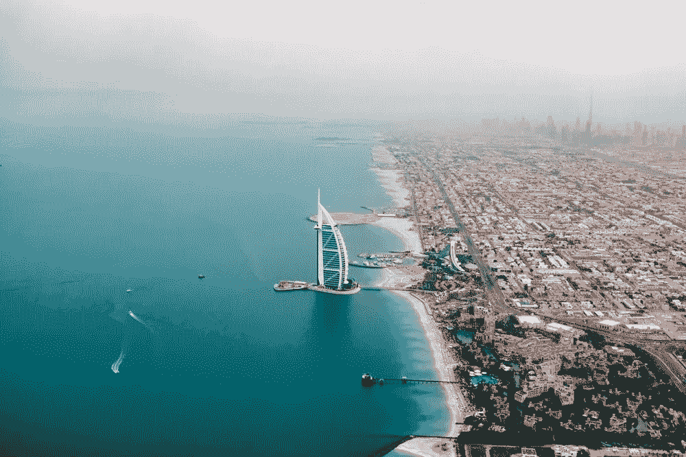

# 全球首个区块链驱动的政府？

> 原文：<https://medium.com/coinmonks/dubai-aspires-to-be-the-first-blockchain-powered-government-in-the-world-by-2020-c3efbbb55c6a?source=collection_archive---------1----------------------->

## 迪拜渴望在 2020 年成为世界上第一个由区块链掌权的政府？一厢情愿还是有可能？

Photo by Christoph Schulz on Unsplash

从阿拉伯沙漠中的一个渔村到一个生活方式的目的地，迪拜是不可思议的。拥有世界最高建筑的人工岛的形状…