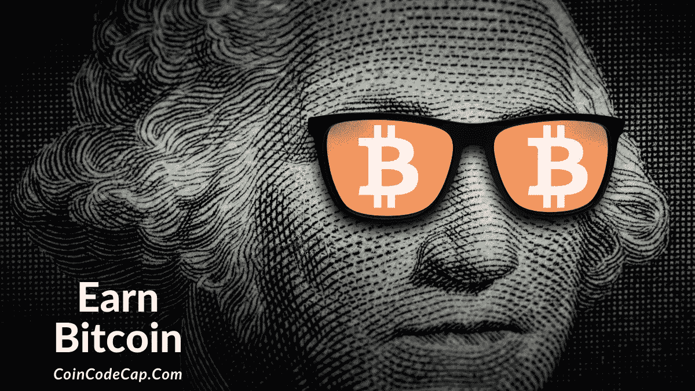
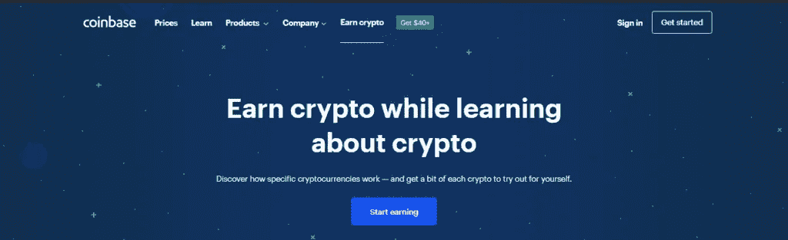
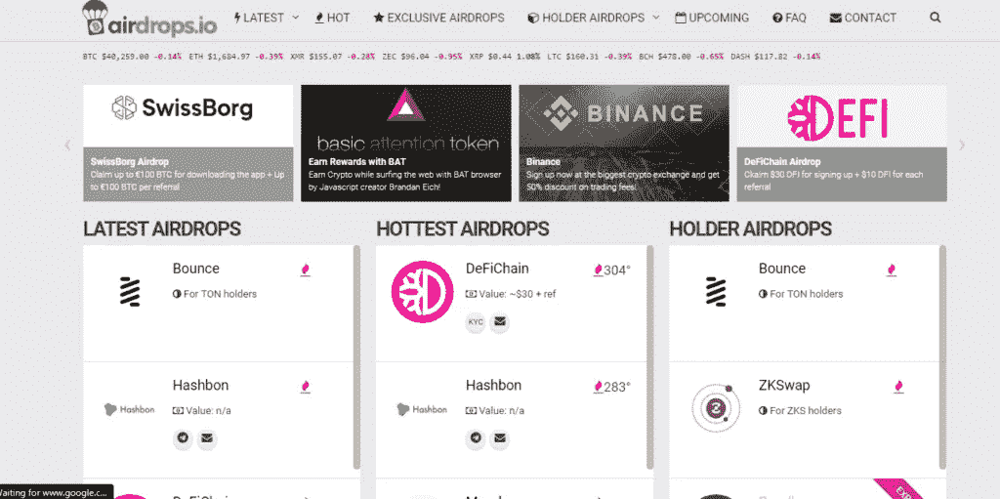
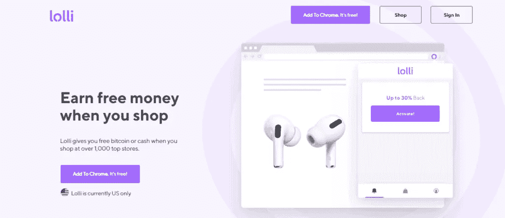
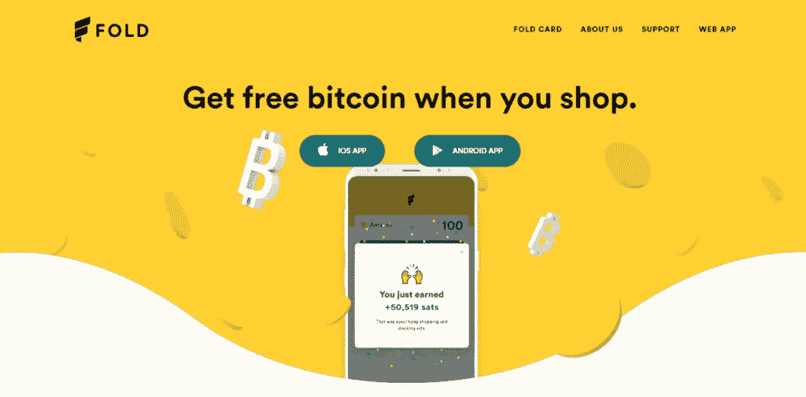
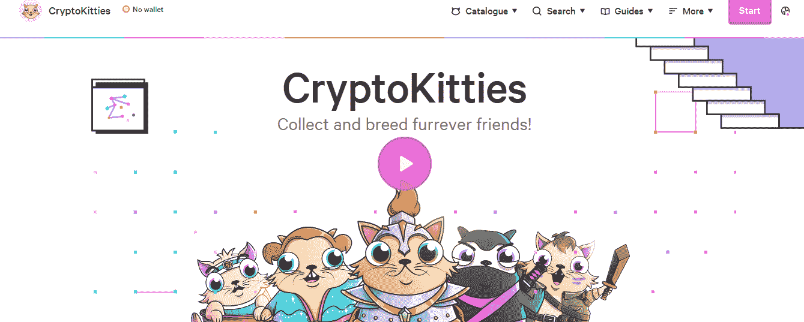
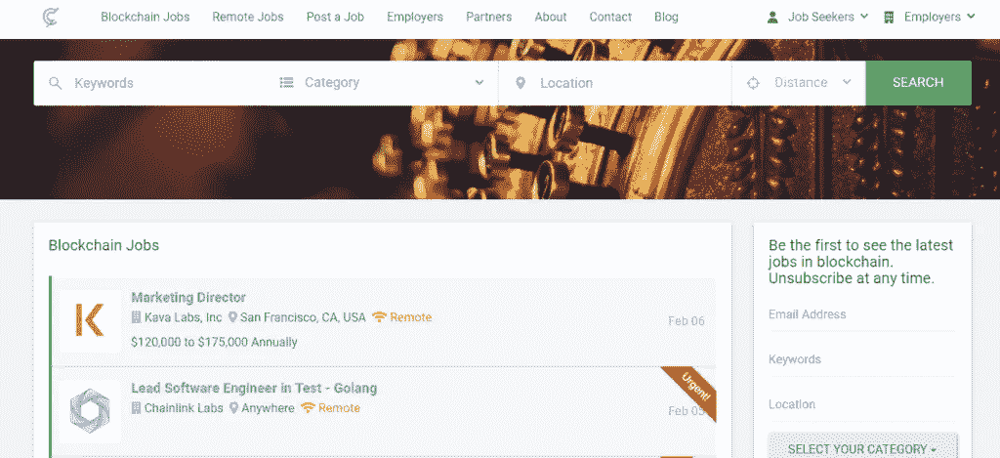

# 免费赚比特币[2021 版]

> 原文：<https://medium.com/coinmonks/earn-bitcoin-6e8bd3c592d9?source=collection_archive---------2----------------------->

这个博客涵盖了免费获得比特币的各种方式。这些方法中的大部分都很简单，但是正如你所知，天下没有免费的午餐。因此，其中一些步骤需要一些努力。

# 摘要

*   许多平台提供比特币作为完成特定任务的奖励。
*   [比特币基地](https://blog.coincodecap.com/go/coinbase) earn 让你学习各种加密货币，并付给你一定数量的特定加密硬币。
*   许多公司为联盟营销支付了不菲的价格。
*   你可以通过交易轻松赚取利润，并用利润购买比特币。
*   如果你拥有比特币，你可以通过将比特币借给借款人来获得高额利息。
*   空投是另一种帮助你免费获得比特币的方式。
*   一些平台甚至提供比特币作为在其合作平台上购物的奖励。
*   你可以在网上完成一些奇怪的任务，比如填写调查问卷。
*   许多游戏公司为你提供比特币来玩他们的游戏。
*   你可以开始写关于加密货币的文章，成为一名博客写手或加密记者，或者从事加密工作。

# 如何赚取免费的比特币？

由于[比特币](https://blog.coincodecap.com/a-candid-explanation-of-bitcoin)是最受欢迎和最有价值的加密货币，几乎我们所有人都想免费获得它。免费赚比特币的方式多种多样。然而，当比特币在你的账户中积累时，很少有一种方法可以让你高枕无忧。

有公司和购物网站以各种方式提供免费的比特币。然而，他们大多是通过联盟营销。该公司从其利润中提供这些硬币。

一些网站会给你分配任务，完成这些任务后，你会获得比特币的奖励。

我们准备了一份免费赚取比特币的最佳方式清单。让我们来看看。

# 比特币基地·欧文

[**比特币基地**](https://www.coinbase.com/earn) 是最多样化的密码交易平台之一。它向初学者教授不同的加密货币，并在完成每门课程后给你一些硬币进行交易。

使用比特币基地将增加你对许多加密货币的工作知识。它还将帮助您在您的 coinbase 钱包中积累不同的加密货币。

他们通过视频讲座教授你加密货币，并通过测试对你进行检查。完成这些测试后，您将在钱包中收到加密。

coinbase 提供的一些加密货币如下:

*   [核酸分子](https://www.nucypher.com/)
*   [图表](https://thegraph.com/)
*   [Celo](https://celo.org/)
*   [大院](https://compound.finance/)
*   [恒星流明](https://www.stellar.org/lumens?locale=en)
*   [Filecoin](https://en.wikipedia.org/wiki/Filecoin)
*   [算法和](https://www.algorand.com/)

# 联盟营销

交易平台和其他加密产品为他们的用户提供附属程序。这些平台付钱给联盟营销商来推广他们的平台。

联盟营销是最好的赚钱方式之一，因为它为你提供了比特币或利润。许多不同的平台都在提供这个领域的服务。

以下是为您提供最大收益的平台的一些建议:

*   [**Bitsgap**](http://blog.coincodecap.com/go/bitsgap) ，提供加密网格交易机器人，并提供一个最好的加密联盟营销计划，佣金高达 30%。要了解更多信息，请阅读我们的 [Bitsgap 评论](/coinmonks/bitsgap-review-a-crypto-trading-bot-that-makes-easy-money-a5d88a336df2)。
*   [**Quadency**](https://blog.coincodecap.com/go/quadency) 是另一个交易机器人提供商，为每个付费客户提供高达 200 美元。阅读我们的 [Quadency review](/coinmonks/quadency-review-a-crypto-trading-automation-platform-3068eaa374e1) 以了解关于该平台的更多信息。
*   [**CryptoHopper**](https://blog.coincodecap.com/go/cryptohopper) 支付市场上最高的联盟营销佣金之一。然而，随着时间的推移，他们已经稍微减少了支付。

你也可以通过让其他交易者在像 [Pionex](http://blog.coincodecap.com/go/pionex) 这样的交易平台上注册来赚取利润。这些平台向你提供你在论坛上带来的交易者赚取的利润的百分比。

# 贸易

复制交易让你赚到免费的比特币，帮你盈利。虽然你需要投资来赚取利润，并且永远记住，交易是有风险的。

*   **:作为世界上最大的交易平台，币安对每个人来说都是最安全的交易平台。**
*   **[**Bybit**](https://blog.coincodecap.com/go/bybit) 易于使用的加密交易交易所，提供高达 100 倍[杠杆](https://www.investopedia.com/terms/l/leverage.asp)的永续期货。阅读我们的 [Bybit 评论](/coinmonks/bybit-exchange-review-dbd570019b71)了解更多关于该平台的信息。**
*   **[**Pionex**](https://blog.coincodecap.com/go/pionex) 是世界上第一个[加密货币交易所](https://blog.coincodecap.com/go/crypto-exchange)，有交易机器人帮助你交易并获得利润。要了解更多信息，请阅读我们的 [Pionex 评论](/coinmonks/pionex-review-exchange-with-crypto-trading-bot-1e459d0191ea)。**

**此外，还有复制交易平台，允许交易者建立一个追随者，并通过分享他们的交易策略来赚钱。专业交易者从拷贝交易者收取的百分比中获利。同时，复制交易者通过复制专家交易者来获利。**

**但是，也可以有副本交易时不给你提供比特币的情况，但是你可以用赚到的利润买比特币。**

**一些最好的提供拷贝交易的网站如下:**

*   **Bityard 是复制交易行业的新生事物，但他们提供独家合同复制交易服务。你可以阅读我们的[比特码拷贝交易](https://blog.coincodecap.com/bityard-copy-trading)终极指南。**
*   **艾娃交易:他们是全球最好的外汇交易平台之一。他们的复制交易平台允许交易所实时复制。**

# **借出比特币**

****

**如果你已经拥有一些比特币，你可以注册[借贷网站](https://blog.coincodecap.com/top-5-crypto-lending-platforms)。这些网站会为你的比特币支付高达 15%的年利率，这些钱会每周存入你的账户。**

**一些最好的贷款网站是:**

*   **[**BlockFi**](http://blog.coincodecap.com/go/blockfi)**
*   ****
*   ****[**尤霍德勒**](https://blog.coincodecap.com/go/youhodler)****

# ****通过空投获得比特币****

****有时，新的加密货币项目提供免费硬币，以获得最初的牵引力或创造公众意识。一个著名的例子是 Byteball 或目前被称为 [Obyte](https://obyte.org/) 。****

****他们免费向比特币所有者分发 Byteball。拥有更多比特币的比特币所有者仍然位于优先级列表的顶部。****

****你可以在这里查看这些[空投](https://airdrops.io/)。****

********

# ****购物并赚取免费比特币****

****有各种各样的在线平台，像 [Lolli](http://blog.coincodecap.com/go/lolli) ，可以让你赚取比特币，用于在线购物。Lolli 为您在网上的每一笔购物提供少量比特币作为返现。****

********

****你需要做的就是注册 Lolli 并添加它的 chrome 扩展。无论您何时从其 500 多家合作伙伴商店中的任何一家购物，您都将获得奖励。****

****其中一些平台甚至为你提供网上购物的借记卡。这些卡是可充值的，你用它们购物越多，你得到的奖励就越多。****

****其他提供这项服务的平台还有 [Foldapp](https://blog.coincodecap.com/go/foldapp) 和 [Cryptocom](https://crypto.com/) 。****

********

# ****接受比特币作为支付手段****

****接受比特币支付有助于你过渡到未来经济。比特币向你保证你的产品的价值，并防止你通过信用卡进行任何欺诈。****

****顾客更喜欢用比特币支付的一个重要原因是因为匿名性。比特币交易是 sudo 匿名的，可以保护支付者的身份。****

****通过接受比特币，你可以节省银行收取的交易费用。****

# ****执行在线任务****

****像 [Timebucks](https://timebucks.com/) 这样的众多平台提供比特币，以换取你完成一些任务。这些工作可以根据公司的需求而变化。****

****他们中的一些人可以要求你测试他们的网站，填写他们的调查，并执行许多类似的任务。他们用比特币支付你这些任务。****

# ****玩网络游戏****

****许多网络游戏在达到一定级别或完成特定任务时会提供免费的比特币。你可以很容易地从这些网站上获得免费的比特币。这些公司会用比特币支付给你。但是，他们会通过游戏中的各种广告来这样做。****

********

****你甚至可以加入一些在线赌场，在那里你对你的钱或比特币进行出价，并赚取利润。然而，它包含了赌博的风险。****

****以下是赚取比特币的最佳游戏列表:****

*   ****[隐猫](https://www.cryptokitties.co/)****
*   ****[超越虚空](https://www.beyond-the-void.net/)****
*   ****[创世纪的咒语](https://spellsofgenesis.com/)****
*   ****[文字政策](https://worldopoly.io/)****

# ****加密作业****

****有像我一样写加密货币的内容作家和博主。假设你对加密货币有着浓厚的兴趣，并且有着永无止境的求知欲。你可以开始你的写作之旅了。****

****根据你的喜好，你可以成为一名秘密记者或博客写手。有时，一些网站会让作者改造他们的整个网站。****

****加密领域有各种各样的工作，你可以加入与加密相关的公司，用比特币领取薪水。****

****然后他们用比特币或其他加密货币支付给这些作者。也有各种网站雇佣个人进行各种加密货币或区块链项目。****

****其中一些网站如下:****

*   ****[crypto.jobs](https://crypto.jobs/)****
*   ****[cryptocurrencyjobs.co](https://cryptocurrencyjobs.co/)****
*   ****[远程确认](https://remoteok.io/remote-crypto-jobs)****
*   ****[向上工作](https://www.upwork.com/freelance-jobs/cryptocurrency/)****
*   ****[密码携带者](https://www.crypto-careers.com/)****
*   ****[封锁. io](https://blockace.io/)****
*   ****[加密工作](https://cryptojobs.com/)****

********

# ****比特币挖矿****

****比特币挖矿是另一种赚取免费比特币的方式。然而，无论听起来多么有利可图，比特币挖矿都是一个昂贵的过程，并且纯粹依赖硬件。这导致许多矿工一起工作，使用一个矿池。****

****由于挖矿是一个昂贵且耗时的过程，因此许多人不追求比特币挖矿。然而，如果你对比特币挖矿感兴趣，这里有一些平台可以开始你的旅程:****

*   ****贸易区:它是最透明的矿池之一，自 2011 年以来一直在开采比特币。****
*   ****[雪泥池](https://slushpool.com/):世界上第一个矿池，自诞生以来已经开采了超过 120 万 BTC。****
*   ****[Bitclub Network](https://www.bitclubnetwork.co.uk/) :提供比特币交易和挖掘比特币的服务。****
*   ****[比特明特](https://bitminter.com/):它是最早的采矿池之一，最近由于缺少矿工，不得不停止采矿活动。****

********

# ****免费的比特币挖矿软件****

****许多公司也提供免费的比特币挖矿软件。一些软件是:****

*   ****[CGminer](https://github.com/ckolivas/cgminer) :是开源软件，其代码在 GitHub 上有。****
*   ****他们的目标是让每个人都能接触到 BTC 矿业。****
*   ****令人敬畏的矿工:他们提供最大的利润，对大规模采矿有决定性作用。****
*   ****Easy miner :他们提供了一个开源的，非常安全的加密挖掘平台。****

****在没有任何投资的情况下，几乎不可能推进比特币挖矿的进程。因此，这是赚取或购买比特币的最不可取的方式，除非你有资源。****

# ****意识到****

****如果你是加密新手，千万不要把你的私钥放在任何网站或应用程序上。注意那些承诺给你很高回报的服务和快速致富的广告计划。****

# ****结论****

****在互联网上有几种免费赚取比特币的方法。然而，这是真的，如果说，一切都是有代价的，没有什么是免费的。之所以如此，是因为所有这些方法都让你以这样或那样的方式工作。****

****你当然可以选择一些不需要太多努力的工作。尽管这些方法不会给你带来太多的回报，但它们肯定会开启你的加密之旅。****

# ****常见问题****

******赚取免费比特币的最好方法是什么？******

****赚取免费比特币的最佳方式是获得与加密公司相关的工作或成为自由职业者，并获得比特币报酬。****

******免费获得一枚比特币是否无风险？******

****密码行业没有什么是无风险的。然而，毫无疑问，有一些特定的方法可以将风险降到最低。比如你可以在网上购物赚取比特币，甚至完成一些任务。****

******比特币挖矿违法吗？******

****这取决于你居住的国家。在美国，开采比特币是完全合法的。一些国家没有关于加密货币的法律。因此，它们既不合法也不非法。****

> ****加入 Coinmonks [Telegram group](https://t.me/joinchat/EPmjKpNYwRMsBI4p) 并了解加密交易和投资****

## ****另外，阅读****

*   ****什么是[闪贷](https://blog.coincodecap.com/what-are-flash-loans-on-ethereum)？****
*   ****最好的[密码交易机器人](/coinmonks/crypto-trading-bot-c2ffce8acb2a) | [网格交易](https://blog.coincodecap.com/grid-trading)****
*   ****[3 商业评论](/coinmonks/3commas-review-an-excellent-crypto-trading-bot-2020-1313a58bec92) | [Pionex 评论](/coinmonks/pionex-review-exchange-with-crypto-trading-bot-1e459d0191ea) | [Coinrule 评论](https://blog.coincodecap.com/coinrule-review-a-perfect-trading-bot)****
*   ****[AAX 交易所评论](/coinmonks/aax-exchange-review-2021-67c5ea09330c) | [德里比特评论](/coinmonks/deribit-review-options-fees-apis-and-testnet-2ca16c4bbdb2) | [FTX 密码交易所评论](/coinmonks/ftx-crypto-exchange-review-53664ac1198f)****
*   ****[零审核](/coinmonks/ngrave-zero-review-c465cf8307fc)****
*   ****[Bybit Exchange 审查](/coinmonks/bybit-exchange-review-dbd570019b71) | [Bityard 审查](https://blog.coincodecap.com/bityard-reivew) | [CoinSpot 审查](https://blog.coincodecap.com/coinspot-review)****
*   ****[3Commas vs Cryptohopper](/coinmonks/3commas-vs-pionex-vs-cryptohopper-best-crypto-bot-6a98d2baa203)****
*   ****最好的比特币[硬件钱包](/coinmonks/the-best-cryptocurrency-hardware-wallets-of-2020-e28b1c124069?source=friends_link&sk=324dd9ff8556ab578d71e7ad7658ad7c) | [BitBox02 回顾](/coinmonks/bitbox02-review-your-swiss-bitcoin-hardware-wallet-c36c88fff29)****
*   ****[莱杰 vs n rave](https://blog.coincodecap.com/ngrave-vs-ledger)|[莱杰 nano s vs x](https://blog.coincodecap.com/ledger-nano-s-vs-x)****
*   ****[加密复制交易平台](/coinmonks/top-10-crypto-copy-trading-platforms-for-beginners-d0c37c7d698c) | [比特码复制交易](https://blog.coincodecap.com/bityard-copy-trading)****
*   ****[沃德评论](https://blog.coincodecap.com/vauld-review) | [尤霍德勒评论](/coinmonks/youhodler-4-easy-ways-to-make-money-98969b9689f2) | [区块链评论](/coinmonks/blockfi-review-53096053c097)****
*   ****最好的[加密税务软件](/coinmonks/best-crypto-tax-tool-for-my-money-72d4b430816b) | [硬币追踪评论](/coinmonks/cointracking-review-a-reliable-cryptocurrency-tax-software-5114e3eb5737)****
*   ****最佳[加密借贷平台](/coinmonks/top-5-crypto-lending-platforms-in-2020-that-you-need-to-know-a1b675cec3fa)****
*   ****[莱杰纳米 S vs 特雷佐 one vs 特雷佐 T vs 莱杰纳米 X](https://blog.coincodecap.com/ledger-nano-s-vs-trezor-one-ledger-nano-x-trezor-t)****
*   ****[block fi vs Celsius](/coinmonks/blockfi-vs-celsius-vs-hodlnaut-8a1cc8c26630)|[Hodlnaut 审查](https://blog.coincodecap.com/hodlnaut-review)****
*   ****[Bitsgap 审查](/coinmonks/bitsgap-review-a-crypto-trading-bot-that-makes-easy-money-a5d88a336df2) | [四项审查](/coinmonks/quadency-review-a-crypto-trading-automation-platform-3068eaa374e1)****
*   ****[埃利帕尔泰坦评论](/coinmonks/ellipal-titan-review-85e9071dd029) | [赛克斯斯通评论](https://blog.coincodecap.com/secux-stone-hardware-wallet-review)****
*   ****[DEX Explorer](https://explorer.bitquery.io/ethereum/dex) | [区块链 API](https://explorer.bitquery.io/graphql)|[local bitcoins 评论](https://blog.coincodecap.com/localbitcoins-review)****
*   ****[最佳区块链分析工具](https://bitquery.io/blog/best-blockchain-analysis-tools-and-software)****
*   ****[加密套利](/coinmonks/crypto-arbitrage-guide-how-to-make-money-as-a-beginner-62bfe5c868f6)指南:新手如何赚钱****
*   ****最佳[加密制图工具](/coinmonks/what-are-the-best-charting-platforms-for-cryptocurrency-trading-85aade584d80) | [最佳加密交易所](https://blog.coincodecap.com/crypto-exchange)****
*   ****了解比特币最好的[书籍有哪些？](/coinmonks/what-are-the-best-books-to-learn-bitcoin-409aeb9aff4b)****

> ****[在您的收件箱中直接获得最佳软件交易](/coinmonks/newsletters/coinmonks)****

********

*****原载于 2021 年 2 月 7 日*[*【https://blog.coincodecap.com】*](https://blog.coincodecap.com/earn-bitcoin)*。*****