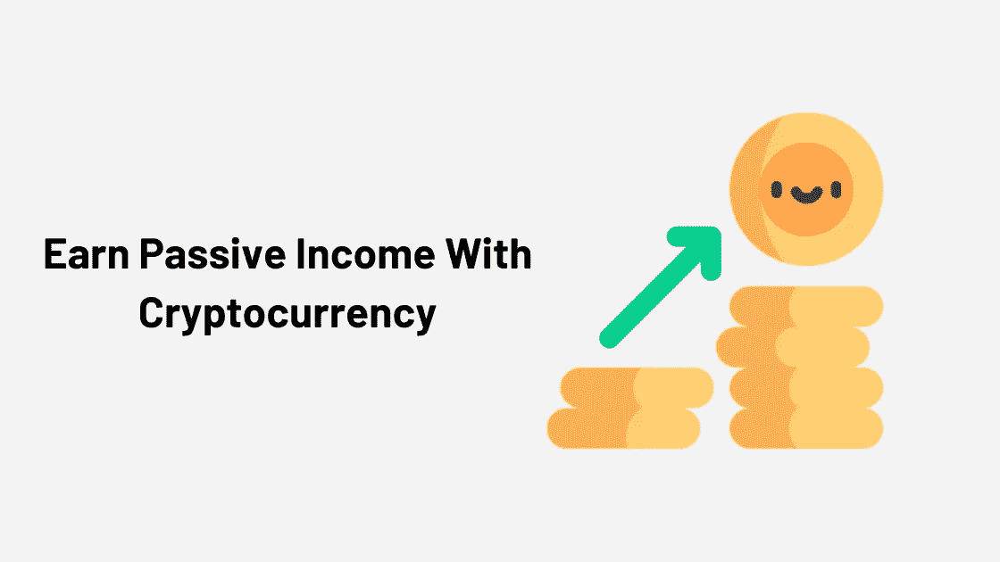

# 通过下注硬币赚取加密被动收入[MyContainer Edition]

> 原文：<https://medium.com/coinmonks/earn-crypto-by-staking-coins-c21414bb2659?source=collection_archive---------1----------------------->

在这篇文章中，我们将讨论如何任何人都可以赚取加密赌注的硬币。让我们开始吧。

靠储蓄账户收利息赚钱的时代早已过去。在当今世界，经济受到极低利率的困扰。有效对抗通胀是不可能的，更别说在这个过程中赚钱了。

为了对抗不断增长的通货膨胀率和刺激经济，中央银行继续他们的货币政策。这些政策依赖于推动量化宽松，也就是最大限度地印钞，并导致通货膨胀。当我们坐视美元、欧元和所有其他国家货币的购买力下降时。

# 比特币和工作证明加密货币

[比特币](https://blog.coincodecap.com/tag/bitcoin/)是第一种在短短几年内从 2010 年的 1 美元增长到 2 万美元的加密货币。

当你购买一种加密货币并放在一个[加密钱包](https://blog.coincodecap.com/tag/crypto-wallet/)中，希望它的价格会上涨，这就叫做**霍德林。**

[比特币](https://blog.coincodecap.com/tag/bitcoin/)是一种工作证明加密货币，也就是说要赚取更多的比特币，需要借助挖矿硬件进行挖矿。这种硬件为矿工提供了解决加密算法、发现新块和处理事务所需的计算能力。这个过程需要花费大量的钱来购买机器和电力。

> [*阅读什么是比特币及其工作原理？*](https://blog.coincodecap.com/what-is-bitcoin-and-how-it-works/)

我们都同意比特币挖矿最初是一种很好的赚钱方式，但那些日子已经过去了。

对于那些无法获得廉价电力或资金来购买数千美元 ASIC 采矿设备的个人来说，采矿电力硬币可能不再有利可图。

# 加密货币的演变与赌注硬币的证明

[比特币](https://blog.coincodecap.com/tag/bitcoin/)的确是第一种加密货币，但从那时起，我们已经看到了一个巨大的创新正在发生。和往常一样，当行业成熟时，新的服务和改进会涌现出来。

我们现在有了股份证明(PoS)加密货币，采矿并不是赚取加密和更多钱的唯一途径。

通过 PoS 赚钱类似于投资传统金融，投资者可以让他们的投资为他们服务。简而言之，利益一致的证明允许你充分利用你的资产。

# 用“赌注证明”硬币赢得加密

赌注硬币的证明引入了一个新的赚钱概念，通过一个叫做****的过程。**凭证加密货币的持有者可以用他们的硬币来支持网络并赚取加密。**

**当用户将硬币放在特定的赌注钱包中时，赌注过程就会发生，通常是加密货币的官方钱包，或属于交易所或提供赌注服务的公司的在线钱包。**

**你拥有的硬币越多，保存的时间越长，你的赌注利润就越高。**

**赌注最近变得容易获得，以至于赌注加密货币的总额飙升至超过 80 亿美元的历史最高水平。这意味着比以往任何时候都多的加密货币被押上赌注。**

# **“股权证明即服务”的兴起**

**随着赌注证明加密货币的日益流行，我们观察到人们对赌注服务的兴趣越来越大。有了赌注服务，投资者可以绕过赌注硬币的复杂性。**

**此外，借助 staking 服务，他们可以消除任何技术问题，并避免必须验证交易或管理节点以换取收入分成的烦恼。**

# **my container——定位即服务的演变**

**[my container](https://www.mycointainer.com?utm_source=coincodecap.com)是一个领先且独一无二的 Staking 即服务平台。这项服务的不同之处在于它提供了一个类似 PoS hub 的平台。因此，允许用户购买加密货币，将其兑换成不同的硬币，池赌注，主节点赌注。并且所有收益同时复利。**

> **[***阅读 CoinCodeCap 上的 MyContainer 评论***](https://coincodecap.com/product/mycointainer-7)**

**所以当你用我的容器下注时，你会从你的硬币中获得最大的利润。另一个值得一提的重要特性是 MyCointainer 是一个受财务监管的服务。**

**他们获得了提供电子钱包服务的法律许可和加密转账的法令。此外，所有资金都受到 SAFU 的保护。**

**最后但同样重要的是，他们的安全协议将确保您的资金始终受到多层安全保护，以便用户可以安全地存储数字资产和安全地下注。**

# **每个人的简单赌注**

**MyCointainer 的主要使命是将分散经济的潜力带给大众，让加密投资和盈利像浏览网页一样简单。**

**凭借世界一流的赌注奖励分配引擎，MyCointainer 可以支持相当多种基于 PoS 的加密资产。此外，还有 50 多种 PoS 币可供选择，每周都会增加更多优质币。**

# **内置加密货币交易所**

**MyCointainer 的交易所正在利用多个 API 点来实现最低价格。因此，你不必在交易所之间跳来跳去寻找最好的交易。用法定货币购买加密货币，将 BTC 兑换成其他货币，反之亦然，从来没有这么容易。**

# **MyContainer 的其他令人兴奋的特性**

**到目前为止，我们已经了解到 MyCointainer 通过一次性下注、主节点下注和复利提供了更高的收入潜力。你也可以用法定货币购买比特币和其他替代硬币，然后将硬币兑换成其他硬币……好吗？不，不是真的。**

**此外，MyCointainer Insight 是一种类似博客的服务，它是加密相关信息、有趣的加密指南、世界经济新闻和区块链的绝佳来源。还有一个部分，你会读到目前最有价值的空投。**

**最后但同样重要的是，MyCointainer POWER 是一项订阅服务，向加密货币爱好者介绍新的有趣的赚钱方式。**

**对于每月 3.90€的订阅，用户可以获得最好的赌注交易。访问专为订户托管的有限 Masternodes，将获得 100%的赌注奖励。通常，在这个价格上，你可以得到 1 或 2 个服务器，你可以在上面托管一个主节点。有了[我的容器](https://www.mycointainer.com/?utm_source=coincodecap.com)，你就可以访问它们了！此外，MyCointainer 将不再收取赌注费。**

****

> **[在您的收件箱中直接获得最佳软件交易](https://coincodecap.com/?utm_source=coinmonks)**

****