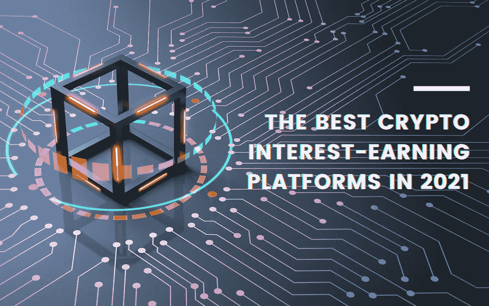
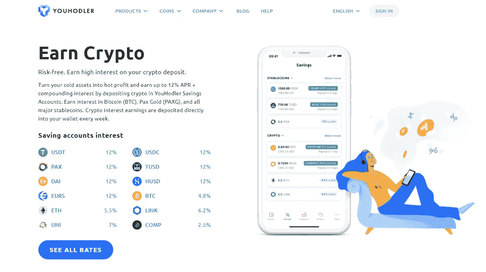
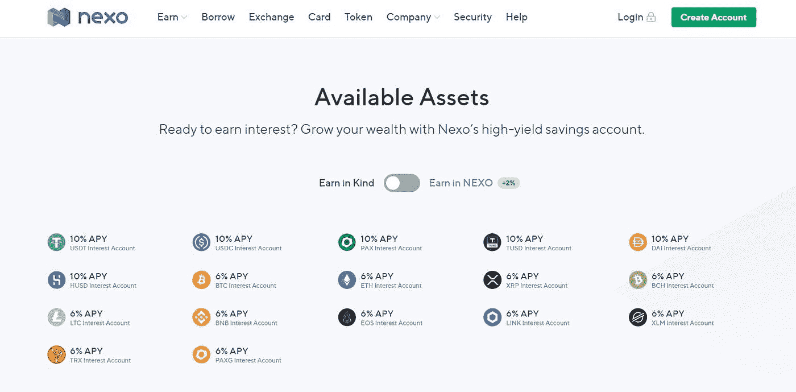
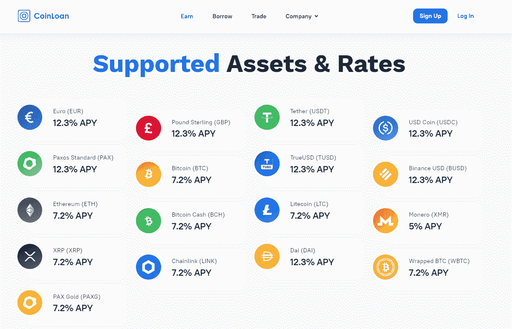

# 2022 年赢得加密兴趣的最佳平台

> 原文：<https://medium.com/coinmonks/earn-crypto-interest-b10b810fdda3?source=collection_archive---------0----------------------->

2020 年初，加密货币的前景看起来并不那么乐观。加密市场试图摆脱价格暴跌，而市场流动性仍然低迷。接着，新冠肺炎疫情发生了，世界各地的央行推出了一轮又一轮的刺激支出来拯救经济。这导致人们对比特币作为价值储存手段的信心上升。

2020 年底，比特币的价格突破了近 3 年前创下的 2 万美元的纪录。2021 年 1 月初，比特币的价格达到了创纪录的 41940 美元。价格后来有所调整，在 30，000 美元上下浮动。尽管如此，加密货币将继续震撼金融界，并吸引更多用户。

有很多方法可以得到密码。有些甚至不需要你花一分钱。如果你已经拥有一些数字资产，并希望赚取加密利息，你可以通过[加密贷款平台](/coinmonks/top-5-crypto-lending-platforms-in-2020-that-you-need-to-know-a1b675cec3fa)来实现。这是一种在不交易的情况下从加密货币中获得被动收入的方式。

它的运作方式是，你把你的资产借给中央金融(CeFi)平台，该平台充当你资产的托管人。CeFi 平台可通过抵押将上述资产借给经过审查的机构借款人或第三方。作为交换，你将获得存款的高利率。

那么，你可以在哪里赚取加密利息？以下是 2022 年获得加密兴趣的**前三大平台。**

## [优霍德勒](https://blog.coincodecap.com/go/youhodler)

[YouHodler](https://blog.coincodecap.com/go/youhodler) 是一家来自瑞士的多元化金融服务公司，帮助加密用户利用加密货币，而无需主动进行交易。有了这个平台，你可以交易加密货币或法定货币，获得以加密货币为抵押的贷款，以及高息储蓄账户。适合每个层次的投资者，YouHodler 使用户更容易增加他们的加密组合。

用户可以期望在 22 种资产上获得高达 12%的年利率，如比特币、以太坊、莱特币等等。很高兴知道 YouHodler 有一个集成了法定货币和加密货币的钱包。对于那些对密码交易更有经验的人来说， [YouHodler](https://blog.coincodecap.com/go/youhodler) 有**涡轮增压**和**多 HODL** 是两个值得研究的产品。

## **YouHodler Pros**

*   多种多样的加密资产选择
*   年利率高达 12%的诱人利率
*   创新交易产品

## **YouHodler Cons**

*   不适用于美国或中国居民
*   与其他类似平台相比，费用更高
*   移动应用程序需要改进

## [Nexo](https://blog.coincodecap.com/go/nexo)

加密领域的另一个巨头, [Nexo](https://blog.coincodecap.com/go/nexo) 正致力于用加密资产取代传统银行业务。Nexo 提供广泛的金融服务，包括利息账户、借贷加密、交换和加密借记卡，是希望获得被动收入的个人投资者的可靠选择。用户可以赚取利息的 17 加密资产以及一些法定货币，如欧元，美元和英镑。利率从加密债券的 8%到稳定债券的 12%不等。Nexo 也有自己的原生 token NEXO Token，用户可以通过其 [**Nexo 账户**](https://blog.coincodecap.com/go/nexo) 中的闲置资产获得 25%的高利息。

## Nexo Pros

*   使用 Nexo 代币赢取额外 25%的利息
*   无提现、交易、平台费用
*   已建立的平台处理了超过 40 亿美元的业务，拥有 100 多万客户

## Nexo Cons

*   如果你想要最好的利率，持有 NEXO 代币是强制性的
*   1 亿美元的保险仅适用于储存在冷库中的资产
*   在借款方面，与竞争对手相比，利息并不低

## [信用贷款](https://blog.coincodecap.com/go/coinloan)

CoinLoan 是一个有趣的加密平台，允许用户借出他们的资产并获得诱人的回报。它起源于爱沙尼亚，以较高的 LTV(贷款价值比)率在 P2P 基础上运作，同时还提供法定借贷。信用检查不良或没有信用检查的投资者和借款人会发现这个平台是有益的，因为不需要信用检查。你只需拿出你的加密或菲亚特控股公司作为抵押，借高达 70%的加密或菲亚特的贷款价值。

CoinLoan 没有固定的利率。用户可以赚取高达 12.3%的利息，主要是稳定的欧元。利率包括 2%的 CLT 赌注奖励，这是 CoinLoan 本地令牌。

## 信用贷款专业人士

*   高于加密和欧元的平均利率
*   零存款和取款费用
*   作为欧洲虚拟货币提供商受到监管并获得许可

## 信用贷款专业人士

*   需要更大的透明度
*   加密货币的波动性会影响你的贷款
*   投资的贷款额度有限

## **总之**

随着比特币开始了迄今为止最令人兴奋的牛市之一，其他加密货币也在获得动力。加密市场的积极前景促使更多用户考虑如何获得加密货币。将数字资产存入生息账户是增加加密资产组合的一种方式。和往常一样，在存款之前，你应该仔细查看每个平台，并理解其中的细节。如果策略得当，通过[加密借贷平台](/coinmonks/top-5-crypto-lending-platforms-in-2020-that-you-need-to-know-a1b675cec3fa)赚取加密利息是一种在维持加密生态系统的同时增加被动收入的便捷方式。

> *加入 Coinmonks* [*电报频道*](https://t.me/coincodecap) *和* [*Youtube 频道*](https://www.youtube.com/c/coinmonks/videos) *获取每日* [*加密新闻*](http://coincodecap.com/)

## 另外，阅读

*   [复制交易](/coinmonks/top-10-crypto-copy-trading-platforms-for-beginners-d0c37c7d698c) | [加密税务软件](/coinmonks/crypto-tax-software-ed4b4810e338)
*   [网格交易](https://coincodecap.com/grid-trading) | [加密硬件钱包](/coinmonks/the-best-cryptocurrency-hardware-wallets-of-2020-e28b1c124069)
*   [密码电报信号](/coinmonks/top-3-telegram-channels-for-crypto-traders-in-2021-8385f4411ff4) | [密码交易机器人](/coinmonks/crypto-trading-bot-c2ffce8acb2a)
*   [最佳加密交易所](/coinmonks/crypto-exchange-dd2f9d6f3769) | [印度最佳加密交易所](/coinmonks/bitcoin-exchange-in-india-7f1fe79715c9)
*   [面向开发人员的最佳加密 API](/coinmonks/best-crypto-apis-for-developers-5efe3a597a9f)
*   最佳[密码借贷平台](/coinmonks/top-5-crypto-lending-platforms-in-2020-that-you-need-to-know-a1b675cec3fa)
*   [免费加密信号](/coinmonks/free-crypto-signals-48b25e61a8da) | [加密交易机器人](/coinmonks/crypto-trading-bot-c2ffce8acb2a)
*   [杠杆代币](/coinmonks/leveraged-token-3f5257808b22)终极指南