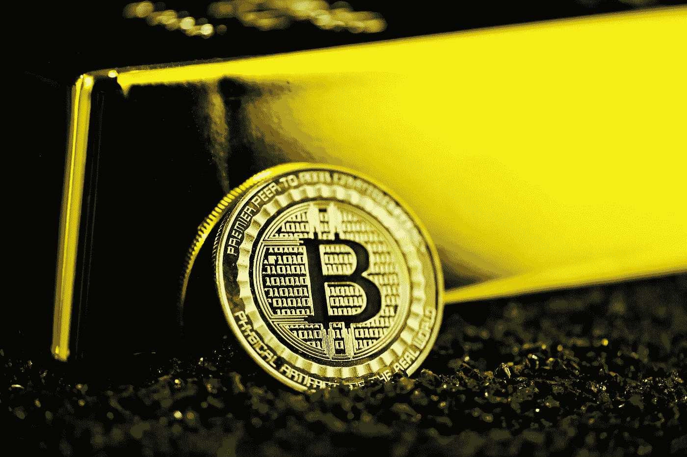

# 赚取比特币及其重要性

> 原文：<https://medium.com/coinmonks/earning-bitcoin-and-why-it-matters-4fdb06ef3775?source=collection_archive---------4----------------------->

## 加密领域为我们如何储蓄和投资提供了新的选择

Photo by [Executium](https://unsplash.com/@executium?utm_source=unsplash&utm_medium=referral&utm_content=creditCopyText) on [Unsplash](https://unsplash.com/s/photos/bitcoin?utm_source=unsplash&utm_medium=referral&utm_content=creditCopyText)

去年，美联储降低了利率，并开始以前所未有的速度印刷美元。以当前 0.30%的利率储蓄现金会产生负的实际回报，这抑制了持有现金的积极性。结果，人们预期更高的通货膨胀率会侵蚀美元的价值，侵蚀他们储蓄的价值。这就引出了一个问题:一个人能用他们的现金做什么？

# 菲亚特的选择

比特币、以太坊和其他密码有望重塑我们的金融生活。通过他们分散的网络，cryptos 没有一个中央权威，并通过共识进行管理。区块链技术记录所有交易，提供公开、不可变的活动分类账。

加密技术火了——主要货币价格屡创新高，吸引了大量机构和企业投资。每周我都会向另一个感兴趣的朋友介绍加密领域以及如何入门。

最有趣的发展之一是密码出借人的兴起，如 BlockFi 和 Celsius。

进入加密贷款——block fi 和 Celsius，为你的美元提供 8.6%到 10.5%的利息。

[RushRadar](https://rushradar.com/blockfi-vs-celsius-network/)

# 它是如何工作的

自 2017 年成为主流以来，加密货币生态系统已经发生了很大的变化，并通过机构投资者的大量投资获得了合法性。BlockFi 和 Celsius 等公司是这一演变的一部分。它们就像是加密的“银行”,你可以在那里存钱、取钱并赚取利息。你可以用你的加密资产作为抵押来获得美元贷款。就像正规银行发放贷款一样，加密贷款机构将你的硬币借给需要加密的大型机构，主要是交易所或机构基金。他们支付贷款利息，其中一部分会返还给你。

这些加密贷款机构对美元支持的 stablecoins、GUSD(双子星美元)和 USDC(美元硬币)提供最高利率，以 1:1 的比率与实际美元挂钩。

这些硬币以美元计价，交易速度快，利率高，从而增加了流动性，加快了交易结算时间。速度和流动性对于在市场永不关闭的加密空间中运营至关重要。此外，将它们与美元挂钩为买卖波动性更大的硬币提供了一个稳定且被接受的参考点。

BlockFi 在这些硬币上分别提供 8.6%的 APY，Celsius 提供 10%的 APY。每月:

*   BlockFi 赚 0.71%
*   摄氏收益 0.83%
*   HYS 账户(0.50% APY)赚取 *0.0004%*

通过加密银行，你可以在储蓄账户中用同样的钱赚到超过**1775 倍的利润。**

如果你是比特币或以太坊等常见密码的持有者，你可以获得大约 6%和 5%的 APY。利息以实物支付，所以你持有的硬币增加了。随着比特币和以太坊的升值，很高兴看到你的兴趣也是如此。

BlockFi 提供独特的功能，以您选择的货币赚取利息。在写这篇文章的时候，我选择了比特币，它被广泛认为是一种价值储存手段。从升值的资产而不是通胀的资产中赚取利息非常酷，这让我不得不重新思考我对储蓄和投资的预期。

Celsius 提供更高的收益率，但没有弹性利息选项。如果你把钱存到平台上，我建议你从交易所大量买入，然后转换成摄氏度。一旦上了平台，hodl 会在一段时间内返还你的转让费。

BlockFi 和 Celsius 是由霍德勒创建的，为霍德勒服务，奖励长期心态和耐心的前景——很像股票市场。

# 有什么好处？

这些账户并非没有风险和不利之处。

Photo by [janilson furtado](https://unsplash.com/@janilson123?utm_source=unsplash&utm_medium=referral&utm_content=creditCopyText) on [Unsplash](https://unsplash.com/s/photos/investing-risk?utm_source=unsplash&utm_medium=referral&utm_content=creditCopyText)

## 加密货币风险

黑客入侵、市场波动以及*没有联邦存款保险公司保险*都有风险。作为一种年轻的资产类别，加密货币的风险一如既往。上面提供的高利率符合标准普尔 500 指数的平均年回报率，强调进入加密更类似于投资而不是储蓄的 T4。

就我个人而言，这种程度的风险并没有阻止我，因为我采用的是一种长期的思维模式，只投入我可以承受的资金，就像我对投资股票市场的看法一样。

我将我的投资组合分散到不同的资产类别，加密是风险最高的。通过这种方式，我不会过度暴露于加密空间的波动，并有其他投资来赚取回报。良好的多元化可以防范任何一个资产类别表现不佳的下行风险。此外，如果你是储蓄和投资的新手，那么加密可能不适合你，直到你有一个坚实的基础。

## 在一个地方有密码

将您的加密存储在一个位置会带来安全风险，并导致利率降低。加密贷款使用分级利率系统，你持有的特定硬币越多，利率就越低。例如，如果你持有超过 0.5 BTC 或 15 瑞士法郎，Blockfi 的利率就会开始下降。然而，他们并没有减少稳定的硬币持有的利率。最好将您的密码存放在多个地方，以最大化您的利息收益并保护您的硬币。您可以在每个应用程序的设置中启用额外的安全措施，以提供额外的保护和提醒。

## 获得资金的延误

普通银行账户的存款和取款可能需要几天或一周的时间。货币兑换、清算资金和其他流程需要时间来执行，从而导致延迟。最好把你的应急资金存放在一个更容易拿到的地方。

[CoinCentral](https://coincentral.com/will-bitcoin-ever-replace-fiat/)

# **为什么重要**

自 2010 年首次亮相以来，比特币和加密货币促进了大规模的、意想不到的财富转移，并为许多人创造了财富。

密码出借人的崛起已经使密码领域制度化，并使普通人更容易接触到它。它们提供了一个赚取高回报和战胜通胀的独特机会，这在传统银行体系中几乎肯定不会发生。

作为一种新兴的资产类别，密码在试验新技术和用例时具有未开发的潜力。因此，它们伴随着高风险，应该考虑到每个人独特的财务状况。

*   *免责声明:我不支持任何产品或提供财务建议。我不是财务顾问。以上内容仅供参考和娱乐。我当然希望你被告知或娱乐。**

如果你想和我一起学习更多关于个人理财的知识，可以看看我的博客 financefuturists.com。我涵盖了储蓄、预算、投资等内容！

> 加入 [Coinmonks 电报频道](https://t.me/coincodecap)，了解加密交易和投资

## 另外，阅读

*   [尤霍德勒 vs 科恩洛 vs 霍德诺特](/coinmonks/youhodler-vs-coinloan-vs-hodlnaut-b1050acde55a) | [Cryptohopper vs 哈斯博特](https://blog.coincodecap.com/cryptohopper-vs-haasbot)
*   [币安 vs 北海巨妖](https://blog.coincodecap.com/binance-vs-kraken) | [美元成本平均交易机器人](https://blog.coincodecap.com/pionex-dca-bot)
*   [如何在印度购买比特币？](/coinmonks/buy-bitcoin-in-india-feb50ddfef94) | [WazirX 评论](/coinmonks/wazirx-review-5c811b074f5b) | [BitMEX 评论](https://blog.coincodecap.com/bitmex-review)
*   [比特币主根](https://blog.coincodecap.com/bitcoin-taproot) | [Bitso 点评](https://blog.coincodecap.com/bitso-review) | [排名前 6 的比特币信用卡](/coinmonks/bitcoin-credit-card-bc8ab6f377c6)
*   [双子座 vs 比特币基地](https://blog.coincodecap.com/gemini-vs-coinbase) | [比特币基地 vs 北海巨妖](https://blog.coincodecap.com/kraken-vs-coinbase) | [硬币罐 vs 硬币点](https://blog.coincodecap.com/coinspot-vs-coinjar)
*   [印度加密交易所](/coinmonks/bitcoin-exchange-in-india-7f1fe79715c9) | [比特币储蓄账户](/coinmonks/bitcoin-savings-account-e65b13f92451) | [Paxful 审核](/coinmonks/paxful-review-4daf2354ab70)
*   [杠杆令牌](/coinmonks/leveraged-token-3f5257808b22) | [最佳加密交易所](/coinmonks/crypto-exchange-dd2f9d6f3769) | [AscendEX 评论](/coinmonks/ascendex-review-53e829cf75fa)
*   [Godex.io 审核](/coinmonks/godex-io-review-7366086519fb) | [邀请审核](/coinmonks/invity-review-70f3030c0502) | [BitForex 审核](https://blog.coincodecap.com/bitforex-review) | [HitBTC 审核](/coinmonks/hitbtc-review-c5143c5d53c2)
*   [Crypto.com 费用](/coinmonks/binance-fees-8588ec17965) | [僵尸密码审查](/coinmonks/botcrypto-review-2021-build-your-own-trading-bot-coincodecap-6b8332d736c7) | [替代品](https://blog.coincodecap.com/crypto-com-alternatives)
*   [MXC 交易所评论](/coinmonks/mxc-exchange-review-3af0ec1cba8c) | [Pionex vs 币安](https://blog.coincodecap.com/pionex-vs-binance) | [Pionex 套利机器人](https://blog.coincodecap.com/pionex-arbitrage-bot)
*   [我的密码交易经验](/coinmonks/my-experience-with-crypto-copy-trading-d6feb2ce3ac5) | [比特币基地评论](/coinmonks/coinbase-review-6ef4e0f56064)
*   [CoinFLEX 评论](https://blog.coincodecap.com/coinflex-review) | [AEX 交易所评论](https://blog.coincodecap.com/aex-exchange-review) | [UPbit 评论](https://blog.coincodecap.com/upbit-review)