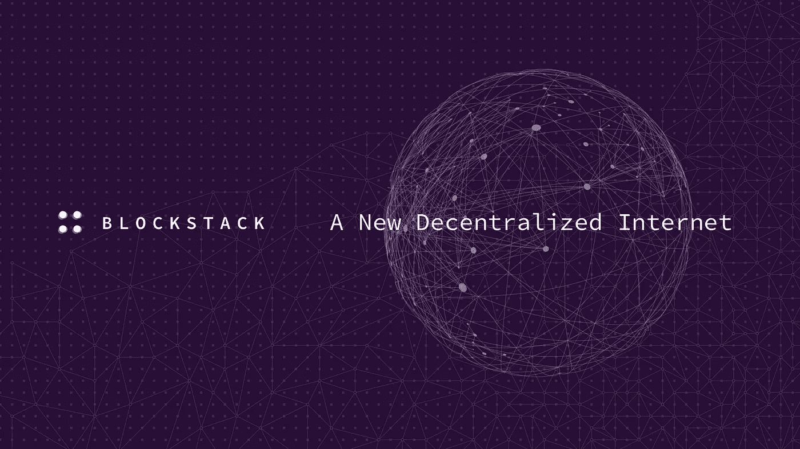

# 通过参与您自己的分散式 Blockstack 浏览器赢取奖金！

> 原文：<https://medium.com/coinmonks/earning-bounties-by-participating-with-your-own-decentralised-blockstack-browser-535c864a107?source=collection_archive---------8----------------------->

赚取奖金。我将在未来写更多关于这个有趣的主题，但这篇文章完全致力于 Blockstack！“为什么会这样？”，有人可能会问…

**Blockstack: A new decentralized Internet**

有几个原因，但第一个是非常重要的事情。[在我的上一篇文章](/@bertbosman/bringing-crypto-to-the-masses-52dfec231c25)中，我谈到了加密项目的三个规则。平台应该易于**接近**(这也意味着易于使用；)，它们应该是**匿名的**和**无权限的**，所以对于每个人来说都可以参与……并且人们应该总是有可能**选择退出。**是的……你应该可以随时离开……而不会造成大的伤害。因此，让我们看看当我们将所有这些规则应用于块堆栈时会发生什么。

先说一下**第一法则**。可达性。直接进入 Blockstack 网站的[主页，可以看到两个按钮。当您点击“*安装*”时，您就可以轻松参与了。没有给出任何额外的信息，但它们基本上给了你所需要的…即…轻松访问最新版本的 Blockstack 浏览器！太棒了。只需点击几下鼠标，我们就可以开始运行了。当然，您现在可以尝试点击并运行 web 应用程序，但是请稍等，让我用几秒钟时间指导您完成这个过程…](https://blockstack.org)

在我们第一次点击后，我们读到:*“block stack 是一个为自由安全而设计的新互联网&。在 Blockstack 上，您可以找到让您控制数据的应用程序。”*。好的，听起来不错，所以我想输入我们的电子邮件地址会很有价值。*目前哪个应用程序不需要连接到电子邮件地址？；)*……然后我们可以继续阅读……*“block stack 没有第三方:您设备上的钥匙链可以让您访问！”好的，听起来也很不错。所以让我们选择一个密码来保护我们的新钥匙链。(*也许我们应该用我们的*[*Lastpass*](http://www.lastpass.com)*插件生成一个安全的？；)*但是要注意… **一定要在纸上写下这个 12 个字的关键短语！不要以数字方式存储这个钥匙链，这非常重要！就像所有去中心化的事情一样，这也意味着至少要对它负责一点。当我们做到这一点，我们已经在那里了！我们可以看到浏览器界面，我们可以发现平台上一些令人惊叹的应用程序。***

好吧，说实话。发现应用程序实际上并不像听起来那么容易。这里有一点批评是，我发现发现这些应用程序的用途有点困难。“我能用它们做些什么呢？”，是我的第一个想法。当你回来几次，你尝试一些东西，你会很快注意到，例如，你也可以将你自己的专属名称-身份附加到你的新 blockstack-ID...非常酷！

每当你试图在这个平台上使用应用程序时，一定要意识到这样一个事实(就像区块链的所有东西一样& crypto)这些东西都还在发展中。所以，不，这个平台上的一切都不会尽如人意，但美好的事情是，你可以在开发这些应用的同时一起学习和发现。当你不知道某些事情时，总有一个非常容易访问的[论坛](https://forum.blockstack.org/)可用！

但是……这基本上是很容易开始的。它工作得很好，不是吗？当然，您可以继续使用 web 应用程序，但是我建议您也运行自己的本地主机。一样简单。点击几下，你就可以在你的电脑上安装应用程序，基本上你会经历同样的过程。也许你甚至想运行自己的 Blockstack 节点？嗯，你也可以这样做，但老实说，我没有这方面的经验。).我的猜测是，虽然它不会有太大的不同。

现在。一旦你加入了，你就可以立即成为新社区的一员。非常有趣的是，你可以获得“筹码”作为你参与的奖励。通过[对 Blockstack 社区](https://contribute.blockstack.org)的贡献，我已经赚了大约 22，50 美元！是因为我的钱吗？不，它不是，但它确实激励偏离轨道。是的，我喜欢我可以赚取赏金的事实，是的，我也必须支付租金…但在这一发展中更重要的是，Blockstack 实际上希望你赚取堆栈，因为这意味着这些硬币在网络上更均匀地分布！还有是的……至于**密码**的第二条规则，你可以这样做**匿名**和**无权限**随你便。一个解释。我将引用我从白皮书中摘录的一些片段，这对我来说有点太专业了，但从这个角度来看……我的知识也在发展中。

*“在区块堆栈 BNS(区块链名称系统)中，名称由底层区块链的加密地址及其相关私钥所拥有。用户先预订，然后在两阶段提交过程中注册一个名称。第一个成功完成预订和注册交易的用户被授予该名称的所有权。任何人都可以创建名称空间或在名称空间中注册名称，因为没有中央机构来阻止某人这样做。”*

所以没有中央权力机构会为我们决定选择什么！当然，该名称仍应可用，并收取费用，但这主要是为了防止“土地掠夺”，即“*……阻止人们注册大量他们不打算实际使用的名称空间/名称。*“这种偏离路线很有道理。你也可以注册一个以上的 ID-name，当你从浏览器进入某个应用程序时，你可以选择在登录时使用哪一个！至于匿名和“无许可访问”的部分，在我看来已经涵盖得差不多了。我们只剩下一件事。

**第三条规则**是选择‘选择退出’**。在我看来，我仍然拥有最初拥有的所有可用工具。我可以选择进入，并且很容易使用另一个浏览器，以旧的方式成为互联网的一部分。Blockstack 至少不会阻止这一点，甚至更多，因为你可以在你原来的浏览器中进入平台。当然，我们必须开始使用平台上的应用程序，看看会发生什么，但看起来我们将完全控制自己的数据。*“新用户/节点需要在网络上建立信任……”*所以是的，肯定会有一定数量的'*..附加到某些应用程序..还有名声…* '涉及其中，但我们必须试着看看结果如何。现在对我来说一切都很好。在分散的应用程序之间的注意力竞争中，开发者总是有优势的…所以也有保持干净的动机！**

**作为对此的最后一个论证，我想添加白皮书中的以下片段……*“我们认为，支持从一个区块链迁移到另一个的能力非常重要，因为它允许更大的系统继续存在，即使底层的区块链遭到破坏。该架构允许多个底层区块链。”***

**所以对于结论来说。对我来说，Blockstack 似乎是一个非常简洁、干净和易于使用的浏览器，它允许你以一种非常酷的方式尝试和使用新的去中心化互联网。你会很快发现你可能想成为这个项目的参与者和贡献者。这个' *400 字的帖子*'比如……*(这就是 Blockstack 希望从我这里收到的 300 个新堆栈！)*，也是这一承诺的一部分，可能会让我更多地参与到社区中来。我已经写了一些话，因为我对它非常热情，想彻底。目前一叠大约值 0.15 美元。所以这个帖子只要 45 美元就可以了？*哇…我希望如此…**

**正如你在下面的图片中看到的，我已经做得很好了，赚了一些钱，做了一些贡献，即使我不是开发者。感谢 Blockstack…继续努力，我一定会继续推广你，并继续发现提供的服务。我想以 Blockstack-platform 的联合创始人之一**穆尼布·阿里**的一个很棒的 TEDx 演讲的链接来结束我的演讲。绝对值得一看…**

**[**欢迎来到新互联网**](https://youtu.be/qtOIh93Hvuw) | Muneeb Ali | TEDxNewYork！！**

**现在继续享受所有这些新的惊人的可能性，如果你对我写的东西有任何评论或批评，我很期待！但是一如既往，请保持礼貌…**

***PS。当然，这篇文章仍然需要被验证，让我们等着看我是否通过了验证过程…)***

****

**Rewards I’ve earned so far…**