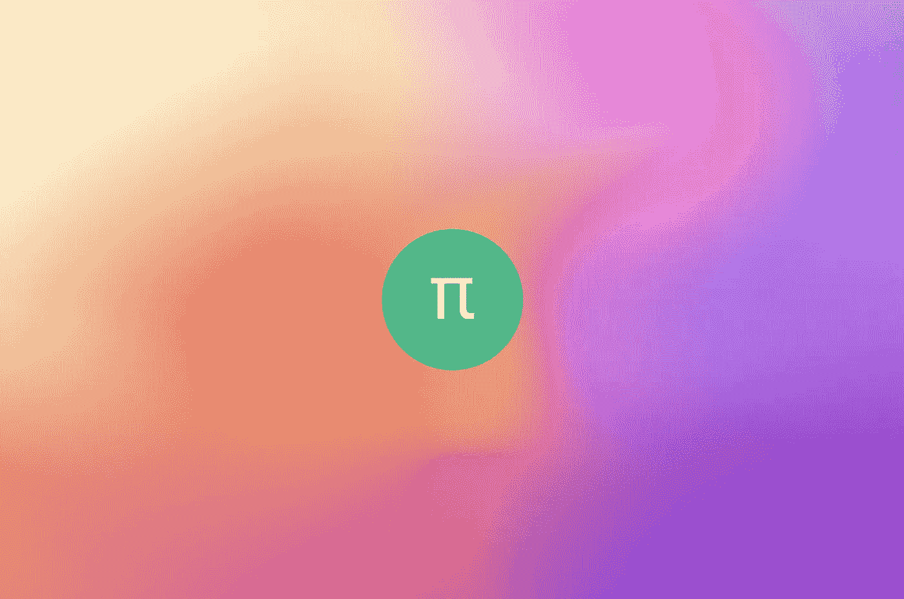
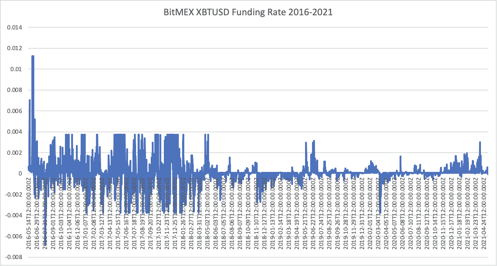
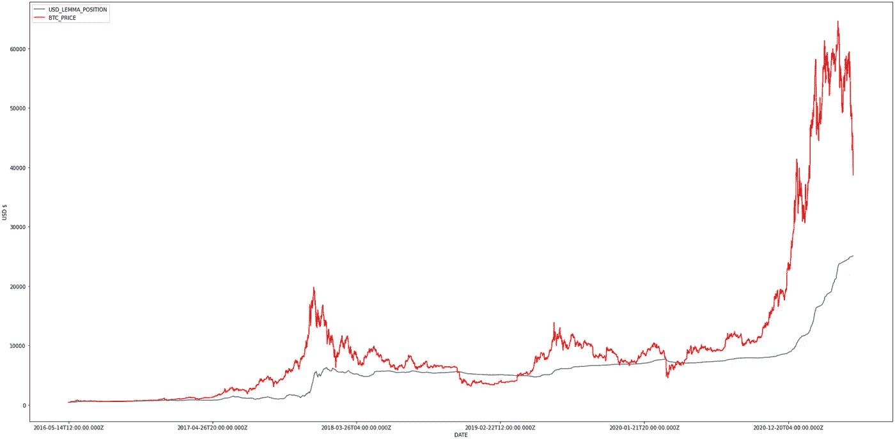
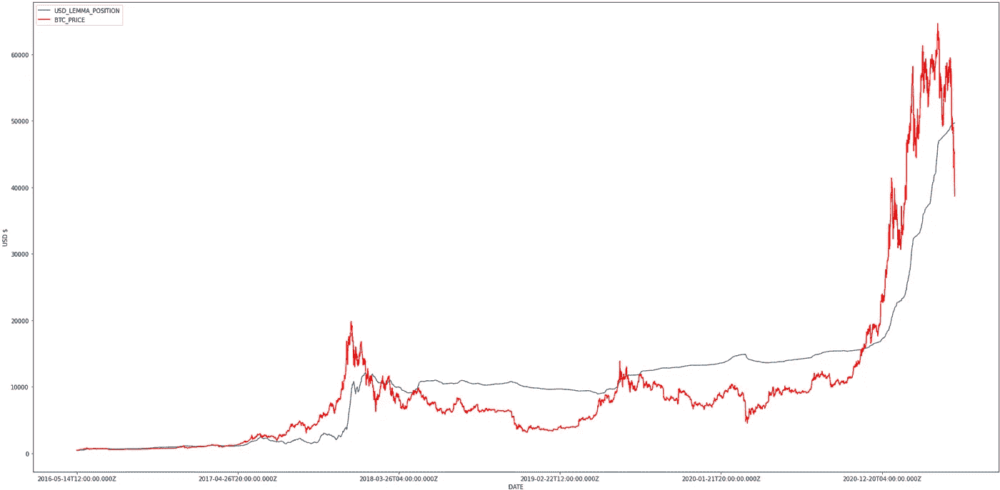
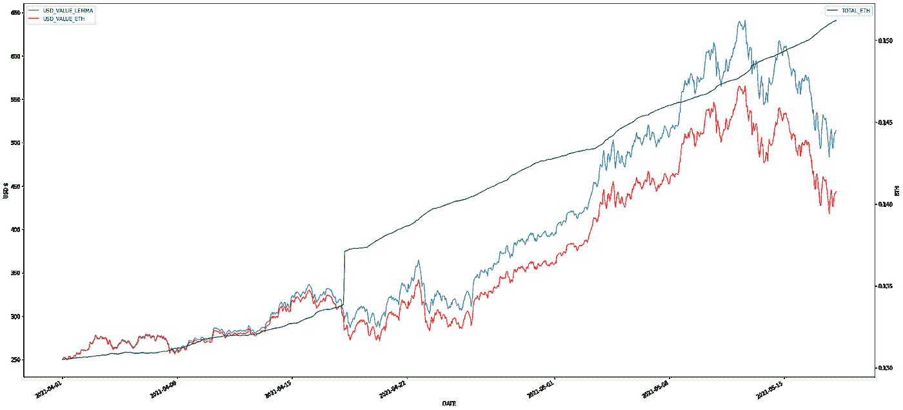

# 通过基差交易赚取差价

> 原文：<https://medium.com/coinmonks/earning-defi-yield-via-basis-trading-379d1d5e7207?source=collection_archive---------1----------------------->

# DeFi 建立在贷款协议上

自 2021 年 1 月以来，去中心化金融生态系统的增长超过了 8 倍，仅在五个月内就从 100 亿美元 TVL 飙升至 800 亿美元(总价值锁定)。然而，近一半( [43%](https://defipulse.com/) )的 TVL 属于三种贷款协议:制造商、Aave 和复合贷款。

因此，许多使用 crypto 锁定借贷协议的用户完全依赖 crypto 和 stablecoin 借贷的高利率来产生收益。因为稳定的货币借贷到目前为止一直维持着高利率，所以不难想象人们会意识到他们可以:

1.  以加密年利率的一小部分借入法定美元
2.  将其转换成与美元挂钩的稳定货币
3.  存入一份提供 15% APY 的贷款协议

参与其中的人越多，每个人的利率和利润就变得越低。

# 集中交易所的基差交易

在对卓越和可持续的 DeFi 收益率的不懈追求中，我们发现了一个快速增长的细分市场，可以帮助我们实现这一目标:分散化衍生品。但首先，快速历史课的加密衍生品，永久掉期和交易者如何从这些掉期大幅获利。

[Bitmex](/coinmonks/bitmex-review-280ca1c00980) 是一家集中式加密货币交易所，成立于 2014 年；不久之后，他们创造了一种叫做[永久掉期](https://www.bitmex.com/app/perpetualContractsGuide)的金融工具。顾名思义，永久掉期是一种永不到期的期货合约。为了使永久掉期的价格与 BTC 现货价格保持一致，Bitmex 实施了一种称为融资利率的机制。融资费率支付是交易“热门”方的交易者必须向交易“冷门”方的交易者支付的经常性费用。

历史上，由于多种原因，持有多头头寸的交易者通常会支付持有空头头寸的交易者。最大的原因是更多的资本想做多加密技术而不是做空它。当融资利率为正时，持有多头头寸的交易者向持有空头头寸的交易者付款。下图显示了 2016 年至今 Bitmex 上 BTC 永久掉期的融资利率；平均值约为 0.015%。

基差交易是一种寻求从这些融资利率中获利的策略。它可以通过几种不同的方式实现。在 Bitmex 上，由于接受的抵押品是 BTC，交易者每存入 1 个 BTC，就会做空 1 个 BTC 永久合约。然后，交易者将是市场中性的，并且将每 8 小时获得(或必须支付)一个资金利率；但是，正如我们在上面看到的，持有多头头寸的交易者通常会支付空头头寸的交易者！

在下图中，我们对基差交易策略与简单持有 BTC 的回报进行了回溯测试。有几个项目很突出:持有 BTC 表现更好，基差交易与 BTC 相比减少了近 90%(从历史峰值下降)，两种策略都有强劲的美元计价回报。在过去的一年里(2020 年 5 月 19 日-2021 年 5 月 19 日)，基差交易带来了 103%的回报，最大跌幅为 0.3%，持有 BTC 带来了 297%的回报，最大跌幅为 40%。

这实际上意味着什么？基差交易可以提供很大的上升风险，同时防范下跌风险。基本上，如果你不确定未来是牛市还是熊市，并且你有兴趣在不担心市场波动的情况下产生收益，这绝对是一个值得考虑并加入更广泛投资组合的策略。

这是针对 Bitmex 的 1 倍杠杆，但让我们看看杠杆为 2 倍时的图表:

基差交易比持有比特币的表现好得多，而且没有太大的波动性！但是 2 倍杠杆不就意味着平仓风险吗？不一定；指数和市场价格之间需要有 50%的价格差异(这是非常罕见的，可以减轻)。最初，Lemma 将只提供 1 倍杠杆基础交易，但请关注我们，了解 2 倍(或更多)交易何时可用:)

# 引理

Lemma Finance 为存款提供了优越且可持续的收益。我们目前集成了永久协议(其他协议，如 DyDx、MCDEX、Injective 和 Futureswap 将紧随其后)。我们当前的“基差交易策略”与通常的实施略有不同，我们在下面描述了一些条件，但我们仍然致力于提供正常的基差交易策略。

有趣的是，永久协议的融资利率一直为负，甚至在牛市的顶峰时期也是如此。正如我们在 Bitmex(以及其他所有交易所)看到的那样，这种情况非常罕见。但是，不要害怕！这对 Lemma 和它未来的用户来说都是塞翁失马，焉知非福。我们目前的“基差交易策略”利用了这一点，取而代之的是让用户在交易所做多。它还做了一些事情，如自动再投资资金支付。我们对过去 6 个月进行了回溯测试，结果如下:

根据我们用永久协议子图中的数据进行的[回溯测试](https://colab.research.google.com/drive/14qf3klgfBZa1Ah4oPaKsggRfdxgeGZ9L?usp=sharing)，Lemma 的策略比简单地持有 ETH 要高出 120%*！如果你认为我们目前仍处于 ETH 牛市，并希望获得 ETH 计价的收益，基差交易可能是你的最佳选择之一。

我们将在与我们整合的其他交易所实施正常的基础交易策略，并在融资利率翻转的情况下实施永久协议。因为基差交易有助于衍生品交易所的运作，它产生的收益更可持续。

如果你想了解更多关于基差交易的知识，我推荐亚瑟·海斯(Arthur Hayes)(bit MEX 的联合创始人和前 CEO)[文章](https://cryptohayes.medium.com/all-aboard-4d50435190d6)。

# 为什么 Lemma 不是一个渴望策略？

首先，我想说我个人是《渴望》的粉丝(和用户)。它最接近于加密的高收益储蓄账户。因此，向往的核心原则之一是，你储蓄的 APY 永远不会是负的。它可能为零或非常低，但决不是负数。

另一方面，如果你太快(几周之内)撤资，基差交易(推而广之，Lemma)不能保证 APY 为非负。正如我们之前看到的，虽然融资利率通常是正的，但也有负的时候。

# *了解更多关于引理的知识*

引理。金融是一个 DeFi 项目，通过以非托管方式自动交易用户存款资产，产生卓越、可持续的收益。它允许投资者从借贷协议产生的收益中分散投资，与渴望获得更大回报的投资者相比，它具有不同的风险特征。

*感谢你阅读这篇文章，如果你喜欢你所读的，请查看*[*lemma . finance*](http://lemma.finance/)*！*

推特:[https://twitter.com/LemmaFinance](https://twitter.com/LemmaFinance)

不和:[https://discord.gg/K2wtWvxmRU](https://discord.gg/K2wtWvxmRU)

*该数字不包括首次存取资产时产生的汽油费、滑动费和交换费。

这不是财务建议，莱马也不是财务顾问。请自行进行研究和分析。