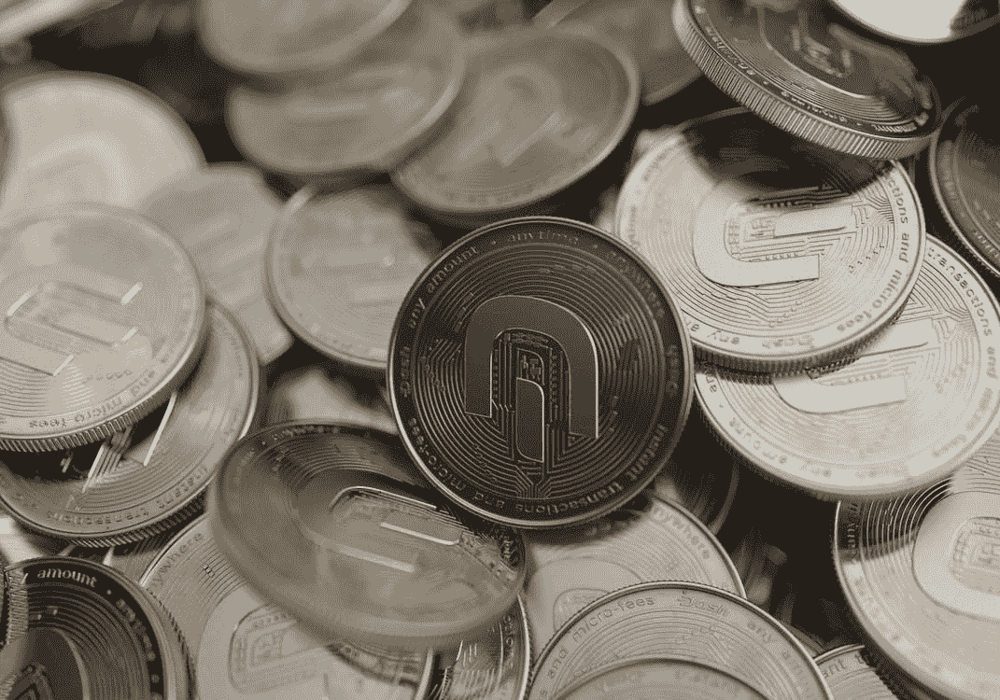
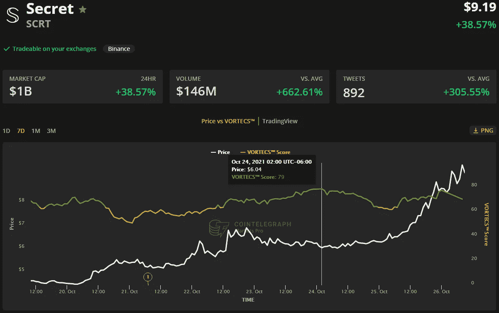
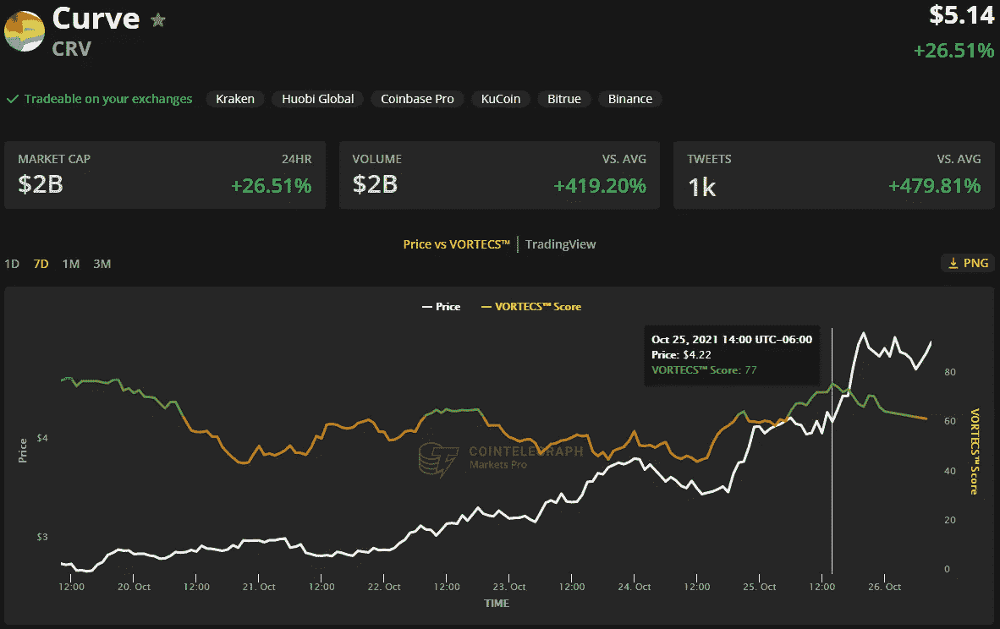
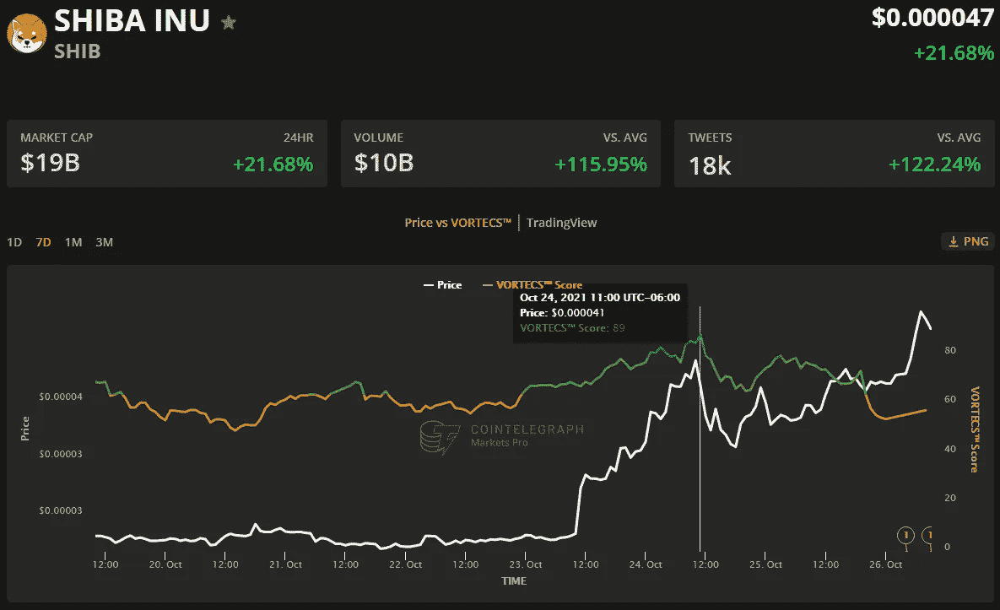

# 来自 Secret、Curve 和 Shiba Inu 的收益表明，替代硬币季节即将到来

> 原文：<https://medium.com/coinmonks/earnings-from-secret-curve-and-shiba-inu-suggest-an-altcoins-season-ahead-ceae4b611e44?source=collection_archive---------3----------------------->

## SCRT 和 SHIB 股市创下新高，而 CRV 股市的反弹打破了近一年的横盘趋势。

pexels.com

宣布“替代季”的声音越来越大，因为几天来替代币市场的价格一直在上升。与此同时，比特币价格继续在 62，000 美元支撑位附近的历史高点下方盘整。

通常，替代硬币的走势集中在特定的代币领域，如 meme 货币或分散式金融协议，但当前市场正在经历所有领域的增长，这可能是一个新的替代季节正在形成的迹象。

来自 Cointelegraph Markets Pro 和 TradingView 的数据显示，过去 24 小时内涨幅最大的货币是 Secret (SCRT)、Curve (CRV)和 Shiba Inu (SHIB)。

# 与 OpenSea 秘密合作推出匿名 NFTs

Secret Network 是一种区块链协议，内置了智能合约和分散式应用程序的数据隐私，由本地 SCRT 令牌提供支持。

根据 Cointelegraph Markets Pro 的数据，一段时间以来，SCRT 的市场条件一直很有利。

由 Cointelegraph 独家提供的 VORTECS 评分是对历史和当前市场状况的算法比较，来自数据点的组合，包括市场情绪、交易量、最近的价格变动和 Twitter 活动。

VORTECS™ Score (green) versus SCRT price. Source: Cointelegraph Markets Pro

如上图所示，SCRT 的 VORTECS 指数在 10 月 22 日开始回升，并在 10 月 24 日达到 79 的高点，大约 6 个小时后，价格在接下来的两天内飙升 65%，创下 9.66 美元的历史新高。

SCRT 的价格上涨和势头是在 Secret Network 上推出第一个匿名不可替代代币(NFT)之后，这是通过最近与 NFT 最大的市场 OpenSea 的合作实现的。

# 曲线延伸了它的生态系统

CRV 是 Curve 生态系统的原生令牌，这是一个分散的 stablecoins 交易所，使用自动化做市商来管理协议中的流动性。

在最近的价格重估之前，来自 Cointelegraph Markets Pro 的 VORTECS 数据在 10 月 25 日开始检测 CVR 的看涨前景。

VORTECS™ Score (green) versus CRV price. Source: Cointelegraph Markets Pro

如上图所示，CRV 的 VORTECS 指数在 10 月 25 日开始回升，并在第二天上涨 31.66%的同时达到 77 的高点。

CRV 价格上涨之际，该协议继续在多个一层和二层网络上建立加密货币生态系统的合作伙伴关系和集成。

# 柴犬创建了一个社交俱乐部

柴犬起源于 20 世纪 20 年代末的一种迷因货币，并已演变成一个生态系统，包括分散的柴犬交易所和自己的 NFT 线，供其社区成员进行交易。

Cointelegraph Markets Pro 的 VORTECS 数据在 10 月 24 日开始检测 SHIB 的看涨前景，这发生在最近的价格飙升之前。

VORTECS™ Score (green) versus SHIB price. Source: Cointelegraph Markets Pro

如上图所示，SHIB 的 VORTECS 指数在 10 月 23 日开始回升，并在 10 月 24 日达到 89 分的高点，大约 7 个小时后，价格在接下来的两天内上涨了 40.7%，创下 0.000049 美元的历史新高。

SHIB 的价格上涨是在引入 Shiboshi Social Club 之后，该俱乐部专为 Shiboshi NFT 业主提供，并为所有社区成员提供专属福利。

全球加密货币市值目前为 2.621 万亿美元，比特币的主导率为 45%。

> 加入 Coinmonks [电报频道](https://t.me/coincodecap)和 [Youtube 频道](https://www.youtube.com/c/coinmonks/videos)了解加密交易和投资

## 也阅读

 [## 最佳加密交易所| 2021 年十大加密货币交易所

### ICON _ PLACEHOLDEREstimated 预计阅读时间:28 分钟加密货币交易所的加密交易需要知识…

blog.coincodecap.com](https://blog.coincodecap.com/crypto-exchange)  [## 2021 年 10 大最佳加密贷款平台| CoinCodeCap

### 当谈到加密货币贷款时，大量因素等同于良好的收入状况。此外，借款的一部分…

blog.coincodecap.com](https://blog.coincodecap.com/crypto-lending)  [## 2021 年最佳免费加密交易机器人

### 2021 年币安、比特币基地、库币和其他密码交易所的最佳密码交易机器人。四进制，位间隙…

medium.com](/coinmonks/crypto-trading-bot-c2ffce8acb2a)  [## 最佳 4 个加密交易信号电报通道

### 这是乏味的找到正确的加密交易信号提供商。因此，在本文中，我们将讨论最好的…

medium.com](/coinmonks/best-crypto-signals-telegram-5785cdbc4b2b)  [## BlockFi 评论 2021:利弊和利率| CoinCodeCap

### 今天，我们提出了一个全面的 BlockFi 评论，这是一个成立于 2017 年的加密贷款平台，拥有其…

blog.coincodecap.com](https://blog.coincodecap.com/blockfi-review)  [## 如何在印度购买比特币？2021 年购买比特币的 7 款最佳应用[手机版]

### 如何使用移动应用程序购买比特币印度

medium.com](/coinmonks/buy-bitcoin-in-india-feb50ddfef94)  [## 加密税务软件——五大最佳比特币税务计算器[2021]

### 不管你是刚接触加密还是已经在这个领域呆了一段时间，你都需要交税。

medium.com](/coinmonks/best-crypto-tax-tool-for-my-money-72d4b430816b)  [## 存储比特币的最佳加密硬件钱包[2021] | CoinCodeCap

### 保管您的数字资产很容易，但找到正确的存储方式却是一项繁琐的任务。在线钱包有一个风险…

blog.coincodecap.com](https://blog.coincodecap.com/best-hardware-wallet-bitcoin)