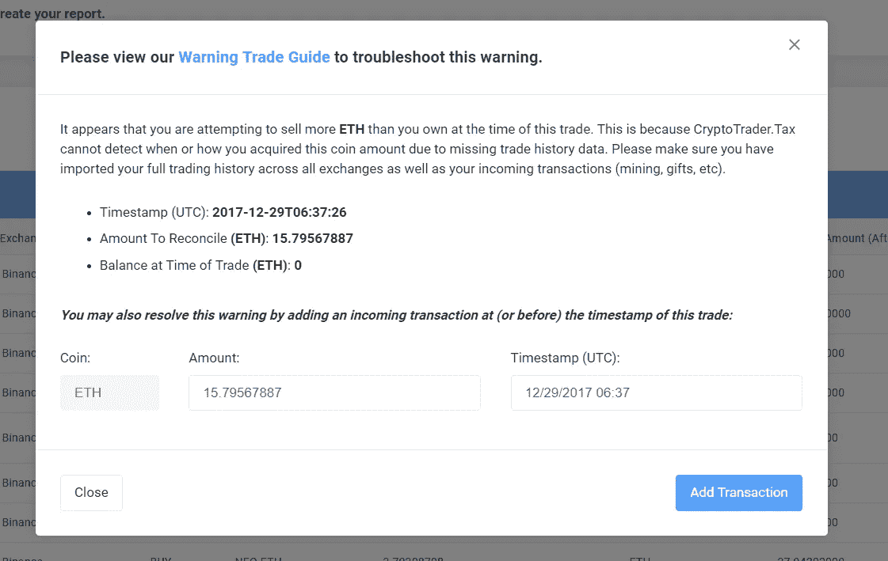

# 在 CryptoTrader 中轻松修复您的警告交易。税务-主要更新

> 原文：<https://medium.com/coinmonks/easily-fix-your-warning-trades-inside-of-cryptotrader-tax-major-update-a8f50a6c70bd?source=collection_archive---------2----------------------->

我们的用户所要求的第一个功能现在已经上线。

“警告交易”现在可以在应用程序中修复，你的税务报告现在可以运行了。

至少可以说，12 月是紧张的一个月。我们看到成千上万的密码爱好者开始税务规划和报告过程。

随着音量的增大，出现了一些问题。

许多用户遇到了麻烦，原因是缺少历史交易数据，以及币安和波洛涅克斯等交易所的舍入误差，这使得他们似乎卖出了比他们拥有的更多的硬币。这些被标记的交易直接阻止了税务报告…这是一个大问题。

谢天谢地，你让我们意识到了这个问题。

我们的开发团队在过去几周一直在努力工作，推出一个直观的修复，我们很高兴地说，它现在是活的！

通过此更新，您现在可以:

*   运行报告，即使你有警告交易，看看他们如何影响你的税号
*   进行“应用内”修复，从你的报告中消除警告交易

检查[新的工作流程](https://www.cryptotrader.tax)来修复那些讨厌的警告交易。

*另外，你还想看到产品增加其他功能或更新吗？只需发邮件给我:*[*Lucas @ cryptotrader . tax*](mailto:lucas@cryptotrader.tax)*。我们会处理的。*

*使用*[***CryptoTrader 自动报告您的加密货币资本收益。税***](http://www.cryptotrader.tax/) 。