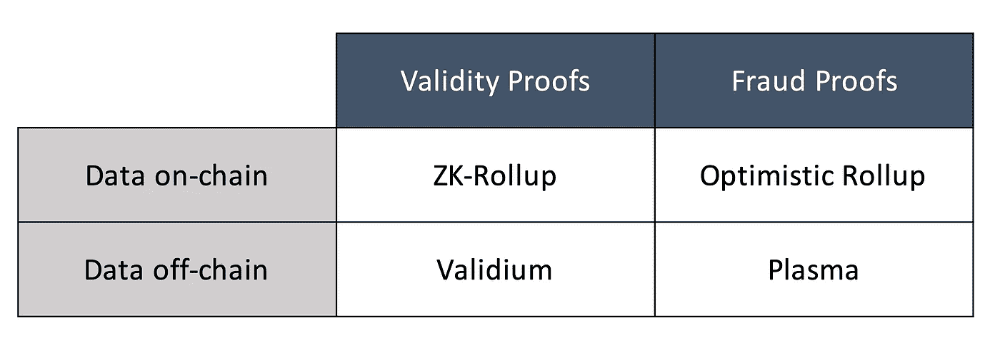
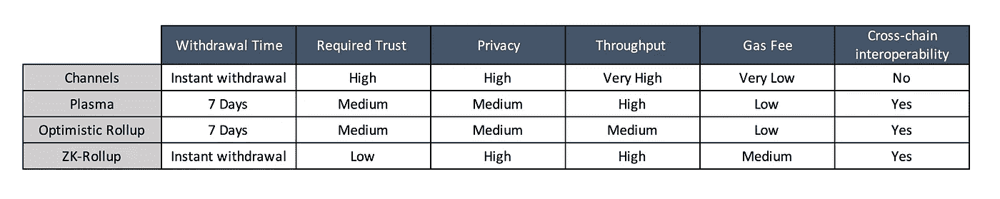
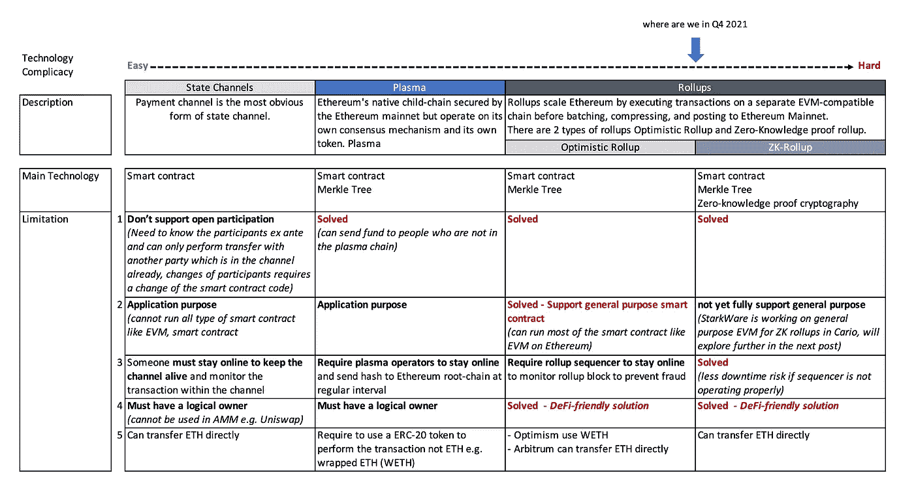

# 易于理解的以太坊第 2 层扩展解决方案:通道 vs 等离子 vs 汇总

> 原文：<https://medium.com/coinmonks/easy-to-understand-ethereum-layer-2-scaling-solutions-channels-vs-plasma-vs-rollups-1dc1d4e9cb52?source=collection_archive---------1----------------------->

所有第 1 层区块链网络都有区块链三难问题:分散化；安全性；可扩展性。并且扩展解决方案试图在很少或不牺牲其他两个属性的情况下扩展网络的性能。

以太坊无疑是基于智能合约的区块链的领导者。dApps 的巨大需求推动交易费用在 2021 年 5 月高达 70 美元。现在，平均交易费用可能已经下降到 20-40 美元，但这个数字仍然非常庞大，许多人无法负担。虽然 ETH 2.0 正在努力通过分片和过渡到股权证明来扩展基础层本身，但仍然需要第 2 层解决方案，以便立即改善当前以太坊网络的拥塞情况，并为后 ETH 2.0 时代的大规模采用奠定基础。

# **状态通道**

如果你没有听说过国家频道，你可能已经知道什么是付费频道。支付渠道是国家渠道的一种形式(最常用的一种)。比特币网络闪电网是区块链支付渠道的一个很好的例子。以太坊中状态通道的例子有[雷电](https://raiden.network/)、[策勒网络](https://www.celer.network/)、[连接下](https://connext.network/)和[状态通道](https://statechannels.org/)。

以太坊中的渠道最适合于从事大量交易的一组已知方，并且该组之间已经有很高的直接信任度。渠道还需要一大笔资金来锁定渠道的智能合约。

Channels 是最早的扩展解决方案。然而，在 2021 年，鉴于它不支持通用智能合同和许多 DeFi 应用。预计我们将越来越少看到它。

# **血浆**

Plasma 可以被认为是以太坊的原生“侧链”，它使用智能契约和 Merkle 树来创建无限的子链。这些子链几乎是以太坊的复制品，但有其共识机制和业务逻辑。Plasma 在 chid 链中保存事务数据和计算，然后定期将状态数据发送到根链(以太坊)。Plasma 依靠**保税防欺诈系统**来保障安全。当参与者在血浆区块链中请求退出时，需要等待一段质疑期(7-14 天),以便子链中的其他人提交证据来质疑退出。如果交易有效，所有者将在挑战期后收到资金。如果撤销被证明是欺诈性的，该批交易及其后的所有批次将被还原。在阻止攻击的情况下，plasma 子链参与者可以快速、廉价地批量退出以太坊，而无需信任 plasma 子链验证器，这意味着 plasma 仍然受到底层以太坊主网络的保护。等离子体的例子包括 [OMG 网络](https://omg.network/)、[等离子体](https://plasma.io/)和[织机网络](https://loomx.io/)。

[StarkWare](https://starkware.co/) 的 [Validium](/starkware/volition-and-the-emerging-data-availability-spectrum-87e8bfa09bb) 在 plasma 中使用零知识证明(而不是欺诈证明)解决了这个长撤回时间的问题。将在以后的文章中进一步探讨这个解决方案。

值得指出的是，像币安智能链或者 [Polygon](https://polygon.technology/) 这样的侧链其实并不是以太坊的第二层扩展解决方案。事实上，它们是一个独立的区块链，有自己的共识机制和安全属性。然而，鉴于这些侧链的代码与以太坊的高度相似，这使得它们与以太坊的桥接非常容易。许多人会说，这些侧链不像以太坊那样分散，因此，它们不像以太坊和等离子体那样是安全的网络。

等离子体在 DeFi 时代的一个致命弱点。任何未经所有者同意就可以改变对象状态的系统(例如 Uniswap)都不能很好地与等离子体一起工作。即使其它侧链可以在等离子体链和那些 DeFi 应用之间桥接，但是由于额外的复杂性，它不是最佳的。接下来，我们进行汇总。

# **汇总**

血浆和浓缩血浆有两个主要区别。

1.  虽然 plasma 将所有的交易数据和计算保存在链外，但 rollup 将一些数据保存在以太坊区块链上。因此，所有以太坊节点都可以验证汇总侧链上的交易，而不仅仅是侧链中的参与者。明显的好处是增强了安全性，避免了集中化。
2.  汇总是通用的，甚至可以在汇总中运行 EVM，允许现有的以太坊应用程序迁移到汇总，几乎不需要编写任何新代码。

rollup 中的链上事务数据被高度压缩以仅包括网络验证事务所需的必要数据，其他数据如状态存储将在 rollup 子链中保持离线。较小的数据大小使得汇总在第 1 层主网上仍具有良好的可伸缩性。

现在有两种类型的汇总。

1.  **乐观汇总**，其使用**欺诈证据**(与 Plasma 相同)，因此，乐观汇总也会有更长的撤销时间——乐观汇总批次中的数据包括 1)压缩汇总发送数据，2)前状态根哈希和 3)后状态根哈希
2.  **ZK 汇总，**使用**有效性证明**:此外，每个 ZK 汇总批次都包括 4)一个被称为 ZK-斯纳克的加密证明，它证明后状态根是执行批次的正确结果。无论计算量有多大，都可以非常快速地在链上验证证明，因此 zk-rollup 上的撤销将是立即的。

> *虽然没有人知道未来会怎样，但哪种扩展解决方案会在未来胜出。* [*Vitalik 在他的博客*](https://vitalik.ca/general/2021/01/05/rollup.html) 中写道:“总的来说，我自己的观点是，在短期内，乐观汇总可能会在通用 EVM 计算中胜出，ZK 汇总可能会在简单的支付、交换和其他特定应用的用例中胜出，但从中长期来看，随着 ZK-斯纳克技术的改进，ZK 汇总将在所有用例中胜出。”

我相信图表胜过千言万语，因此这里有一个汇总表，可以帮助您快速概括这些年来扩展解决方案改进了多少。

Pros and Cons of Channels, Plasma and Rollups

Comparison on Channels, Plasma and Rollups

如果你喜欢我写的东西，你也可以在 Twitter 上关注我， [@samchan_2008](https://twitter.com/samchan_2008)

> 加入 Coinmonks [电报频道](https://t.me/coincodecap)和 [Youtube 频道](https://www.youtube.com/c/coinmonks/videos)了解加密交易和投资

## 也阅读

 [## 最佳加密交易所| 2021 年十大加密货币交易所

### ICON _ PLACEHOLDEREstimated 预计阅读时间:28 分钟加密货币交易所的加密交易需要知识…

blog.coincodecap.com](https://blog.coincodecap.com/crypto-exchange)  [## 2021 年 10 大最佳加密贷款平台| CoinCodeCap

### 当谈到加密货币贷款时，大量因素等同于良好的收入状况。此外，借款的一部分…

blog.coincodecap.com](https://blog.coincodecap.com/crypto-lending)  [## 如何在印度购买比特币？2021 年购买比特币的 7 款最佳应用[手机版]

### 如何使用移动应用程序购买比特币印度

medium.com](/coinmonks/buy-bitcoin-in-india-feb50ddfef94)  [## 最佳 4 个加密交易信号电报通道

### 这是乏味的找到正确的加密交易信号提供商。因此，在本文中，我们将讨论最好的…

medium.com](/coinmonks/best-crypto-signals-telegram-5785cdbc4b2b)  [## BlockFi 评论 2021:利弊和利率| CoinCodeCap

### 今天，我们提出了一个全面的 BlockFi 评论，这是一个成立于 2017 年的加密贷款平台，拥有其…

blog.coincodecap.com](https://blog.coincodecap.com/blockfi-review)  [## 加密税务软件——五大最佳比特币税务计算器[2021]

### 不管你是刚接触加密还是已经在这个领域呆了一段时间，你都需要交税。

medium.com](/coinmonks/best-crypto-tax-tool-for-my-money-72d4b430816b)  [## 存储比特币的最佳加密硬件钱包[2021] | CoinCodeCap

### 保管您的数字资产很容易，但找到正确的存储方式却是一项繁琐的任务。在线钱包有一个风险…

blog.coincodecap.com](https://blog.coincodecap.com/best-hardware-wallet-bitcoin)