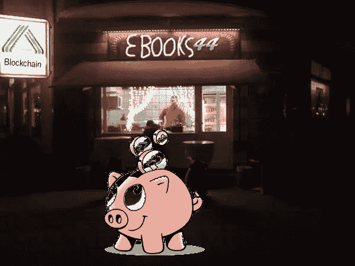

# 区块链中的电子书

> 原文：<https://medium.com/coinmonks/ebooks-in-the-blockchain-500f3778d4c7?source=collection_archive---------1----------------------->



# 摘要

我将提出一种具体的方法，将区块链网络中的智能合同和文件共享网络结合起来，这样一个开放、透明和“无信任”的电子书市场将成为可能。区块链网络附带的数字签名将用于签署文件共享网络中的请求。因此，只要存在涉及那些商业伙伴的适当的区块链交易进行验证，电子书的加密副本就可以从呼叫者传送到接收者。

# 先决条件

# 区块链

我们将智能合约定义为在对等网络中运行的小型计算机程序。我们特定的智能合同将通过在网络中的区块链中接收交易来管理电子书的所有权。这种链通常被称为区块链。为了简单起见，并且在不引起混淆的情况下，当我们提到维护区块链数据的对等网络时，我们也使用区块链这个词，而不是数据块本身。

区块链可以通过使用其 P2P 网络协议固有的共识算法来保证交易的有效性和完整性。这独立于任何中央权力机构或机构。

# 文件共享网络

由于区块链不足以传输电子书数据，因此需要第二个网络。

我们提出了一个文件共享网络，虽然这非常接近于今天用于非法和不受控制的文件共享。与现有的文件共享相比，我们的目标是一个受控和安全的文件共享网络，其中的每次数据传输都对应于区块链的一次交易及其货币价值。

这将意味着，所有权和知识产权可以得到尊重，而电子书文件易于运输，没有不必要的限制。

这将大大改善目前的情况，因为我们今天的情况是，版权保护和其他类型的数字版权管理严重阻碍了电子书的销售和转让。

# 电子书盗版及其对策

当今电子书交易中的一个常见问题是电子书盗版。对于一个有经验的人来说，取消电子书的版权保护是很容易的。然后，未加密的电子书在暗网上以合法价格的一小部分出售。或者可以在文件共享网络上免费下载。

众所周知，数字版权管理(DRM)也会在许多方面损害电子书交易。

为了防止非法拷贝，电子书通常以加密形式分发。在这些情况下，解密和可读性仅限于特定的硬件(电子书阅读器)或特定的软件。因此，读者被剥夺了很多灵活性。几乎总是没有办法让他们放弃或转售电子书。形成收藏，存储电子书，电子书格式之间的转换，使用不同的阅读器软件或硬件，任何这些活动要么是不可能的，要么局限于卖方提供的“监狱”。

这似乎是一个几乎无法解决的问题，因为没有办法完全消除创建一个可读的电子书副本并在互联网上传播的可能性。通过或多或少的努力，总是有可能复制一本电子书，即“去 DRM”。

必须给读者一个新的激励，以激励他们合法购买电子书，即使这比非法拷贝更贵。

我们相信，这种激励是可以找到的，因为电子书市场的现状并不令人满意，无论是对读者、出版商还是编辑来说都是如此。这种情况可以在许多方面得到改善，以便电子书的交易变得不那么复杂，更加透明，并且更少受到特定软件或硬件的限制。

一旦这些缺点被消除，一个更好的电子书市场将成为可能，这对所有相关方都有很多好处。

在一个合法和透明的电子书市场中，交易会更容易，这将是人们在一个对用户友好的开放市场中买卖的第一个动机。价格可能会下降，因为交易简化了。

其次，我们认为大多数人都有表现良好的动机。如果对我们许多人来说不是这样，任何社会都不会运转。因此，我们确实相信，许多人会对合法拥有数字资产感兴趣，这就是为什么如果他们有选择的余地，如果他们可以轻松选择，他们会更喜欢合法副本而不是非法副本。

但目前，对于一个诚实的人来说，这样的选择并不存在。合法购买的电子书并不是真正的财产。你真正得到的，买一本电子书，只是一种“阅读的权利”。这种权利通常受到冗长复杂的条款和条件的限制，每个供应商的条款和条件都不相同。更多的限制来自供应商特定的硬件和软件。

因此，事实上，存在使用非法电子书网站的动机，并且很难支持合法交易。

但是我们现在将发展我们的概念来改善这种情况…

# 区块链的电子书

# 智能合同

目前正在开发的一种描述智能合约的编程语言叫做 solidity。下面的代码示例旨在模仿 solidity 中编写的代码，但它实际上是伪代码。它的目的是说明电子书交易智能合约中的(非常简单的)编程逻辑。

```
contract Book {
  uint minPrice;        // price of the book 
  string eBookHash;  // hash identifier of the book
  address author;    // author of the book
  address editor;    // editor of the book
  address shop;      // shop selling the book
  uint copies;       // number of copies to be sold function fee(address who,uint aValue) returns (uint aFee){
    //Calculate the percentage of the paid price that needs to be sent
    // to the address
    [...]//Implementation skipped 
    return aFee;
  } //Transfer a digital copy to another smart contract
  function transferCopyFrom(address otherContract){
    [...]///Implementation skipped
  } function buy(){
    if(msg.value < minPrice) throw; //Not enough money sent, abort. if(copies < 1 ) throw;  // This book is sold out //Pay the parties involved, according to the contract negotiated
    author.send(fee(author,ms.value))
    editor.send(fee(editor,ms.value))
    shop.send(fee(shop,ms.value)) //Reduce the number of available copies
    copies = copies -1 }}
```

在我们简单的交易场景中，将扮演以下角色:

1.  作者
2.  编者ˌ编辑
3.  商店
4.  读者

以下解释需要对公钥加密有基本的了解。我们将使用公钥密码进行加密、解密、认证和授权的系统称为**公钥基础设施** ( *PKI* )。

我们场景中的每个参与者都将获得一个私钥，该私钥可用于椭圆曲线加密。这个私钥可以用来计算相应的公钥，而相反的过程是不可能的。然后公钥可以用于计算区块链地址，该地址对应于大约 33 个字符的短字符串。

*   区块链地址可以用来唯一地识别演员。
*   演员自己，因为他知道他的私钥，可以用它来签署数据，从而产生一个数字签名。
*   任何拥有演员公钥的人都可以用它来验证演员生成的任何数字签名。

因此，市场中的每个参与者都将获得一个区块链地址。因此，可以通过他的区块链地址来识别他，并且他可以使用他的地址的私钥来为任意数据生成数字签名。

不幸的是，基于椭圆曲线加密的密钥对不适合加密和解密数据(虽然原则上这是可能的，但不实际)。这就是为什么加密和解密需要第二个密钥对，例如一个 **RSA** 密钥对。该密钥对将用于加密和描述。

因为我们将使用第二个密钥对进行电子书传输，所以我们将相应的基础设施称为我们的**传输 PKI** 。其公钥将是**传送公钥**，私钥将是**传送私钥**。

另一方面，我们将把对应于我们的区块链地址的私钥称为我们的**区块链私钥。公共密钥将被称为区块链公共密钥。**

现在我们将执行以下步骤:

1.  电子书的所有者将使用他的**传输公钥**来加密电子书。
2.  每个演员将使用他的**区块链私钥**签署他的**传输公钥**
3.  电子书的所有者将把**加密的**电子书文件添加到文件共享网络，并且他将依次接收唯一标识加密的电子书文件的散列码。

第二步将区块链网络和文件共享网络结合起来至关重要。我们将在下一节中了解这个动作的好处。

在**步骤 3** 中创建的散列将用于建立智能合同。

现在，这个散列和所涉及的四个参与者的区块链地址可以用于将智能合约的单个实例部署到区块链网络中。

智能合约一经部署，电子书交易就可以开始了。

例如，如果读者(例如 Linda)购买了 Stephen King 的书“The Shining ”,当在区块链网络内调用智能合同时，将发生以下情况:

1.  执行区块链交易，从与读者地址(Linda 的地址)相关联的账户向智能合同转移金额(等于以加密货币表示的电子书的价格)。
2.  智能合同计算费用，并将电子书价格的相应百分比转给作者、书店和编辑。
3.  智能合约内的复制计数器减 1。

当然，减少拷贝计数器可以是可选的，因为有可能产生无限数量的电子书拷贝。但我们认为这样的计数器确实有意义，因为限制(合法)可用电子书的数量可能是有用的，因为这可能导致更高的价格和更高的需求。

# 交易服务器

由于智能合同只包含与电子书销售直接相关的逻辑，因此需要第二个组件来提供用户交互。这个组件必须链接到提供购物前端的电子书商店，我们将称之为交易服务器。

但无论你如何调用和实现它，它总是必须提供区块链交易和世界其他地方之间的联系。在我们的例子中，它只需从电子书商店接收销售数据，并触发区块链网络内部的电子书交易。

# 文件共享网络中的电子书

# 请求

既然琳达已经买了这本电子书，她有权通过文件共享网络接收它。

电子书的提供者必须以这样一种方式发送一份拷贝给琳达，他可以确定只有琳达可以阅读这本书，并且他可以确定真的是琳达在接收这本书，而不是其他人。

让我们假设电子书是由电子书商店提供的。(当然，它也可以由作者自己提供，或者由编辑或使用上述基础设施参与电子书市场的任何其他人提供)。

此外，在下文中，我们将假设正在使用的文件共享网络是 IPFS [1](#fn1) 。这也意味着，如前一节所述，当加密的电子书被添加到共享网络时，电子书的散列等于由 IPFS 生成的散列。

IPFS 用于简化解释，但其背后的原理可以很容易地转移到其他文件共享网络:基本思想是使用可以用区块链地址生成的签名在文件共享网络中进行认证和授权。

我们将假设在 IPFS 有一个目录，可以使用 Linda 的区块链地址找到它。这个目录必须包含琳达的**传输公钥**，以及她的签名，如前一节所述。

商店现在必须维护一个内容服务器，该服务器可以处理以下步骤:

商店的内容服务器将接收 Linda 的电子书请求。

这个请求需要包含事务哈希，该事务哈希惟一地标识 Linda 买书时在区块链执行的电子书事务。

使用这个事务散列，内容服务器将能够检索处理请求所需的所有信息:

1.  林达区块链地址
2.  电子书的杂凑

# 转移

使用区块链地址，内容服务器现在将能够找到 Linda 在 IPFS 的目录。在那里它会找到琳达的**传送公钥**，以及琳达的签名。使用 Linda 的签名，内容服务器将能够验证公钥确实由在区块链购买电子书的人拥有，即 Linda。

剩下的就很简单了。内容服务器将使用商店的**传输私钥**来解密电子书。然后，它将立即使用 Linda 的**传输公钥**对其进行加密，并将文件写入 Linda 的目录。

琳达会在她的目录中找到这本电子书，而且——因为她可以用自己的**传输私钥**解密它——她将是唯一一个阅读它的人。

但是正如在开始时所讨论的，琳达仍然可以创建和分发电子书的非法拷贝，只要她完全控制她的私钥并且知道如何使用它。如果 Linda 不直接使用她的私钥，而是使用电子书阅读器软件或硬件，则可以设想不同的场景。在这种情况下，Linda 将再次使用传统的 DRM 及其所有缺点。

# 转售

在上面的例子中，Linda 不能转售她的电子书，因为她自己不是图书合同的所有者。她只是通过向合同付款获得了阅读权。

为了拥有电子书的可交易副本，她需要部署智能合约的第二个实例，其中副本计数器将被初始设置为零。

她将通过支付以原始智能合同和她自己的智能合同作为端点的交易来获得转售该书的权利。该事务将通过在她自己的智能合约实例上调用`transferCopyFrom(...)`来执行。为了便于说明，上面的代码示例中已经给出了函数声明。

购买涉及两个智能合约的交易，第一个智能合约的复制计数器将减少 1，而 Lindas 复制计数器将增加 1。

当然，该交易的价格可以更高，因为在这种情况下，Linda 收到了可交易的商品，其可以被确认为高于简单的权利读取权利。

除了转售，现在更复杂的情况越来越明显:如果合同定义的复杂性增加，或者更多的参与者参与交易，将有几乎无限的可能性。

# 关闭

显然，上述原则并不局限于电子书交易。事实上，它们可以很容易地扩展到描述任意数字资产的交易。但是由于文档中使用的大多数概念都相当新且相当抽象，所以从一个具体的例子开始似乎是不错的。未来将会证明这一概念的变化或扩展是否会蓬勃发展。

> [在您的收件箱中直接获得最佳软件交易](https://coincodecap.com/?utm_source=coinmonks)

[](https://coincodecap.com/?utm_source=coinmonks)

1.  参见[https://ipfs.io/](https://ipfs.io/)↩