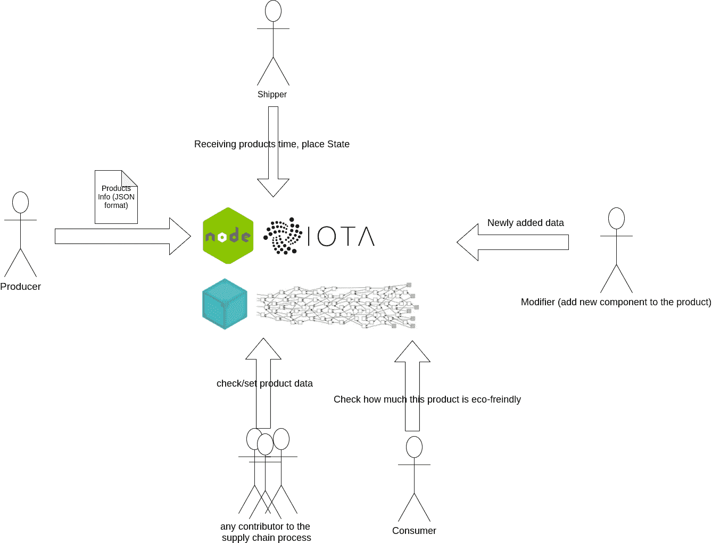
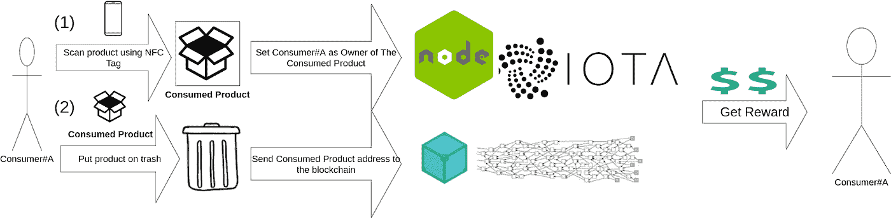

# 使用 IOTA 的生态跟踪供应链和回收服务

> 原文：<https://medium.com/coinmonks/eco-track-supply-chain-and-recycling-services-using-iota-c2b1de681aac?source=collection_archive---------2----------------------->

自 2019 年 8 月以来，我开始致力于我的毕业项目创意，这是一个供应链系统，用于跟踪从制造到最终用户的产品。终端用户可以通过将他们的产品放入我们的智能垃圾桶获得一些奖励。Eco-track 由一个供应链移动应用程序、一个回收应用程序和一个注册网站组成。我使用 nodejs、IOTA 和 IPFS 创建了一个 REST API。我通过这四篇文章记录了我所有的毕业设计开发历程:

[解析数据](/coinmonks/playing-with-iota-parsing-data-for-supply-chain-project-b46806170c6)

[跟踪产品 API](/coinmonks/make-a-rest-api-to-track-products-51fb65e4ab4d)

IPFS 数据 e

[回收系统](/coinmonks/recycling-system-using-iota-2172ecc7444)

所有这些文章都展示了这一逻辑。现在我要和你分享最终的结果。但在此之前，我要解释一下生态追踪的作用。

## 什么样的生态赛道能做到？

Eco-Track 是一个对两个分类帐感兴趣的供应链系统。第一个是直到最终用户的产品分解。每个终端用户都可以用供应链移动应用程序更新产品的状态并给出反馈，以实现最高的透明度。

第二个分类账是从最终用户到回收者，它使用另一个移动应用程序进行回收。我在[回收系统](/coinmonks/recycling-system-using-iota-2172ecc7444)文章中详细解释了这个分类账。

你可以在这里看到这两个应用程序的简单演示

## 与你共享生态赛道

现在，在我拿到 A+的成绩后💃。我很高兴将 Eco-Track 作为[公共存储库](https://github.com/yehia67/Eco-Track)来分享。我不仅分享了源代码，还包括了我找到或使用的所有资源，比如:

1.  蓝图，文章，论文和类似于生态轨道的项目。
2.  我为毕业设计制作的图表。
3.  我自己创建的原型简单的应用程序+一些我尝试过的 IOTA 工具，如 IOTA 分散数据市场。
4.  DevOps:解析测试用例，然后使用 IPFS 部署网站(不完整的测试用例)。
5.  三个移动应用(供应链、回收和 NFC 标签读写)。
6.  我在我的种子里放了一些来自[评论纠结](https://faucet.comnet.einfachiota.de/#/)的水龙头 IOTA。

可以查看[自述](https://github.com/yehia67/Eco-Track/blob/master/README.md)文件。我试着尽可能说清楚。如果你面临任何问题，请不要犹豫与我联系。

## 另外，阅读

*   最好的[密码交易机器人](/coinmonks/crypto-trading-bot-c2ffce8acb2a)
*   [密码本交易平台](/coinmonks/top-10-crypto-copy-trading-platforms-for-beginners-d0c37c7d698c)
*   最好的[加密税务软件](/coinmonks/best-crypto-tax-tool-for-my-money-72d4b430816b)
*   [最佳加密交易平台](/coinmonks/the-best-crypto-trading-platforms-in-2020-the-definitive-guide-updated-c72f8b874555)
*   最佳[加密贷款平台](/coinmonks/top-5-crypto-lending-platforms-in-2020-that-you-need-to-know-a1b675cec3fa)
*   [最佳区块链分析工具](https://bitquery.io/blog/best-blockchain-analysis-tools-and-software)
*   [加密套利](/coinmonks/crypto-arbitrage-guide-how-to-make-money-as-a-beginner-62bfe5c868f6)指南:新手如何赚钱
*   最佳[加密制图工具](/coinmonks/what-are-the-best-charting-platforms-for-cryptocurrency-trading-85aade584d80)
*   [莱杰 vs 特雷佐](/coinmonks/ledger-vs-trezor-best-hardware-wallet-to-secure-cryptocurrency-22c7a3fd391e)
*   了解比特币最好的[书籍有哪些？](/coinmonks/what-are-the-best-books-to-learn-bitcoin-409aeb9aff4b)
*   [3 商业评论](/coinmonks/3commas-review-an-excellent-crypto-trading-bot-2020-1313a58bec92)
*   [AAX 交易所评论](/coinmonks/aax-exchange-review-2021-67c5ea09330c) |推荐代码、交易费用、利弊
*   [Deribit 审查](/coinmonks/deribit-review-options-fees-apis-and-testnet-2ca16c4bbdb2) |选项、费用、API 和 Testnet
*   [FTX 密码交易所评论](/coinmonks/ftx-crypto-exchange-review-53664ac1198f)
*   [n 零审核](/coinmonks/ngrave-zero-review-c465cf8307fc)
*   [Bybit 交换审查](/coinmonks/bybit-exchange-review-dbd570019b71)
*   [3Commas vs Cryptohopper](/coinmonks/cryptohopper-vs-3commas-vs-shrimpy-a2c16095b8fe)
*   最好的比特币[硬件钱包](/coinmonks/the-best-cryptocurrency-hardware-wallets-of-2020-e28b1c124069?source=friends_link&sk=324dd9ff8556ab578d71e7ad7658ad7c)
*   最佳 [monero 钱包](https://blog.coincodecap.com/best-monero-wallets)
*   [莱杰 nano s vs x](https://blog.coincodecap.com/ledger-nano-s-vs-x)
*   [bits gap vs 3 commas vs quad ency](https://blog.coincodecap.com/bitsgap-3commas-quadency)
*   [莱杰纳米 S vs 特雷佐 1 vs 特雷佐 T vs 莱杰纳米 X](https://blog.coincodecap.com/ledger-nano-s-vs-trezor-one-ledger-nano-x-trezor-t)
*   [block fi vs Celsius](/coinmonks/blockfi-vs-celsius-vs-hodlnaut-8a1cc8c26630)vs Hodlnaut
*   Bitsgap 评论——一个轻松赚钱的加密交易机器人
*   为专业人士设计的加密交易机器人
*   [PrimeXBT 审查](/coinmonks/primexbt-review-88e0815be858) |杠杆交易、费用和交易
*   [埃利帕尔泰坦评论](/coinmonks/ellipal-titan-review-85e9071dd029)
*   [SecuX Stone 评论](https://blog.coincodecap.com/secux-stone-hardware-wallet-review)
*   [BlockFi 评论](/coinmonks/blockfi-review-53096053c097) |从您的密码中赚取高达 8.6%的利息