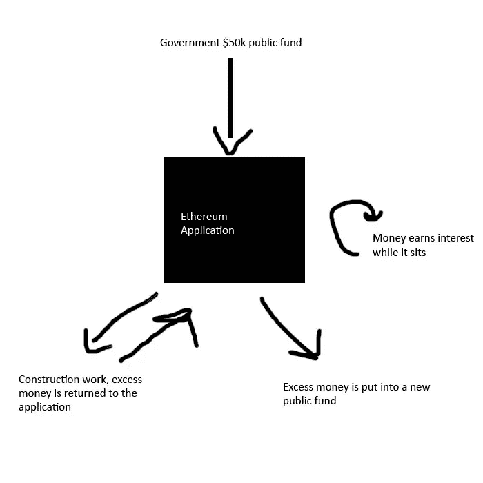
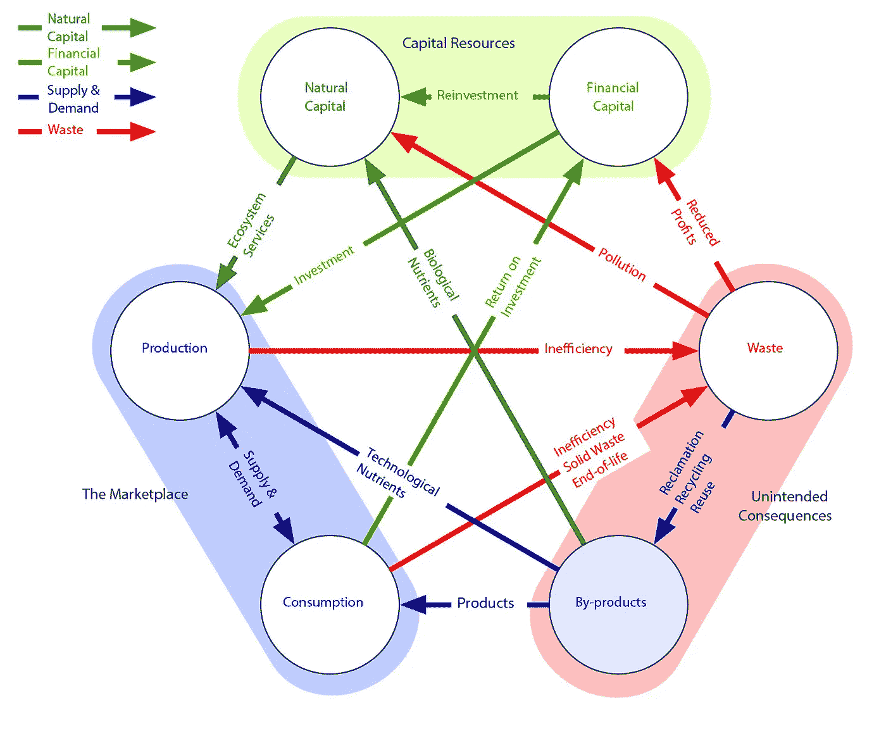

# 以太坊 vs 比特币的经济应用

> 原文：<https://medium.com/coinmonks/economic-applications-of-ethereum-78d20ca1de9a?source=collection_archive---------1----------------------->

我们已经听到了围绕比特币及其将国家从金融控制和公民监督中分离出来的激进运动的嗡嗡声。

Cypherpunks are activists advocating strong use of cryptography and privacy-enhancing technologies as a route to social and political change.

就比特币而言，他们计划通过让尽可能多的人使用这种加密货币来实现这一目标。这是通过广泛招募新成员实现的，无论是通过挖掘、运营节点还是直接购买加密货币。

最近，比起 T4 革命运动，它更像是对 T2 的狂热崇拜。这个社区越来越依赖意识形态信仰，公然无视现实。比特币创造者期望世界改变其业务流程，转而使用新的加密货币，公然忽略了一些重要事实。

*   比特币只能作为交换的媒介。一种用来在人们之间进行服务和商品交易的货币单位。
*   由于比特币的架构设计及其第二层扩展解决方案的限制，它作为货币失败了。
*   它不是 turing complete，这意味着它不能运行任何可以执行某种商业/金融逻辑的自动化程序。
*   思想领袖不断改变叙述，以保持比特币看似相关。比特币灾难性失败后，随之而来的是比特币成为价值储存手段或“数字黄金 2.0”的宏大构想。
*   价值储存是一个死胡同，因为它不能提供任何经济救济，也不能带来任何重大的变化，因为上述的限制。
*   有一件事是肯定的。它让比特币保持相关性，因为在一种分散的、不可改变的加密货币中存在政治含义。对于政治难民、法律规避者和任何希望在没有任何人干预的情况下自由交易和管理自己财富的人来说，这是一个巨大的帮助。
*   这是一个不错的 cypherpunk 工具，但它能保证 2400 亿美元的市值吗？肯定不是。

如你所见，比特币并不像你想象的那样令人印象深刻。只不过是一个美其名曰**的海盗网络**相互之间送钱而已。难怪它会受到主流的强烈反对，因为恐怖分子和罪犯会利用它。还有谁会需要这样的功能呢？

# 政府本质上并不坏

要是有办法让我们随时了解政府的活动就好了。要是有一种方法能让公民对正在发生的事情有所监督就好了。

以太坊允许透明的操作网络。假设有一笔政府拨款用于修建一条新路。初始余额为**50，000 美元。**目前，业务细节不透明。我们真的不知道建设要花多少钱，也不知道有多少钱花在了不相关的事情上。

有了以太坊应用程序，政府机构可以将资助**公之于众，并使商业细节透明**。可以看到建筑交易的成本以及一方到另一方的资金交易。任何剩余的钱都可以返还或者作为将来的另一笔补助金。放在账户里的钱在这段时间内会产生 T2 利息。

# 经济效率

除了假设的情况，其中一些现在已经成为现实。想象一下，银行账户里有大量的钱，却什么都不做。
资本可以更有效地利用，方法是把它借出去，并在任何时间内收取利息。有了以太坊，你可以借出你的资本来赚取利息，并以此获得新的资本。实际上，你的钱在为你工作，但是你仍然可以使用你的钱。从个人到商业运作，你可以看到一个更具资本效率的方法是如何产生的。

[**MakerDAO**](https://makerdao.com/en/) 首创以**多抵押品存款**为抵押品的真正透明、可验证的数字货币。它总是被覆盖，价值不能被免费印刷，总有一些有价值的东西支持每一个单位的 **$Dai** ($1 等值)货币。因为它是建立在以太坊之上的，所以它的本质是可组合和可编程的。

****** 违约不会让整个系统崩溃，你只能达到违约，永远不要超过限度。

# 算账吧。

最美最厉害的是**问责**的力量。一个财政透明的体系是我们梦寐以求的社会政治体系。不再有虚构的数字被模糊在抽象和可疑的技术中，如部分准备金和量化宽松。**政客给自己发巨额奖金？现在你可以看到到底有多少了。问责制是一个简单的工具，让你确切地看到每一个货币单位发生了什么。**

Photo by [History in HD](https://unsplash.com/@historyhd?utm_source=medium&utm_medium=referral) on [Unsplash](https://unsplash.com?utm_source=medium&utm_medium=referral)

人们对社会负责**，社会对世界负责。QE，印钞票，欠下 230 万亿美元的债务，这是对自然的犯罪，到时候会有后果的。**

Mattereum 是一项社会运动，旨在将每一件物品数字化，并创建一个更高效的资源生态系统。

没有更多的借口，我们有能力掌控自己的生活，建立一个真正的、客观的民主制度，在这个制度中，自由是自由的，自由是不可妥协的。我们对系统负责，我们对记录负责。我们的法律就是以此为基础的！

以太坊是从比特币中衍生出来的真正的革命性系统。比特币及其社区已经陷入贪婪和权力之争，朝着他们的理想(或缺乏理想)的进展表明了这一点。以太坊作为一个年轻得多的社区已经取得了显著的进步，这可以从社区的发展和规模来衡量。以太坊的社区一直表现出想要让世界变得更好的愿望，尽管这种努力雄心勃勃。好消息是，我们并不孤单，每个人都可以凑钱。我们不需要改变世界，我们只需要升级它。

▶️Ethereum 是一个工具。从 [https://ethhub.io](https://ethhub.io/)
开始你的旅程📈在[https://ethereumprice . or](https://ethereumprice.org/)g
追踪价格📱用 [Argent 的加密钱包](https://www.argent.xyz/)
赚取利息🐦在推特上关注我:[https://twitter.com/sanneh_si](https://twitter.com/sanneh_si)
👉继续阅读:[你现在可以在以太坊上做的 5 件事](/altcoin-magazine/5-things-you-can-do-on-ethereum-right-now-729bf6875106?source=---------10------------------)

> [直接在您的收件箱中获得最佳软件交易](https://coincodecap.com/?utm_source=coinmonks)

