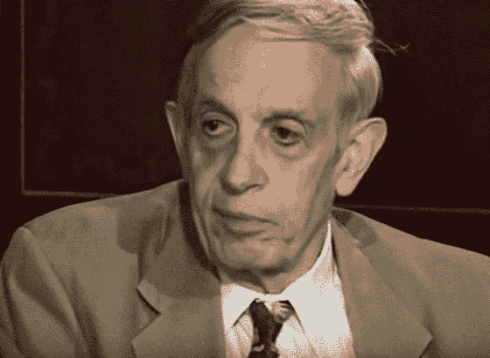

# 经济学、比特币、纳什和萨博

> 原文：<https://medium.com/coinmonks/economics-bitcoin-nash-and-szabo-f6c96ecfa0b3?source=collection_archive---------7----------------------->

John Nash, in interview with Marika Griehsel at the 1st Meeting of Laureates in Economic Sciences in Lindau, Germany, September 1–4, 2004.

英国从今天早上开始实行日光节约时间，意思是多睡一个小时。像往常一样，没过多久，我的大脑就开始慢慢思考比特币，因此，我决定反思一下最近的想法。

# 纳什

该博客的横幅图像取自约翰·纳西因其在非合作博弈论方面的工作而获得诺贝尔经济学奖十年后的一次采访。

我挑选了几个突出的时刻(我也为不想看剪辑的观众解释了这些时刻)。在采访的这一点上，纳什谈到了他对经济学的看法:

> “我并不完全像职业经济学家那样思考。我思考经济学和经济思想，但有点像局外人。”约翰·纳西

然后这里:

> “经济学中有很多趋势，现在看起来很时髦，而普遍的观点可能在 20 年左右的时间里会有很大的不同……开始职业生涯的人应该为变化做好准备……努力学习那些永远有用的东西……具有毋庸置疑的科学价值”。约翰·纳西

这里有一点幽默，然后是一个观察:

> “第一世界，第三世界。二次元世界怎么了？……有一些观点更科学..”约翰·纳西

最后，关于萨博如何看待经济学:

> “我只上了一门经济学课，而且是由一个来自澳大利亚的人教的……另一所学校……”约翰·纳西

# 绍博

以下推文显示了尼克·萨伯对经济的总体看法:

然后是萨博作品的一个更深层次的起点，这里:

这条线索中的一个插曲，在这里:

Szabo 在这里总结了他的观点:

在这个观察中有一个小小的讽刺:

# 比特币的经济学

人们普遍认为，比特币缺乏弹性，价格昂贵，无法作为日常货币使用，但它提供了一个不受政府或银行干预的加密基础，这将使它有朝一日最终“规模化”。

在这方面，白皮书的标题让许多人从字面上理解了*现金*的概念——将比特币的无状态现金与等同的法定货币直接对立起来，强调交易能力和费用。

由于两种技术的相似之处，Szabo 尚未实现的先驱*比特币*让许多人认为他是 Satoshi:Szabo 至少提供了比特币作为收藏品的用途，比特币已经演变成了 *hodl* 。

这种观点在比特币社区中更为普遍，他们被称为最大化主义者。这里有一个这样的主张:

这通常忽略了纳什的观点——或背景——比特币是一种类似黄金的非主权主权货币标准。在纳什的更广泛的背景下，它可以被视为他的工作中的一个自然的部分，发现在讨价还价的问题(1950)，纳什均衡(1951)和平行控制(1954)。这也可以在理想货币的背景下看到，理想货币是纳什晚年的工作重点，比特币可以被视为白皮书的实现。

纳什是一位杰出的数学家，他很早就对密码学感兴趣，并意识到通过使用计算机和机器思维，加密的速度将超过解密。在平行控制中有一种扩展的洞察力，这可以通过当代货币的信任优化技术应用来观察。

在 *cash* 的背景下，这种扩展的洞察力很容易演化:比特币被设计为国家同行之间货币市场的纳什均衡；在这方面，这种均衡不是静态的——事实上，**它解释了为什么央行购买比特币可能引发下一轮牛市**。

这是一个 Szabo 不会发表评论的观察结果——纳什获得诺贝尔奖也不是因为他如何将基于科学的思维引入经济学；或者纳什可能真的是比特币的创造者——以及随之而来的他脱离自己思想的悖论，作为结果或原因。

> [在您的收件箱中直接获得最佳软件交易](https://coincodecap.com/?utm_source=coinmonks)

