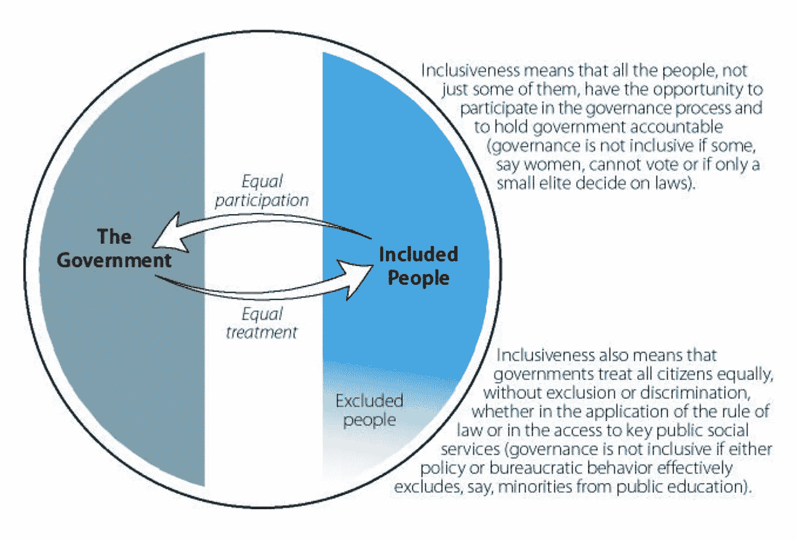
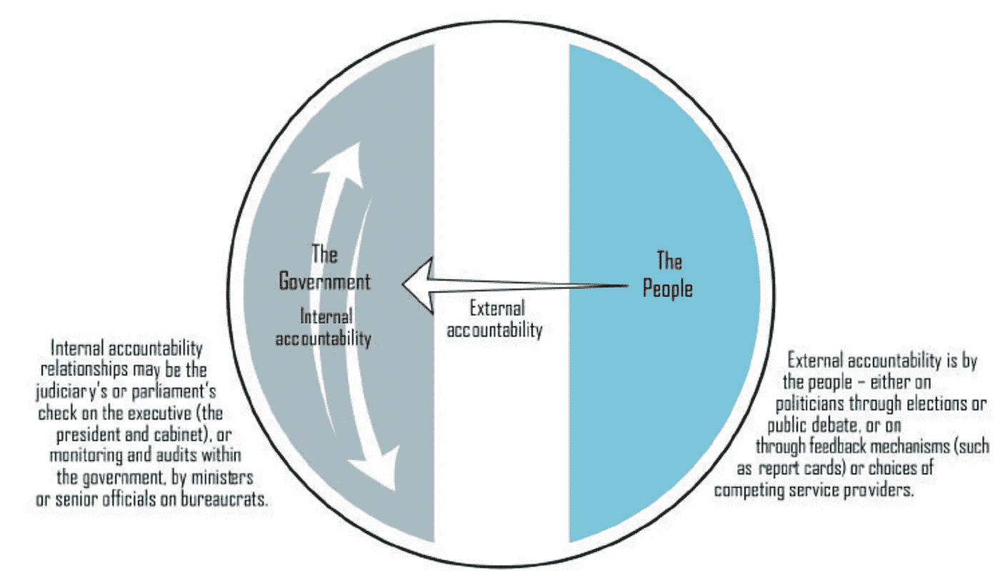
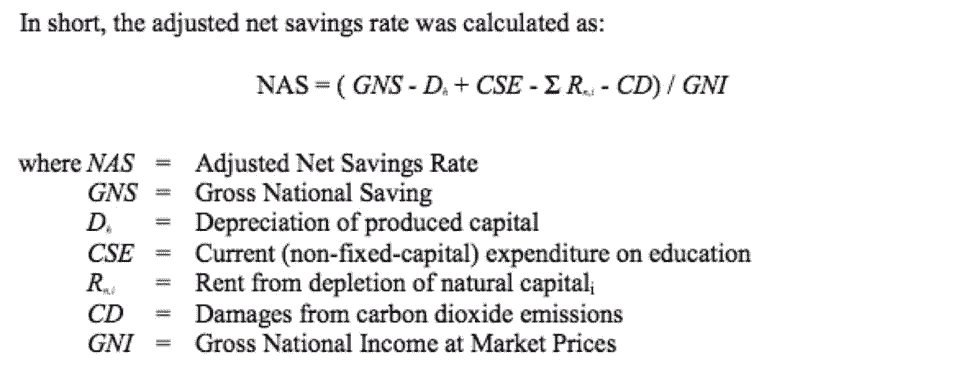
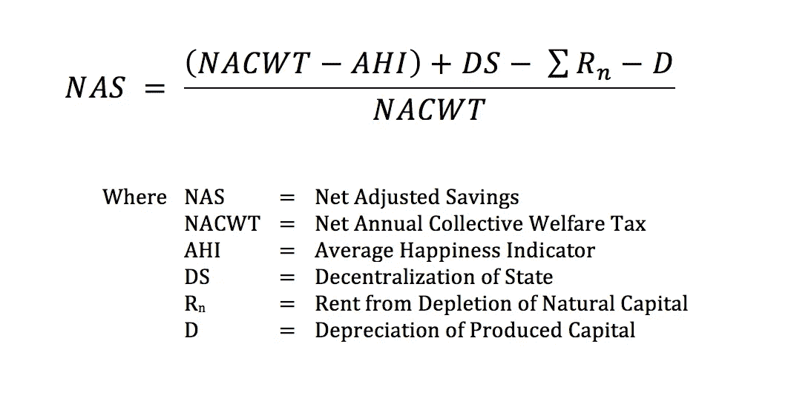

# 区块链中的治理经济

> 原文：<https://medium.com/coinmonks/economies-of-governance-in-blockchain-e5379c7a4dd4?source=collection_archive---------1----------------------->

[Time’s 2006 Person of the Year.](http://content.time.com/time/specials/packages/0,28757,2019341,00.html) Especially true today.

如果我们要定义最佳的区块链治理，我们必须理解什么是治理，什么是良好的治理，以及谁是治理结构中的参与者。我们希望，通过打破治理的抽象概念以及经济学如何帮助塑造这一定义，我们可以建立一个更好的解决方案。

**什么是治理？**

在其最严格的定义中，“治理意味着行使政治、经济和行政权力来管理一个群体的事务，包括一系列复杂的机制、过程、关系和机构，公民和群体通过这些机制、过程、关系和机构来表达他们的利益、行使权利和义务并调解分歧。治理不是领导人的专有特权，但其职能可以由私营部门和民间社会的特定机构和组织承担或委托给它们。这种组织在领导人确定的法律或政策框架内运作，但具有自主性，并行使政治、经济和行政权力 [[1]。](https://publicadministration.un.org/publications/content/PDFs/E-Library%20Archives/2000%20Economic%20Governance_Guidelines%20for%20Effective%20Financial%20Management.pdf)

简而言之，治理是制定决策和行使团体权力的过程和制度。它可以像民族国家一样复杂，也可以像你家中的家庭动态一样简单。

**什么是善治？**

良好的治理结构有四个主要价值。

*   参与性:所有成员在决策过程中都有发言权
*   透明度:决策的程序和方法应该向所有成员公开
*   可持续性:变化对成员的影响是平衡的
*   公平和平等:每个人以同样的投入获得同样的产出，并积极努力提供平等的投入

归结起来有两点:包容性和问责制。

包容性是拥有公平、参与性和平等结构的因素，在这种结构中，每个成员在治理流程中都有平等的指导权。

[[2]](http://siteresources.worldbank.org/INTWBIGOVANTCOR/Resources/1740479-1149112210081/2604389-1149699431307/edouardpresentation_munich_inwent.pdf)

问责制允许我们核实和输入我们认为应该发生的事情。这包括内部和外部两个部分，这使得我们能够拥有透明和可持续的流程。可持续发展将是本文大部分内容的重点，尤其是如何将所有参与者纳入一个长期的净积极系统。

[[2]](http://siteresources.worldbank.org/INTWBIGOVANTCOR/Resources/1740479-1149112210081/2604389-1149699431307/edouardpresentation_munich_inwent.pdf)

谁是治理的参与者？

出于我们的目的，我们将把重点放在三个核心群体上，参与成员(想想一个国家的公民，或者一个家庭的成员)，政府本身，以及所有外部力量(非人类/其他国家/环境)。

对于任何政府，我们都必须确保:

*   面向服务
*   对希望和愿望做出反应
*   促进和扶持
*   监管而非控制
*   处理时间问题

另一方面，我们的参与成员拥有:

*   有责任
*   平等表达意见
*   审计决策过程的能力

**税**

治理机构最大的武器是向参与者征税的能力。这种税收可以有多种形式，不仅用于财富的再分配，也是保持一个群体所有资源可持续利用的一种方式。如果运用得当，它可以在监管和增长之间提供完美的经济平衡，并避免不必要的控制力。在一个家庭的例子中，税收可以被认为是每周的家务劳动，与大家庭共度的时光，甚至是实际的支付(也许是一个骂人的罐子)。

不幸的是，税收存在低效率，特别是逃税/避税。这违反了财政公平，因为现在并非每个人都贡献了自己的公平份额。除此之外，我们现在必须实行强制遵守，因为我们不能再依赖自愿捐款。强制执行增加了另一层成本，这大大降低了税收激励的价值，影响了再分配计划，造成了宏观经济税收指标的人为偏差，并增加了其他所有人的税收负担。如果一个家庭中有人没有履行他们的职责，我们很容易看到这是如何导致上述问题的。

**打击避税的方法**

最明显的方法包括交叉检查提交的信息，审计税务线索以确保正确遵守程序，以及执行处罚。从规模上看，维持这些变得越来越昂贵，尤其是在税收结构变得复杂的情况下。这就是为什么税收制度必须更有效率、更有效、更公平和更容易理解。

最后一种方法是依靠间接税。这些要抽象得多，计算其经济价值也困难得多。在一个家庭动态中，间接税将是一个在水槽里的脏盘子的堆积，使人无法吃饭，在这里“税”是不遵守规则的产物。从世界观来看，最丰富的例子是我们对环境的影响，以及这对后代意味着什么。

对我们来说幸运的是，区块链实际上使直接方法更容易实施，使我们能够准确地将间接影响建模到税收结构中，并降低税收效率低下的成本。

**结论**

发展中的治理的基本第一步是评估其资源并制定经济稳定战略。所有关键参与者、资源和增长战略都必须协调，尤其是生态系统内的私营部门发展标准。在私人和公共实体之间建立关系有助于共同成长，而不是投机交易。

对于任何治理模式，我们都应该不断地重新评估我们的财务管理改革的有效性，包括结构化规划、创建统一的预算、整合预算和会计，以及鼓励财务问责制。

# 这一切和区块链有什么关系？

如果你还没有，我鼓励你阅读一下 [Fred Ehrsam 关于区块链治理的文章](/@FEhrsam/blockchain-governance-programming-our-future-c3bfe30f2d74)。在民族国家政府和区块链议定书之间有许多相似之处，同时也提供了为什么考虑这种联系如此重要的具体原因。接下来的部分将是这一点的延伸，也是与我们之前的治理定义的比较。

**治理到区块链**

使用我们简单的定义，区块链的治理最广泛地指国家的共识，但因为区块链的工作是无限地生存，我们必须考虑对国家有长期影响的所有资源，以及为所有关键参与者保持可持续价值的税收激励结构。

**与会者**

在最初设计比特币的时候，Satoshi 设想了一个世界，矿工就是用户，用户就是矿工，用户积极为发展做贡献。这很快被分解成独立的成员类别，其他协议也遵循相对类似的准则。

*   用户:交易或储存货币的人，群体中的积极参与者
*   矿工:投票者对系统的状态
*   开发者:规则制定者，在某些情况下，是新提议的第一轮投票者
*   第三方贡献者(如 ASIC 创建者或 Infura):更一般地说，这些可以被视为私人机构，它们被雇佣来扩大政府，或填补政府无力处理的缺口
*   有利者:在生态系统价值方面，做市商可以说最符合他们的利益，即使是卖空者，因为他们希望得到回报

**比特币和以太坊。**

每当我们想到区块链的治理，可以说比特币非常类似于美国自己的系统。不幸的是，就像在国内一样，比特币面临着几个固有的问题。

参与性:虽然你可能认为每个人都有权利表达他们对协议的意见，但每个人的意见都有同等的分量，或者有系统的方法来处理意见，这肯定是不对的。代码库由不到 5 个活跃的核心开发人员维护，其中的任何变化都必须被一个极小的矿工群体接受，这个群体就是 T2。

透明:抛开一小部分人能够评估代码更改是否有价值这一简单事实，仍然很难发现代码更改是什么，人们目前不得不依赖深奥的 BIP 请求电子邮件链。

可持续:最具破坏性的问题是所有参与者对长期价值的不一致。正如 Fred 指出的，除了核心的早期采用者之外，开发人员几乎没有动力去创造新的计划，因为他们在系统中没有利益。矿商更喜欢短期收益，而不是长期增长，他们不愿意接受更新，因为害怕失去利润。很少考虑外部力量，从第三方钱包，到环境和政府。

公平和平等:由于激励模式，矿工的股份和对协议的影响随着他们的参与而复合，使其更加集中，并创造了垄断性的进入壁垒。ASIC 创作者已经成为行业的瓶颈，因为对下一个版本的依赖使那些无法访问的人处于不利地位，除了屈服于他们的愿望之外没有其他选择。

以太坊也是如此，尽管它处于一种更加不稳定的仁慈独裁状态，过度依赖和信任领袖来决定系统的命运。

比特币和以太坊的主要错误是创建了过于僵化的治理结构，没有考虑到所有的资源和参与者。规模经济、搭便车、规避损失和逃税等因素严重阻碍了平台的寿命，并造成了价值的严重错位。

# **那么，什么是好的区块链治理？**

每当我们想象良好的治理是什么样的，总有一点会不断地驱使我们做出决定，那就是不确定性。对于一个理论上应该永远存在的系统来说，环境、社会、行为、法规和技术的不确定性。正因为如此，我们主要关心的是一个简化的和健壮的系统，它依赖于充分参与的、客观可证明的和透明的信息，例如参与者的快乐，或自然资源的测量。我们在接下来的章节中所展示的是由弱数学证明所支持的，并承诺会有更正式的迭代。

我们将触及一个更为规定性的观点[【3】](http://mudancasclimaticas.cptec.inpe.br/~rmclima/pdfs/destaques/sternreview_report_complete.pdf)到[新古典经济学](https://www.investopedia.com/terms/n/neoclassical.asp)，参考“强可持续性”而不是更为僵化的“弱可持续性”模型。我们还将研究二权制、二次投票、税收和真正的储蓄，作为代际可持续性的基础。

当我们深入研究原型的细微差别时，请记住，我们讨论的内容旨在成为区块链的治理层，也就是说，通过使用它，我们希望创建一个更可持续的系统，该系统将持续几代人，能够适应变化，并考虑到可能发生的任何不可预见的事件。这将是系统提案的基础，从改变矿工奖励，代码更新，到改造治理本身。同样，在开发一个正式的经济模型时要记住的一件重要事情是，在创建一个单一的最优路径时要小心谨慎。环境、市场情绪、道德和信息都在不断变化，权衡道德含义、自然环境损耗后果的不确定性以及自然环境在维持可持续发展中的作用符合我们的最佳利益[【4】](http://citeseerx.ist.psu.edu/viewdoc/download?doi=10.1.1.365.6128&rep=rep1&type=pdf)。没有一个正式的模型能够完美地预测未来，在我们的方法中具有可塑性比包罗万象更有价值。

**可持续发展入门，以及围绕不同方法的思考**

为了理解经济学中的可持续性，我们不得不回到 20 世纪 60 年代，当时在大众、政治和社会科学意识中出现了新一轮的环境问题。起初，经济学家采取了一种非常形式化的数学方法，称为“新古典”或“边际主义”经济学，其中某样东西的价值不在于制造它的成本，而在于有人愿意为此支付多少钱。这创造了一个微观经济模型，因为它基本上是静态经济中的资源稀缺理论。通过将其应用于环境经济学[【5】](https://supreme.justia.com/cases/federal/us/471/343/)，它创造了一个刚性的结构，在这个结构中，经济主体存在，他们的选择是在完全整合的市场中做出的，并且他们对自己的决策问题有充分和相关的知识[【6】](https://sites.google.com/a/akajok.space/cailinopkeloise/mathematics-for-economists-an-integrated-approach-by-e-roy-weintraub-1985-11-27)。

20 世纪 80 年代，我们看到了向可持续经济的转变，可持续经济是长期经济、环境和社会可持续性的结合。经济学家仍然依赖于新古典模型，在这种模型中，最优增长可以通过允许福利永久不下降来维持。随着我们现在对不可再生资源以及出现负增长的资源有了更好的理解，这个假设已经被证明是错误的[【7】](https://academic.oup.com/restud/article-abstract/41/5/29/1522050?redirectedFrom=fulltext)。

正是[哈特维克法则](https://folk.uio.no/gasheim/A-EENE13.pdf)，以及皮尔斯、阿特金森[【8】](https://www.sciencedirect.com/science/article/pii/0921800993900399?via%3Dihub)和汉密尔顿[【9】](https://www.sciencedirect.com/science/article/pii/0301420794900485)随后对其进行的改进，导致了可持续发展的功利主义经济学的现代实施，在这种经济学中，我们将生产资本、自然资本和人力资本的净投资计算为真正的储蓄。本质上，这是一种将生产的东西与我们消费的无法再生的东西联系起来的方式。只要真实储蓄高于零，我们就在创造一种比现有资源更有效、相对更好的资源。这是允许的，因为假设一个单位的自然资源与一个单位的生产资本价值相等。

对这一假设进行了论证，这是需要区分“弱可持续性”和“强可持续性”的地方，也是我们选择强可持续性模式的原因。虽然我们将建立在哈特维克规则的实施上，但我们将使用宽松的贴现率来反映强大的可持续性。

在弱可持续性中，经济学家的操作条件是所有资源都是可以互换的，尽管存在风险，但每种资源都可以被优化建模。尽管这使得计算和预测环境退化变得容易得多，但它没有考虑未知因素，更重要的是，这是一种对伦理问题的严格功利主义方法。只有当我们作为人类能够完美地珍视世界或系统的最大效用时，这种僵化才有可能。

另一方面，强大的可持续性遵循着自然资本没有简单替代品的思路。我们仍然被允许对可持续性应用资本方法，但是环境经济学的总体成本效益计算必须缩减，因为关键自然资本的[影子价格](https://www.investopedia.com/terms/s/shadowpricing.asp)根据定义是无限的。强可持续性的主要阻力是它依赖于不太正式的预防方法，这反过来导致功利主义经济学家眼中不必要的成本，因为我们现在正在考虑无法证明是可计算的未知因素。然而，就我们的目的而言，我们更关心的是系统的寿命和代际性，虽然可能会有潜在的净正提案(与市场利率相比)由于我们的贴现率而失败，但确保生存比绝对增长更有价值。

**复权**

对于我们的基本模型，我们将使用 Ralph Merkle 的 Futarchy 系统，但是我们很快就会发现，有些问题需要解决。

简而言之，Futarchy 是一种将投票复杂性从治理中的普通参与者中抽象出来的方法。人们不必为复杂的问题投票，而是被问及他们对过去一年的感受，从 0 到 1(被称为年度集体福利或 ACW)。然后，我们创建了一个看跌期权和看涨期权，对未来 20 年的预测意见总数进行预测。每当有新提案时，betters 会将市场转移到他们认为会员意见会随着新提案而转向的地方(即，对系统有净正面影响的提案会将量表推向 1)。

这有望解决 5 个关键问题:

*   会员投票积极性低:从统计上看，投票对结果没有影响(人均净正值低)
*   选民必须花费大量的时间和精力来充分理解他们投票的目的:通过强迫人们投票，他们将随机地或基于不完整的信息来投票，从而导致次优的投票决定
*   投票“影响者”(游说者、政治行动委员会、政党)提供系统性错误信息，可能导致投票者投反对票
*   你投票支持的事情(即使是出于好意)可能并不一定会发生
*   投票给了每个人平等的发言权，这又回到了问题(2 ),投票者拥有不完整或不正确的信息，最多导致平庸的决定

首先，它解决了什么问题。

这使得成员参与变得非常容易，因为即使他们的信息不完整，他们的快乐也会相对等于系统的真实状态。例如，一个群体并不需要真正理解免费医疗对其在未来 20 年改善生活的好处，而这正是市场反过来押注发生的事情。因为它更容易，它缓解了问题(1)和(2 ),因为一个人的意见与将要发生的事情更合拍，并且对集体幸福的客观测量简化了一个提议必须完成的内容。问题(4)通过以下事实得到解决，即建议可以像输入时一样快速地回滚，并且市场力量将考虑建议被完成的概率，正如我们已经对合并/收购请求所做的那样。

**现在，它没有解决什么，还有相应的解决办法。**

最明显的问题是，多数人的暴政仍然是一个相对较大的问题，如果一个少数群体对某个主题充满热情，但大多数人对此漠不关心或略有负面影响，它可能不会被通过。我们相信，通过使用[二次投票](http://scholar.google.com/scholar_url?url=https://www.aeaweb.org/conference/2015/retrieve.php%3Fpdfid%3D871&hl=en&sa=X&scisig=AAGBfm0OD9bRP617nYAExAUW53dUHOsWmg&nossl=1&oi=scholarr)，我们可以更好地调整意见的权重，以匹配获得的价值。

我们对二次投票的实现。

*   创建一个提交意见的税收系统:我们将在 0 到 1 的范围内设置 0.5 作为基线。通过提交 0.5，您支付(1)单位。
*   除了 0.5 之外的任何意见都有一个平方增长的成本，由(x-0.5) +1 建模。这意味着 0 或 1 的投票将花费(1.25)个单位，而 0.6 将仅花费(1.01)个单位。
*   在投票期结束时，所有的资金被平均分配给投票人。

这导致边际成本增加了 2 倍，这是一种线性增长，可以更均匀地匹配用户对价值的感知。我们现在鼓励人们尽可能保持冷漠，只有当他们对某个话题特别感兴趣时才离开。

第二个问题是，投票影响仍然可能发生，虽然你可以说，由于幸福看跌期权/看涨期权是对 20 年的预测，短期的幸福感受将被长期的净负面影响抵消，但在某些攻击媒介中，情况并非如此。特别是对于复杂的提案，人们对其作用的理解存在很大的不对称性。正如 Merkle 所指出的，贴现率存在固有的缺陷，有些事情我们无法预测，即使是一周后，而未来的其他事情可以被视为几乎确定无疑。为此，我们提出了一种更不统一的折现方法，同时也将基本衰变时间扩展到大约 50 年以上，其中某些被认为或多或少确定的事件可以反映其权重。在这方面，我们采取了更规范的方法，减少了“玩弄”系统的机会，因为我们在权衡不确定和不可预见的风险。虽然现在我们将直接把它与我们的 ACW 计算联系起来，但我们将把它转换为更一般的 NAS 公式。

现在，我们已经实施了一个税收制度和一个非统一的衰减期，我们可以从数学上证明，不再可能让成员违背他们的最大利益。让我们举一个朋友提到的例子:富人投票反对全民医保。

假设一个集团有 10 名成员，其中 9 人每年生产(100)件，1 人每年生产(1000)件。他们目前都将收入的 20%支付给全民医疗解决方案，分别意味着每年(20)和(200)个单位。因此，每个人都获得 38 个医疗单位。每年，会员们都会就他们对去年的看法进行投票，投 10 个单位，如果每个人都无动于衷，就退回 10 个单位(成本是无关紧要的，重要的是成本的规模)。

显然，富人付出的比她得到的多得多，并且希望这种情况能够改变。她提交了一个提案来摆脱这一点，并投票赞成该提案 1，支付(12.5)个单位。在这种情况下，其他 9 个作为理性成员，仍然希望维持他们的全民医疗保健。每个成员只需要提交少于 0.4444 的投票，这又导致每人成本为~(10.03)个单位(累计额外成本为~(0.27)个单位)，抵消了提案，并在最后从富人的投票中获得了返还税的好处。

如果富人决定“收买”其他议员投票支持该法案，该怎么办？让我们假设任何高于 0.5 的平均幸福值都会起作用，不管它比截止值高多少，只要最终提案被通过。由于税收以及包含了 50 年左右的幸福加权(基本衰减率足够了，因为我们的测试中没有不确定性)，富人将不得不支付每个成员从全民医疗保健中获得的机会成本率+税收上涨(稍微可以忽略不计)的确切现值。任何不足之处，博彩市场都会计算出会员幸福感的下降，进而导致提案无法通过。支付正确数量的人来通过提案，结果比我们的富人每年可能失去的(162)个单位的现值更昂贵(162 个单位，因为她还将从医疗保健中获得 38 个单位)。

另一个问题是缺乏对提交净积极建议的激励，以及目前通过提交“坏”建议或具有净消极影响的建议赚钱的能力，因为坏建议的提交者可以利用赌博市场。这个解决方案是相当投机的，并且可以很容易地被改变。对于这两个问题，我们引入了提交净积极提案的奖励系统的想法，其中提交者由于她的提案而获得 1%的正价值税。

比方说，在一个 1000 人的小组中，一个用户提交了一个建议，平均每个用户获得了 3%的净收益。这将导致每个用户提交 0.53，平均多支付(0.0009)个单位。提交者将从每个用户那里得到额外金额的 1%,结果得到(0.009)个单位作为他们努力工作的回报。随着用户数量的增加，这个数字呈线性增加，随着净收益的增加，回报呈平方增加。

**可持续性**

最后一个关于二权制的问题是双重的，都集中在可持续性和幸福的问题上，即使超过 50 年也是可持续发展的准确描述。在本文的其余部分，每当我们提到可持续发展，我们将指的是维持世界(或系统)满足人类需求和提供人类福利的能力。

目前，净负面提议被接受的唯一真正负面的副作用是，在某个时候，如果足够多的负面提议被通过，我们将看到系统本身的崩溃，这意味着没有人，甚至是卖空者，可以兑现。虽然如果我们对所有负面影响有完美的理解，这在理论上可能就足够了，但事实上，这样的假设可能导致过度依赖描述性定价，而没有考虑未知的风险。

Futarchy 假设，即使是一个简单的问题，如去年过得怎么样，人类也可以准确地得出系统的集体立场。然而，通常情况下，一个人对事物现状的感知并不能真实地反映已经发生的事情，当我们试图预测未来时，这一点变得越来越明显。作为人类，我们可能会在未来 50 年集体幸福，但可能会对自然资源或未来福祉造成不可挽回的损害，而我们对此一无所知。这就是为什么我们必须引入一个更标准化的可持续性计算方法，一个关注代际价值的方法。同样，我们的目标是避免间接税，尽可能接近真实世界，同时仍然能够改变公式。

**调整后的净储蓄**

我们对哈特维克规则的实施将基于调整后的净储蓄计算器，该计算器由[世界银行](https://www.worldbank.org/)用于评估可持续发展国家每年的表现[【11】](https://siteresources.worldbank.org/INTEEI/1105643-1115814965717/20486606/Savingsmanual2002.pdf)。公式可以在下面找到。

[[11]](https://siteresources.worldbank.org/INTEEI/1105643-1115814965717/20486606/Savingsmanual2002.pdf)

*   国民储蓄总值。按国民总收入与公共和私人消费之间的差额计算。
*   固定资本的消耗被扣除了。这代表在生产过程中消耗掉的资本的重置价值。
*   增加了当前的教育支出。作为下限第一近似值，计算结果包括教育方面的经常性运营支出，包括工资和薪金，但不包括建筑物和设备方面的资本投资。
*   自然资源损耗产生的租金被扣除了。租金的计算方法是开采材料的市场价值减去平均开采成本。
*   二氧化碳排放造成的损失被扣除了。这种计算有效地扩展了国家“资产”的概念，进一步包括了未受污染的空气。

通过使用这种方法，各国可以了解他们对自然资本的消耗是否与其他资源的生产相当。我们的工作将是现在采取这一点，并界定什么“资源”和“产品”将构成一个区块链系统。虽然在我们的计算中只依赖产品是很好的，例如使用我们的 ACW，但我们需要考虑运行该系统的成本，如果一个人获得了价值，但它需要花费数百万美元，这不是一个可持续的协议。

资源:

*   用于维持系统状态的所有固定折旧资本。采矿机器、建筑物和其他使用寿命较长的资产。这与公式中的 D 非常相似。
*   在区块链系统中，自然资本枯竭产生的租金将代表两件事，第一件是采矿/交易回报与获得该回报的运营成本之间的差额。我们可以包括电力和维护节点间网络的成本。第二种租金计算方法是将新信息放置到区块链上的[存储租金乘以当年放置的新信息数量。](/ipdb-blog/forever-isnt-free-the-cost-of-storage-on-a-blockchain-database-59003f63e01)
*   将来，我们可能会包括更多与运行协议相关的长尾资源，如环境影响或人力资本。对于我们的简化版，租金和折旧就够了。

产品:

*   我们对公式所做的最大改变是在计算国民总储蓄和国民总收入时。如果我们想一想我们的目标是在区块链体系中保持什么，有两件事。第一个是总体幸福(ACW)，或消费资本[【12】](https://www.ru.nl/publish/pages/516298/nice-12108.pdf)。问题是，目前这没有货币价值，我们可以通过使用我们之前定义的二次征税公式来解决(这现在将被称为年度集体福利税或 ACWT)。国民总收入现在将是所有参与者提交的税收总和减去我们给予提案提交者的 1%(净年度集体福利税或 NACWT)。消费将成为平均幸福指标(1 单位*参与人数:AHI)。
*   第二种是没有一个实体能够控制国家的任何方面。有几种方法可以反映充分的权力下放。我们可以计算随机节点赢得奖励的概率(以显示状态进程中的分散化)乘以竞争的非池化节点的总数，或者可以关注不同人提交的提案的数量(这也可以代表鼓励教育的系统)。不管这是基于什么，它将是一个不妥协的区块链的辅助指标。这一部分需要更多的讨论，尤其是围绕分权意味着什么，什么程度的分权是必要的(我们需要平等参与还是仅仅保证没有人能够控制)。

使用这些资源和产品，我们现在可以创建自己的公式版本:

Net Adjusted Savings for a Blockchain Protocol

由此，我们现在可以计算反映系统当前状态的每年 NAS。任何提议都会有正面或负面的影响，如果我们遵从有效市场假说，市场会做出相应的反应。Betters 将能够创建长期赌注，预测给定提案的无限未来(我们的目的是大约 50 年)将会发生什么，向我们保证任何高于当前 NAS 的提案都将具有长期效益，因此应该被接受。

你会注意到，我们的公式中没有包括市场资本总额，或者系统的金融价值的任何不变量。这是从社会经济和可持续发展的角度特意选择的。事实证明，GDP(和个人收入)与幸福度之间的相关性很低[【12】](https://www.ru.nl/publish/pages/516298/nice-12108.pdf)[【13】](http://docenti.unisi.it/stefanobartolini/wp-content/uploads/sites/19/2016/03/Happy-for-how-long-How-social-capital-and-economic-growth-relate-to-happiness-over-time_2014_Ecological-Economics.pdf)，由于我们的工作是确保积极确保参与者幸福度高于财务增长，因此使用 ACW 作为衡量市值成功的标准符合我们的最佳利益。

在我们对第 0 年的 NAS 进行计算后，我们必须使用我们的指数权重衰减公式来计算现值，并将未知因素导致的任何变化率考虑在内，从而预测未来约 50 年的所有未来 NAS。一旦我们有了这些，我们现在可以看到特定的提议是否有足够的可持续性被接受。

**在实践中**

想象一个非常像以太坊的区块链系统，但是我们有一个接受提议的新公式，而不是当前的治理模型。我们希望实施利益相关证明，并提交一份提案，概述代码变更以及对资源和产品变更的预测。

目前，我们的措施如下:

*   ACWT = 10，169，000(约 1.017 ETH (0.63 平均 CW) * 10，000，000 用户)
*   NACWT = 10，167，310 (10，169，000 ETH-(169，000 ETH * 0.01)
*   AHI = 10，000，000 (1 ETH * 10，000，000 用户)ETH
*   DS = 200，000(每节点约 5 ETH 奖励/年* 40，000 活动节点)ETH
*   r(电力)= 120，000(每个节点大约 3 个以太网成本/年* 40，000 个活动节点)以太网
*   r(存储)= 125，000(约 0.005 ETH 成本/存储字节* 25，000，000 存储字节)ETH
*   D = 40，000(每个节点每年约 1 个以太网成本* 40，000 个活动节点)以太网

使用这个，我们可以看到 NAS 为 0.0081，略高于我们的临界值 0，这表明我们今年是积极可持续的。但是，我们需要考虑到，我们需要预测未来大约 50 年的所有后续 NAS，随着我们继续使用工作证明，我们会看到节点的整合，这也会导致用户满意度下降。由于规模经济，每个节点的电力下降，折旧也下降。在计算所有未来储蓄后，我们得出的现值为-0.05(本例中的虚构值)，这意味着我们当前的系统是不可持续的。

现在，我们将介绍 PoS 实施中的新措施:

*   ACWT = 10，327，240(约 1.033 ETH (0.68 平均 CW) * 10，000，000 个用户)
*   NACWT = 10，323，968 (10，327，240 ETH-(327，240 ETH * 0.01)
*   AHI = 10，000，000 (1 ETH * 10，000，000 用户)ETH
*   DS = 200，000(每节点每年约 5 ETH 奖励* 40，000 个活动节点)
*   r(电力)= 80，000(每节点约 2 ETH 成本/年* 40，000 个活动节点)
*   r(存储)= 125，000(约 0.005 ETH 成本/存储字节* 25，000，000 存储字节)
*   D = 20，000(每节点每年约 0.5 以太网成本* 40，000 个活动节点)

股权证明为我们提供了直接的 NAS 净正结果，因为我们现在的值为 0.029。然而，更重要的是，股权证明允许更慢的权力巩固(因为他们积累了更多的奖励，他们可以用它来获得更多的奖励)，因为在权力中，你必须考虑到，随着你获得更多的奖励，你可以建造更快的机器，使你比你的竞争对手更有优势。由于这个原因，幸福在 0.50 以上停留的时间更长，导致现值预测为 0.12(同样，这个例子中的值是虚构的)。这一预测高于我们之前的值-0.05，使我们进入了可持续的领域。正因为如此，该建议将被接受和执行。

**自变量**

你可能有的一个论点是，这需要对提案将如何影响我们的生态系统进行许多主观预测。虽然这是真的，正如我们在上市公司的交易中发现的那样，我们在预测未来方面相当准确，而且由于更好的人希望优化他们的收益，我们将为每个点开发相当复杂的模型，特别是因为我们专注于使它们尽可能客观可证和透明。已经有很多关于用电成本的计算，虽然快乐是一种主观的心态，但我们可以通过比较快乐意味着什么来找到优化。

另一个可能的负面因素是，可能有其他我们没有考虑到的因素，这很可能是真的。这种模式的好处是，你可以用一个提案对另一个模式进行投票。只有当人们认为一个改变模式的提议会导致一个更可持续的协议，从而减少有人提交一个试图获得短期收益的机会时，这个提议才会被接受。市场会对 NAS 的预测作出反应，因为它不会像当前模型那样高效，从而导致总体价值降低。然而，一个更好的模型将走向更高的可持续性，因为它将提高未来的 NAS，导致它被接受为计算提案接受度的新公式。

# **结论**

计算可持续性的实践，尤其是无限期的可持续性，与其说是科学，不如说是一门艺术，我们并不声称这是解决这个问题的一条包罗万象的道路。然而，我们正在做的是为一种新的思维框架奠定基础，这是一种让我们客观选择自己未来的稳健方式。

最有价值的是，我们第一次把主观幸福感作为我们选择的来源。我们不关心交易费用、可伸缩性、市场价值或易用性，因为这些都不是客观的最终目标。这些都是我们幸福的刺激因素。如果我们有一个提高我们幸福感的糟糕的服务协议，在我们看来，这足以确保可持续性。因为只要人们从你所构建的东西中汲取价值，那就足够了。这就是赛博朋克的方式。那是聪的梦想。

*感谢经济学和密码/区块链社区的所有人，以及他们在创造人类下一次进化中的热情和奉献。*

1.  [*https://public administration . un . org/publications/content/pdf/E-Library % 20 archives/2000% 20 economic % 20 governance _ Guidelines % 20 for % 20 effective % 20 financial % 20 management . pdf*](https://publicadministration.un.org/publications/content/PDFs/E-Library%20Archives/2000%20Economic%20Governance_Guidelines%20for%20Effective%20Financial%20Management.pdf)
2.  [*http://site Resources . world bank . org/INTWBIGOVANTCOR/Resources/1149112210081/2604389-1149699431307/Edouard presentation _ Munich _ in went . pdf*](http://siteresources.worldbank.org/INTWBIGOVANTCOR/Resources/1740479-1149112210081/2604389-1149699431307/edouardpresentation_munich_inwent.pdf)
3.  [*http://mudancasclimaticas . CP tec . INPE . br/~ RM clima/pdf/destaques/stern review _ report _ complete . pdf*](http://mudancasclimaticas.cptec.inpe.br/~rmclima/pdfs/destaques/sternreview_report_complete.pdf)
4.  [*http://citeseerx.ist.psu.edu/viewdoc/download?doi = 10 . 1 . 1 . 365 . 6128&rep = re P1&type = pdf*](http://citeseerx.ist.psu.edu/viewdoc/download?doi=10.1.1.365.6128&rep=rep1&type=pdf)
5.  [*https://supreme.justia.com/cases/federal/us/471/343/*](https://supreme.justia.com/cases/federal/us/471/343/)
6.  [*https://sites . Google . com/a/aka jok . space/cailinkoloise/mathematics-for-economists-an-integrated-approy-by-e-wein traub-1985-11-27*](https://sites.google.com/a/akajok.space/cailinopkeloise/mathematics-for-economists-an-integrated-approach-by-e-roy-weintraub-1985-11-27)
7.  [*https://academic . oup . com/restud/article-abstract/41/5/29/1522050？redirectedFrom = full text*](https://academic.oup.com/restud/article-abstract/41/5/29/1522050?redirectedFrom=fulltext)
8.  [*https://www . science direct . com/science/article/pii/0921800993900399？经由% 3 dihub*](https://www.sciencedirect.com/science/article/pii/0921800993900399?via%3Dihub)
9.  [https://www . science direct . com/science/article/pii/0301420794900485](https://www.sciencedirect.com/science/article/pii/0301420794900485)
10.  [*http://dieoff.org/page88.htm*](http://dieoff.org/page88.htm)
11.  [*https://site resources . world bank . org/INTEEI/1105643-1115814965717/20486606/savings manual 2002 . pdf*](https://siteresources.worldbank.org/INTEEI/1105643-1115814965717/20486606/Savingsmanual2002.pdf)
12.  【https://www.ru.nl/publish/pages/516298/nice-12108.pdf】T5[T6](https://www.ru.nl/publish/pages/516298/nice-12108.pdf)
13.  [*http://docenti . unisi . it/stefanobartolini/WP-content/uploads/sites/19/2016/03/Happy-for-How-long-How-social-capital-and-economic-growth-relate-to-Happy-over-time _ 2014 _ Ecological-economics . pdf*](http://docenti.unisi.it/stefanobartolini/wp-content/uploads/sites/19/2016/03/Happy-for-how-long-How-social-capital-and-economic-growth-relate-to-happiness-over-time_2014_Ecological-Economics.pdf)

> [直接在您的收件箱中获得最佳软件交易](https://coincodecap.com/?utm_source=coinmonks)

