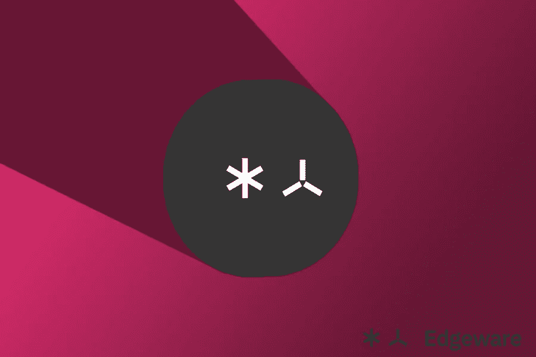

# 边缘软件指南(EDG 令牌)

> 原文：<https://medium.com/coinmonks/edg-guide-1704bc8f7a46?source=collection_archive---------3----------------------->

## 问答形式的完整综合指南，包括 EDG 的所有当前使用案例以及它们如何在 [Edgeware](https://edgewa.re/) 网络中发挥作用。

## 什么是硬币/代币？

EDG 是一个象征。术语**硬币**通常是指任何拥有自己独立的区块链的加密货币…