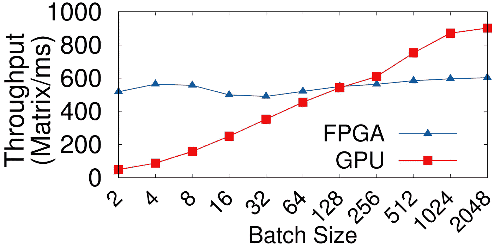
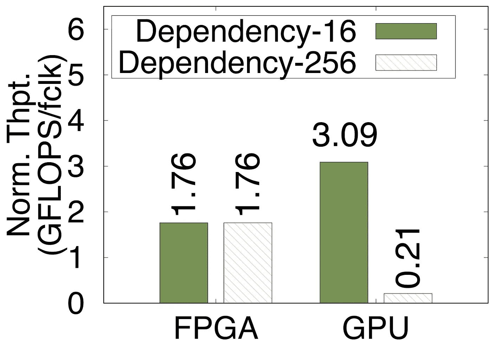
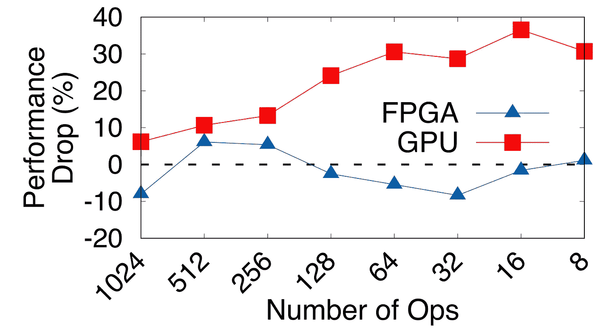
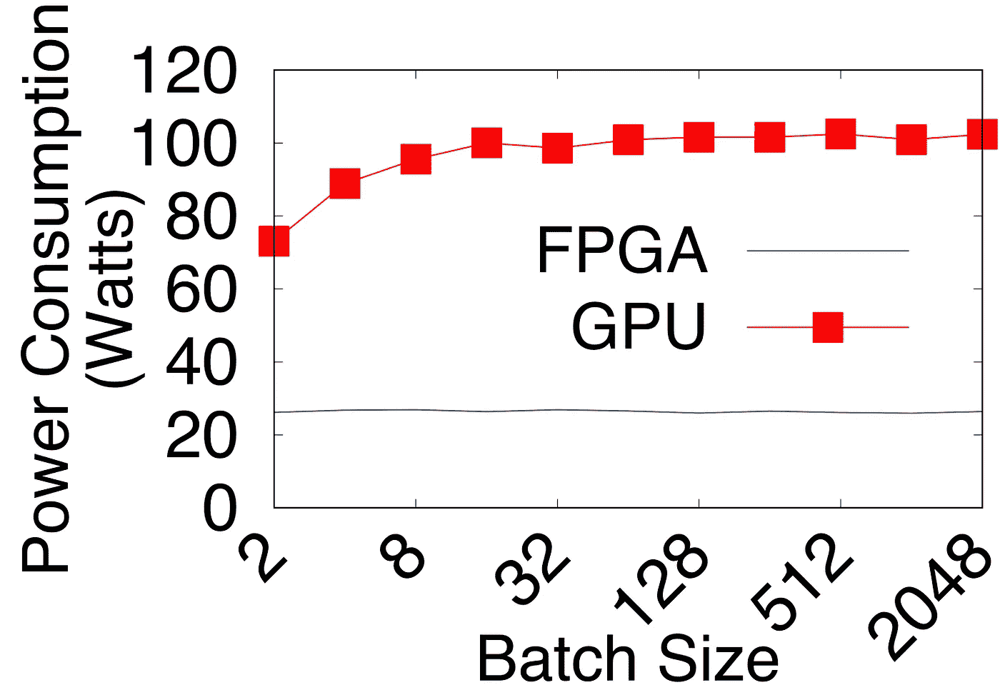
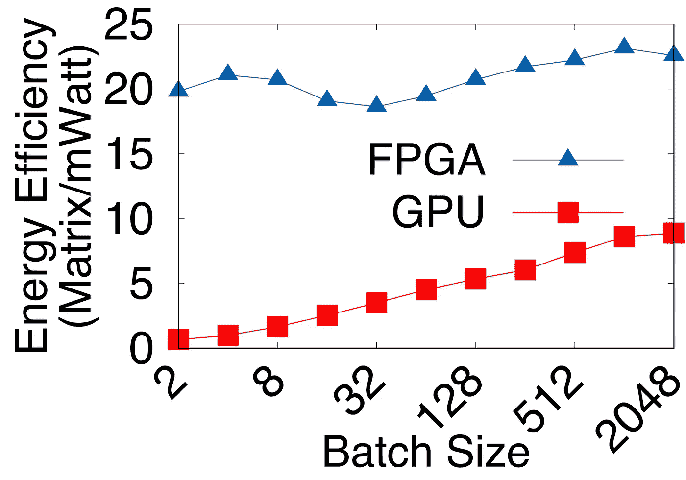

# 边缘计算不一样！

> 原文：<https://medium.com/coinmonks/edge-computing-is-different-9fe637bf1e00?source=collection_archive---------2----------------------->

有一段时间，我在考虑分享我的想法和经验，同时研究 edge 和 fog 计算(因为我很懒，所以在本文的其余部分我称之为 edge-computing)。我相信你一定听说过很多关于边缘计算的事情。这是一个新的商业流行语。甚至最近有许多关于这个特定主题的会议和研讨会，例如(1) IEEE 边缘计算，(2)边缘计算研讨会(SEC)，(3) Usenix HotEdge，以及许多其他会议。所以我花了一段时间研究这个话题。我的工作主要不是关于 edge 范式的应用和未来，而是重新思考 edge 的基本原理。在分享我的观察之前，我想简单地讨论一下什么是边缘，以及为什么它最近吸引了很多关注。(我最近发表了一篇关于这个话题的科学论文。可以在这里找到:[https://www . usenix . org/conference/hotedge 18/presentation/biookaghazadeh](https://www.usenix.org/conference/hotedge18/presentation/biookaghazadeh)

用一句话来总结边缘计算，就是让计算离客户端更近。让我们提一下，客户可以是任何东西。在过去，客户是一个典型的坐在桌前与应用程序交互的人。今天，我们有其他类型的客户，不一定是人类。它可以是任何能感知和作用的东西。是的，假设它很大。因此，边缘计算就是将特定的工作从云中提取出来，放到其他地方。这个“别处”没有预定义的位置。它可以在客户端设备和云之间的任何地方。

现在你可能会问，为什么我们需要边缘？云不够用吗？简而言之，云已经不够了。云的设计主要是为了服务大型应用程序，这些应用程序没有时间敏感的限制。云应用主要是处理一批数据，这些数据要么来自内存，要么来自磁盘。这种范式能够成功地实现广泛的应用。换句话说，云是根据当时的工作负载设计的。此后，工作负载发生了显著变化。我们已经看到机器学习和人工智能应用的爆发。应用程序变得越来越智能，并依赖于先进的传感器，如摄像头和麦克风。它们不仅接收来自这些传感器的信息，还执行繁重的处理。你可以想到语音助手(如 Siri、Google Now、Cortana)、增强现实、场景识别等等。传统的云无法在高度响应的同时处理如此巨大的输入负载。事实上，当前的用户应用需要服务提供商做出快速且可预测的响应。

处理新一代工作负载需要重新思考当前的基础架构。Edge 范式是对上述所有需求的合理回答。将计算转移到离客户端更近的地方，同时进行分布(与云相反，云是一个集中的平台)可以及时完成各种工作负载。在边缘中，用户请求不需要一直传输到云。它可以由最近的边缘云在局部实现。通过这种方式，云可以节省能源预算，同时在后台工作，为特定类型的工作负载提供服务。例如，想象有一个交通摄像机，负责检测和跟踪超速行驶的汽车的牌照。在当前模式下，图像需要传输到云中，由云进行处理，然后将响应发送回相机。使用边缘云，车牌号码检测可以卸载到最近的云。此外，cloudlet 只能向云发送一个小字符串，以通知中央数据库有关超速的信息。在这种新的模式下，摄像头馈送可以更快地提供服务，同时节省通信和云存储。

我相信您已经对边缘计算以及为什么它会被未来的服务提供商所接受有了一些大概的了解。我们仍然没有任何真正的边缘平台，正在安装和运行 24/7。惠普、思科和英特尔等厂商已经有了一些原型，称之为边缘服务器。所有这些平台主要是我们称之为“服务器”的小型设备。你可以把它们想象成拥有相当数量的内存和 CPU 的小盒子。哦，这几乎都是关于 cloudlet 服务器的。正如我之前所说，从用户设备到云，edge 可以是任何东西。你甚至可以把自己的移动设备想象成一个边缘加速器。我打算在另一篇文章中讨论这个问题。现在，正如我上面所讨论的，我意识到当前可用的所谓“边缘平台”并不是为边缘工作负载而设计的。换句话说，你不能只是缩小我们现在作为服务器的规模，并试图以 edge 的名义出售它们。对我来说，边缘社区需要为未来的边缘基础设施重新设计可用的计算平台。我先举个例子。正如我上面提到的，人工智能和机器学习正在被许多用户应用程序高度采用。这些应用依赖于像 DNNs 这样的重模型，根据请求提供高度准确的结果。当前的云模型依赖于最先进的加速器，如 GPU，来执行任何与人工智能相关的活动。正如您所见，当前的 edge cloudlets 并没有真正考虑到边缘和物联网工作负载。这就是为什么我认为我们需要从硬件和平台的角度开始讨论和集思广益边缘的设计和实现。

最近，我对 edge 将会是什么样子做了一些回顾？物联网工作负载是什么样的？它们与当前的云工作负载有何根本不同。根据我的调查，我从三个不同的角度总结了边缘计算工作负载。**首先**，边缘主要走向服务器物联网，物联网工作负载具有时效性。与我们日常的交互式应用不同，物联网高度依赖于服务提供商的可预测和快速响应。**第二个**，是 IOT 而不是人类的答案。思科最近发布的白皮书研究了物联网设备的未来，并预测到 2020 年，我们将拥有约 500 亿台联网设备，预计每年将产生约 400 Zetta 字节的数据。这意味着当前旨在为人服务的云将会落后两个数量级。你可以看到，edge 将成为新一波计算(即物联网)的答案。**第三个**，edge 将处理来自各种 I/O 通道的输入数据流和请求。在云中，应用程序主要被设计为处理来自内存或存储的东西(嗯，它们也高度依赖于网络，但它们不以流的方式处理东西)。

考虑到边缘的三个特征，我们可以快速识别可用边缘(甚至云)平台的弱点。当前的边缘服务器是现有云服务器的小型产品，是为人们的工作负载而不是 IOT 设计和优化的。这些服务器上的处理器架构(CPU 和 GPU)适合批处理，而不是流处理。此外，它们不具备为任何 I/O 通道提供输入和输出的能力。这些具体原因让我重新思考了关于边缘未来基础设施的一切。问题是我的想法是:关于处理和计算，最好的答案是什么？CPU？GPU？不，这些都是用批处理思维设计的。所以后来我又想了一件事，就是 FPGA。

# 现场可编程门阵列 （Field Programmable Gata Array 的缩写）

FPGAs 是可重新配置硬件，具有很高的能效，能够适应各种各样的工作负载。此外，高级综合(HLS)和并行编程框架(OpenCL)的流行使它们更容易被可用的计算基础设施访问。看一看 FPGA 的独特特性，你会发现它们最适合上述所有要求。FPGAs 可以有固定的流水线，能够以固定的速率处理输入。因此，它们可以为应用程序保证严格限定的延迟。FPGAs 还有其他一些优势。FPGAs 具有很高的能效。如果您将 cloudlet 安装在电力紧张的地区，那么您将面临服务的扩展和可用性问题。FPGAs 可以在低得多的频率下工作。累计功耗远低于预期。此外，它们还能提高小云的热稳定性，显著降低冷却成本。最后一个重要优势是 FPGAs 对各种算法特性的适应性。CPU 和 GPU 架构可以在空间上向外扩展，并且能够以高水平的空间并行性来并行化应用。这些应用在其工作流中具有有限的依赖性，并且能够充分利用并行架构的能力。另一方面，有几种其他类型的算法具有很高的依赖性，无法在可用的 CPU 和 GPU 中加速。在这种情况下，他们可以利用 FPGAs 的可重新配置性，实现加速的时间并行性。让我补充一下，FPGAs 也可以提供空间并行性，但不如 CPU 和 GPU。FPGAs 的资源有限，比 GPU 之类的东西少得多。人们可以期待未来 FPGAs 在资源可用性方面的增长(即使现在也是如此)。可以查 Intel Stratix FPGAs)。

为了证明我的观点，我设计了简单的实验来演示 FPGAs 如何在工作负载加速方面超越其他加速器(这里我们只考虑 GPU)。我的实验可以分为三个部分:(1)工作负荷敏感性，(2)适应性，和(3)能量效率。

# 工作负载敏感度

edge-cloudlet 的一个具体要求是提供可预测的延迟和吞吐量。物联网设备正在生成各种粒度的请求，并期望 cloudlets 以相同的速度处理各种大小的请求。FPGAs 非常适合这种情况，因为它们可以利用流水线并以恒定速率产生输出。我设计了一个简单的矩阵乘法场景(A x B x C)，并在 GPU 和 FPGA 上进行了实验。人们可能会问矩阵乘法如何反映合法的边缘工作负载。矩阵乘法可以在几乎所有的机器学习和人工智能应用中找到。它是 BLAS 库的关键组件，广泛用于各种类型的应用程序中。在图 1 中，可以看出 FPGA 和 GPU 在乘法运算时的工作流程差异。

Figure 1: Matrix Multiplication on (a) a GPU and (b) an FPGA.

在这个实验中，选择大小为 32×32 的矩阵。我们将批处理大小从 2 改变到 2048 以观察性能，处理吞吐量计算为每毫秒的矩阵数。在图 2 中，您可以看到 FPGA 和 GPU 之间的性能差异。

Figure 2: sensitivity of the matrix multiplication throughput to batch size

如图所示，无论有多少矩阵进入，FPGA 都可以保持恒定的吞吐量。另一方面，GPU 只有在特定的批量大小之后才会表现得更好。在本实验中，FPGA 从以太网 I/O 通道接收批量数据。发送者可以通过改变发送矩阵的频率来改变批量大小。无论有多少矩阵到达，FPGA 都会以恒定的速率工作并产生输出。对于 GPU，发送方需要将数据复制到 GPU 的主机内存中，从主机传输到设备并启动操作。在批处理大小为 128 之后，GPU 在吞吐量方面可以胜过 FPGA，但 FPGA 仍然在另一项竞争中胜出，那就是每个请求的延迟。在 GPU 中，所有请求需要一起处理，然后转发给发出请求的人。这意味着即使是批处理中的第一个请求也需要和最后一个请求等待相同的时间。对于 FPGA 来说，情况并非如此。FPGA 一进行处理就转发答案。

总之，FPGAs 对工作负载大小不敏感，这正是服务物联网请求所需要的。

# 适应性

这部分在很多人看来可能比较模糊，但我会尽力去论证它的真正目的。在本文的前面，我们声称 FPGAs 可以适应任何算法特性，因为这些硬件具有可重新配置的特性。现在让我们深入探讨一下我们所说的适应性到底是什么意思。

为了评估 FPGAs 和 GPU 适应算法特征的能力，我们设计了基准来捕捉两种类型的依赖关系:数据依赖关系，表示循环不同迭代之间的依赖关系；条件依赖关系，表示循环每次迭代对条件语句的依赖关系。我们假设每个应用程序，特别是它的算法部分，可以表示为一个 for 循环来执行一定数量的操作。我相信这是足够通用的，可以算作大多数应用程序的代表。

我们的基准类似于由简单的迭代块(for-loop)组成的算法，其中每次迭代执行一定数量的操作。循环长度和 ops 变量分别定义了总迭代次数和每次迭代的总操作次数(在实验中设置为 262144 和 512)。实验中所有变量都是单精度的。请注意，我们实验的目的是揭示架构适应性对算法特征的影响，而不是评估特定算法的性能。

该基准通过在循环的不同迭代中引入依赖性来捕获数据依赖性。当没有数据依赖时，每一次迭代都被认为是独立的，所有迭代都可以并行执行。对于数据依赖，相互依赖的迭代需要作为一个组按顺序执行。因此，通过改变数据依赖度，即组的平均大小，我们可以使用该基准控制算法中可用的数据并行性。GPU 的性能与可用的数据并行度密切相关。相比之下，FPGA 可以串行利用处理元素并接收迭代，而不管依赖性如何。不同的迭代可以共存并在流水线中执行，同时向下遍历连接的处理元件。

为了引入条件依赖，我们在基准测试的循环迭代中添加了 *if-else* 语句。如果块中有一半迭代在*中，另一半在*否则*块中。*

现在让我们看看第一个场景的结果。我已经使用 OpenCL 来评估我的假设。图 3 显示了 FPGA 和 GPU 的性能比较结果。

Figure 3: Raw throughput comparison at low and high data dependency degrees.

一个明显的观察结果是 FPGA 对算法的依赖程度不敏感，而 GPU 可能会受到严重影响。很明显，FPGA 高度适用于具有任何特性的任何算法。现在，我还将原始吞吐量除以工作频率，以便在两个平台之间进行公平的比较。图 4 描述了标准化的结果:

Figure 4: Normalized throughput comparison at low and high data dependency degrees.

归一化吞吐量将频率时钟从评估中分离出来，并衡量架构并行性对吞吐量的实际影响。

我们还评估了条件依赖对 FPGA 和 GPU 的性能影响。图 6 显示了这种影响。

Figure 6: Performance drop comparison for kernel with conditional statements.

这表明，随着条件依赖性的增加，FPGA 性能相对稳定。对于某些特定情况，由于时钟频率比基准内核高，性能甚至有所提高。相比之下，与没有条件语句的基线内核相比，GPU 经历了高达 37.12 倍的性能下降。来自条件语句的分支导致 warp 中的不同线程遵循不同的路径，从而产生指令重放并导致吞吐量降低。

**能效**

我评估的最后一个重要方面是 FPGAs 的能效。这对于边缘架构非常重要。与云不同，Edge cloudlets 可以部署在任何地方。这意味着它应该能够在电力有限的地区运行。现在，我将讨论如何进行计算功耗的实验。

为了评估能效，我们测量了工作负载吞吐量除以其平均功耗。为了预测能效，记录了所有实验中两个设备的功耗。

图 7 和图 8 描述了矩阵乘法示例的原始功耗和能效。

Figure 7: Raw power consumption

Figure 8: Energy Efficiency

FPGA 以低得多的频率运行，功耗始终比 GPU 低 2.79-3.92 倍。考虑到性能，它表明在执行矩阵乘法时，FPGA 可以提供比 GPU 高 2.6-30.7 倍的能效。改进是显著的，尤其是对于小批量。FPGA 的低功耗和高能效意味着部署 FPGA 进行边缘计算可能会以更低的冷却成本和更少的能源费用获得更好的热稳定性。

**结论**

在本文中，我试图分享我关于边缘计算及其独特需求的实验。我的观察可能完全正确，也可能不完全正确，但值得与其他人分享并获得反馈。它可能会帮助其他人开辟另一个场地，或者它可以帮助人们找到错误并使之变得更好。

由于我不想让这篇文章太长，我想讨论一下未来 edge 平台可用 FPGAs 的局限性以及可能的解决方案。所以你可以期待我的另一篇相同主题的文章。

干杯！