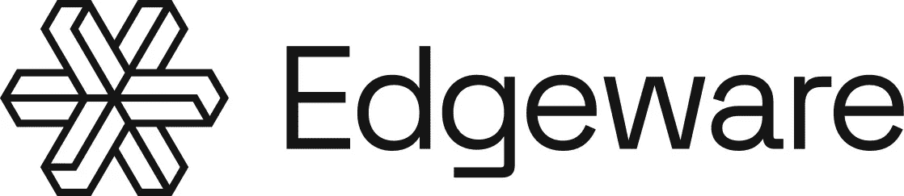

# Edgeware:这个区块链社区的本质…

> 原文：<https://medium.com/coinmonks/edgeware-the-nature-of-this-blockchain-community-d8ffc79534b9?source=collection_archive---------8----------------------->

## Edgeware 区块链和社区是为了什么？

我很清楚 Edgeware 是做什么的，也很清楚它一直以来都是做什么的。

有时候，作为密码世界中一个分散的区块链社区，要就如何定义我们在做什么达成共识可能是一个挑战，因为我们参与了一种新的社交技术，一种有自己货币的有机体。尽管 Edgeware 今天在其网站上说它的标题是:

> Edgeware 是一个智能合同链，具有社区管理的资金、分散的提案系统和 Dao 网络。

是的，我想这就是它的作用。但这是为了什么？

**把我带到这里的** 把我带到 Edgeware 的是波尔卡多特。波尔卡多特是一个区块链，旨在与其他区块链连接非常容易。Polkadot 创建了一个名为 Substrate 的开源编程框架。所以我放下行李，花了整整 6 个月的时间学习基质。真正让我惊讶的是“链上治理”，它需要链上的一种民主投票功能，这是人类就决策达成共识的一种方式，并且该决策将在链上执行，这是有保证的。提案可能是财政部拨款提案。国库是所有连锁代币供应的一部分，由社区通过民主进行管理。我对这种去中心化的治理方式感到非常惊讶，我以为更多对去中心化系统、政府和机构感兴趣的人会对此感兴趣。所以我找到政党和团体，说“哦，顺便说一句，你谈到了去中心化，有一种技术可以真正实现这一点。这不仅仅是一个想法，而是这些想法在现实世界中的技术实现，使社区能够以分散的方式进行管理并达成共识。这很酷，它是这样工作的…" [*这里的*](/coinmonks/decentralised-government-how-to-build-new-systems-that-enable-collective-power-390dd02d25e7) *是一个治理实验，叫做*[*DGov*](/coinmonks/decentralised-government-how-to-build-new-systems-that-enable-collective-power-390dd02d25e7)*，我今年早些时候邀请人们参加*。

当我在学习 substrate 时，我不断地遇到另一个叫做 Edgeware 的链，它在 Substrate 文档中。当时的 Edgeware 是除了波尔卡多和草间弥生之外仅有的其他活基质链之一。Edgeware 就像 Polkadot 的秘密爱子，但由一群不合群的人管理，他们聚集在一起创建了一个基质链，并在其上构建了一个以太坊克隆体。

Edgeware 的创始人 Commonwealth Labs 也建立了一个非常酷的线程论坛平台，名为 [Commonwealth](https://commonwealth.im/edgeware/proposal/discussion/1327-edgeware-road-parachains-and-bridges-core-development) ，允许区块链社区将他们的论坛连接到他们的链上。有一些有趣的线程，Edgeware 社区可以在其中讨论提议、想法和计划。因此阅读论坛激发了我的兴趣。

Edgeware 并不完美。无论你来自哪个角度(我的是产品管理和创业)，你都可以找到改进的方法。有趣的是，这正是 Edgeware 吸引我的地方。我可以看到他们还没有弄清楚自己的身份，他们需要新的开发者。“智能合约区块链”，我认为这是我在区块链社区看到的一个常见错误。他们混淆了他们的技术是什么作为他们的目的和价值，并把它作为他们的标题信息。智能合约区块链究竟如何吸引任何人的心灵？“这可能会改善”我想。一个合理的类比就像 25 年前创办了一个网站，并称之为网站。

**网站:**“我们是网站。”

**我:**是的，我知道你是一个网站，但你在做什么，这对我有什么好处？

网站:“我们做网站的东西。”

我:哦，你为别人做网站？

网站:“不，不是真的。”

**我:** OK 好玩。

同样,“智能合同区块链”过于模糊和宽泛，并没有真正表明它的用途。然而，我有兴趣加入，所以它的工作。

我认为这将是一个很好的方式来，学习和获得一些关于如何参与，贡献和成为一个分散的链上管理社区的一部分的经验。

快进几个月，我正在为 Edgeware 在技术和文化上的形成做出贡献和影响。拥有庞大社区的大地方，感觉他们已经有了一切，你的声音会感觉被淹没了。Edgeware 有一群兼收并蓄的人，有些人在旧的 web 2.0 集中世界(spits“TF ooo”)中非常成功，有些人对这个新领域非常热衷。

**涉足 Edgeware** 在 Edgeware 时，我是一名基板开发人员，有 L 个牌照，非常擅长处理冒名顶替综合症，直接给我提供远远超出我经验水平的职位。“哇，冷静点”我想。“用这些头衔慢慢来”，那时我真的不想做技术领导。我只是想呆在我舒适的泡泡里，探索并变得更习惯于 Substrate，通用的 Rust 语言，也许在我学习和研究桥接、中继和副链时提出一个资助建议，也许很快我就会想出一些神奇的方法来实现有益于 Edgeware 的酷概念。所以我筹集了一笔资金。第二天，我马上找到了 Edgeware 的管理人员和领导人物 Thom Ivy，问我是否愿意领导 Edgeware 想要创建的 parachain integration 和 Kusama relay chain。“我们开始吧”，我想，我得到了一些资金来做我的研究，人们想要比我想要的更多的责任。我说“让我考虑一下”。我睡了大约 20 分钟，然后想我到底在害怕什么？无法整合副链。我以前从未做过，但也没有多少人做过。但是伟大的工程师在工作中学习。所以我说“当然，就这么办吧。”

几个月过去了，我正在从事 parachain integrations 的工作，同时也是 Edgeware para chain 的技术联合创始人。Kabocha 翻译成南瓜。是艺术家草间弥生最喜欢的东西。(*顺便说一句，草间弥生·区块链是以这位古怪又酷的日本艺术家命名的，他是波尔卡多特艺术的先驱)*

**那么 Edgeware 是干什么用的呢？从我的经验来看，Edgeware 是一个为初露头角的创业者提供的社区，他们可以参与到区块链的社区中来，学习，积累经验，被抛入困境，然后获得资助，建立一些东西。这是一个发射台加速器，孵化器的东西。它就像是一个整合者，但是是分散的，由社区拥有和管理，但是更有活力。**

看关于**的东西，Edgeware 区块链是干什么用的？**人们直奔区块链的东西，好像它的本意是做一些特殊的固定机制，好像那就是有价值的东西，但他们遗漏了重点。我们有这种不正确的固定观念，认为像区块链这样的技术是固定的、静态的，有一种特殊的神奇机制，而实际上它是一种社会技术，根据建造它的人们的意愿和价值观而动态变化。是的，机制为非常有趣和令人敬畏的东西打开了大门，但更重要的是使用这种技术的社区的价值观、叙事、故事、意图和文化，因为这些东西将被动态地塑造到技术中。

有了底层链，开箱即用，就可以获得链上治理。社区投票升级连锁软件或资助财政部提案的能力。

当 Edgeware 认识自己时，它就会自我实现。
打个口袋妖怪的比方，Edgeware 还不是一个喷火怪，或者雷丘(我喜欢雷丘)，它更像是一只皮卡丘或者小火龙。尽管我认为进化很快就要成熟了。当它了解你自己时，它会进化，当它了解你自己时，它会获得新的力量，它所有的力量都会增加。

这就是 Edgeware 的本质，一个孵化创始人的地方，这也是它的目的。这是一种很有禅意的想法，我喜欢这样的自己。

找到你的目标，意识到你的本性，获得更多的力量，然后贡献你的潜能。

保持幸福，

拉姆齐

*社区开发者为*[*Edgeware*](https://edgewa.re/) *卡博查技术创始人*